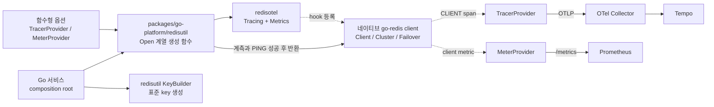
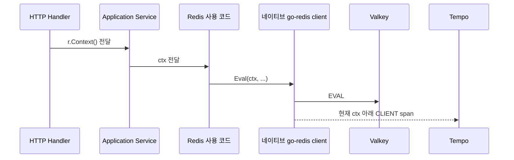

# Go Redis 클라이언트 트레이싱 연동 계획

관련 문서: [Trace 수집 기준](../README.md) · [Sampling 기준](../sampling-retention.md) · [서비스 메트릭 기준](../../metrics/service-metrics.md)

## 목적

이미 적용된 `redisotel`을 `redisutil` 생성 함수의 공통 기능으로 확장한다. `redisutil`은 관측성과 연결 유효성이 확인된 네이티브 go-redis client를 반환하며, client를 감싸지 않는다.

## 한눈에 보는 패키지 구조



## 현재와 목표

| 구분 | 현재 | 목표 |
|---|---|---|
| client 생성 | `redisutil.Open()`이 `*redis.Client` 반환 | 모든 운영 client가 `redisutil` 생성 함수 사용 |
| tracing | `InstrumentTracing(client)` 적용 | 호출자가 함수형 옵션으로 구성을 주입 |
| client metric | `InstrumentMetrics(client)` 적용 | 호출자가 함수형 옵션으로 구성을 주입 |
| client 종류 | 단일 `*redis.Client` 지원 | Client, Cluster, Failover 생성 지원 |
| 초기화 실패 | client를 닫고 `oops` 오류 전파 | 모든 생성 함수에서 같은 실패 원칙 유지 |
| 적용 서비스 | coupon, go-reference | Redis 사용 서비스 전체 |
| 직접 생성 | 일부 테스트에서 허용 | 운영 composition root에서는 금지 |

## 설계 결정

| 항목 | 결정 |
|---|---|
| 계측 위치 | `packages/go-platform/redisutil`의 생성 함수 |
| 반환값 | `*redis.Client`, `*redis.ClusterClient` 같은 네이티브 타입 |
| 추가 wrapper | 계측을 위한 interface, wrapper, 명령 전달 계층을 만들지 않음 |
| 구성 주입 | 함수형 옵션으로 tracer와 meter 구성을 호출자가 결정 |
| 실패 처리 | 계측 또는 연결 확인 실패 시 client를 닫고 `oops` 오류 전파 |
| key builder | 환경·서비스·schema version을 생성 시 고정하는 순수 유틸리티 제공 |
| 업무 span | 여러 저장소 단계를 묶을 때만 부모 span 추가 |
| client metric | 서버 메트릭과 별도로 유지하고 실제 출력을 검증 |

tracing과 metrics는 생성 단계에서 모두 적용한다. 다만 사용할 provider와 `redisotel` 세부 옵션은 `redisutil`이 전역 상태로 고정하지 않고 호출자가 IoC·DI 구성에 맞게 주입한다.

## 공통 key builder

```text
<environment>:<service>:v<schema>:<identifier...>
```

builder를 생성할 때 환경·서비스·schema version을 고정하고 이후 segment는 모두 동일한 identifier로 취급한다. identifier에는 용도 같은 별도 의미를 부여하지 않고 문자 제약도 두지 않는다. 각 identifier는 안전하게 encoding하며, 빈 값과 전체 key 길이만 검증한다. Redis Cluster에서 Lua나 transaction의 여러 key를 같은 slot에 배치해야 할 때만 명시적인 hash tag 옵션을 사용한다. builder는 key 문자열만 반환하며 client를 보관하거나 Redis 명령을 실행하지 않는다.

## Context 전달 순서



`context.Background()`나 `context.TODO()`로 교체하면 Redis span이 요청과 분리된다. timeout은 기존 context에서 `context.WithTimeout()`으로 파생한다.

## 코드 책임

| 위치 | 책임 |
|---|---|
| `packages/go-platform/redisutil` | 네이티브 client 생성, 함수형 옵션 적용, trace·metric hook 등록, startup `PING`, 공통 key builder |
| 서비스 `resources.go` | 설정과 관측성 구성을 주입하고 공통 생성 함수 호출 |
| application/use case | 기존 `ctx`를 Redis 호출까지 전달 |
| Redis 사용 코드 | 실제 명령 실행, 업무 판단은 service에 유지 |
| 공통 패키지 테스트 | 반환형, 옵션 주입, 초기화 실패, client 종류별 계측 검증 |
| 통합 테스트 | Lua, pipeline, timeout, error span 검증 |

## Span과 metric 기준

| 대상 | 기준 |
|---|---|
| 단일 명령 | 전달된 context 아래 `CLIENT` span 하나 생성 |
| pipeline / transaction | 실제 span 수와 이름을 확인한 뒤 sampling 판단 |
| Lua | script 본문, ARGV, key를 기록하지 않음 |
| startup `PING` | 사용자 요청과 무관한 startup span으로 구분 |
| client metric | pool과 client 관점의 값을 서비스 `/metrics`로 노출 |
| server metric | 메모리, eviction, CPU, replication은 exporter가 수집 |

허용 속성은 고정된 명령·업무 operation·result·script 이름이다. Redis key/value, URL 인증 정보, request/trace/user ID, campaign/coupon/order ID는 span attribute와 metric label에서 제외한다.

## 적용 순서

1. 현재 `redisutil.Open()`의 동작과 오류 코드를 회귀 테스트로 고정한다.
2. tracer와 meter 구성을 받는 함수형 옵션을 추가한다.
3. Cluster와 Failover용 생성 함수에도 같은 계측과 실패 원칙을 적용한다.
4. 접두사, schema version, encoding, hash tag를 검증하는 key builder를 추가한다.
5. 모든 운영 client가 `redisutil` 생성 함수를 거치도록 정렬한다.
6. Lua, pipeline, timeout, connection 실패와 계측 실패를 Testcontainers로 검증한다.
7. Tempo의 parent 관계와 `/metrics`의 client metric을 함께 확인한다.

## 완료 확인

- [ ] 운영 composition root에 `redis.NewClient()` 직접 사용이 없다.
- [ ] 서비스가 `redisotel.InstrumentTracing()`을 중복 호출하지 않는다.
- [ ] 생성 함수가 wrapper 없이 네이티브 Client, Cluster, Failover client를 반환한다.
- [ ] 호출자가 함수형 옵션으로 tracer와 meter 구성을 주입한다.
- [ ] 계측이나 연결 확인이 실패하면 client를 닫고 `oops` 오류를 반환한다.
- [ ] key builder가 서비스 접두사와 schema version을 강제하고 Redis 명령은 실행하지 않는다.
- [ ] HTTP와 worker context가 Redis command까지 전달된다.
- [ ] command 오류가 error span으로 보이고 원래 오류가 유지된다.
- [ ] key, ARGV, 인증 정보, 사용자·업무 ID가 span과 metric label에 없다.
- [ ] `HTTP -> 업무 span(선택) -> Redis CLIENT span` 관계가 Tempo에서 보인다.
- [ ] Redis client metric과 server exporter metric의 책임이 구분된다.

## 참고 자료

- [go-redis OpenTelemetry instrumentation](https://github.com/redis/go-redis/tree/master/extra/redisotel)
- [Redis semantic conventions](https://opentelemetry.io/docs/specs/semconv/db/redis/)
