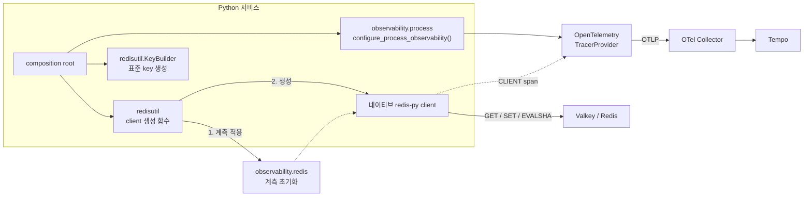
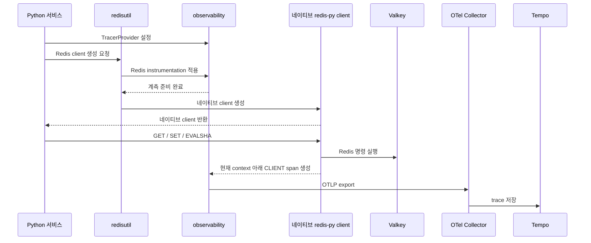

# Python Redis 클라이언트 트레이싱 연동 계획

관련 문서: [Trace 수집 기준](../README.md) · [Sampling 기준](../sampling-retention.md) · [서비스 메트릭 기준](../../metrics/service-metrics.md)

## 목적

공통 `redisutil` 생성 함수가 Redis 계측을 적용한 뒤 네이티브 redis-py client를 반환하게 한다. `redisutil`은 client를 감싸지 않으며, 서비스는 반환된 client를 직접 사용한다.

## 한눈에 보는 목표 구조



## 현재와 목표

| 구분 | 현재 | 목표 |
|---|---|---|
| 공통 관측성 | FastAPI, SQLAlchemy, PyMongo 계측 제공 | Redis 계측 helper 추가 |
| Redis 생성 유틸리티 | 없음 | 관측성을 적용하고 네이티브 client를 반환하는 `redisutil` 제공 |
| 초기화 | `configure_process_observability()` | tracer 설정 후 `redisutil`의 생성 함수 호출 |
| 라이브러리 | Redis instrumentation 없음 | 기존 `0.63b1` OTel 계열과 버전 정렬 |

## 설계 결정

| 항목 | 결정 |
|---|---|
| 공개 진입점 | 서비스는 `redisutil`의 client 생성 함수를 사용 |
| 생성 순서 | 관측성 초기화가 끝난 뒤 네이티브 client 생성 |
| 반환값 | 별도 wrapper가 아닌 네이티브 redis-py client |
| client 종류 | 동기·비동기 선택은 이 문서에서 고정하지 않음 |
| 직접 계측 | 서비스가 계측 helper만 호출하는 방식은 확장 가능성만 열어두고 이번 범위에서 제외 |
| key builder | 환경·서비스·schema version을 생성 시 고정하는 순수 유틸리티 제공 |
| 기본 span | `GET`, `SET`, `EVALSHA` 같은 자동 `CLIENT` span |
| 업무 span | 여러 명령을 묶는 단계에만 `coupon.redis.admit` 같은 부모 span 추가 |

`redisutil`은 Redis 명령, 오류 또는 생명주기를 재정의하지 않는다. 공통 key 형식만 제공하며 TTL, 저장 값, 무효화, 재시도, fallback 같은 서비스 정책은 포함하지 않는다. `opentelemetry-instrument` 실행 방식은 기존 FastAPI·DB 계측과 중복될 수 있어 사용하지 않는다.

## 공통 key builder

```text
<environment>:<service>:v<schema>:<identifier...>
```

builder를 생성할 때 환경·서비스·schema version을 고정하고 이후 segment는 모두 동일한 identifier로 취급한다. identifier에는 용도 같은 별도 의미를 부여하지 않고 문자 제약도 두지 않는다. 각 identifier는 안전하게 encoding하며, 빈 값과 전체 key 길이만 검증한다. Redis Cluster에서 여러 key를 Lua나 transaction으로 함께 처리할 때만 명시적인 hash tag 옵션을 사용한다. 생성된 전체 key와 identifier는 span attribute나 metric label에 기록하지 않는다.

## 초기화와 호출 순서



## 패키지 배치

| 위치 | 책임 |
|---|---|
| `packages/observability/pyproject.toml` | 호환되는 Redis instrumentation 버전 고정 |
| `packages/observability/src/observability/redis.py` | Redis 계측 초기화 제공 |
| `packages/redisutil` | 계측 적용 후 네이티브 client를 생성하고 공통 key builder 제공 |
| Redis 사용 서비스의 composition root | tracer 설정 뒤 `redisutil` 호출 |
| 공통 패키지 테스트 | 생성 순서, 반환형, span, 오류, 민감 정보 검증 |

## 계측 규칙

| 대상 | 기준 |
|---|---|
| client 종류 | 선택된 redis-py client가 현재 request 또는 worker context 아래에 span 생성 |
| pipeline / transaction | 실제 생성되는 span 수를 먼저 확인하고 과도하면 조정 |
| Lua | script 본문·key·인자를 기록하지 않고 고정된 script 이름만 허용 |
| background worker | 작업 root span을 시작한 뒤 Redis 호출 |
| 오류 | timeout, connection error, Redis error를 구분하고 예외는 기존 오류 경계로 전달 |

span에는 명령 이름과 낮은 cardinality 결과만 남긴다. Redis key/value, token, session, 사용자·업무 ID, 전체 명령 인자는 기록하지 않는다. 공통 instrumentation hook과 pipeline sanitization이 일반 명령과 오류 span 모두에서 효력이 있는지 검증한다.

## 적용 순서

1. 기존 OTel 패키지와 버전을 맞춘 Redis instrumentation 의존성을 추가한다.
2. 공통 관측성 패키지에 Redis 계측 초기화를 추가한다.
3. `redisutil`에 계측 후 네이티브 client를 반환하는 생성 함수를 추가한다.
4. 접두사, schema version, encoding, hash tag를 검증하는 key builder를 추가한다.
5. 선택한 client 종류의 pipeline, Lua, timeout 경로를 Testcontainers로 검증한다.
6. Tempo에서 HTTP span 아래 Redis `CLIENT` span과 민감 정보 미노출을 확인한다.

## 완료 확인

- [ ] 자동 실행 계측과 명시적 계측이 동시에 켜지지 않는다.
- [ ] `redisutil`이 계측 초기화 후 네이티브 client를 반환한다.
- [ ] 반환된 client에 별도 wrapper나 공통 명령 interface가 없다.
- [ ] key builder가 서비스 접두사와 schema version을 강제하고 Redis 명령은 실행하지 않는다.
- [ ] 선택한 client가 현재 parent span을 유지한다.
- [ ] Redis 오류가 error span으로 보이고 원래 예외가 사라지지 않는다.
- [ ] key, value, token, 사용자·업무 ID가 span에 없다.
- [ ] 실제 요청 trace가 `HTTP -> 업무 span(선택) -> Redis CLIENT span`으로 조회된다.

## 참고 자료

- [OpenTelemetry Python instrumentation](https://opentelemetry.io/docs/zero-code/python/)
- [Python agent configuration](https://opentelemetry.io/docs/zero-code/python/configuration/)
- [Redis semantic conventions](https://opentelemetry.io/docs/specs/semconv/db/redis/)
