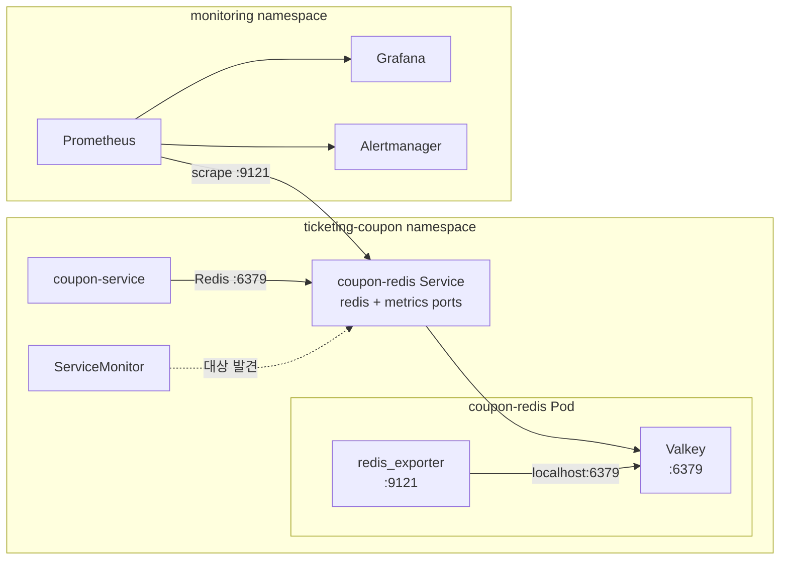
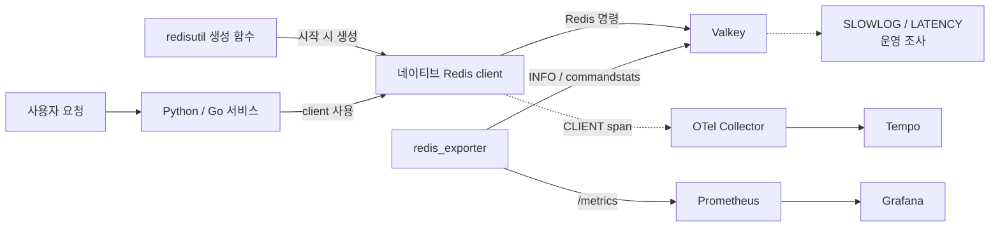

# Redis 서버 메트릭 연동 계획

관련 문서: [Trace 수집 기준](../README.md) · [서비스 메트릭 기준](../../metrics/service-metrics.md) · [대시보드 관리 방식](../../metrics/dashboard-authoring-options.md)

## 목적

Valkey 서버의 메모리, connection, eviction, CPU 상태를 Prometheus에서 수집한다. client span이 요청 한 건의 Redis 지연을 보여준다면, 서버 메트릭은 같은 시각의 Redis 전체 상태를 보여준다.

## 한눈에 보는 배포 구조



NetworkPolicy는 `coupon-service -> 6379`와 `Prometheus -> 9121`을 따로 허용한다.

## 현재와 목표

| 구분 | 현재 | 목표 |
|---|---|---|
| Redis 호환 서버 | `coupon-redis` Valkey StatefulSet 1개 | 유지 |
| metrics 설정 | values에 `serviceMonitor` 선언만 존재 | exporter와 template까지 실제 연결 |
| metrics endpoint | 없음 | sidecar `:9121/metrics` |
| Prometheus 대상 | `ticketing-coupon` namespace 감시 | Redis target 1개를 중복 없이 수집 |
| Collector | DaemonSet의 logs·traces pipeline | Redis metrics 수집에는 사용하지 않음 |

## 수집 방식 결정

| 방식 | 판단 | 이유 |
|---|---|---|
| `redis_exporter` sidecar | 채택 | 현재 단일 Valkey Pod와 1:1 대응하고 Prometheus 구조에 바로 연결 |
| Collector `redisreceiver` | 보류 | DaemonSet마다 같은 endpoint를 읽으면 중복 수집 위험 |

eBPF, Beyla, OBI와 Envoy Redis Proxy는 이 계획에서 다루지 않는다.

## Trace와 server metric의 책임



Tempo는 어느 요청의 Redis 명령이 늦었는지 보여준다. Prometheus는 Redis 서버 전체가 왜 느렸는지 보여준다. SLOWLOG와 Latency Monitor는 원인을 더 확인할 때만 사용한다.

`redisutil`은 계측된 네이티브 client를 생성할 뿐이며 서버 메트릭 수집에는 관여하지 않는다. 서버 메트릭은 client 생성 방식과 독립적으로 exporter가 수집한다.

## 구현 위치

| 위치 | 변경 계획 |
|---|---|
| `platform/data/chart/templates/valkey.yaml` | exporter sidecar와 Service metrics port 추가 |
| Valkey ServiceMonitor template | `release=kube-prometheus-stack`, interval `30s` 설정 |
| Valkey NetworkPolicy | monitoring namespace의 Prometheus가 `9121`에 접근하도록 허용 |
| `platform/monitoring/dashboards/ops` | Redis 운영 dashboard JSON 추가 |
| PrometheusRule | baseline 확인 후 P0 alert부터 추가 |

인증이 추가되면 exporter password를 values나 command line에 직접 넣지 않고 Secret으로 전달한다.

## 수집 범위

| 영역 | 핵심 값 |
|---|---|
| 가용성 | Redis up, exporter scrape 성공 |
| 메모리 | used/max memory, RSS, fragmentation |
| keyspace | keys, expires, eviction, expiration, hit/miss |
| 연결 | connected, blocked, rejected clients |
| 처리량 | commands/sec, command별 호출과 지연 |
| 자원·복제 | CPU, network, persistence, replication 상태 |

실제 metric 이름은 고정한 exporter 버전의 `/metrics`를 확인한 뒤 확정한다. key pattern 조회와 `SCAN` 기반 metric은 기본으로 끈다.

## Dashboard와 alert

```text
Redis up
-> memory / fragmentation
-> commands / latency
-> connections
-> eviction / hit ratio
-> CPU / network
```

| 우선순위 | Alert 후보 | 초기 기준 |
|---|---|---|
| P0 | Redis unavailable | 2분 이상 실패 |
| P0 | memory pressure | 80% warning, 90% critical 검토 |
| P0 | rejected connection | 증가가 반복될 때 |
| P1 | eviction / blocked client | 정상 baseline을 벗어날 때 |
| P1 | command latency | 부하 테스트와 서비스 SLO로 확정 |

임계값은 초기 후보일 뿐이다. Valkey의 `maxmemory`, eviction policy와 부하 테스트 결과를 확인한 뒤 PrometheusRule에 반영한다.

## 보안과 label 기준

- 허용: `instance`, `namespace`, `pod`, `service`, `role`, `db`, 고정된 `cmd`, `environment`
- 금지: Redis key, key pattern, user/request/trace ID, 업무 객체 ID, 원본 오류 문자열
- SLOWLOG 원문은 명령 인자를 포함할 수 있으므로 일반 로그처럼 무제한 수집하지 않는다.
- `LATENCY LATEST`, `HISTORY`, `DOCTOR`는 접근을 제한한 운영 조사 명령으로 둔다.

## 적용 순서

1. Valkey의 `maxmemory`, eviction, persistence 현재 설정을 확인한다.
2. exporter 버전을 고정하고 `/metrics` 원본을 확인한다.
3. sidecar, Service port, ServiceMonitor, NetworkPolicy를 함께 구현한다.
4. Prometheus target과 기본 dashboard를 연결한다.
5. 부하·중단 시험으로 P0 alert와 client span 비교를 검증한다.

## 완료 확인

- [ ] Prometheus에서 `coupon-redis` target 하나가 `up`으로 보인다.
- [ ] Redis port와 metrics port의 NetworkPolicy가 분리된다.
- [ ] memory, keyspace, connection, command, CPU 상태를 Grafana에서 조회한다.
- [ ] key와 사용자·요청·업무 ID가 metric label에 없다.
- [ ] Redis 중단과 복구 시 P0 alert가 발생하고 해제된다.
- [ ] 같은 시각의 client span과 server dashboard를 함께 비교할 수 있다.

## 참고 자료

- [Prometheus Redis and Valkey exporter](https://github.com/oliver006/redis_exporter)
- [OpenTelemetry Collector Redis receiver](https://github.com/open-telemetry/opentelemetry-collector-contrib/tree/main/receiver/redisreceiver)
- [Redis latency monitor](https://redis.io/docs/latest/operate/oss_and_stack/management/optimization/latency-monitor/)
