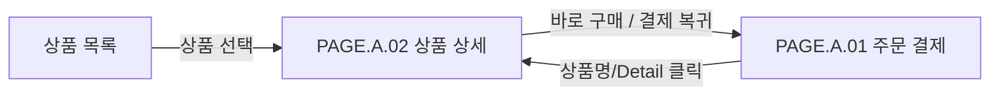

# 상품 상세 페이지

## 페이지 소개

구매자가 상품 정보, 가격, 옵션, 재고 상태를 확인하고 구매 행동으로 이어지는 페이지다.

## 스크린샷

## 연관 사이트맵

[PAGE.A.01](./PAGE_A_01_order_checkout.md)

## 연관 태그

🏷️ 요구사항 참조: [REQ.A.01](../00-requirements/.examples/REQ_A_01_order_checkout.md) | 이동 출발 페이지: [PAGE.A.01](./PAGE_A_01_order_checkout.md)
