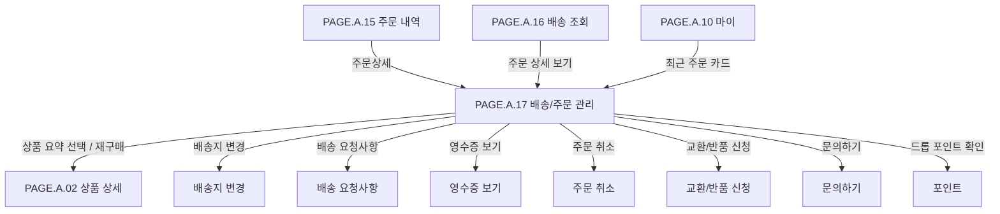

# 배송/주문 관리 페이지

## 페이지 소개

배송/주문 관리 페이지는 구매자가 특정 주문의 상품 요약을 확인하고, 배송지 변경, 배송 요청사항, 영수증, 주문 취소, 교환/반품, 문의하기 같은 주문 후속 관리를 실행하는 화면이다.

한정 드롭 상품은 주문 이후에도 배송 상태에 따라 가능한 행동이 달라진다. 따라서 이 화면은 주문 상태에 맞는 메뉴만 활성화해 불필요한 실패를 줄이고, 사용자가 다음 행동을 명확히 선택하도록 돕는 관리 허브다.

## 스크린샷

## 화면 구성

| 영역 | 화면 요소 | 사용자 행동 | 연결 페이지/기능 |
| --- | --- | --- | --- |
| 상단 앱 바 | 뒤로가기, 페이지 제목, 알림 아이콘 | 이전 화면 복귀, 알림 확인 | 주문 내역, 배송 조회, 알림 |
| 주문 상품 요약 카드 | 상품 썸네일, 상품명, 옵션, 주문번호, 주문일시, 상태 칩, 가격 | 주문 대상 확인 | 상품 상세, 주문 상세 |
| 주문 관리 메뉴 리스트 | 배송지 변경, 배송 요청사항, 영수증 보기, 주문 취소, 교환/반품 신청, 문의하기 | 상태별 주문 관리 실행 | 각 관리 기능 |
| 메뉴 행 상태 | 활성 행, 비활성 행, 불가 라벨, 보조 설명 | 가능한 행동과 불가능한 행동 구분 | 상태 정책 |
| 추가 관리 카드 | 재구매, 드롭 포인트 확인 | 같은 상품 재구매, 포인트 확인 | 상품 상세/장바구니, 포인트 |
| 주문 상태 안내 배너 | 현재 주문 상태 설명, 교환/반품 가능 조건 안내 | 상태별 후속 가능 조건 확인 | 주문 상태 정책 |
| CTA 버튼/링크 | 문의하기, 주문 상세 보기 | 문의 작성, 주문 상세 확인 | 문의, 주문 상세 |
| 하단 내비게이션 | 홈, 드롭, 알림, 마이 | 주요 탭 이동 | 홈, 드롭, 알림, 마이 |

## 연관 사이트맵

## 진입 경로

| 출발 지점 | 진입 조건 | 비고 |
| --- | --- | --- |
| 주문 내역 | 주문상세 버튼 선택 | 주문별 관리 메뉴 확인 |
| 배송 조회 | 주문 상세 보기 선택 | 배송 상태 확인 후 주문 관리 |
| 마이 | 최근 주문 카드 선택 | 최근 주문 관리 진입 |
| 알림 | 주문/배송/문의 알림 선택 | 특정 주문으로 바로 진입 가능 |

## 이동 규칙

| 사용자 행동 | 이동 대상 | 권한/상태 조건 |
| --- | --- | --- |
| 뒤로가기 선택 | 주문 내역 또는 이전 화면 | 진입 경로 기준 복귀 |
| 알림 아이콘 선택 | 알림 | 로그인 필요 |
| 상품 요약 선택 | 상품 상세 또는 주문 상세 | 주문 상품 스냅샷 기준 표시 |
| 배송지 변경 선택 | 배송지 변경 | 배송 준비 전 또는 정책상 허용 상태 |
| 배송 요청사항 선택 | 배송 요청사항 | 출고 전까지 수정 가능 |
| 영수증 보기 선택 | 영수증 | 결제 완료 이후 가능 |
| 주문 취소 선택 | 주문 취소 | 배송 준비 시작 전까지 가능 |
| 교환/반품 신청 선택 | 교환/반품 | 배송 완료 후 7일 이내 등 정책 필요 |
| 문의하기 선택 | 문의 작성 | 주문 소유자만 가능 |
| 재구매 선택 | 상품 상세 또는 장바구니 | 상품 판매 가능 상태 필요 |
| 드롭 포인트 확인 선택 | 포인트 | 로그인 필요 |
| 주문 상세 보기 선택 | 주문 상세 | 주문 상세 정보 확인 |

## 페이지 데이터

| 데이터 | 설명 | 출처/후속 연결 |
| --- | --- | --- |
| 주문 식별자 | 주문 ID, 주문번호 | 주문 서비스 |
| 주문 상품 요약 | 상품명, 옵션, 수량, 썸네일, 주문일시, 가격 | 주문 상품 스냅샷 |
| 주문 상태 | 배송중, 배송완료, 주문완료, 취소, 교환, 반품 | 주문/배송 서비스 |
| 관리 메뉴 목록 | 메뉴명, 아이콘, 보조 설명, 활성 여부, 불가 사유 | 주문 상태 정책 |
| 배송지 변경 가능 여부 | 현재 상태 기준 배송지 변경 가능 여부 | 배송/주문 정책 |
| 배송 요청사항 | 현재 요청사항과 변경 가능 여부 | 주문 배송 정보 |
| 영수증 정보 | 결제 금액, 결제 수단, 영수증 조회 가능 여부 | 결제 서비스 |
| 취소 가능 여부 | 주문 취소 가능 여부와 사유 | 주문 정책 |
| 교환/반품 가능 여부 | 신청 가능 기간, 상품 상태 조건 | 교환/반품 정책 |
| 포인트 정보 | 보유 포인트 또는 주문 적립 포인트 | 포인트 서비스 |

## 상태와 예외

| 상태 | 화면 처리 | 비고 |
| --- | --- | --- |
| 배송중 | 배송지 변경/배송 요청사항/영수증/문의는 활성, 주문 취소와 교환/반품은 정책에 따라 비활성화한다. | 시안 기본 상태 |
| 배송완료 | 교환/반품 신청과 구매확정 관련 행동을 활성화할 수 있다. | 기간 조건 필요 |
| 주문완료/결제완료 | 주문 취소와 배송지 변경을 활성화할 수 있다. | 배송 준비 전 기준 |
| 취소 | 주문 취소 이후에는 취소 상태와 영수증/문의 중심으로 표시한다. | 재구매 가능 |
| 교환/반품 | 교환/반품 진행 상태와 문의 중심으로 표시한다. | 별도 상태 추적 필요 |
| 메뉴 비활성 | 회색 아이콘, 불가 라벨, 사유 문구를 함께 표시한다. | 실패 버튼 클릭 방지 |
| 주문 조회 실패 | 주문 내역으로 돌아가기와 재시도를 제공한다. | 권한/네트워크 오류 |

## 후속 페이지 후보

| 후보 Page ID | 페이지 | 상태 | 배송/주문 관리에서의 연결 |
| --- | --- | --- | --- |
| `PAGE.A.02` | [상품 상세](./PAGE_A_02_product_detail.md) | 작성 완료 | 상품 요약, 재구매 |
| `PAGE.A.10` | [마이](./PAGE_A_10_my.md) | 작성 완료 | 하단 마이 |
| `PAGE.A.15` | [주문 내역](./PAGE_A_15_order_history.md) | 작성 완료 | 뒤로가기, 주문상세 진입 |
| `PAGE.A.16` | [배송 조회](./PAGE_A_16_track_order.md) | 작성 완료 | 주문 상세 보기 진입 전후 |
| `PAGE.A.18` | 배송지 변경 | 문서 예정 | 배송지 변경 |
| `PAGE.A.19` | 교환/반품 신청 | 문서 예정 | 교환/반품 |
| `PAGE.A.20` | 문의하기 | 문서 예정 | 문의하기 |

## 연관 요구사항

| Requirements ID | 연결 이유 |
| --- | --- |
| [REQ.A.01](../00-requirements/REQ_A_01_limited_drop_commerce.md) | 주문 이후 배송 상태, 주문 취소, 교환/반품, 재구매, 문의 같은 사후 주문 관리와 연결된다. |
| [REQ.A.02](../00-requirements/REQ_A_02_coupon_benefit.md) | 영수증, 최종 결제 금액, 포인트 확인에서 쿠폰/포인트 적용 결과 확인과 연결된다. |

## 연관 태그

🏷️ 요구사항 참조: [REQ.A.01](../00-requirements/REQ_A_01_limited_drop_commerce.md), [REQ.A.02](../00-requirements/REQ_A_02_coupon_benefit.md) | 플로우 참조: FLOW.A.17 | UI 참조: [UI.A.17](../20-ui/UI_A_17_shipping_order_manage.md) | UC 참조: UC.A.17 | 영속성 참조: PST.A.17 | 서비스 참조: SVC.A.17 | 시나리오 참조: SCN.A.17 | API 참조: API.A.17

## 열린 질문

- 이 화면을 “주문 상세”로 명명할 것인가, “배송/주문 관리”로 별도 분리할 것인가?
- 배송지 변경과 배송 요청사항은 어느 배송 상태까지 허용할 것인가?
- 주문 취소는 배송 준비 전까지 허용할 것인가, 판매자 확인 전까지 허용할 것인가?
- 교환/반품 신청 조건은 배송 완료 후 며칠까지로 둘 것인가?
- 재구매는 상품 상세로 보낼 것인가, 장바구니에 즉시 담을 것인가?

## 확인 필요

- 주문 상태별 메뉴 활성/비활성 정책
- 주문 취소, 교환/반품, 문의하기의 후속 Page ID 확정
- 영수증 보기 방식: 앱 내부 문서, PDF, 외부 결제 영수증
- 배송지 변경과 배송 요청사항 수정 API 책임
- 문의하기에서 주문/상품/배송 문의 유형 분리 여부
- 주문 상세 보기 버튼이 이 화면 내부 상세 섹션인지 별도 페이지인지 확정
