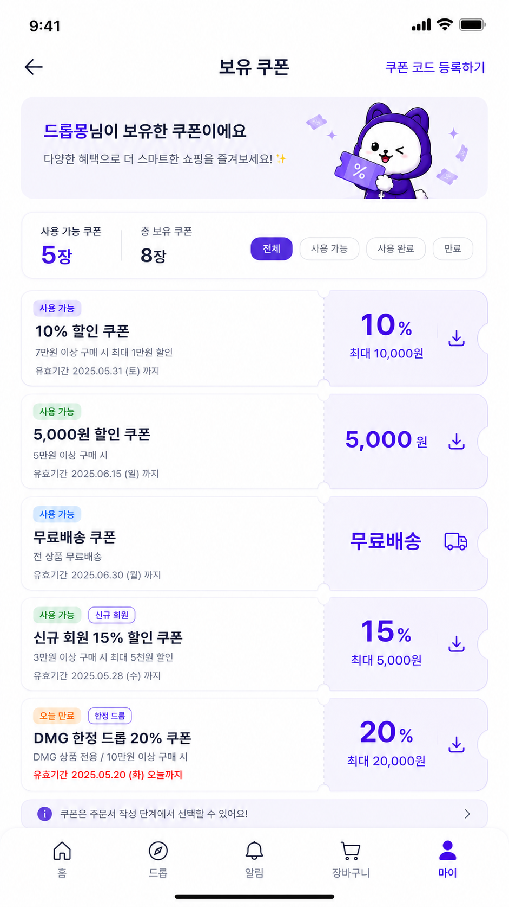
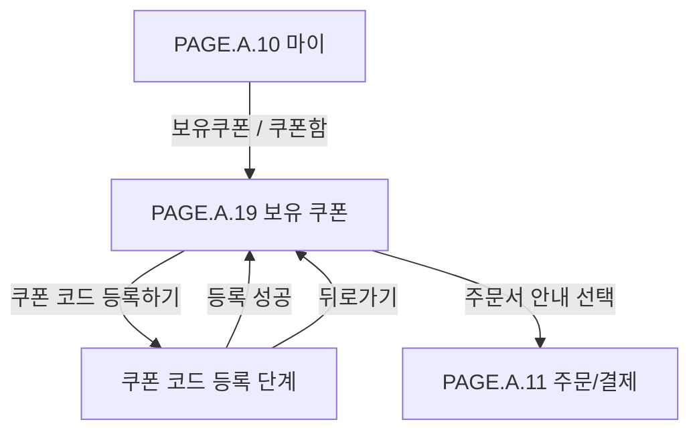

# 보유 쿠폰 페이지

## 페이지 소개

보유 쿠폰 페이지는 구매자가 마이 페이지에서 진입해 사용 가능 쿠폰, 사용 완료 쿠폰, 만료 쿠폰을 확인하고, 받을 수 있는 쿠폰을 수령하거나 이벤트와 프로모션으로 받은 쿠폰 코드를 등록하는 화면 묶음이다.

쿠폰은 주문서에서 선택 가능한 혜택이므로, 이 화면은 단순 목록이 아니라 사용 가능 상태, 만료 임박, 혜택 유형, 주문 적용 가능성을 미리 확인하는 개인 혜택 허브 역할을 한다.

물리 화면은 `보유 쿠폰`과 `쿠폰 코드 등록`으로 나뉘지만 사용자 목적은 하나이므로 `PAGE.A.19` 하나에서 스크린샷, 사이트맵, 이동 규칙, 상태와 예외를 함께 관리한다.

## 스크린샷

  <figure style="flex: 1 1 0; margin: 0;">
    
    <figcaption>1. 마이 페이지 쿠폰함 진입</figcaption>
  </figure>
  <figure style="flex: 1 1 0; margin: 0;">
    
    <figcaption>2. 보유 쿠폰</figcaption>
  </figure>
  <figure style="flex: 1 1 0; margin: 0;">
    
    <figcaption>3. 쿠폰 코드 등록</figcaption>
  </figure>

## 화면 구성

| 화면 | 영역 | 화면 요소 | 사용자 행동 | 연결 페이지/기능 |
| --- | --- | --- | --- | --- |
| 보유 쿠폰 | 상단 앱 바 | 뒤로가기, 페이지 제목, 쿠폰 코드 등록하기 | 마이로 복귀, 쿠폰 코드 등록 단계 진입 | [PAGE.A.10](../PAGE_A_10_my.md), 쿠폰 코드 등록 단계 |
| 보유 쿠폰 | 소개 배너 | 보유 쿠폰 안내 문구, 쿠폰 캐릭터 이미지 | 보유 쿠폰 화면의 맥락 확인 | 쿠폰 혜택 안내 |
| 보유 쿠폰 | 쿠폰 요약 카드 | 사용 가능 쿠폰 수, 총 보유 쿠폰 수, 필터 탭 | 쿠폰 상태별 현황 확인, 상태 필터 선택 | 쿠폰 조회 |
| 보유 쿠폰 | 필터 탭 | 전체, 사용 가능, 사용 완료, 만료 | 상태별 목록 필터링 | 쿠폰 목록 조회 |
| 보유 쿠폰 | 보유 쿠폰 카드 | 상태 배지, 쿠폰명, 조건, 유효기간, 혜택 금액/비율, 액션 아이콘 | 쿠폰 확인, 수령, 상세/적용 안내 확인 | 쿠폰 수령, 쿠폰 상세, 주문서 사용 예정 |
| 보유 쿠폰 | 안내 메시지 바 | 주문서에서 쿠폰 사용 가능 안내 | 주문서 사용 맥락 확인 | 주문서 |
| 쿠폰 코드 등록 | 상단 앱 바 | 뒤로가기, 페이지 제목 | 보유 쿠폰 목록으로 복귀 | 보유 쿠폰 단계 |
| 쿠폰 코드 등록 | 소개 배너 | 쿠폰 코드 등록 안내, 캐릭터 이미지 | 쿠폰 코드 등록 맥락 확인 | 쿠폰 등록 안내 |
| 쿠폰 코드 등록 | 쿠폰 코드 입력 카드 | 쿠폰 코드 입력 필드, 등록하기 CTA | 쿠폰 코드 입력, 등록 요청 | 쿠폰 코드 검증 API |
| 쿠폰 코드 등록 | 등록 안내 카드 | 입력 형식, 등록 불가 조건, 등록 후 확인 위치 | 등록 정책 확인 | 쿠폰 정책 |

## 연관 사이트맵

## 진입 경로

| 출발 지점 | 진입 조건 | 비고 |
| --- | --- | --- |
| [PAGE.A.10 마이](../PAGE_A_10_my.md) | 보유쿠폰 요약 또는 쿠폰함 메뉴 선택 | 로그인 필요 |
| 주문/결제 | 쿠폰 사용 후보 확인 중 보유 쿠폰 확인 | 주문서 연결 정책 확인 필요 |
| 쿠폰 코드 등록 단계 | 등록 성공 또는 뒤로가기 | 목록 갱신 필요 |

## 이동 규칙

| 사용자 행동 | 이동 대상 | 권한/상태 조건 |
| --- | --- | --- |
| 뒤로가기 선택 | [PAGE.A.10 마이](../PAGE_A_10_my.md) | 로그인 상태 유지 |
| 쿠폰 수령 선택 | 현재 화면 내부 상태 변경 | 발급 가능 쿠폰, 로그인 필요, 수량/기간/대상 조건 검증 |
| 쿠폰 코드 등록하기 선택 | 쿠폰 코드 등록 단계 | 로그인 필요 |
| 쿠폰 코드 등록 단계에서 뒤로가기 선택 | 보유 쿠폰 단계 | 입력 중인 쿠폰 코드 폐기 여부 확인 필요 |
| 쿠폰 코드 입력 | 쿠폰 코드 등록 단계 내부 상태 변경 | 영문 대문자, 숫자 조합 기준 |
| 등록하기 선택 | 보유 쿠폰 단계 또는 현재 화면 오류 표시 | 서버 검증 성공 시 보유 쿠폰 목록 갱신 |
| 전체/사용 가능/사용 완료/만료 탭 선택 | 현재 화면 내부 상태 변경 | 쿠폰 상태 필터 적용 |
| 정렬 선택 | 현재 화면 내부 상태 변경 | 최신순 기본, 만료 임박순 검토 |
| 쿠폰 카드 액션 선택 | 쿠폰 수령, 쿠폰 상세 또는 주문서 사용 안내 | 액션 의미 확인 필요 |
| 안내 메시지 선택 | [PAGE.A.11 주문/결제](../PAGE_A_11_payment.md) 또는 안내 상세 | 주문서 진입 가능 조건 확인 필요 |

## 페이지 데이터

| 데이터 | 설명 | 출처/후속 연결 |
| --- | --- | --- |
| 쿠폰 요약 | 사용 가능 쿠폰 수, 총 보유 쿠폰 수, 포인트 | 쿠폰/포인트 서비스 |
| 필터 상태 | 전체, 사용 가능, 사용 완료, 만료 | 클라이언트 상태 |
| 정렬 상태 | 최신순, 만료 임박순 후보 | 클라이언트/쿠폰 서비스 |
| 쿠폰 목록 | 쿠폰 ID, 쿠폰명, 상태, 혜택 유형, 할인 값, 최대 할인 금액, 조건, 유효기간, 태그 | 쿠폰 서비스 |
| 쿠폰 수령 상태 | 수령 가능, 수령 완료, 발급 대기, 수량 종료, 대상 아님 | 쿠폰 서비스 |
| 쿠폰 액션 | 수령, 상세, 주문 사용 안내 가능 여부 | 쿠폰 정책 |
| 쿠폰 코드 입력값 | 사용자가 입력한 프로모션 코드 | 사용자 입력 |
| 입력 검증 상태 | 필수값, 형식, 길이, 허용 문자 | 클라이언트/쿠폰 서비스 |
| 등록 결과 | 등록 성공, 이미 등록됨, 만료됨, 사용 완료, 대상 아님, 존재하지 않음 | 쿠폰 서비스 |
| 등록된 쿠폰 | 등록 성공 후 추가된 보유 쿠폰 ID와 표시 정보 | 쿠폰 서비스 |
| 재시도 제한 | 연속 실패 횟수, 제한 해제 시각 | 쿠폰/보안 정책 |
| 안내 메시지 | 주문서에서 쿠폰 사용 가능 안내 | 쿠폰/주문 정책 |

## 상태와 예외

| 상태 | 화면 처리 | 비고 |
| --- | --- | --- |
| 사용 가능 쿠폰 있음 | 사용 가능 쿠폰을 기본 우선순위로 표시한다. | 기본 상태 |
| 쿠폰 없음 | 빈 상태와 쿠폰 코드 등록 CTA를 표시한다. | 빈 상태 시안 필요 |
| 수령 가능 쿠폰 있음 | 수령 CTA를 표시하고 성공 시 보유 쿠폰 목록을 갱신한다. | 선착순/대상 조건 검증 필요 |
| 쿠폰 수령 대기 | 발급 대기 상태와 안내 문구를 표시한다. | 비동기 발급일 때 사용자 표현 결정 필요 |
| 쿠폰 수령 실패 | 실패 사유와 재시도 가능 여부를 표시한다. | 수량 종료, 대상 아님, 기간 아님, 중복 수령 |
| 사용 완료/만료 필터 | 해당 상태의 쿠폰 목록과 상태 배지를 표시한다. | 사용 불가 사유 확인 가능해야 함 |
| 오늘 만료 쿠폰 있음 | 만료 임박 배지와 강조 문구를 표시한다. | 주문 전환 유도 |
| 쿠폰 조회 실패 | 재시도 CTA와 일시 실패 안내를 표시한다. | 공개 페이지가 아니므로 로그인 유지 확인 |
| 쿠폰 코드 입력 전 | 입력 필드와 등록하기 CTA를 표시한다. | 쿠폰 코드 등록 기본 상태 |
| 쿠폰 코드 형식 오류 | 입력 필드 오류와 형식 안내를 표시한다. | 영문 대문자/숫자 기준 |
| 쿠폰 코드 등록 성공 | 성공 토스트를 표시하고 보유 쿠폰 목록으로 돌아가거나 목록을 갱신한다. | 이동 방식 확인 필요 |
| 이미 등록한 코드 | 중복 등록 불가 안내를 표시한다. | 사용자/코드 기준 멱등 처리 |
| 만료/사용 완료 코드 | 등록 불가 사유를 표시한다. | 사용자와 CS가 같은 코드로 확인 가능해야 함 |
| 쿠폰 코드 서버 검증 실패 | 재시도 안내를 표시하고 입력값을 유지한다. | 실패 횟수 제한 검토 |
| 세션 만료 | 로그인 화면으로 이동하고 복귀 의도를 보존한다. | 인증 게이트 |

## 연관 요구사항

| Requirements ID | 연결 이유 |
| --- | --- |
| [REQ.A.02.FR-006](../../00-requirements/REQ_A_02_coupon_benefit.md) | 구매자는 내 쿠폰함에서 보유 쿠폰, 사용 가능 쿠폰, 사용 완료 쿠폰, 만료 쿠폰을 조회한다. |
| [REQ.A.02.FR-003](../../00-requirements/REQ_A_02_coupon_benefit.md) | 쿠폰 수령 요청 시 로그인 사용자, 쿠폰 상태, 발급 기간, 발급 대상, 1인 제한을 검증한다. |
| [REQ.A.02.FR-004](../../00-requirements/REQ_A_02_coupon_benefit.md) | 선착순 쿠폰 수령 요청은 수량 제한 안에서 원자적으로 승인하거나 실패 사유를 반환한다. |
| [REQ.A.02.FR-005](../../00-requirements/REQ_A_02_coupon_benefit.md) | 같은 사용자와 같은 쿠폰의 중복 수령 요청은 하나의 발급 결과로 처리한다. |
| [REQ.A.02.FR-007](../../00-requirements/REQ_A_02_coupon_benefit.md) | 주문서에서 현재 주문에 적용 가능한 쿠폰 목록과 적용 불가 사유를 확인한다. |
| [REQ.A.02.FR-025](../../00-requirements/REQ_A_02_coupon_benefit.md) | 사용자는 쿠폰 코드를 입력해 보유 쿠폰으로 등록할 수 있어야 한다. |
| [REQ.A.02.NFR-005](../../00-requirements/REQ_A_02_coupon_benefit.md) | 같은 쿠폰 코드 등록 요청을 반복해도 중복 보유 쿠폰이 생성되지 않아야 한다. |

## 연관 태그

🏷️ 요구사항 참조: [REQ.A.02](../../00-requirements/REQ_A_02_coupon_benefit.md) | 플로우 참조: FLOW.A.19 | UI 참조: [UI.A.19](../../20-ui/UI_A_19_coupon_wallet/UI_A_19_coupon_wallet.md) | UC 참조: [UC.A.19](../../30-uc/UC_A_19_coupon_wallet.md) | 영속성 참조: PST.A.19 예정 | 서비스 참조: SVC.A.19 예정 | 시나리오 참조: SCN.A.19 예정 | API 참조: API.A.19 예정

## 확인 필요

- 쿠폰 카드 액션 아이콘의 실제 동작: 쿠폰 수령, 쿠폰 상세, 주문서 이동 중 무엇인지 확인한다.
- 쿠폰 수령 성공을 즉시 보유 쿠폰으로 표시할지, 발급 대기 상태를 먼저 표시할지 정한다.
- 기본 정렬을 최신순으로 둘지, 만료 임박순을 우선할지 정한다.
- 포인트 요약을 보유 쿠폰 화면에 계속 둘지 별도 포인트 페이지로만 보낼지 정한다.
- 쿠폰 코드 입력 시 자동 대문자 변환, 공백 제거, 하이픈 허용 여부를 정한다.
- 등록 성공 후 보유 쿠폰 화면으로 자동 이동할지, 현재 화면에서 계속 등록 가능하게 할지 정한다.
- 쿠폰 코드 등록 실패 횟수 제한과 잠금/쿨다운 정책을 정한다.
