# 판매자 웹 포털 사이트맵

## 문서 역할

이 문서는 판매자 웹 포털에 실제로 존재하는 페이지와 페이지 사이의 이동 관계를 정의한다.

`PAGE.A.200~211`은 한 사이트맵 문서에서 관리한다. 페이지에서 제공하는 기능, 권한, 상태 규칙은 요구사항과 UI 문서에서 다루고 이 문서에서는 반복하지 않는다.

## 포함 페이지

| Page ID | 페이지 | 실제 경로 |
| --- | --- | --- |
| `PAGE.A.200` | 판매자 대시보드 | `/seller` |
| `PAGE.A.201` | 드롭 관리 | `/seller/drops` |
| `PAGE.A.202` | 상품 관리 | `/seller/products` |
| `PAGE.A.203` | 드롭 등록·편집 | `/seller/drops/new`, `/seller/drops/{dropId}/edit` |
| `PAGE.A.204` | 검수·변경 요청 | `/seller/drops/{dropId}/review` |
| `PAGE.A.205` | 주문·출고 | `/seller/orders` |
| `PAGE.A.206` | 쿠폰·프로모션 | `/seller/coupons` |
| `PAGE.A.207` | 판매 분석 | `/seller/analytics` |
| `PAGE.A.208` | 정산 조회 | `/seller/settlements` |
| `PAGE.A.209` | 판매자·스토어 정보 | `/seller/settings/store` |
| `PAGE.A.210` | 팀·권한 | `/seller/settings/members` |
| `PAGE.A.211` | 운영 이슈 | `/seller/issues` |

## 전체 사이트맵

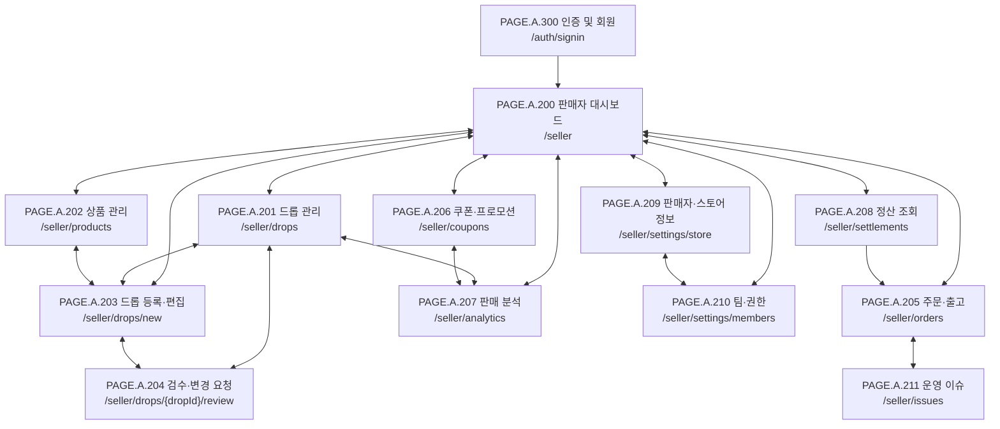

`PAGE.A.200`, `PAGE.A.201`, `PAGE.A.202`, `PAGE.A.205`, `PAGE.A.206`, `PAGE.A.207`, `PAGE.A.208`, `PAGE.A.209`, `PAGE.A.210`은 공통 좌측 메뉴에 노출된다. 따라서 이 페이지들은 현재 페이지에서 대시보드를 거치지 않고 서로 직접 이동할 수 있다. 다이어그램은 연결선 과밀을 피하기 위해 `PAGE.A.200`을 기준점으로 표시한다.

## 페이지 이동 관계

| 현재 페이지 | 화면 내부에서 직접 이동 가능한 페이지 |
| --- | --- |
| `PAGE.A.200` | `PAGE.A.201`, `PAGE.A.202`, `PAGE.A.203`, `PAGE.A.205`, `PAGE.A.206`, `PAGE.A.207`, `PAGE.A.208`, `PAGE.A.209`, `PAGE.A.210` |
| `PAGE.A.201` | `PAGE.A.203`, `PAGE.A.204`, `PAGE.A.207` |
| `PAGE.A.202` | `PAGE.A.203` |
| `PAGE.A.203` | `PAGE.A.201`, `PAGE.A.202`, `PAGE.A.204` |
| `PAGE.A.204` | `PAGE.A.201`, `PAGE.A.203` |
| `PAGE.A.205` | `PAGE.A.211` |
| `PAGE.A.206` | `PAGE.A.207` |
| `PAGE.A.207` | `PAGE.A.201`, `PAGE.A.206` |
| `PAGE.A.208` | `PAGE.A.205` |
| `PAGE.A.209` | `PAGE.A.210` |
| `PAGE.A.210` | `PAGE.A.209` |
| `PAGE.A.211` | `PAGE.A.205` |

## 시나리오별 이동 경로와 화면

각 시나리오는 왼쪽에서 오른쪽 순서로 읽는다. 화면이 문서 너비를 넘으면 가로 스크롤로 다음 단계를 이어서 확인한다.

| 시나리오 | 이동 경로 |
| --- | --- |
| 드롭 준비와 검수 | `PAGE.A.200 → PAGE.A.202 → PAGE.A.203 → PAGE.A.204 → PAGE.A.201` |
| 주문 출고와 이슈 | `PAGE.A.200 → PAGE.A.205 → PAGE.A.211` |
| 쿠폰 운영과 성과 | `PAGE.A.200 → PAGE.A.206 → PAGE.A.207` |
| 정산 상태 확인 | `PAGE.A.200 → PAGE.A.208` |
| 스토어와 팀 설정 | `PAGE.A.200 → PAGE.A.209 → PAGE.A.210` |

### 시나리오 1. 드롭 준비와 검수

  <figure style="min-width: 320px; margin: 0;"><figcaption>1. PAGE.A.200 판매자 대시보드</figcaption></figure>
  <figure style="min-width: 320px; margin: 0;">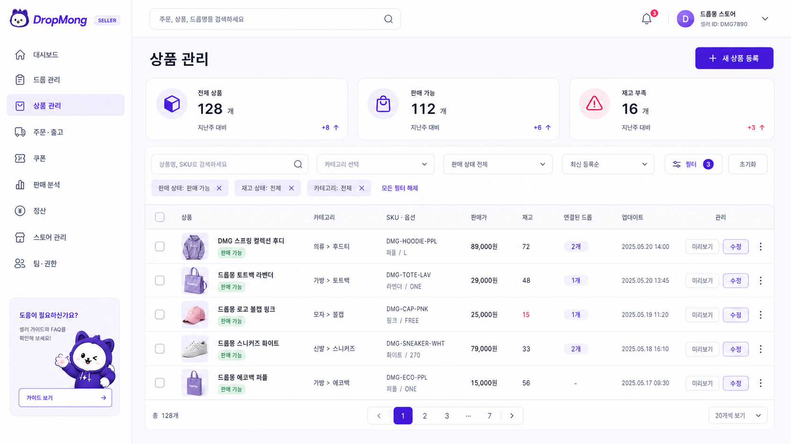<figcaption>2. PAGE.A.202 상품 관리</figcaption></figure>
  <figure style="min-width: 320px; margin: 0;">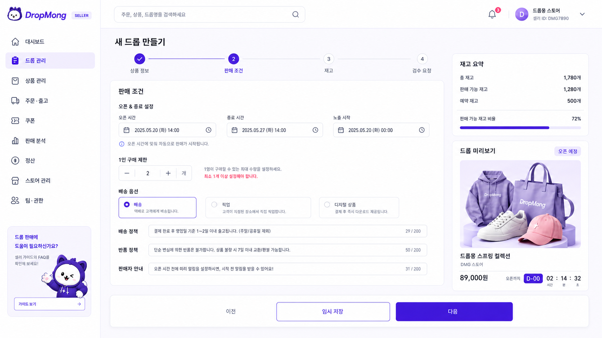<figcaption>3. PAGE.A.203 드롭 등록·편집</figcaption></figure>
  <figure style="min-width: 320px; margin: 0;"><figcaption>4. PAGE.A.204 검수·변경 요청</figcaption></figure>
  <figure style="min-width: 320px; margin: 0;">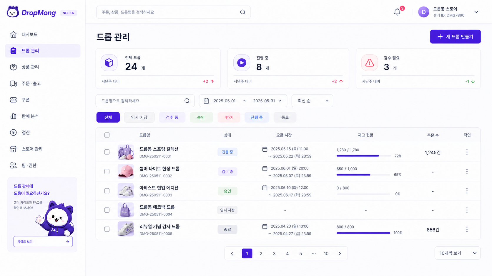<figcaption>5. PAGE.A.201 드롭 관리</figcaption></figure>

### 시나리오 2. 주문 출고와 이슈

  <figure style="min-width: 320px; margin: 0;"><figcaption>1. PAGE.A.200 출고 대기 확인</figcaption></figure>
  <figure style="min-width: 320px; margin: 0;">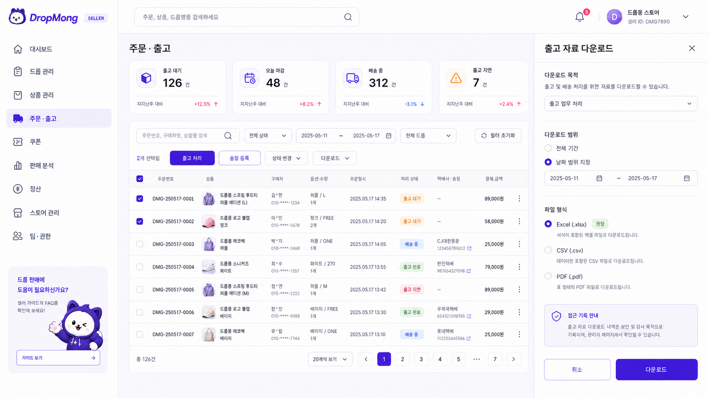<figcaption>2. PAGE.A.205 주문·출고</figcaption></figure>
  <figure style="min-width: 320px; margin: 0;">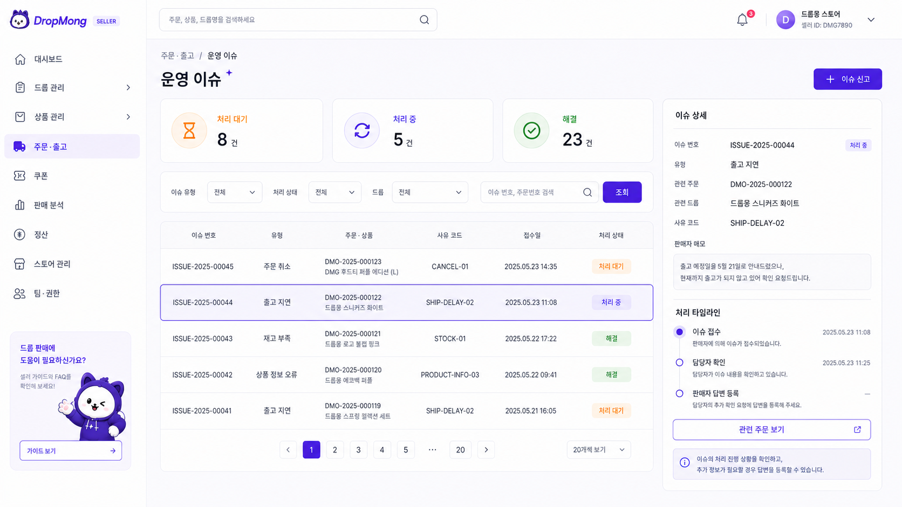<figcaption>3. PAGE.A.211 운영 이슈</figcaption></figure>

### 시나리오 3. 쿠폰 운영과 성과

  <figure style="min-width: 320px; margin: 0;"><figcaption>1. PAGE.A.200 쿠폰 작업 확인</figcaption></figure>
  <figure style="min-width: 320px; margin: 0;">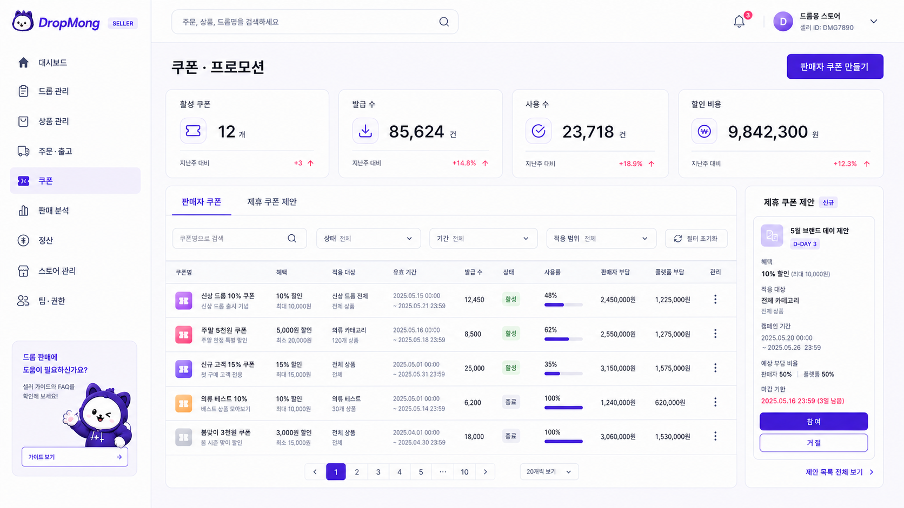<figcaption>2. PAGE.A.206 쿠폰·프로모션</figcaption></figure>
  <figure style="min-width: 320px; margin: 0;">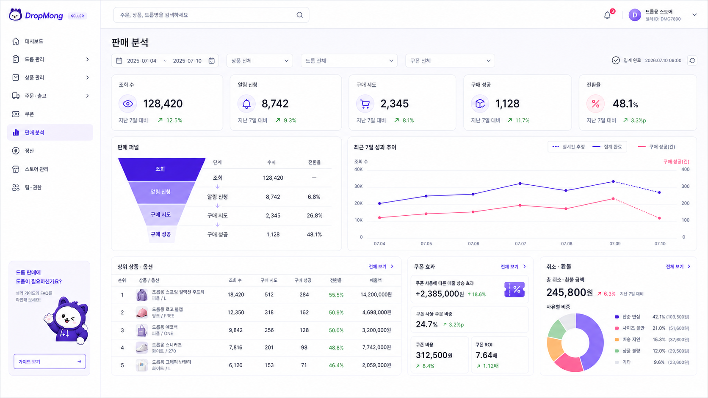<figcaption>3. PAGE.A.207 판매 분석</figcaption></figure>

### 시나리오 4. 정산 상태 확인

  <figure style="min-width: 320px; margin: 0;"><figcaption>1. PAGE.A.200 정산 요약 확인</figcaption></figure>
  <figure style="min-width: 320px; margin: 0;">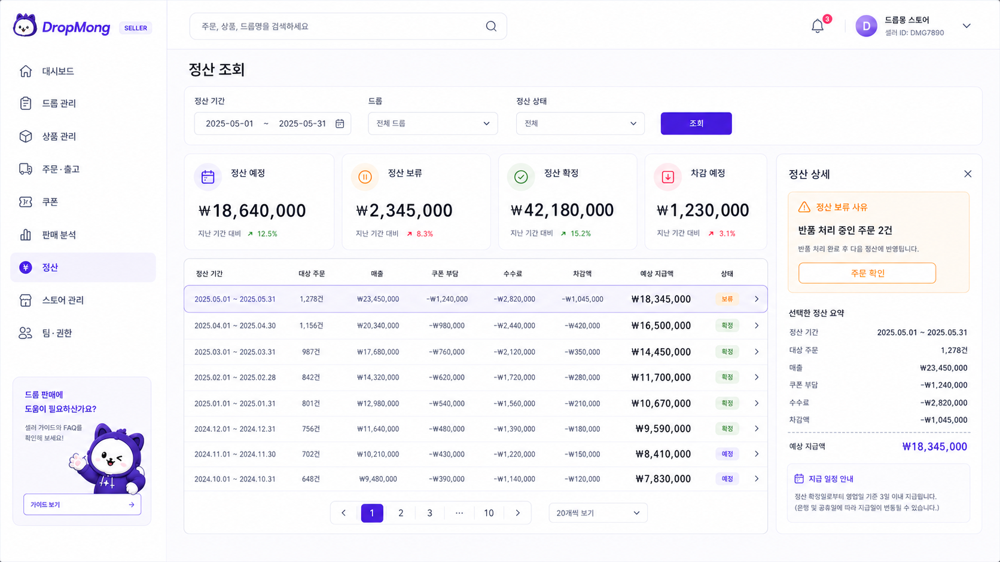<figcaption>2. PAGE.A.208 정산 조회</figcaption></figure>

### 시나리오 5. 스토어와 팀 설정

  <figure style="min-width: 320px; margin: 0;"><figcaption>1. PAGE.A.200 판매자 설정 진입</figcaption></figure>
  <figure style="min-width: 320px; margin: 0;">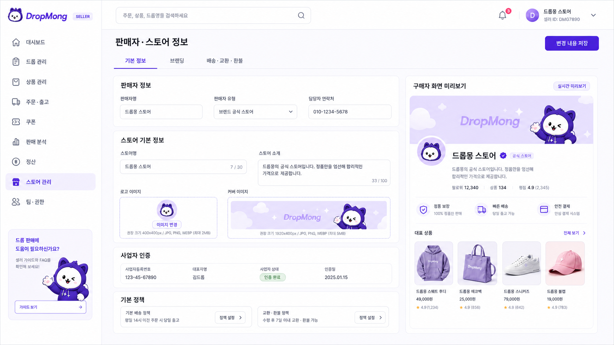<figcaption>2. PAGE.A.209 판매자·스토어 정보</figcaption></figure>
  <figure style="min-width: 320px; margin: 0;">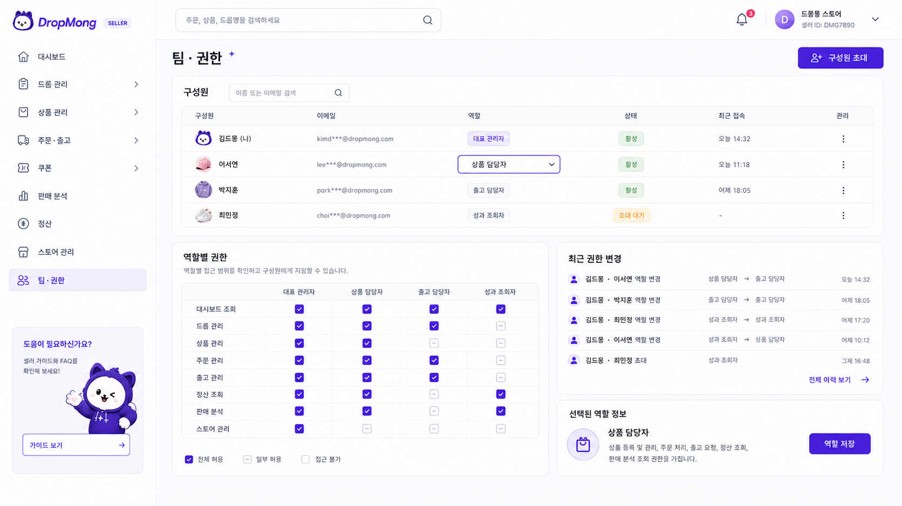<figcaption>3. PAGE.A.210 팀·권한</figcaption></figure>

## 화면 에셋 연결

| Page ID | UI ID | 화면 에셋 | 시나리오 |
| --- | --- | --- | --- |
| `PAGE.A.200` | `UI.A.200` | [판매자 대시보드](../../20-ui/assets/UI_A_200_seller_portal/UI_A_200_01_seller_portal_dashboard.png) | 전체 진입점 |
| `PAGE.A.201` | `UI.A.201` | [드롭 관리](../../20-ui/assets/UI_A_200_seller_portal/UI_A_201_01_drop_management.png) | 드롭 준비와 검수 |
| `PAGE.A.202` | `UI.A.202` | [상품 관리](../../20-ui/assets/UI_A_200_seller_portal/UI_A_202_01_product_management.png) | 드롭 준비와 검수 |
| `PAGE.A.203` | `UI.A.203` | [드롭 등록·편집](../../20-ui/assets/UI_A_200_seller_portal/UI_A_203_01_drop_create_edit.png) | 드롭 준비와 검수 |
| `PAGE.A.204` | `UI.A.204` | [검수·변경 요청](../../20-ui/assets/UI_A_200_seller_portal/UI_A_204_01_review_change_request.png) | 드롭 준비와 검수 |
| `PAGE.A.205` | `UI.A.205` | [주문·출고](../../20-ui/assets/UI_A_200_seller_portal/UI_A_205_01_order_fulfillment.png) | 주문 출고와 이슈 |
| `PAGE.A.206` | `UI.A.206` | [쿠폰·프로모션](../../20-ui/assets/UI_A_200_seller_portal/UI_A_206_01_coupon_promotion.png) | 쿠폰 운영과 성과 |
| `PAGE.A.207` | `UI.A.207` | [판매 분석](../../20-ui/assets/UI_A_200_seller_portal/UI_A_207_01_sales_analytics.png) | 쿠폰 운영과 성과 |
| `PAGE.A.208` | `UI.A.208` | [정산 조회](../../20-ui/assets/UI_A_200_seller_portal/UI_A_208_01_settlement.png) | 정산 상태 확인 |
| `PAGE.A.209` | `UI.A.209` | [판매자·스토어 정보](../../20-ui/assets/UI_A_200_seller_portal/UI_A_209_01_store_settings.png) | 스토어와 팀 설정 |
| `PAGE.A.210` | `UI.A.210` | [팀·권한](../../20-ui/assets/UI_A_200_seller_portal/UI_A_210_01_team_permissions.png) | 스토어와 팀 설정 |
| `PAGE.A.211` | `UI.A.211` | [운영 이슈](../../20-ui/assets/UI_A_200_seller_portal/UI_A_211_01_operational_issues.png) | 주문 출고와 이슈 |

### 공통 컴포넌트

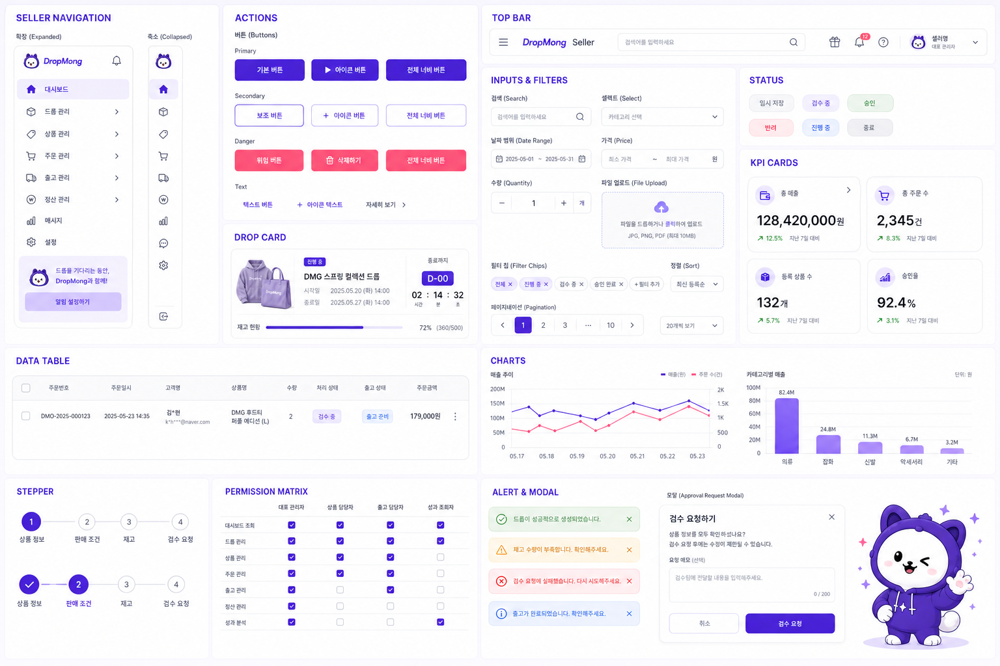

## 연관 태그

🏷️ 요구사항 참조: [REQ.A.03](../../00-requirements/REQ_A_03_seller.md), [REQ.A.02](../../00-requirements/REQ_A_02_coupon_benefit.md) | 페이지 참조: PAGE.A.200~211 | UI 참조: [UI.A.200~211](../../20-ui/UI_A_200_seller_portal/README.md) | UC 참조: [UC.A.02](../../30-uc/UC_A_02_seller_manage_drop.md), [UC.A.300](../../30-uc/UC_A_300_auth_member.md) | 영속성 참조: PST.A.200 예정 | 서비스 참조: SVC.A.200 예정 | 시나리오 참조: SCN.A.200 예정 | API 참조: API.A.200 예정

## 이동 경로 확인 필요

- `PAGE.A.300` 공통 인증 페이지에서 `PAGE.A.200`으로 직접 이동할지, 판매자 전용 로그인 페이지를 추가할지 정한다.
- `PAGE.A.202` 상품 관리와 `PAGE.A.203` 드롭 등록·편집을 별도 페이지로 유지할지 정한다.
