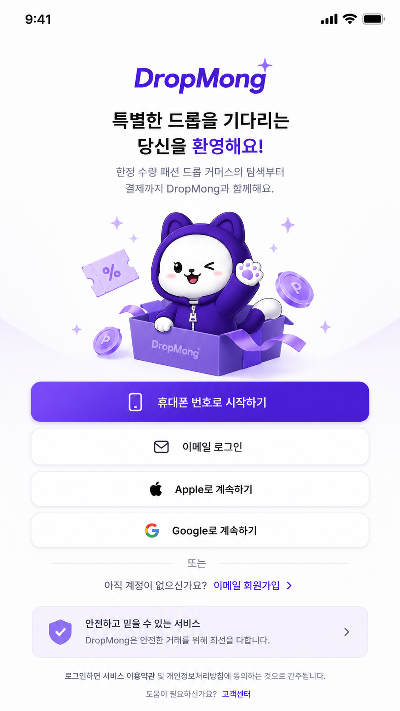
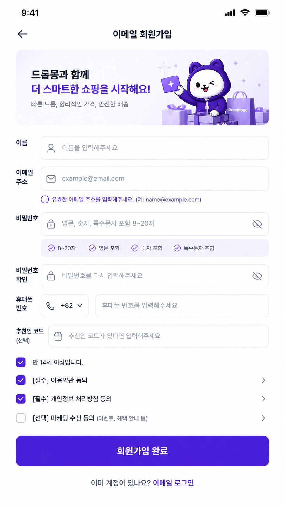
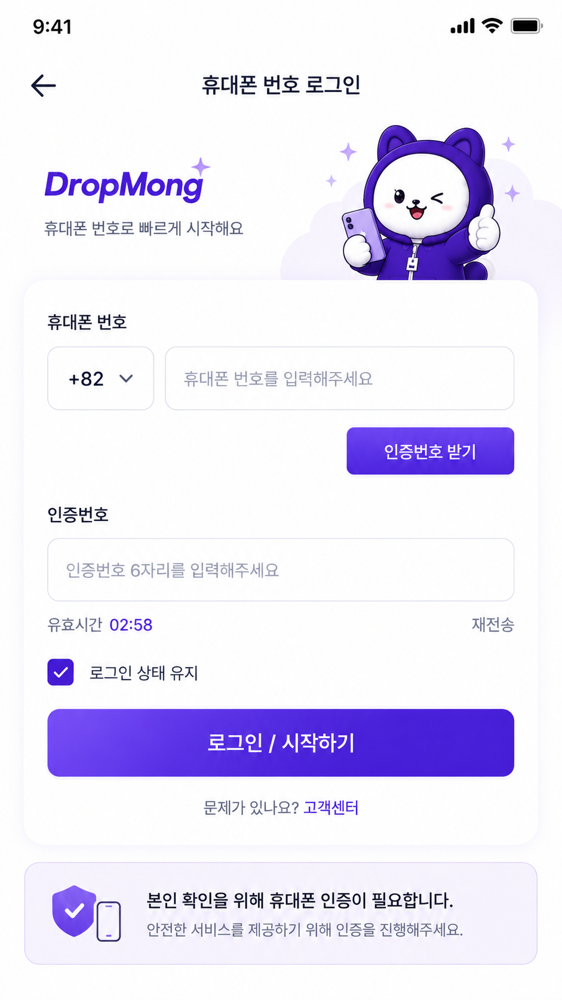
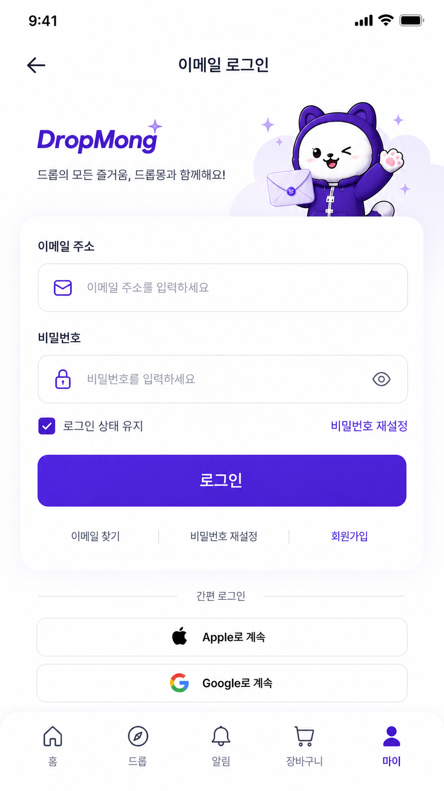
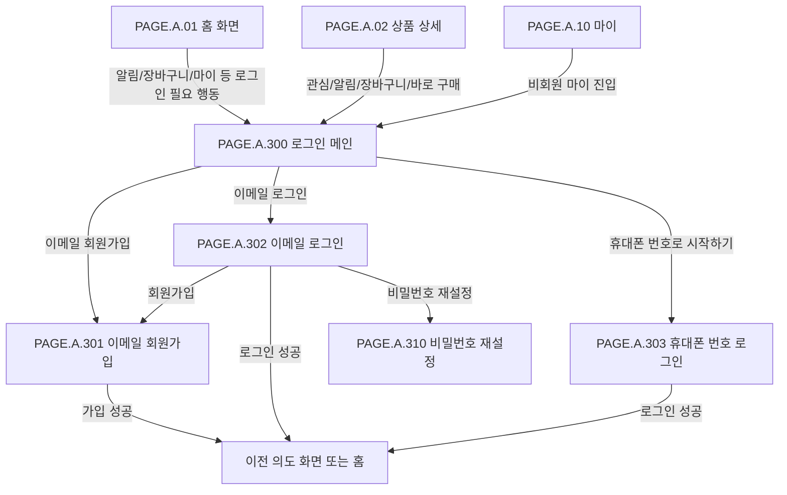

# 인증 및 회원 페이지

## 페이지 소개

인증 및 회원 페이지는 비회원이 개인화 기능, 드롭 참여, 주문/결제, 마이 영역에 진입하려 할 때 인증 수단을 선택하고 계정을 만들거나 로그인하는 페이지 묶음이다.

물리 화면은 로그인 메인, 이메일 회원가입, 이메일 로그인, 휴대폰 번호 로그인으로 나뉘지만 사용자 목적은 하나이므로 `PAGE.A.300` 그룹 문서에서 스크린샷, 이동 경로, 상태와 예외를 함께 관리한다.

## 스크린샷

### 이메일 회원가입 경로

  <figure style="margin: 0; min-width: 0;"><figcaption>1. PAGE.A.300 로그인 메인</figcaption></figure>
  <figure style="margin: 0; min-width: 0;"><figcaption>2. PAGE.A.301 이메일 회원가입</figcaption></figure>
  <figure style="margin: 0; min-width: 0;"><figcaption>3. PAGE.A.303 휴대폰 인증 식별자 확인</figcaption></figure>

### 이메일 로그인 경로

  <figure style="margin: 0; min-width: 0;"><figcaption>1. PAGE.A.300 로그인 메인</figcaption></figure>
  <figure style="margin: 0; min-width: 0;"><figcaption>2. PAGE.A.302 이메일 로그인</figcaption></figure>
  <figure style="margin: 0; min-width: 0;"><figcaption>3. PAGE.A.310 비밀번호 재설정 진입</figcaption></figure>

### 휴대폰 번호 로그인 경로

  <figure style="margin: 0; min-width: 0;"><figcaption>1. PAGE.A.300 로그인 메인</figcaption></figure>
  <figure style="margin: 0; min-width: 0;"><figcaption>2. PAGE.A.303 휴대폰 번호 로그인</figcaption></figure>

## 포함 페이지

| Page ID | 페이지 | 경로 | 역할 |
| --- | --- | --- | --- |
| `PAGE.A.300` | 로그인 메인 | `/auth/signin` | 인증 수단을 선택하고 로그인/회원가입/복구로 분기한다. |
| `PAGE.A.301` | 이메일 회원가입 | `/auth/signup/email` | 이메일 회원가입, 필수 동의, 추천인 코드, 휴대폰 인증 식별자 연결을 처리한다. |
| `PAGE.A.302` | 이메일 로그인 | `/auth/signin/email` | 이메일/비밀번호 로그인, 로그인 상태 유지, 비밀번호 재설정 진입을 처리한다. |
| `PAGE.A.303` | 휴대폰 번호 로그인 | `/auth/signin/phone` | 연결된 휴대폰 인증 식별자를 검증한 뒤 기존 `user_id`로 로그인한다. |

## 화면 구성

| 페이지 | 영역 | 화면 요소 | 사용자 행동 | 연결 페이지/기능 |
| --- | --- | --- | --- | --- |
| `PAGE.A.300` | 인증 수단 선택 | 휴대폰 번호, 이메일, Apple, Google 로그인 버튼 | 원하는 인증 수단 선택 | `PAGE.A.301`, `PAGE.A.302`, `PAGE.A.303` |
| `PAGE.A.300` | 회원가입 안내 | 이메일 회원가입 링크 | 새 계정 생성으로 이동 | `PAGE.A.301` |
| `PAGE.A.301` | 입력 폼 | 이름, 이메일, 비밀번호, 휴대폰 번호, 추천인 코드 | 회원가입 정보 입력 | 회원가입 API |
| `PAGE.A.301` | 약관 체크리스트 | 필수/선택 동의, 약관 상세 링크 | 필수 동의 완료 | 약관/정책 |
| `PAGE.A.302` | 로그인 폼 | 이메일, 비밀번호, 로그인 상태 유지 | 이메일 로그인 요청 | 인증 API |
| `PAGE.A.302` | 계정 도움말 | 이메일 찾기, 비밀번호 재설정, 회원가입 | 계정 복구 또는 가입 이동 | `PAGE.A.310`, `PAGE.A.301` |
| `PAGE.A.303` | 휴대폰 인증 | 휴대폰 번호, 가상 SMS 인증번호, 재전송 | 연결된 휴대폰 인증 식별자로 로그인 | 인증 API |

## 연관 사이트맵

## 진입 경로

| 출발 지점 | 진입 조건 | 복귀 기준 |
| --- | --- | --- |
| 홈 화면 | 알림, 장바구니, 마이 등 로그인 필요 행동 선택 | 로그인 후 원래 행동 또는 홈으로 복귀 |
| 상품 상세 | 관심, 알림 신청, 장바구니, 바로 구매 선택 | 상품, 옵션, 수량, 구매 의도 보존 |
| 장바구니 | 비회원 장바구니 진입 또는 주문 시도 | 장바구니 또는 주문 의도 복구 |
| 마이 | 비회원 마이 탭 선택 | 로그인 후 마이로 이동 |
| 이메일 로그인 | 비밀번호 재설정 선택 | 재설정 완료 후 이메일 로그인 또는 검증된 복귀 위치 |

## 이동 규칙

| 사용자 행동 | 이동 대상 | 권한/상태 조건 |
| --- | --- | --- |
| 휴대폰 번호로 시작하기 | `PAGE.A.303` 휴대폰 번호 로그인 | 휴대폰 로그인 수단이 활성화되어 있음 |
| 이메일 로그인 선택 | `PAGE.A.302` 이메일 로그인 | 이메일 인증 계정 사용자 |
| 이메일 회원가입 선택 | `PAGE.A.301` 이메일 회원가입 | 계정이 없는 사용자 |
| 회원가입 완료 | 이전 의도 화면 또는 홈 | 이메일 인증과 가상 SMS 휴대폰 인증 식별자 연결 완료 |
| 이메일 로그인 성공 | 이전 의도 화면 또는 홈 | 이메일/비밀번호 검증 성공 |
| 휴대폰 인증 성공 | 이전 의도 화면 또는 홈 | 휴대폰 인증 식별자가 기존 `user_id`에 연결되어 있음 |
| 비밀번호 재설정 선택 | `PAGE.A.310` 비밀번호 재설정 | 이메일 로그인 화면에서 계정 복구 진입 |
| Apple/Google 선택 | 소셜 로그인 | MVP 이후 구현 후보, 노출 여부는 설정으로 제어 |

## 페이지 데이터

| 데이터 | 설명 | 출처/후속 연결 |
| --- | --- | --- |
| 인증 진입 컨텍스트 | 로그인 후 돌아갈 페이지와 의도한 행동 | 클라이언트 라우팅 |
| redirect target | 로그인 성공 후 이동할 검증된 내부 경로 또는 intent id | 인증/프론트 라우팅 |
| 지원 인증 수단 | 휴대폰, 이메일, Apple, Google 활성 여부 | 인증 서비스/설정 |
| 회원가입 입력값 | 이름, 이메일, 비밀번호, 휴대폰 번호, 추천인 코드, 약관 동의 | 사용자 입력 |
| 회원가입 작업 | 가입 단계, 이메일/휴대폰 확인 상태, 만료 시각 | 인증 서비스 `Registration` |
| 이메일 인증 상태 | 인증 메일 발송, 검증, 재발송 가능 시각 | 인증 서비스 `VerificationChallenge` |
| 휴대폰 인증 상태 | 휴대폰 번호, 인증번호 검증, 재전송 가능 시각 | 인증 서비스 |
| 인증 결과 | 성공, 실패 사유, 잠금 여부, 재시도 제한 | 인증 서비스 |

## 상태와 예외

| 상태 | 화면 처리 | 비고 |
| --- | --- | --- |
| 정상 | 활성화된 인증 수단과 회원가입 링크를 표시한다. | 기본 상태 |
| redirect target 있음 | 인증 성공 후 검증된 이전 의도 화면으로 복귀한다. | 외부 URL은 허용하지 않는다. |
| 소셜 로그인 비활성 | 해당 버튼을 숨기거나 비활성 상태로 표시한다. | MVP 구현 범위 밖 |
| 이메일 회원가입 검증 실패 | 필드별 오류를 표시하고 입력값을 유지한다. | 형식/중복/약관/추천인 코드 |
| 이메일 인증 대기/만료 | 메일 재발송 가능 시각과 가입 작업 만료를 표시한다. | 이메일 원문 존재 여부는 노출하지 않는다. |
| 휴대폰 인증번호 오류 | 오류 문구와 남은 재시도 또는 재전송 제한을 표시한다. | TTL/재시도 정책 필요 |
| 휴대폰 인증 식별자 미연결 | 이메일 회원가입 또는 인증 수단 연동 안내를 제공한다. | 새 `user_id`를 자동 생성하지 않는다. |
| 로그인 실패 5회 | 인증 계정 잠금 안내와 해제 가능 시점을 표시한다. | 전역 잠금 정책 |
| 인증 성공 | access token, refresh token, 세션 만료 시각을 관리하고 복귀한다. | `REQ.A.05` 세션 정책 |

## 연관 요구사항

| Requirements ID | 연결 이유 |
| --- | --- |
| [REQ.A.05](../../00-requirements/REQ_A_05_auth_member.md) | 인증 수단 선택, 회원가입, 이메일/휴대폰 로그인, redirect target, 세션, 계정 잠금과 직접 연결된다. |
| [REQ.A.01](../../00-requirements/REQ_A_01_limited_drop_commerce.md) | 드롭 알림, 장바구니, 바로 구매, 주문/결제 같은 로그인 필요 행동과 연결된다. |
| [REQ.A.02](../../00-requirements/REQ_A_02_coupon_benefit.md) | 추천인 코드, 마케팅 수신, 쿠폰/포인트 혜택 제공과 연결된다. |

## 연관 태그

- 요구사항 참조: [REQ.A.05](../../00-requirements/REQ_A_05_auth_member.md), [REQ.A.01](../../00-requirements/REQ_A_01_limited_drop_commerce.md), [REQ.A.02](../../00-requirements/REQ_A_02_coupon_benefit.md)
- 플로우 참조: FLOW.A.300, FLOW.A.301, FLOW.A.302, FLOW.A.303
- UI 참조: [UI.A.300](../../20-ui/UI_A_300_auth_member/UI_A_300_auth_member.md)
- UC 참조: [UC.A.300](../../30-uc/UC_A_300_auth_member.md)
- 도메인 참조: [SD.A.30010](../../50-service-design/A_300_auth/A_300_10-domain-model/SD_A_30010_auth_domain_model.md)
- 영속성 참조: [SD.A.30020](../../50-service-design/A_300_auth/A_300_20-persistence/README.md)
- 서비스 참조: [SD.A.30030](../../50-service-design/A_300_auth/A_300_30-service/README.md)
- API 참조: [SD.A.30040](../../50-service-design/A_300_auth/A_300_40-api/README.md)
- 시퀀스 참조: [SCN.A.300](../../80-sequence/A_300_auth/README.md)

## 확인 필요

- 로그인 성공 후 redirect target 저장 방식과 intent id 만료 정책을 정한다.
- 가상 SMS 인증번호 TTL, 재전송 제한, 실패 횟수 제한, 테스트 번호 정책을 정한다.
- 휴대폰 번호 로그인 실패 시 이메일 회원가입 안내와 인증 수단 연동 안내 문구를 확정한다.
- Apple/Google 로그인 버튼의 MVP 노출 여부와 비활성 상태 표현을 정한다.
- 이메일 인증 메일과 가상 SMS 인증 완료 후 자동 로그인 화면 전이를 확정한다.
