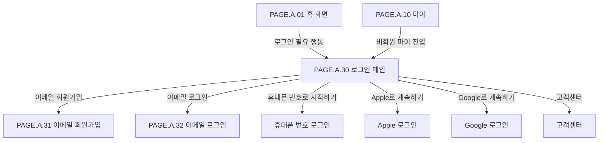

# 로그인 메인 페이지

## 페이지 소개

로그인 메인 페이지는 비회원이 DropMong의 개인화 기능과 구매 기능을 사용하기 위해 인증 방법을 선택하는 진입 화면이다.

휴대폰 번호, 이메일, Apple, Google 로그인을 한 화면에서 제공하고, 계정이 없는 사용자는 이메일 회원가입으로 이어진다.

## 스크린샷

## 화면 구성

| 영역 | 화면 요소 | 사용자 행동 | 연결 페이지/기능 |
| --- | --- | --- | --- |
| 브랜드 영역 | DropMong 로고, 환영 헤드라인, 설명 문구 | 서비스 정체성 확인 | 브랜드 인지 |
| 히어로 일러스트 | 마스코트 이미지, 포인트/쿠폰 오브젝트 | 로그인 전 기대감 형성 | 시각적 안내 |
| 주요 CTA | 휴대폰 번호로 시작하기 | 휴대폰 인증 로그인 시작 | 휴대폰 로그인 |
| 보조 로그인 버튼 | 이메일 로그인, Apple, Google | 인증 방식 선택 | 이메일 로그인, 소셜 로그인 |
| 회원가입 안내 | 이메일 회원가입 링크 | 이메일 가입으로 이동 | 이메일 회원가입 |
| 신뢰/안전 정보 카드 | 안전 거래 안내, 더보기 아이콘 | 안전 정책 확인 | 고객센터/안내 |
| 법적 문구 | 이용약관, 개인정보처리방침, 고객센터 링크 | 약관/도움말 확인 | 약관, 고객센터 |

## 연관 사이트맵

## 진입 경로

| 출발 지점 | 진입 조건 | 비고 |
| --- | --- | --- |
| 홈 화면 | 알림, 장바구니, 마이 등 로그인 필요 행동 선택 | 로그인 후 원래 행동 복귀 필요 |
| 상품 상세 | 알림 신청, 관심, 장바구니, 바로 구매 선택 | 의도한 상품/옵션 보존 필요 |
| 장바구니 | 비회원 장바구니 진입 또는 주문 시도 | 로그인 후 장바구니 복구 필요 |
| 마이 | 비회원 마이 탭 선택 | 로그인 전용 허브 |

## 이동 규칙

| 사용자 행동 | 이동 대상 | 권한/상태 조건 |
| --- | --- | --- |
| 휴대폰 번호로 시작하기 | 휴대폰 번호 로그인 | 휴대폰 인증 수단 필요 |
| 이메일 로그인 선택 | 이메일 로그인 | 이메일 계정 사용자 |
| Apple로 계속하기 | Apple 로그인 | Apple 로그인 가능 환경 |
| Google로 계속하기 | Google 로그인 | Google 계정 연동 |
| 이메일 회원가입 선택 | 이메일 회원가입 | 계정이 없는 사용자 |
| 이용약관/개인정보처리방침 선택 | 약관 | 외부 또는 내부 약관 문서 |
| 고객센터 선택 | 고객센터 | 도움말 확인 |
| 로그인 성공 | 이전 의도 화면 또는 홈 | redirect target 필요 |

## 페이지 데이터

| 데이터 | 설명 | 출처/후속 연결 |
| --- | --- | --- |
| 인증 진입 컨텍스트 | 로그인 후 돌아갈 페이지와 의도한 행동 | 클라이언트 라우팅 |
| 지원 로그인 수단 | 휴대폰, 이메일, Apple, Google 활성 여부 | 인증 서비스/설정 |
| 약관 링크 | 이용약관, 개인정보처리방침 URL | 정책/약관 서비스 |
| 고객센터 링크 | 도움말 URL 또는 페이지 ID | 고객지원 |
| 보안 안내 | 안전 거래 안내 문구 | 정책/운영 |

## 상태와 예외

| 상태 | 화면 처리 | 비고 |
| --- | --- | --- |
| 정상 | 모든 인증 버튼과 회원가입 링크를 표시한다. | 기본 상태 |
| 특정 소셜 로그인 비활성 | 해당 버튼을 숨기거나 비활성화한다. | 플랫폼 정책 |
| redirect target 있음 | 로그인 성공 후 이전 의도 화면으로 복귀한다. | 장바구니/알림/구매 의도 |
| 인증 실패 | 선택한 인증 방식 화면에서 실패 사유를 표시한다. | 메인 화면은 재선택 가능 |

## 후속 페이지 후보

| 후보 Page ID | 페이지 | 상태 | 로그인 메인에서의 연결 |
| --- | --- | --- | --- |
| `PAGE.A.31` | [이메일 회원가입](./PAGE_A_31_email_signup.md) | 작성 완료 | 이메일 회원가입 |
| `PAGE.A.32` | [이메일 로그인](./PAGE_A_32_email_signin.md) | 작성 완료 | 이메일 로그인 |
| `PAGE.A.33` | 휴대폰 번호 로그인 | 문서 예정 | 휴대폰 번호로 시작하기 |
| `PAGE.A.34` | 약관/정책 | 문서 예정 | 이용약관, 개인정보처리방침 |

## 연관 요구사항

| Requirements ID | 연결 이유 |
| --- | --- |
| [REQ.A.01](../00-requirements/REQ_A_01_limited_drop_commerce.md) | 드롭 알림, 장바구니, 바로 구매, 주문/결제 같은 로그인 필요 행동과 연결된다. |

## 연관 태그

🏷️ 요구사항 참조: [REQ.A.01](../00-requirements/REQ_A_01_limited_drop_commerce.md) | 플로우 참조: FLOW.A.30 | UI 참조: [UI.A.30](../20-ui/UI_A_30_multi_signin.md) | UC 참조: UC.A.30 | 영속성 참조: PST.A.30 | 서비스 참조: SVC.A.30 | 시나리오 참조: SCN.A.30 | API 참조: API.A.30

## 확인 필요

- 로그인 성공 후 redirect target 저장 방식
- 휴대폰 번호 로그인 MVP 포함 여부
- Apple/Google 로그인 지원 범위
- 약관/개인정보처리방침 링크의 실제 URL
- 비회원 장바구니/알림 의도 복구 정책
