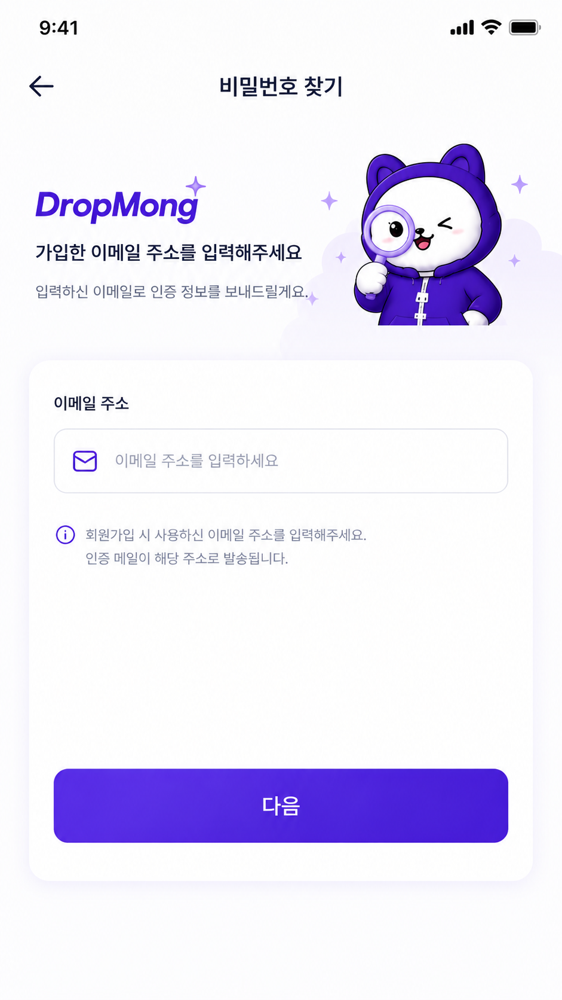
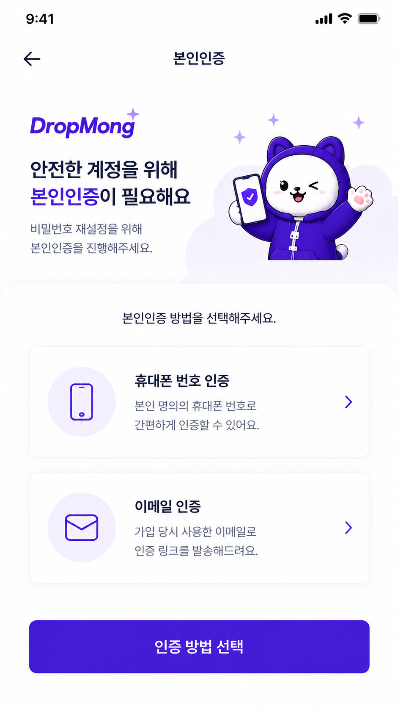
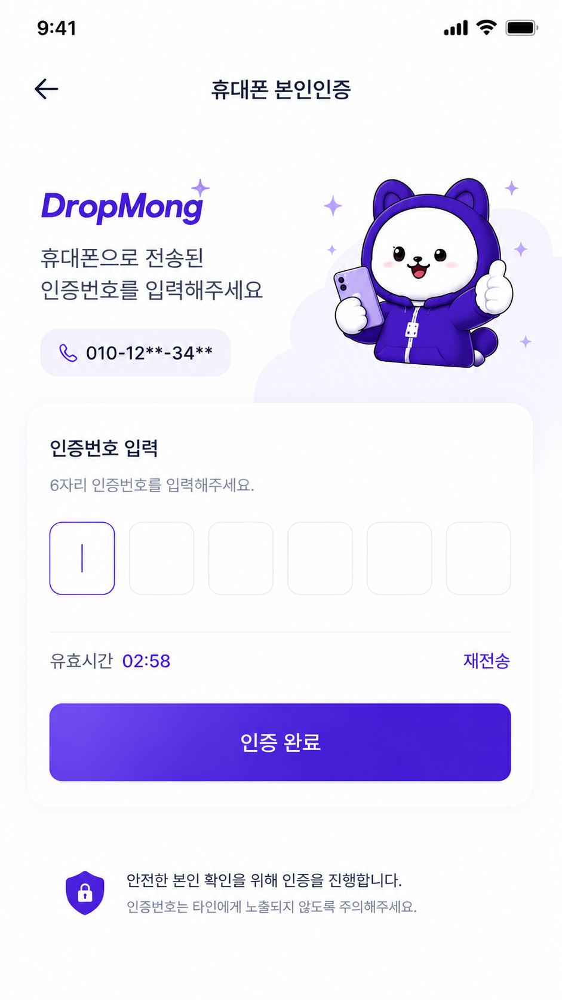
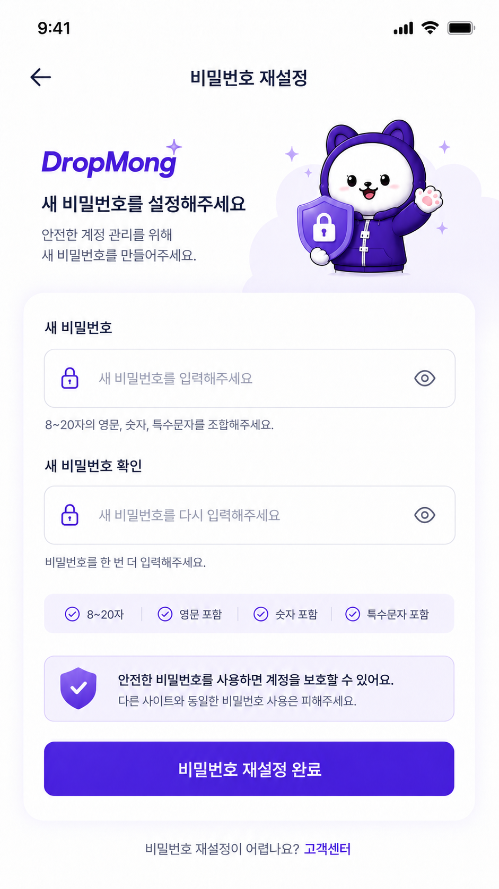
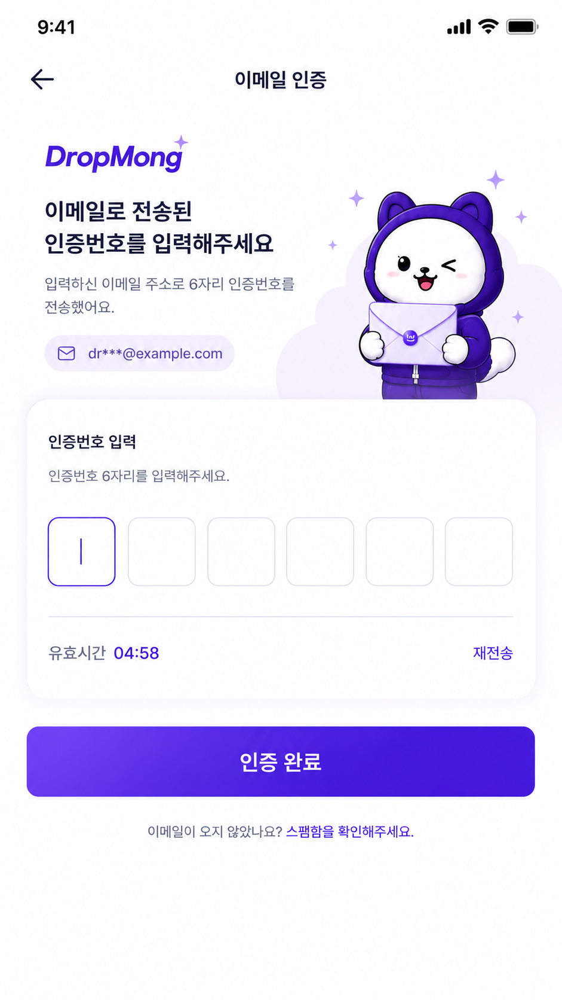
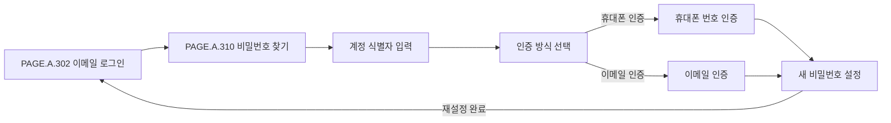

# 비밀번호 찾기 페이지

## 페이지 소개

비밀번호 찾기 페이지는 사용자가 계정 식별자를 입력하고, 이메일 인증 또는 휴대폰 번호 인증을 거쳐 새 비밀번호를 설정하는 재설정 과정 전체를 하나로 묶은 페이지 문서다.

물리 화면은 여러 단계로 나뉘지만 사용자 목적은 하나이므로 `PAGE.A.310` 하나에서 스크린샷, 사이트맵, 이동 규칙, 상태와 예외를 함께 관리한다.

## 스크린샷

### 휴대폰 인증 경로

  <figure style="margin: 0; min-width: 0;"><figcaption>1. 비밀번호 찾기</figcaption></figure>
  <figure style="margin: 0; min-width: 0;"><figcaption>2. 인증 방식 선택</figcaption></figure>
  <figure style="margin: 0; min-width: 0;"><figcaption>3A. 휴대폰 번호 인증</figcaption></figure>
  <figure style="margin: 0; min-width: 0;"><figcaption>4. 새 비밀번호 설정</figcaption></figure>

### 이메일 인증 경로

  <figure style="margin: 0; min-width: 0;"><figcaption>1. 비밀번호 찾기</figcaption></figure>
  <figure style="margin: 0; min-width: 0;"><figcaption>2. 인증 방식 선택</figcaption></figure>
  <figure style="margin: 0; min-width: 0;"><figcaption>3B. 이메일 인증</figcaption></figure>
  <figure style="margin: 0; min-width: 0;"><figcaption>4. 새 비밀번호 설정</figcaption></figure>

## 화면 구성

| 영역 | 화면 요소 | 사용자 행동 | 연결 페이지/기능 |
| --- | --- | --- | --- |
| 비밀번호 찾기 | 계정 식별자 입력, 다음 CTA, 로그인 복귀 링크 | 이메일 주소 또는 휴대폰 번호로 재설정 대상 계정을 찾는다. | 재설정 intent 생성 |
| 인증 방식 선택 | 이메일 인증 선택 카드, 휴대폰 인증 선택 카드, 다음 CTA | 사용 가능한 인증 방식 중 하나를 선택한다. | 인증 수단 선택 |
| 휴대폰 번호 인증 | 마스킹된 휴대폰 번호, 가상 SMS 인증번호 입력, 재전송, 인증 CTA | 휴대폰으로 받은 인증번호를 입력한다. | 휴대폰 인증 검증 |
| 이메일 인증 | 마스킹된 이메일 주소, 이메일 인증번호 입력 또는 인증 링크 안내, 재발송, 인증 CTA | 이메일로 받은 인증 정보를 확인한다. | 이메일 인증 검증 |
| 새 비밀번호 설정 | 새 비밀번호, 비밀번호 확인, 비밀번호 규칙, 재설정 완료 CTA | 새 비밀번호를 입력해 재설정을 완료한다. | 비밀번호 변경 |
| 하단 내비게이션 | 홈, 드롭, 알림, 장바구니, 마이 | 전역 탭 이동 | 전역 내비게이션 |

## 연관 사이트맵

## 이동 규칙

| 사용자 행동 | 이동 대상 | 권한/상태 조건 |
| --- | --- | --- |
| 뒤로가기 | [PAGE.A.302 이메일 로그인](../PAGE_A_300_auth_member/PAGE_A_300_auth_member.md) | 로그인 화면에서 비밀번호 재설정 진입 |
| 계정 식별자 입력 후 다음 선택 | 인증 방식 선택 단계 | 계정 식별자 형식 검증과 서버 조회 성공 |
| 휴대폰 인증 선택 후 다음 선택 | 휴대폰 번호 인증 단계 | 해당 계정에 휴대폰 인증 계정이 연결되어 있음 |
| 이메일 인증 선택 후 다음 선택 | 이메일 인증 단계 | 해당 계정에 이메일 인증 계정이 연결되어 있음 |
| 휴대폰 인증번호 입력 후 인증 선택 | 새 비밀번호 설정 단계 | 가상 SMS 인증번호 검증 성공 |
| 이메일 인증번호 입력 또는 인증 링크 확인 | 새 비밀번호 설정 단계 | 이메일 인증 검증 성공 |
| 재전송/재발송 선택 | 현재 인증 단계 유지 | 재전송 제한과 인증번호 TTL 정책 통과 |
| 새 비밀번호 입력 후 재설정 완료 | 이메일 로그인 또는 로그인 완료 후 복귀 위치 | 재설정 intent 유효, 비밀번호 규칙 충족 |

## 페이지 데이터

| 데이터 | 설명 | 출처/후속 연결 |
| --- | --- | --- |
| 계정 식별자 | 이메일 주소 또는 휴대폰 번호 입력값 | 사용자 입력 |
| 재설정 intent | 비밀번호 재설정 과정의 임시 식별자와 만료 시각 | 인증 서비스 |
| 사용 가능한 인증 수단 | 이메일 인증 가능 여부, 휴대폰 인증 가능 여부 | 인증 서비스 |
| 선택한 인증 방식 | 이메일 인증 또는 휴대폰 인증 | 사용자 입력 |
| 인증번호 입력값 | 휴대폰 또는 이메일 인증번호 | 사용자 입력 |
| 마스킹된 연락처 | 마스킹된 휴대폰 번호, 마스킹된 이메일 주소 | 인증/회원 서비스 |
| 재전송 가능 시각 | 인증번호 재전송/재발송 제한 상태 | 인증 서비스 |
| 새 비밀번호 | 새 비밀번호 입력값 | 사용자 입력 |
| 비밀번호 규칙 충족 상태 | 길이, 문자 조합, 확인 일치 여부 | 클라이언트/인증 서비스 |

## 상태와 예외

| 상태 | 화면 처리 | 비고 |
| --- | --- | --- |
| 계정 식별자 입력 전 | 비밀번호 찾기 안내와 비활성 또는 기본 CTA를 표시한다. | 기본 상태 |
| 입력값 형식 오류 | 입력 필드에 오류 상태와 형식 안내를 표시한다. | 이메일/휴대폰 형식 |
| 계정 없음 | 보안 정책에 맞는 일반화된 안내를 표시한다. | 계정 존재 여부 노출 수준 확인 |
| 인증 수단 없음 | 고객센터 또는 회원가입/로그인 안내를 표시한다. | 정책 확인 필요 |
| 인증번호 대기 | 인증번호 입력 필드, 재전송 제한 시간, 인증 CTA를 표시한다. | 휴대폰/이메일 공통 |
| 인증번호 오류 | 오류 문구와 남은 시도 횟수 또는 재시도 안내를 표시한다. | 실패 횟수 제한 |
| 재전송 제한 | 재전송 가능 시각까지 CTA를 제한한다. | TTL/쿨다운 정책 |
| 재설정 intent 만료 | 처음 단계로 돌아가 재시작을 안내한다. | 보안 정책 |
| 비밀번호 규칙 미충족 | 규칙 안내와 오류 상태를 표시한다. | 비밀번호 정책 |
| 비밀번호 불일치 | 확인 필드 오류를 표시한다. | 클라이언트 검증 |
| 재설정 성공 | 이메일 로그인 또는 복귀 위치로 이동한다. | 자동 로그인 여부 확인 필요 |

## 연관 요구사항

| Requirements ID | 연결 이유 |
| --- | --- |
| [REQ.A.05](../../00-requirements/REQ_A_05_auth_member.md) | 비밀번호 재설정은 이메일 인증과 휴대폰 번호 인증을 모두 지원해야 한다. |

## 연관 태그

🏷️ 요구사항 참조: [REQ.A.05](../../00-requirements/REQ_A_05_auth_member.md) | 플로우 참조: FLOW.A.310 | UI 참조: [UI.A.310](../../20-ui/UI_A_310_password_find/UI_A_310_password_find.md) | UC 참조: [UC.A.300](../../30-uc/UC_A_300_auth_member.md) | 영속성 참조: PST.A.310 예정 | 서비스 참조: SVC.A.310 예정 | 시나리오 참조: SCN.A.310 예정 | API 참조: API.A.310 예정

## 확인 필요

- 오류/제한 상태별 사용자 안내 문구
- 인증번호 TTL, 재전송 제한, 실패 횟수 제한 정책
- 이메일 인증 링크 방식과 인증번호 방식 중 MVP 기본값
- 비밀번호 재설정 완료 후 자동 로그인 여부
