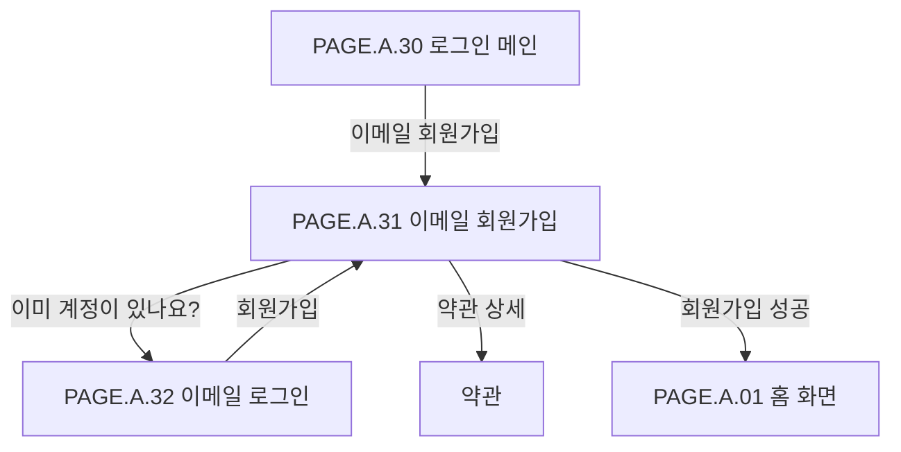

# 이메일 회원가입 페이지

## 페이지 소개

이메일 회원가입 페이지는 사용자가 이름, 이메일, 비밀번호, 휴대폰 번호, 추천인 코드, 필수 동의를 입력해 이메일 계정을 생성하는 화면이다.

입력값 검증과 약관 동의가 모두 충족되어야 회원가입 완료 CTA가 활성화된다.

## 스크린샷

## 화면 구성

| 영역 | 화면 요소 | 사용자 행동 | 연결 페이지/기능 |
| --- | --- | --- | --- |
| 상단 앱 바 | 뒤로가기, 페이지 제목 | 이전 화면 복귀 | 로그인 메인 |
| 프로모션 배너 | 회원가입 혜택 메시지, 마스코트 이미지 | 가입 동기 확인 | 브랜드/혜택 |
| 입력 폼 | 이름, 이메일 주소, 비밀번호, 비밀번호 확인, 휴대폰 번호, 추천인 코드 | 회원 정보 입력 | 회원가입 |
| 이메일 헬퍼 텍스트 | 이메일 형식 안내/오류 | 이메일 검증 결과 확인 | 입력 검증 |
| 비밀번호 규칙 칩 | 8~20자, 영문, 숫자, 특수문자 포함 | 비밀번호 충족 조건 확인 | 입력 검증 |
| 약관 체크리스트 | 만 14세 이상, 이용약관, 개인정보 처리방침, 마케팅 수신 동의 | 필수/선택 동의 | 약관 상세 |
| 주요 CTA | 회원가입 완료 | 계정 생성 요청 | 회원가입 API |
| 하단 로그인 안내 | 이메일 로그인 링크 | 기존 계정 로그인 이동 | 이메일 로그인 |

## 연관 사이트맵

## 이동 규칙

| 사용자 행동 | 이동 대상 | 권한/상태 조건 |
| --- | --- | --- |
| 뒤로가기 선택 | 로그인 메인 또는 이전 화면 | 입력값 보존 여부 결정 필요 |
| 비밀번호 보기/숨기기 | 현재 화면 내부 상태 변경 | 비밀번호/확인 필드 각각 적용 |
| 국가번호 선택 | 국가번호 선택 | MVP는 +82 기본 가능 |
| 필수 약관 선택 | 현재 화면 내부 상태 변경 | 필수 항목 모두 체크 필요 |
| 약관 상세 선택 | 약관 상세 | 이용약관/개인정보처리방침 |
| 회원가입 완료 선택 | 홈 또는 이전 의도 화면 | 모든 검증 통과 필요 |
| 이메일 로그인 선택 | 이메일 로그인 | 기존 계정 사용자 |

## 페이지 데이터

| 데이터 | 설명 | 출처/후속 연결 |
| --- | --- | --- |
| 회원가입 입력값 | 이름, 이메일, 비밀번호, 휴대폰 번호, 추천인 코드 | 사용자 입력 |
| 이메일 검증 상태 | 형식, 중복 여부, 오류 메시지 | 인증/회원 서비스 |
| 비밀번호 규칙 상태 | 길이, 영문, 숫자, 특수문자 충족 여부 | 클라이언트 검증 |
| 약관 동의 상태 | 필수/선택 동의 체크 여부 | 약관 서비스 |
| 추천인 코드 상태 | 코드 유효성, 혜택 가능 여부 | 추천/프로모션 서비스 |
| 제출 가능 여부 | CTA 활성/비활성 상태 | 화면 상태 |

## 상태와 예외

| 상태 | 화면 처리 | 비고 |
| --- | --- | --- |
| 입력 전 | 기본 필드와 안내 문구를 표시한다. | 기본 상태 |
| 이메일 오류 | 이메일 필드와 헬퍼 텍스트에 오류를 표시한다. | 형식/중복 |
| 비밀번호 규칙 미충족 | 미충족 칩을 비활성 또는 오류 상태로 표시한다. | CTA 비활성 |
| 비밀번호 불일치 | 비밀번호 확인 필드에 오류를 표시한다. | CTA 비활성 |
| 필수 약관 미동의 | CTA를 비활성화한다. | 필수 항목 |
| 회원가입 실패 | 실패 사유를 표시하고 입력값을 유지한다. | 중복/서버 오류 |

## 연관 요구사항

| Requirements ID | 연결 이유 |
| --- | --- |
| [REQ.A.01](../00-requirements/REQ_A_01_limited_drop_commerce.md) | 구매/알림/장바구니 같은 로그인 필요 기능을 사용하기 위한 계정 생성과 연결된다. |
| [REQ.A.02](../00-requirements/REQ_A_02_coupon_benefit.md) | 추천인 코드, 마케팅 수신, 쿠폰/포인트 혜택 제공과 연결된다. |

## 연관 태그

🏷️ 요구사항 참조: [REQ.A.01](../00-requirements/REQ_A_01_limited_drop_commerce.md), [REQ.A.02](../00-requirements/REQ_A_02_coupon_benefit.md) | 플로우 참조: FLOW.A.31 | UI 참조: [UI.A.31](../20-ui/UI_A_31_email_signup.md) | UC 참조: UC.A.31 | 영속성 참조: PST.A.31 | 서비스 참조: SVC.A.31 | 시나리오 참조: SCN.A.31 | API 참조: API.A.31

## 확인 필요

- 이메일 중복 검증 시점: 입력 중, 포커스 아웃, 제출 시
- 휴대폰 번호 인증을 가입 필수로 둘지 여부
- 추천인 코드 혜택 지급 시점
- 약관 상세 페이지/모달 방식
- 회원가입 성공 후 자동 로그인 여부
