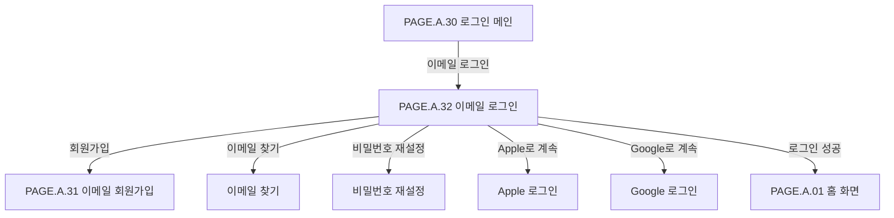

# 이메일 로그인 페이지

## 페이지 소개

이메일 로그인 페이지는 기존 사용자가 이메일 주소와 비밀번호로 로그인하고, 필요하면 소셜 로그인이나 회원가입, 이메일 찾기, 비밀번호 재설정으로 이동하는 화면이다.

로그인 상태 유지 옵션을 제공해 반복적인 구매/알림/주문 확인 경험을 줄인다.

## 스크린샷

## 화면 구성

| 영역 | 화면 요소 | 사용자 행동 | 연결 페이지/기능 |
| --- | --- | --- | --- |
| 상단 앱 바 | 뒤로가기, 페이지 제목 | 이전 화면 복귀 | 로그인 메인 |
| 브랜드 히어로 | DropMong 로고, 설명 문구, 마스코트 이미지 | 브랜드 확인 | 시각적 안내 |
| 로그인 폼 | 이메일 주소, 비밀번호 입력 필드 | 계정 정보 입력 | 로그인 |
| 보조 옵션 | 로그인 상태 유지, 비밀번호 재설정 | 세션 유지 선택, 비밀번호 재설정 이동 | 세션/비밀번호 |
| 주요 CTA | 로그인 버튼 | 이메일 로그인 요청 | 인증 API |
| 보조 링크 | 이메일 찾기, 비밀번호 재설정, 회원가입 | 계정 도움말/가입 이동 | 계정 복구, 회원가입 |
| 간편 로그인 | Apple, Google 버튼 | 소셜 로그인 | 소셜 인증 |
| 하단 내비게이션 | 홈, 드롭, 알림, 장바구니, 마이 | 주요 탭 이동 | 전역 탭 |

## 연관 사이트맵

## 이동 규칙

| 사용자 행동 | 이동 대상 | 권한/상태 조건 |
| --- | --- | --- |
| 뒤로가기 선택 | 로그인 메인 또는 이전 화면 | 입력값 보존 여부 결정 필요 |
| 이메일 입력 | 현재 화면 내부 상태 변경 | 이메일 형식 검증 |
| 비밀번호 보기/숨기기 | 현재 화면 내부 상태 변경 | 비밀번호 필드 |
| 로그인 상태 유지 선택 | 현재 화면 내부 상태 변경 | 세션 유지 정책 필요 |
| 로그인 선택 | 이전 의도 화면 또는 홈 | 이메일/비밀번호 검증 성공 |
| 이메일 찾기 선택 | 이메일 찾기 | 계정 복구 |
| 비밀번호 재설정 선택 | 비밀번호 재설정 | 계정 복구 |
| 회원가입 선택 | 이메일 회원가입 | 계정이 없는 사용자 |
| Apple/Google 선택 | 소셜 로그인 | 소셜 인증 가능 상태 |

## 페이지 데이터

| 데이터 | 설명 | 출처/후속 연결 |
| --- | --- | --- |
| 로그인 입력값 | 이메일, 비밀번호 | 사용자 입력 |
| 로그인 상태 유지 | 세션 유지 체크 여부 | 사용자 입력/인증 서비스 |
| 입력 검증 상태 | 이메일 형식, 필수값, 오류 메시지 | 클라이언트/인증 서비스 |
| 인증 결과 | 로그인 성공, 실패 사유, 잠금 여부 | 인증 서비스 |
| redirect target | 로그인 성공 후 이동할 화면 | 클라이언트 라우팅 |
| 소셜 로그인 활성 여부 | Apple/Google 지원 여부 | 인증 설정 |

## 상태와 예외

| 상태 | 화면 처리 | 비고 |
| --- | --- | --- |
| 입력 전 | 기본 필드와 로그인 CTA를 표시한다. | 기본 상태 |
| 이메일 오류 | 이메일 필드에 오류 상태와 헬퍼 텍스트를 표시한다. | 형식 오류 |
| 비밀번호 미입력 | 로그인 CTA 비활성 또는 오류 표시 | 정책 필요 |
| 인증 실패 | 오류 메시지를 표시하고 입력값을 유지한다. | 계정 없음/비밀번호 오류 |
| 계정 잠금 | 비밀번호 재설정 또는 고객센터 안내를 제공한다. | 보안 정책 |
| 로그인 성공 | redirect target 또는 홈으로 이동한다. | 의도 복귀 |

## 연관 요구사항

| Requirements ID | 연결 이유 |
| --- | --- |
| [REQ.A.01](../00-requirements/REQ_A_01_limited_drop_commerce.md) | 구매, 장바구니, 알림, 주문 조회 같은 로그인 필요 기능의 인증 진입점이다. |

## 연관 태그

🏷️ 요구사항 참조: [REQ.A.01](../00-requirements/REQ_A_01_limited_drop_commerce.md) | 플로우 참조: FLOW.A.32 | UI 참조: [UI.A.32](../20-ui/UI_A_32_email_signin.md) | UC 참조: UC.A.32 | 영속성 참조: PST.A.32 | 서비스 참조: SVC.A.32 | 시나리오 참조: SCN.A.32 | API 참조: API.A.32

## 확인 필요

- 로그인 상태 유지의 세션 만료 정책
- 실패 횟수 제한과 계정 잠금 정책
- 이메일 찾기/비밀번호 재설정 Page ID
- 소셜 로그인과 이메일 계정 병합 정책
- 로그인 성공 후 원래 의도 화면 복귀 정책
