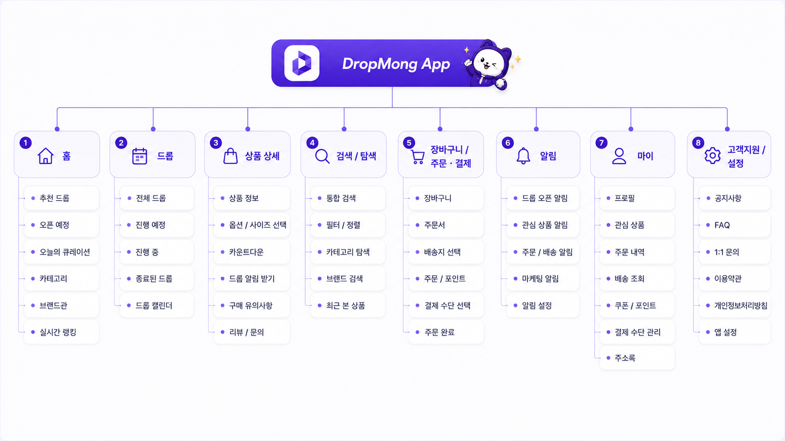
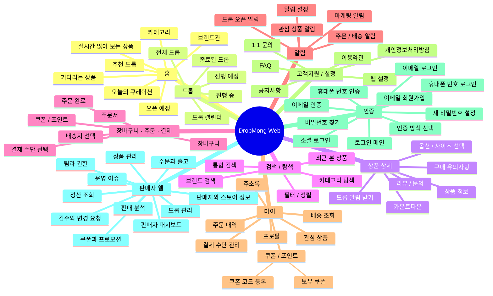

# 사이트맵 인덱스

## 역할

전체 페이지 구조와 페이지 간 연결을 flowchart로 보여주는 인덱스다.

## 템플릿

- [페이지 템플릿](.template/PAGE_A_XX.md)

## 클라이언트별 진입점

- [구매자 모바일 웹앱](buyer-mobile-web/README.md): 공개 탐색부터 주문·배송·쿠폰까지 구매자용 반응형 웹 페이지.
- [판매자 웹 포털](PAGE_A_200_seller_portal/README.md): 판매자 업무용 데스크톱 우선 웹 페이지.
- [공용 인증 및 회원](PAGE_A_300_auth_member/PAGE_A_300_auth_member.md): 여러 클라이언트가 함께 사용하는 인증 페이지 그룹.

## 주요 페이지

## 전체 사이트맵

## 페이지 목록

### 구매자 모바일 웹앱

- [PAGE.A.01 홈 화면](buyer-mobile-web/PAGE_A_01_homepage.md)
- [PAGE.A.02 상품 상세 페이지](buyer-mobile-web/PAGE_A_02_product_detail.md)
- [PAGE.A.09 기다리는 상품 페이지](buyer-mobile-web/PAGE_A_09_waiting_products.md)
- [PAGE.A.06 장바구니 페이지](buyer-mobile-web/PAGE_A_06_shopping_cart.md)
- [PAGE.A.10 마이 페이지](buyer-mobile-web/PAGE_A_10_my.md)
- [PAGE.A.11 주문/결제 페이지](buyer-mobile-web/PAGE_A_11_payment.md)
- [PAGE.A.14 주문 완료 페이지](buyer-mobile-web/PAGE_A_14_order_complete.md)
- [PAGE.A.15 주문 내역 페이지](buyer-mobile-web/PAGE_A_15_order_history.md)
- [PAGE.A.16 배송 조회 페이지](buyer-mobile-web/PAGE_A_16_track_order.md)
- [PAGE.A.17 배송/주문 관리 페이지](buyer-mobile-web/PAGE_A_17_shipping_order_manage.md)
- [PAGE.A.19 보유 쿠폰 페이지 그룹](buyer-mobile-web/PAGE_A_19_coupon_wallet/README.md)
- [PAGE.A.19 보유 쿠폰 페이지](buyer-mobile-web/PAGE_A_19_coupon_wallet/PAGE_A_19_owned_coupon.md)
- [PAGE.A.22 찜리스트 페이지](buyer-mobile-web/PAGE_A_22_wishlist.md)
- [PAGE.A.23 실시간 많이 보는 상품 페이지](buyer-mobile-web/PAGE_A_23_trending_products.md)

### 판매자 웹

- [PAGE.A.200~211 판매자 웹 포털](PAGE_A_200_seller_portal/README.md)

### 공용 인증

- [PAGE.A.300 인증 및 회원 페이지](PAGE_A_300_auth_member/PAGE_A_300_auth_member.md) - `PAGE.A.300~303`
- [PAGE.A.310 비밀번호 재설정 페이지](PAGE_A_310_password_find/PAGE_A_310_password_find.md)

### 예시 문서

- [PAGE.A.01 주문 결제](.examples/PAGE_A_01_order_checkout.md)
- [PAGE.A.02 상품 상세](.examples/PAGE_A_02_product_detail.md)
- [PAGE.A.03 구매자 프로필](.examples/PAGE_A_03_buyer_profile.md)

## 연관 태그

🏷️ 요구사항 참조: [REQ.A.01](../00-requirements/REQ_A_01_limited_drop_commerce.md), [REQ.A.02](../00-requirements/REQ_A_02_coupon_benefit.md), [REQ.A.03](../00-requirements/REQ_A_03_seller.md), [REQ.A.05](../00-requirements/REQ_A_05_auth_member.md), [REQ.A.07](../00-requirements/REQ_A_07_interest_ranking.md) | 페이지 참조: [PAGE.A.01](buyer-mobile-web/PAGE_A_01_homepage.md), [PAGE.A.02](buyer-mobile-web/PAGE_A_02_product_detail.md), [PAGE.A.06](buyer-mobile-web/PAGE_A_06_shopping_cart.md), [PAGE.A.09](buyer-mobile-web/PAGE_A_09_waiting_products.md), [PAGE.A.10](buyer-mobile-web/PAGE_A_10_my.md), [PAGE.A.11](buyer-mobile-web/PAGE_A_11_payment.md), [PAGE.A.14](buyer-mobile-web/PAGE_A_14_order_complete.md), [PAGE.A.15](buyer-mobile-web/PAGE_A_15_order_history.md), [PAGE.A.16](buyer-mobile-web/PAGE_A_16_track_order.md), [PAGE.A.17](buyer-mobile-web/PAGE_A_17_shipping_order_manage.md), [PAGE.A.19](buyer-mobile-web/PAGE_A_19_coupon_wallet/PAGE_A_19_owned_coupon.md), [PAGE.A.22](buyer-mobile-web/PAGE_A_22_wishlist.md), [PAGE.A.23](buyer-mobile-web/PAGE_A_23_trending_products.md), [PAGE.A.200](PAGE_A_200_seller_portal/README.md), [PAGE.A.300](PAGE_A_300_auth_member/PAGE_A_300_auth_member.md), [PAGE.A.310](PAGE_A_310_password_find/PAGE_A_310_password_find.md) | 유스케이스 참조: UC.A.01, [UC.A.02](../30-uc/UC_A_02_seller_manage_drop.md), UC.A.04, [UC.A.07](../30-uc/UC_A_07_interest_ranking.md), [UC.A.19](../30-uc/UC_A_19_coupon_wallet.md), [UC.A.300](../30-uc/UC_A_300_auth_member.md)
