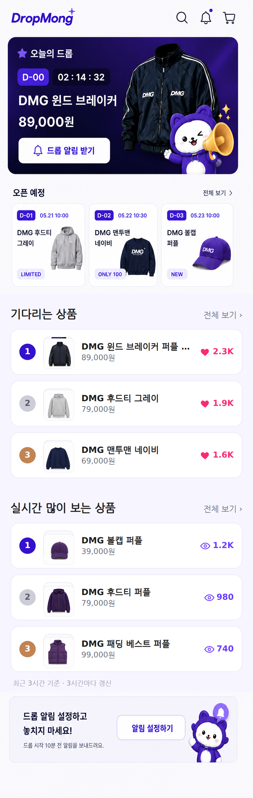
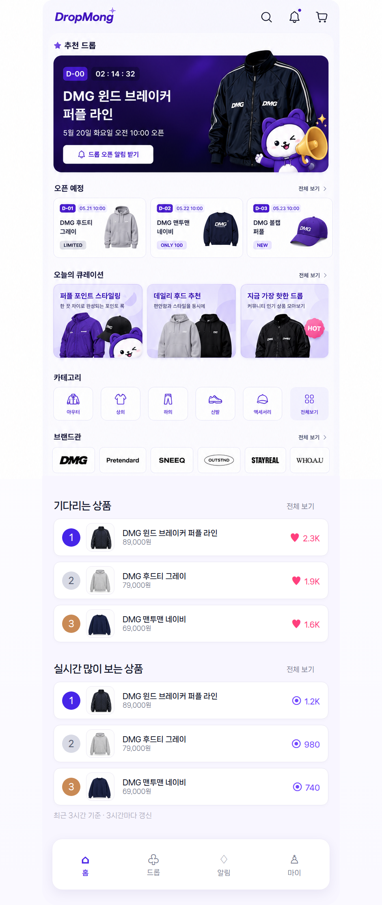
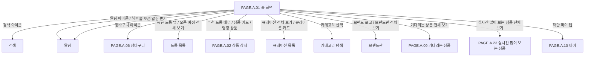

# 홈 화면

## 페이지 소개

홈 화면은 DropMong 앱의 첫 진입 페이지다. 사용자는 현재 추천 드롭, 오픈 예정 드롭, 큐레이션, 카테고리, 브랜드관, 그리고 두 개의 랭킹(기다리는 상품/실시간 많이 보는 상품)을 한 화면에서 훑고 상품 상세나 탐색 페이지로 이동한다.

2026-07-14 수정: 기존에는 "실시간 랭킹" 하나였으나, `REQ.A.07` 설계 확정에 따라 신호가 다른 두 랭킹(찜 기반 "기다리는 상품", 조회 기반 "실시간 많이 보는 상품")으로 분리했다. 두 랭킹 모두 홈에는 Top 3만, "전체 보기"는 Top 100까지 보여준다.

이 페이지는 구매를 바로 시작하는 화면이라기보다, 한정 상품을 발견하고 오픈 알림을 설정하며 관심 있는 드롭으로 진입하게 만드는 탐색 허브다.

## 스크린샷

### 구매자 모바일 웹 시안

### 기존 UI 근거

## 화면 구성

| 영역 | 화면 요소 | 사용자 행동 | 연결 페이지/기능 |
| --- | --- | --- | --- |
| 상단 앱 바 | DropMong 로고, 검색 아이콘, 알림 아이콘, 장바구니 아이콘 | 홈 복귀, 검색 진입, 알림함 진입, 장바구니 진입 | 검색, 알림, 장바구니 |
| 추천 드롭 | 대표 배너, D-day, 카운트다운, 상품명, 오픈 시각, 드롭 오픈 알림 받기 | 추천 상품 상세 확인, 오픈 알림 신청 | 상품 상세, 알림 설정 |
| 오픈 예정 | D-01/D-02/D-03 카드, 오픈 일시, 상품 썸네일, 배지, 전체 보기 | 예정 드롭 탐색, 개별 상품 상세 진입 | 드롭 목록, 상품 상세 |
| 오늘의 큐레이션 | 스타일링/추천/인기 드롭 콘텐츠 카드, 전체 보기 | 테마별 상품 묶음 탐색 | 큐레이션 목록, 상품 상세 |
| 카테고리 | 아우터, 상의, 하의, 신발, 액세서리, 전체보기 | 카테고리별 드롭 탐색 | 카테고리 탐색 |
| 브랜드관 | 브랜드 로고 목록, 전체 보기 | 판매자/브랜드별 드롭 탐색 | 브랜드관, 브랜드 상세 |
| 기다리는 상품(2026-07-14 개편, 구 "실시간 랭킹") | 순위, 상품 썸네일, 상품명, 가격, 찜 수, 전체 보기 | 인기 상품 확인, 전체 목록 진입 | `PAGE.A.09` 기다리는 상품, 상품 상세 |
| 실시간 많이 보는 상품(2026-07-14 신설) | 순위, 상품 썸네일, 상품명, 가격, 조회자 수, 전체 보기 | 실시간 인기 상품 확인, 전체 목록 진입 | `PAGE.A.23` 실시간 많이 보는 상품, 상품 상세 |
| 하단 탭 | 홈, 드롭, 알림, 마이 | 주요 탭 이동 | 홈, 드롭 목록, 알림, 마이 |

## 연관 사이트맵

## 진입 경로

| 출발 지점 | 진입 조건 | 비고 |
| --- | --- | --- |
| 앱 실행 | 앱 최초 진입 또는 로그인 후 기본 탭 | 기본 랜딩 화면 |
| 하단 홈 탭 | 다른 탭에서 홈 선택 | 스크롤 위치 복원 여부는 후속 UX에서 결정 |
| 로고 선택 | 홈이 아닌 화면에서 DropMong 로고 선택 | 앱 바 정책에 따라 적용 |
| 푸시 알림 후 복귀 | 알림 상세 확인 후 홈 복귀 | 알림 종류에 따라 상품 상세로 바로 이동할 수 있음 |

## 이동 규칙

| 사용자 행동 | 이동 대상 | 권한/상태 조건 |
| --- | --- | --- |
| 추천 드롭 배너 선택 | 상품 상세 | 비회원도 조회 가능 |
| 드롭 오픈 알림 받기 선택 | 알림 신청 | 로그인 필요, `AuthenticationIntent`로 신청 의도 보존 |
| 검색 아이콘 선택 | 검색 | 비회원도 진입 가능 |
| 알림 아이콘 선택 | 알림 | 로그인 필요 |
| 장바구니 아이콘 선택 | 장바구니 | 로그인 필요 |
| 오픈 예정 전체 보기 선택 | 드롭 목록 | `status=upcoming` 필터 |
| 큐레이션 카드 선택 | 큐레이션 목록 또는 상품 상세 | 콘텐츠 유형에 따라 이동 |
| 카테고리 선택 | 카테고리 탐색 | 선택 카테고리 필터 |
| 브랜드 로고 선택 | 브랜드 상세 또는 브랜드 드롭 목록 | 선택 브랜드 필터 |
| 기다리는 상품 카드 선택 | 상품 상세 | 해당 상품으로 이동 |
| 기다리는 상품 전체 보기 선택 | `PAGE.A.09` 기다리는 상품 | `interestCount` 내림차순, 최대 100위 |
| 실시간 많이 보는 상품 카드 선택 | 상품 상세 | 해당 상품으로 이동 |
| 실시간 많이 보는 상품 전체 보기 선택 | `PAGE.A.23` 실시간 많이 보는 상품 | `viewerCount` 내림차순, 최대 100위, 3시간마다 갱신 |
| 하단 드롭 탭 선택 | 드롭 목록 | 기본 필터는 전체 또는 예정 드롭 |
| 하단 마이 탭 선택 | 마이 | 로그인 필요 |

## 페이지 데이터

| 데이터 | 설명 | 출처/후속 연결 |
| --- | --- | --- |
| 추천 드롭 | 홈 상단에 크게 노출하는 대표 드롭 | 드롭/상품 서비스, 운영자 편성 |
| 오픈 예정 드롭 | 예정 상태의 드롭 카드 목록 | 드롭 서비스 |
| 큐레이션 | 운영자가 편성한 테마형 상품 묶음 | 운영자 사이트, 콘텐츠/편성 데이터 |
| 카테고리 | 상품 카테고리 목록 | 상품 카탈로그 |
| 브랜드관 | 판매자 또는 브랜드 표시 정보 | 판매자 프로필/스토어 |
| 기다리는 상품 | 리셋 없는 누적 활성 찜 수 기준 인기 목록(`API.A.07-06`) | interest-service, `DropInterestCounter` |
| 실시간 많이 보는 상품 | 최근 3시간 서로 다른 조회자 수 기준 인기 목록, 3시간마다 배치 갱신(`API.A.07-08`) | interest-service, `DropView`/스냅샷 배치 |
| 알림 신청 상태 | 사용자가 해당 드롭 알림을 신청했는지 여부 | 알림 서비스 |

## 상태와 예외

| 상태 | 화면 처리 | 비고 |
| --- | --- | --- |
| 비회원 | 홈 조회, 검색, 상품 상세 조회는 허용하고 알림/장바구니/마이는 로그인으로 유도 | `REQ.A.05`의 공개/필수 인증 정책 적용 |
| 추천 드롭 없음 | 추천 드롭 영역은 오픈 예정 또는 인기 드롭으로 대체 | 운영자 편성 실패 대비 |
| 오픈 예정 없음 | 빈 상태 문구와 전체 드롭 탐색 경로 제공 | 드롭 목록으로 이동 |
| 실시간 많이 보는 상품 구간 갱신 직후 | 새 3시간 구간의 스냅샷이 아직 없으면 직전 구간 값을 유지(확인 필요, `API.A.07-08`) | 실시간 표현의 신뢰성 확보 |
| 이미지 로딩 실패 | 대체 이미지 또는 상품명 중심 카드 제공 | 상품 탐색이 끊기지 않아야 함 |

## 후속 페이지 후보

| 후보 Page ID | 페이지 | 상태 | 홈에서의 연결 |
| --- | --- | --- | --- |
| `PAGE.A.02` | [상품 상세](./PAGE_A_02_product_detail.md) | 작성 완료 | 추천 배너, 상품 카드, 랭킹 상품 |
| `PAGE.A.03` | 드롭 목록 | 문서 예정 | 하단 드롭 탭, 오픈 예정 전체 보기 |
| `PAGE.A.04` | 검색 | 문서 예정 | 상단 검색 아이콘 |
| `PAGE.A.05` | 알림 | 문서 예정 | 상단 알림 아이콘, 하단 알림 탭, 오픈 알림 받기 |
| `PAGE.A.06` | [장바구니](./PAGE_A_06_shopping_cart.md) | 작성 완료 | 상단 장바구니 아이콘 |
| `PAGE.A.07` | 카테고리 탐색 | 문서 예정 | 카테고리 카드, 전체보기 |
| `PAGE.A.08` | 브랜드관 | 문서 예정 | 브랜드 로고, 전체 보기 |
| `PAGE.A.09` | [기다리는 상품](./PAGE_A_09_waiting_products.md)(2026-07-14 개명, 구 "실시간 랭킹") | 작성 완료 | 기다리는 상품 전체 보기 |
| `PAGE.A.10` | [마이](./PAGE_A_10_my.md) | 작성 완료 | 하단 마이 탭 |
| `PAGE.A.23` | [실시간 많이 보는 상품](./PAGE_A_23_trending_products.md)(2026-07-14 신설) | 작성 완료 | 실시간 많이 보는 상품 전체 보기 |

## 연관 요구사항

| Requirements ID | 연결 이유 |
| --- | --- |
| [REQ.A.01](../../00-requirements/REQ_A_01_limited_drop_commerce.md) | 홈에서 진행 중/예정 드롭을 썸네일로 탐색하고 상세로 진입하는 요구사항과 연결된다. |
| [REQ.A.02](../../00-requirements/REQ_A_02_coupon_benefit.md) | 홈 큐레이션과 드롭 카드에서 쿠폰/혜택 표시가 필요할 수 있다. |
| [REQ.A.03](../../00-requirements/REQ_A_03_seller.md) | 브랜드관과 판매자 표시 정보는 판매자 프로필/스토어 정보와 연결된다. |
| [REQ.A.04](../../00-requirements/REQ_A_04_platform_operator_admin.md) | 추천 드롭, 큐레이션, 랭킹 노출은 운영자 편성과 운영 지표에 연결된다. |
| [REQ.A.07](../../00-requirements/REQ_A_07_interest_ranking.md) | 홈의 "기다리는 상품"/"실시간 많이 보는 상품" 두 랭킹 위젯을 직접 정의한다(2026-07-14 추가). |

## 연관 태그

🏷️ 요구사항 참조: [REQ.A.01](../../00-requirements/REQ_A_01_limited_drop_commerce.md), [REQ.A.07](../../00-requirements/REQ_A_07_interest_ranking.md) | 플로우 참조: FLOW.A.01 | UI 참조: [UI.A.01](../../20-ui/buyer-mobile-web/UI_A_01_homepage.md) | UC 참조: UC.A.01, [UC.A.07](../../30-uc/UC_A_07_interest_ranking.md) | 영속성 참조: PST.A.01 | 서비스 참조: SVC.A.01 | 시나리오 참조: SCN.A.01 | API 참조: API.A.01, [API.A.07-06/-08](../../50-service-design/A_07_interest_ranking/A_07_40-api/README.md)

## 열린 질문

- 홈 추천 드롭은 운영자가 수동 편성하는가, 랭킹/개인화 규칙으로 자동 선정하는가?
- `드롭 오픈 알림 받기`의 `AuthenticationIntent` TTL과 로그인 후 중복 신청 처리 기준은 무엇인가?
- (2026-07-14 해소) ~~실시간 랭킹 기준은 무엇을 우선할 것인가~~ — `REQ.A.07`에서 확정: 기다리는 상품(누적 찜)과 실시간 많이 보는 상품(최근 3시간 조회자 수)을 별개 랭킹으로 분리해 하나로 합치지 않는다.
- 브랜드관의 `브랜드`는 판매자 프로필의 표시명인가, 별도 브랜드 엔티티인가?
- 홈 화면에서 쿠폰/할인 배지를 어디까지 노출할 것인가?

## 확인 필요

- 홈에서 보여줄 추천 드롭 편성 기준
- 오픈 예정 드롭 카드의 최대 노출 개수와 정렬 기준
- 큐레이션 카드의 콘텐츠 타입: 테마 목록, 상품 목록, 드롭 목록 중 선택
- 카테고리/브랜드 전체 보기의 후속 페이지 ID(랭킹 둘은 2026-07-14 확정: `PAGE.A.09`/`PAGE.A.23`, 아래 참고)
- 로그인 필요 행동의 `AuthenticationIntent` 보존 TTL과 소비 규칙
- (2026-07-14 해소) ~~홈 랭킹 지표의 집계 주기와 표시 기준 시각~~ — 기다리는 상품은 리셋 없는 실시간 값, 실시간 많이 보는 상품은 KST 3시간 고정 구간 배치(`REQ.A.07` 참고).
