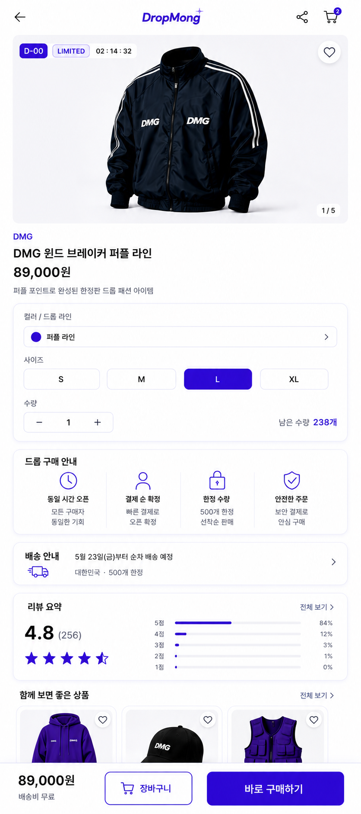
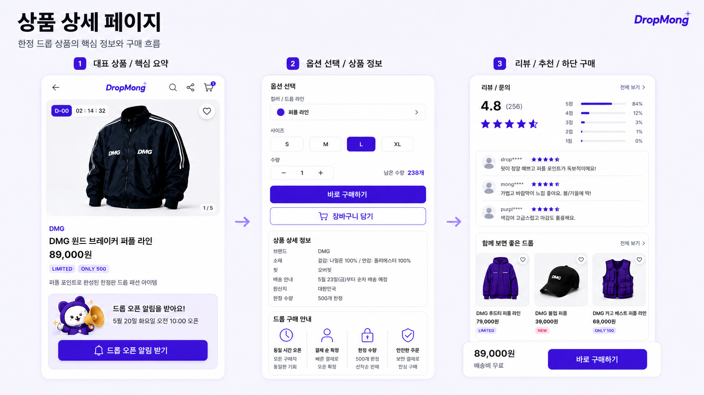
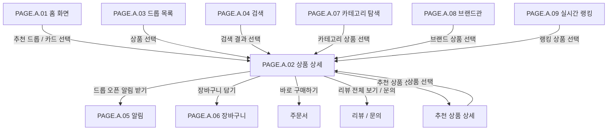

# 상품 상세 페이지

## 페이지 소개

상품 상세 페이지는 구매자가 한정 드롭 상품의 핵심 정보, 오픈 시간, 옵션, 남은 수량, 구매 조건, 리뷰, 추천 상품을 확인하고 구매 행동으로 넘어가는 페이지다.

이 페이지는 드롭 오픈 전에는 알림 신청과 정보 확인을 중심으로 동작하고, 오픈 후에는 옵션 선택, 바로 구매, 장바구니 담기, 주문서 진입을 담당한다.

## 스크린샷

### 구매자 모바일 웹 시안

### 기존 UI 근거

## 화면 구성

| 영역 | 화면 요소 | 사용자 행동 | 연결 페이지/기능 |
| --- | --- | --- | --- |
| 상단 앱 바 | 뒤로가기, DropMong 로고, 검색, 공유, 장바구니 | 이전 화면 복귀, 검색 진입, 공유, 장바구니 확인 | 홈, 검색, 공유, 장바구니 |
| 대표 상품 요약 | 상품 이미지 캐러셀, D-day, 카운트다운, 관심 버튼, 판매자/브랜드명, 상품명, 가격, 배지 | 이미지 탐색, 관심 등록, 상품 핵심 정보 확인 | 관심 등록(`API.A.07-01`/`-02`), 찜리스트(`PAGE.A.22`), 이미지 뷰어 |
| 드롭 오픈 알림 | 캐릭터 안내 카드, 오픈 일시, 드롭 오픈 알림 받기 | 오픈 알림 신청 | 알림 신청 |
| 옵션 선택 | 컬러/드롭 라인, 사이즈, 수량, 남은 수량 | 옵션 선택, 수량 변경 | 재고/옵션 검증 |
| 구매 CTA | 바로 구매하기, 장바구니 담기 | 주문서 진입, 장바구니 추가 | 주문서, 장바구니 |
| 상품 상세 정보 | 브랜드, 소재, 핏, 배송 안내, 원산지, 한정 수량 | 구매 판단 정보 확인 | 상품 정보 |
| 드롭 구매 안내 | 동일 시간 오픈, 결제 순 확정, 한정 수량, 안전한 주문 | 드롭 구매 규칙 확인 | 구매 유의사항 |
| 리뷰/문의 | 평점, 리뷰 분포, 사용자 리뷰, 전체 보기 | 후기 확인, 문의 확인 | 리뷰 목록, 문의 목록 |
| 함께 보면 좋은 드롭 | 추천 상품 카드, 가격, 배지, 관심 버튼 | 관련 상품 탐색 | 상품 상세 |
| 하단 고정 구매 영역 | 가격, 배송비, 바로 구매하기 | 화면 하단에서 즉시 구매 | 주문서 |

## 연관 사이트맵

## 진입 경로

| 출발 지점 | 진입 조건 | 비고 |
| --- | --- | --- |
| 홈 화면 | 추천 드롭, 오픈 예정 카드, 큐레이션, 실시간 랭킹 상품 선택 | 가장 기본 진입 경로 |
| 드롭 목록 | 진행 예정/진행 중/종료 드롭에서 상품 선택 | 목록 필터 상태 유지 필요 |
| 검색 | 상품명, 판매자명, 키워드 검색 결과 선택 | 검색어 복귀 필요 |
| 카테고리 탐색 | 카테고리 상품 선택 | 카테고리 필터 복귀 필요 |
| 브랜드관 | 판매자/브랜드 상품 선택 | 브랜드 상세 복귀 필요 |
| 알림 | 오픈 알림 또는 관심 상품 알림 선택 | 알림 종류에 따라 바로 상품 상세 진입 |
| 장바구니 | 장바구니 상품명 또는 썸네일 선택 | 옵션 선택 상태와 별개로 상품 상세 조회 |

## 이동 규칙

| 사용자 행동 | 이동 대상 | 권한/상태 조건 |
| --- | --- | --- |
| 뒤로가기 선택 | 이전 진입 페이지 | 진입 경로의 목록/검색 필터 복원 |
| 검색 아이콘 선택 | 검색 | 비회원도 진입 가능 |
| 공유 아이콘 선택 | 공유 시트 | 비회원도 가능 |
| 장바구니 아이콘 선택 | 장바구니 | 로그인 필요 |
| 관심 버튼 선택 | 관심 상품 등록/해제(`PUT`/`DELETE API.A.07-01`/`-02`) | 로그인 필요(`POLICY.A.07-01`) |
| 드롭 오픈 알림 받기 선택 | 알림 신청 | 로그인 필요, 오픈 전 중심 기능 |
| 옵션 컬러 선택 | 옵션 상세 상태 변경 | 선택 가능 옵션만 활성화 |
| 사이즈 선택 | 사이즈 상태 변경 | 품절/비활성 사이즈는 선택 불가 |
| 수량 증감 | 구매 수량 변경 | 1인 구매 제한과 남은 수량을 초과할 수 없음 |
| 장바구니 담기 선택 | 장바구니 | 로그인 필요, 오픈 전/품절/옵션 미선택 상태에서는 제한 |
| 바로 구매하기 선택 | 주문서 | 로그인 필요, 오픈 중, 옵션 선택 완료, 재고 가능 상태 필요 |
| 리뷰 전체 보기 선택 | 리뷰/문의 목록 | 비회원도 조회 가능 여부 확인 필요 |
| 추천 상품 선택 | 상품 상세 | 현재 상품에서 다른 상품 상세로 전환 |

## 페이지 데이터

| 데이터 | 설명 | 출처/후속 연결 |
| --- | --- | --- |
| 상품 기본 정보 | 상품명, 가격, 대표 이미지, 상세 이미지, 배지 | 상품 카탈로그 |
| 드롭 정보 | D-day, 카운트다운, 오픈 시각, 종료 시각, 드롭 상태 | 드롭 서비스 |
| 판매자 표시 정보 | 판매자명 또는 브랜드 표시명 | 판매자 프로필/스토어 |
| 옵션 정보 | 컬러, 사이즈, 옵션별 남은 수량, 선택 가능 여부 | 재고/옵션 서비스 |
| 구매 제한 | 1인 구매 제한, 한정 수량, 결제 순 확정 안내 | 드롭 정책 |
| 알림 신청 상태 | 사용자가 이 드롭의 오픈 알림을 신청했는지 여부 | 알림 서비스 |
| 관심 상태 | 사용자가 이 상품을 관심 상품으로 등록했는지 여부 | interest-service(`REQ.A.07`) — 확인 필요: interest-service는 현재 목록(`API.A.07-03`) 또는 토글 응답(`API.A.07-01`/`-02`)만 제공하고, "이 dropId 하나의 현재 찜 상태"를 바로 묻는 단건 조회 API가 없다. 상품 상세 진입 시 초기 하트 상태를 어떻게 채울지 결정 필요 |
| 리뷰/문의 요약 | 평균 평점, 리뷰 수, 별점 분포, 최근 리뷰 | 리뷰/문의 서비스 |
| 추천 상품 | 함께 보면 좋은 드롭 상품 목록 | 추천/큐레이션 또는 운영자 편성 |
| 장바구니 수량 | 상단 장바구니 배지 수 | 장바구니 서비스 |

## 상태와 예외

| 상태 | 화면 처리 | 비고 |
| --- | --- | --- |
| 오픈 전 | 구매 CTA는 비활성 또는 안내 상태로 두고 오픈 알림 신청을 강조 | 카운트다운과 오픈 시각 표시 |
| 오픈 중 | 옵션 선택, 수량 선택, 바로 구매, 장바구니 담기 활성화 | 남은 수량과 구매 제한 검증 |
| 품절 | 구매 CTA 비활성, 품절 안내 표시 | 추천 상품으로 대체 탐색 유도 |
| 종료 | 종료된 드롭 안내, 리뷰/추천 상품 중심 표시 | 재오픈 가능성은 정책 확인 |
| 옵션 미선택 | 바로 구매/장바구니 담기 시 옵션 선택 안내 | 옵션 영역으로 포커스 이동 가능 |
| 로그인 필요 | 관심, 알림, 장바구니, 바로 구매 시 로그인 유도 | 로그인 후 의도한 행동 복귀 필요 |
| 재고 동시성 충돌 | 주문서 진입 전 또는 주문 생성 시 최신 재고 기준으로 실패 사유 표시 | `REQ.A.01` 재고 배정 요구사항과 연결 |
| 이미지 로딩 실패 | 대체 이미지와 상품명 중심 정보 표시 | 구매 판단 정보 손실 최소화 |

## 후속 페이지 후보

| 후보 Page ID | 페이지 | 상태 | 상품 상세에서의 연결 |
| --- | --- | --- | --- |
| `PAGE.A.01` | 홈 화면 | 작성 완료 | 뒤로가기 또는 로고 |
| `PAGE.A.03` | 드롭 목록 | 문서 예정 | 이전 목록 복귀 |
| `PAGE.A.04` | 검색 | 문서 예정 | 상단 검색 |
| `PAGE.A.05` | 알림 | 문서 예정 | 드롭 오픈 알림 받기 |
| `PAGE.A.06` | [장바구니](./PAGE_A_06_shopping_cart.md) | 작성 완료 | 상단 장바구니, 장바구니 담기 |
| `PAGE.A.11` | [주문/결제](./PAGE_A_11_payment.md) | 작성 완료 | 바로 구매하기 |
| `PAGE.A.12` | 리뷰/문의 목록 | 문서 예정 | 리뷰/문의 전체 보기 |
| `PAGE.A.13` | 이미지 뷰어 | 문서 예정 | 상품 이미지 선택 |

## 연관 요구사항

| Requirements ID | 연결 이유 |
| --- | --- |
| [REQ.A.01](../../00-requirements/REQ_A_01_limited_drop_commerce.md) | 상품 상세, 카운트다운, 알림 신청, 옵션 선택, 구매 시도, 재고 배정과 직접 연결된다. |
| [REQ.A.02](../../00-requirements/REQ_A_02_coupon_benefit.md) | 상품 상세 또는 주문 진입 전 쿠폰/혜택 배지와 적용 가능성 표시가 필요할 수 있다. |
| [REQ.A.03](../../00-requirements/REQ_A_03_seller.md) | 판매자 표시 정보, 배송/반품 안내, 판매자 책임 고지와 연결된다. |
| [REQ.A.04](../../00-requirements/REQ_A_04_platform_operator_admin.md) | 추천 상품, 구매 안내 문구, 드롭 노출 상태는 운영자 검수/편성과 연결된다. |
| [REQ.A.07](../../00-requirements/REQ_A_07_interest_ranking.md) | 관심 버튼(찜 등록/해제)은 interest-service가 소유하며, 이 화면의 찜 토글이 오픈 전 랭킹("기다리는 상품") 카운터에 반영된다(2026-07-14 추가). |

## 연관 태그

🏷️ 요구사항 참조: [REQ.A.01](../../00-requirements/REQ_A_01_limited_drop_commerce.md), [REQ.A.07](../../00-requirements/REQ_A_07_interest_ranking.md) | 플로우 참조: FLOW.A.01 | UI 참조: [UI.A.02](../../20-ui/buyer-mobile-web/UI_A_02_product_detail.md) | UC 참조: UC.A.02, [UC.A.07](../../30-uc/UC_A_07_interest_ranking.md) | 영속성 참조: PST.A.02 | 서비스 참조: SVC.A.02 | 시나리오 참조: SCN.A.02 | API 참조: API.A.02, [API.A.07-01/-02](../../50-service-design/A_07_interest_ranking/A_07_40-api/README.md) | 찜리스트 참조: [PAGE.A.22](./PAGE_A_22_wishlist.md)

## 열린 질문

- 상품 상세의 기본 URL은 `/products/{productId}`로 둘 것인가, 드롭 회차를 포함해 `/drops/{dropId}/products/{productId}`로 둘 것인가?
- 오픈 전 장바구니 담기를 허용할 것인가, 오픈 후에만 허용할 것인가?
- `바로 구매하기`는 주문서로 바로 이동하는가, 아니면 별도 구매 대기/재고 배정 단계를 먼저 거치는가?
- 비회원에게 관심 상품과 드롭 오픈 알림 신청을 어떤 방식으로 유도할 것인가?
- 리뷰/문의는 MVP에 포함할 것인가, 상품 신뢰 보강용 후순위 기능으로 둘 것인가?
- 추천 상품은 운영자 편성, 같은 카테고리, 같은 판매자, 실시간 랭킹 중 어떤 기준으로 노출할 것인가?

## 확인 필요

- 상품 상세의 URL 정책과 드롭 회차 식별자 포함 여부
- 옵션/재고 조회 API와 주문서 진입 전 재고 검증 기준
- 오픈 전/오픈 중/품절/종료 상태별 CTA 문구와 활성화 정책
- 관심 상품, 공유, 장바구니, 알림 신청의 로그인 필요 여부
- 리뷰/문의 기능의 MVP 포함 범위
- 추천 상품 노출 기준과 운영자 편성 가능 여부
- 상품 상세에서 쿠폰/혜택 배지를 노출할 위치와 조건
