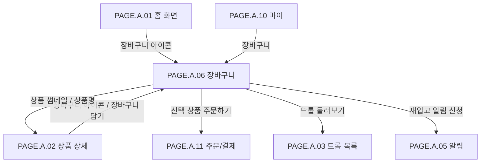

# 장바구니 페이지

## 페이지 소개

장바구니 페이지는 구매자가 담아둔 상품 중 지금 주문 가능한 상품과 주문 불가 상품을 한눈에 구분하고, 선택한 상품만 주문/결제 페이지로 넘기는 화면이다.

한정 드롭 상품은 품절, 판매 종료, 옵션 미선택, 오픈 전 상태가 빠르게 바뀔 수 있으므로 장바구니는 단순 보관함이 아니라 주문 가능 여부를 계속 검증하는 구매 전 단계다.

## 스크린샷

### 구매자 모바일 웹 시안

### 기존 UI 근거

## 화면 구성

| 영역 | 화면 요소 | 사용자 행동 | 연결 페이지/기능 |
| --- | --- | --- | --- |
| 상단 앱 바 | 뒤로가기, 페이지 제목, 전체 삭제 아이콘 | 이전 화면 복귀, 장바구니 비우기 | 이전 페이지, 삭제 확인 |
| 주문 가능 상품 섹션 | 주문 가능한 상품 수, 선택 가능한 상품 카드 | 주문 대상 선택, 옵션 확인, 수량 변경, 상품 삭제 | 주문/결제, 상품 상세 |
| 주문 가능 상품 카드 | 체크박스, 썸네일, 상품명, 옵션, 수량 스테퍼, 가격, 배지, 삭제 | 선택/해제, 수량 변경, 옵션 확인, 삭제 | 상품 상세, 수량 변경 |
| 주문 불가 상품 섹션 | 품절, 판매 종료, 옵션 선택 필요 상품 목록 | 상태 확인, 재입고 알림 신청, 옵션 선택 유도, 삭제 | 상품 상세, 알림 신청 |
| 주문 불가 안내 박스 | 주문 가능한 상품이 없을 때 안내 메시지 | 드롭 둘러보기 | 드롭 목록 |
| 주문 가능 요약 바 | 주문 가능 상품 수, 상품 금액, 배송비, 합계 | 주문 가능 금액 확인 | 주문/결제 |
| 하단 액션 버튼 | 선택 상품 주문하기, 드롭 둘러보기, 주문 불가 | 결제 이동, 탐색 이동 | 주문/결제, 드롭 목록 |

## 연관 사이트맵

## 진입 경로

| 출발 지점 | 진입 조건 | 비고 |
| --- | --- | --- |
| 홈 화면 | 상단 장바구니 아이콘 선택 | 로그인 필요 가능 |
| 상품 상세 페이지 | 상단 장바구니 아이콘 또는 장바구니 담기 후 이동 | 상품 옵션을 담은 뒤 확인 |
| 마이 | 장바구니 메뉴 선택 | 사용자의 보관 상품 확인 |
| 주문/결제 | 주문 실패 또는 옵션/재고 변경 후 장바구니 복귀 | 실패 사유 유지 필요 |

## 이동 규칙

| 사용자 행동 | 이동 대상 | 권한/상태 조건 |
| --- | --- | --- |
| 뒤로가기 선택 | 이전 화면 | 진입 경로 기준 복귀 |
| 전체 삭제 선택 | 삭제 확인 후 장바구니 비우기 | 로그인 필요, 삭제 확인 필요 |
| 상품 체크박스 선택 | 장바구니 내부 상태 변경 | 주문 가능 상품만 선택 가능 |
| 주문 가능 상품 수량 변경 | 장바구니 수량 변경 | 남은 수량, 1인 구매 제한 초과 불가 |
| 상품명/썸네일 선택 | 상품 상세 | 상품 상태와 무관하게 조회 가능 |
| 상품 삭제 선택 | 장바구니 항목 삭제 | 삭제 후 요약 금액 재계산 |
| 재입고 알림 신청 선택 | 알림 신청 | 품절 상품, 로그인 필요 가능 |
| 옵션 선택 필요 선택 | 상품 상세 또는 옵션 선택 화면 | 옵션 미선택 상품만 해당 |
| 선택 상품 주문하기 선택 | 주문/결제 | 선택 상품이 1개 이상이고 모두 주문 가능해야 함 |
| 드롭 둘러보기 선택 | 드롭 목록 | 주문 가능 상품이 없을 때 대체 행동 |

## 페이지 데이터

| 데이터 | 설명 | 출처/후속 연결 |
| --- | --- | --- |
| 장바구니 항목 | 상품, 옵션, 수량, 선택 상태, 담은 시각 | 장바구니 서비스 |
| 상품 상태 | 주문 가능, 품절, 판매 종료, 옵션 선택 필요 | 상품/드롭/재고 서비스 |
| 옵션 정보 | 컬러, 사이즈, 옵션명, 옵션 선택 여부 | 상품 옵션 서비스 |
| 수량 제한 | 남은 수량, 1인 구매 제한, 최대 주문 가능 수량 | 재고/드롭 정책 |
| 가격 정보 | 상품 금액, 배송비, 합계, 무료배송 조건 | 주문/가격 계산 |
| 상태 배지 | LIMITED, ONLY 100, 품절, 판매 종료, 옵션 선택 필요 | 상품/드롭 상태 |
| 알림 가능 여부 | 재입고 알림 또는 드롭 알림 신청 가능 여부 | 알림 서비스 |

## 상태와 예외

| 상태 | 화면 처리 | 비고 |
| --- | --- | --- |
| 주문 가능 상품 있음 | 선택 가능한 상품 카드와 주문 가능 요약 바를 표시한다. | 선택 상품 주문하기 활성화 가능 |
| 주문 가능 상품 없음 | 주문 불가 상품 목록과 안내 박스, 드롭 둘러보기 버튼을 표시한다. | 주문 불가 버튼 비활성 |
| 품절 | 체크박스 비활성, 품절 배지, 재입고 알림 신청 가능 표시 | 재입고 예정 여부에 따라 문구 변경 |
| 판매 종료 | 체크박스 비활성, 판매 종료 배지, 재입고 예정 없음 표시 | 삭제 또는 상세 확인만 가능 |
| 옵션 선택 필요 | 체크박스 비활성, 옵션 선택 필요 배지와 옵션 선택 유도 | 상품 상세 또는 옵션 선택으로 이동 |
| 선택 상품 없음 | 요약 금액 0원, 주문 CTA 비활성 | 주문 가능 상품이 있어도 선택 없으면 비활성 |
| 수량 변경 실패 | 기존 수량 유지, 실패 사유 표시 | 재고 변경 또는 구매 제한 초과 |
| 가격/재고 변경 | 최신 기준으로 재계산하고 변경 안내 표시 | 주문/결제 진입 전 재검증 필요 |

## 후속 페이지 후보

| 후보 Page ID | 페이지 | 상태 | 장바구니에서의 연결 |
| --- | --- | --- | --- |
| `PAGE.A.01` | [홈 화면](./PAGE_A_01_homepage.md) | 작성 완료 | 뒤로가기 이전 화면 |
| `PAGE.A.02` | [상품 상세](./PAGE_A_02_product_detail.md) | 작성 완료 | 상품명/썸네일, 옵션 선택 필요 |
| `PAGE.A.03` | 드롭 목록 | 문서 예정 | 드롭 둘러보기 |
| `PAGE.A.05` | 알림 | 문서 예정 | 재입고 알림 신청 |
| `PAGE.A.11` | [주문/결제](./PAGE_A_11_payment.md) | 작성 완료 | 선택 상품 주문하기 |

## 연관 요구사항

| Requirements ID | 연결 이유 |
| --- | --- |
| [REQ.A.01](../../00-requirements/REQ_A_01_limited_drop_commerce.md) | 장바구니 상품의 주문 가능 여부, 수량 변경, 주문/결제 진입 전 재고/상태 검증과 연결된다. |
| [REQ.A.02](../../00-requirements/REQ_A_02_coupon_benefit.md) | 장바구니 단계 이후 주문/결제에서 쿠폰/혜택 적용 가능성이 이어진다. |

## 연관 태그

🏷️ 요구사항 참조: [REQ.A.01](../../00-requirements/REQ_A_01_limited_drop_commerce.md) | 플로우 참조: FLOW.A.06 | UI 참조: [UI.A.06](../../20-ui/buyer-mobile-web/UI_A_06_shopping_cart.md) | UC 참조: UC.A.06 | 영속성 참조: PST.A.06 | 서비스 참조: SVC.A.06 | 시나리오 참조: SCN.A.06 | API 참조: API.A.06

## 열린 질문

- 장바구니는 오픈 전 상품 담기를 허용할 것인가, 오픈 후 상품만 담을 수 있게 할 것인가?
- 주문 가능 여부 검증은 화면 진입 시만 할 것인가, 수량 변경/주문 버튼 클릭 시에도 다시 수행할 것인가?
- 주문 가능 상품과 주문 불가 상품을 한 화면에 같이 둘 것인가, 탭으로 분리할 것인가?
- 품절 상품의 재입고 알림과 드롭 오픈 알림은 같은 알림 모델을 사용할 것인가?
- 무료배송 조건은 장바구니에서 확정할 것인가, 주문/결제에서 최종 확정할 것인가?

## 확인 필요

- 장바구니 항목 상태 모델: 주문 가능, 품절, 판매 종료, 옵션 선택 필요
- 수량 변경 API와 재고/구매 제한 검증 시점
- 선택 상품 주문하기에서 주문/결제로 넘길 데이터 스냅샷
- 품절/판매 종료/옵션 미선택 상품의 삭제, 알림, 옵션 수정 정책
- 장바구니 전체 삭제의 확인 모달 여부
- 가격/배송비 표시 기준과 주문/결제 재계산 차이 처리
