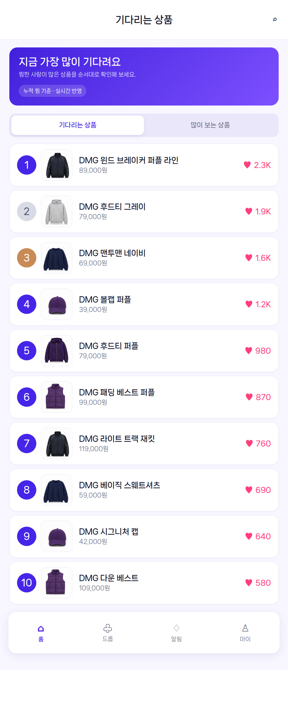

# 기다리는 상품 페이지

## 페이지 소개

홈의 기다리는 상품 Top 3에서 `전체 보기`를 선택했을 때 진입하는 공개 랭킹 페이지다. 드롭 상태와 관계없이 누적 활성 찜 수가 많은 상품을 최대 100위까지 보여준다.

## 스크린샷

## 이동 규칙

| 행동 | 이동 대상 |
| --- | --- |
| 뒤로가기 | [PAGE.A.01 홈](PAGE_A_01_homepage.md) |
| 많이 보는 상품 탭 | [PAGE.A.23](PAGE_A_23_trending_products.md) |
| 랭킹 상품 선택 | [PAGE.A.02 상품 상세](PAGE_A_02_product_detail.md) |

## 페이지 데이터

| 데이터 | 출처 |
| --- | --- |
| 순위, `dropId`, `interestCount` | `API.A.07-06` |
| 상품명, 가격, 썸네일 | catalog-service 상품 표시 정보 |

## 상태와 예외

- 로딩 중에는 동일한 높이의 랭킹 행 스켈레톤을 표시한다.
- 빈 목록에는 홈 이동 CTA를 제공한다.
- 일부 상품 정보 조회 실패가 전체 목록 실패로 번지지 않게 행 단위 대체 상태를 사용한다.

## 연관 요구사항

| Requirements ID | 연결 이유 |
| --- | --- |
| [REQ.A.07](../../00-requirements/REQ_A_07_interest_ranking.md) | 이 페이지가 보여주는 랭킹 자체를 정의한다(리셋 없는 누적 활성 찜 수, 카탈로그 상태 무관). |

## 연관 태그

🏷️ 요구사항 참조: [REQ.A.07](../../00-requirements/REQ_A_07_interest_ranking.md) | UI 참조: [UI.A.09](../../20-ui/buyer-mobile-web/UI_A_09_waiting_products.md) | UC 참조: [UC.A.07](../../30-uc/UC_A_07_interest_ranking.md) | BC 참조: [BC.A.07](../../40-event-storming-bounded-context/BC_A_07_interest_ranking.md) | API 참조: [API.A.07-06](../../50-service-design/A_07_interest_ranking/A_07_40-api/README.md)

