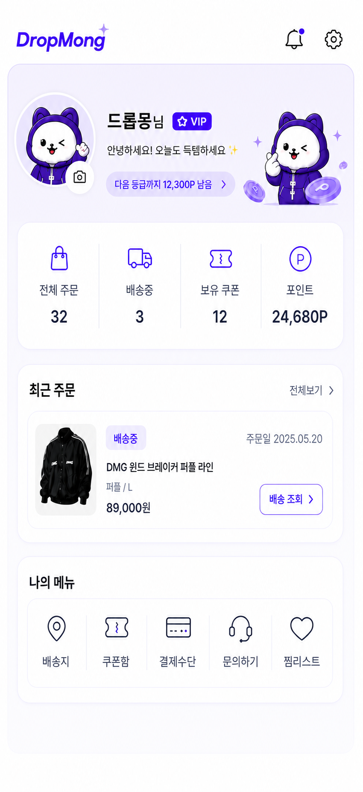
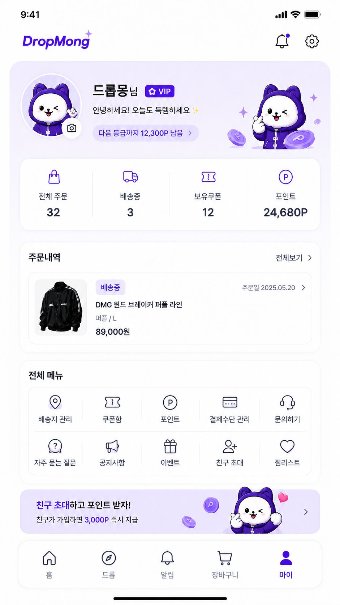
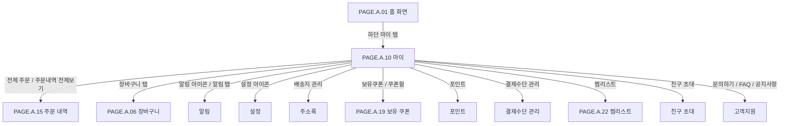

# 마이 페이지

## 페이지 소개

마이 페이지는 구매자가 자신의 프로필, 등급, 주문 현황, 쿠폰, 포인트, 배송지, 결제수단, 문의, 찜리스트 같은 개인화 기능으로 진입하는 계정 허브 화면이다.

DropMong에서는 한정 드롭 참여 이후 주문 추적과 혜택 확인이 중요하므로 마이 페이지는 구매 이후 관리뿐 아니라 다음 드롭 참여를 준비하는 개인 대시보드 역할도 한다.

## 스크린샷

### 구매자 모바일 웹 시안

### 기존 UI 근거

## 화면 구성

| 영역 | 화면 요소 | 사용자 행동 | 연결 페이지/기능 |
| --- | --- | --- | --- |
| 상단 헤더 바 | DropMong 로고, 알림 아이콘, 설정 아이콘 | 알림 확인, 설정 이동 | 알림, 설정 |
| 프로필 히어로 카드 | 프로필 이미지, 닉네임, VIP 배지, 인사말, 등급 진행 칩 | 프로필 확인, 등급 진행 확인, 프로필 이미지 변경 | 프로필, 등급 혜택 |
| 요약 정보 카드 | 전체 주문, 배송중, 보유쿠폰, 포인트 | 주요 계정 지표 확인 | 주문 내역, 배송 조회, 보유 쿠폰, 포인트 |
| 주문내역 미리보기 카드 | 최근 주문 상품, 배송 상태, 주문일, 가격, 전체보기 | 최근 주문 확인, 주문 내역 전체 이동 | 주문 내역, 주문 상세 |
| 전체 메뉴 그리드 | 배송지 관리, 보유 쿠폰, 포인트, 결제수단 관리, 문의하기, FAQ, 공지사항, 이벤트, 친구 초대, 찜리스트 | 계정/혜택/지원 메뉴 이동 | 각 하위 페이지 |
| 친구 초대 프로모션 배너 | 친구 초대 포인트 혜택 | 친구 초대 이동 | 친구 초대 |
| 하단 내비게이션 | 홈, 드롭, 알림, 장바구니, 마이 | 주요 탭 이동 | 홈, 드롭, 알림, 장바구니, 마이 |

## 연관 사이트맵

## 진입 경로

| 출발 지점 | 진입 조건 | 비고 |
| --- | --- | --- |
| 홈 화면 | 하단 마이 탭 선택 | 로그인 필요 |
| 주문 완료 | 하단 마이 탭 선택 | 주문 이후 계정 관리 진입 |
| 주문 내역 | 하단 마이 탭 또는 뒤로가기 | 주문 내역의 상위 허브 |
| 알림 | 마이 관련 알림 선택 후 복귀 | 알림 문서 작성 후 연결 확정 |

## 이동 규칙

| 사용자 행동 | 이동 대상 | 권한/상태 조건 |
| --- | --- | --- |
| 알림 아이콘 선택 | 알림 | 로그인 필요 |
| 설정 아이콘 선택 | 설정 | 로그인 필요 |
| 프로필 이미지 선택 | 프로필 편집 | 이미지 변경 권한 필요 |
| 등급 진행 칩 선택 | 등급 혜택 | 회원 등급 정책 필요 |
| 전체 주문 선택 | 주문 내역 | 로그인 필요 |
| 배송중 선택 | 주문 내역 | 배송중 필터 적용 가능 |
| 보유쿠폰 선택 | [PAGE.A.19 보유 쿠폰](./PAGE_A_19_coupon_wallet/PAGE_A_19_owned_coupon.md) | 로그인 필요 |
| 찜리스트 선택 | [PAGE.A.22 찜리스트](./PAGE_A_22_wishlist.md) | 로그인 필요 |
| 포인트 선택 | 포인트 | 포인트 내역 조회 |
| 주문내역 전체보기 선택 | 주문 내역 | 최근 주문 목록 전체 이동 |
| 최근 주문 카드 선택 | 주문 상세 | 주문 소유자만 조회 |
| 배송지 관리 선택 | 주소록 | 배송지 추가/수정/삭제 |
| 결제수단 관리 선택 | 결제수단 관리 | 기본 결제수단 관리 |
| 친구 초대 배너 선택 | 친구 초대 | 초대 코드/링크 발급 |
| 하단 홈/드롭/알림/장바구니/마이 선택 | 각 탭 | 전역 내비게이션 규칙 적용 |

## 페이지 데이터

| 데이터 | 설명 | 출처/후속 연결 |
| --- | --- | --- |
| 회원 프로필 | 닉네임, 프로필 이미지, 등급, 인사말 | 회원 서비스 |
| 등급 정보 | 현재 등급, 다음 등급까지 필요한 포인트, 등급 혜택 | 등급/포인트 서비스 |
| 요약 지표 | 전체 주문 수, 배송중 수, 보유 쿠폰 수, 보유 포인트 | 주문/배송/쿠폰/포인트 서비스 |
| 최근 주문 | 최근 주문 상품, 배송 상태, 주문일, 가격 | 주문 서비스 |
| 메뉴 목록 | 메뉴 아이콘, 라벨, 이동 대상, 활성 여부 | 화면 정책 |
| 프로모션 배너 | 친구 초대 혜택 문구, 이미지, 이동 대상 | 프로모션/추천 서비스 |
| 알림 상태 | 읽지 않은 알림 도트 또는 카운트 | 알림 서비스 |
| 하단 탭 상태 | 현재 선택 탭, 탭별 이동 대상 | 앱 내비게이션 |

## 상태와 예외

| 상태 | 화면 처리 | 비고 |
| --- | --- | --- |
| 로그인 사용자 | 프로필, 요약 지표, 최근 주문, 메뉴를 표시한다. | 기본 상태 |
| 비회원 | 로그인 유도 카드와 제한 메뉴를 표시한다. | 시안 필요 |
| 최근 주문 없음 | 주문내역 미리보기 대신 드롭 둘러보기 CTA를 표시한다. | 빈 상태 필요 |
| 배송중 주문 없음 | 배송중 요약은 0으로 표시하고 주문 내역 필터 이동 가능 | 정상 상태 |
| 쿠폰/포인트 조회 실패 | 해당 지표를 재조회하거나 안내 문구로 대체한다. | 혜택 신뢰도 중요 |
| 알림 미확인 있음 | 알림 도트를 표시한다. | 알림 서비스 연동 |
| 메뉴 비활성 | 준비 중 또는 권한 필요 상태로 표시한다. | MVP 범위에 따라 결정 |

## 후속 페이지 후보

| 후보 Page ID | 페이지 | 상태 | 마이에서의 연결 |
| --- | --- | --- | --- |
| `PAGE.A.01` | [홈 화면](./PAGE_A_01_homepage.md) | 작성 완료 | 하단 홈 |
| `PAGE.A.06` | [장바구니](./PAGE_A_06_shopping_cart.md) | 작성 완료 | 하단 장바구니 |
| `PAGE.A.15` | [주문 내역](./PAGE_A_15_order_history.md) | 작성 완료 | 전체 주문, 최근 주문 전체보기 |
| `PAGE.A.16` | [배송 조회](./PAGE_A_16_track_order.md) | 작성 완료 | 배송중 요약 |
| `PAGE.A.18` | 주소록/배송지 관리 | 문서 예정 | 배송지 관리 |
| `PAGE.A.19` | [보유 쿠폰](./PAGE_A_19_coupon_wallet/PAGE_A_19_owned_coupon.md) | 작성 완료 | 보유쿠폰, 쿠폰함 |
| `PAGE.A.20` | 포인트 | 문서 예정 | 포인트 |
| `PAGE.A.21` | 결제수단 관리 | 문서 예정 | 결제수단 관리 |
| `PAGE.A.22` | [찜리스트](./PAGE_A_22_wishlist.md) | 작성 완료 | 찜리스트 |

## 연관 요구사항

| Requirements ID | 연결 이유 |
| --- | --- |
| [REQ.A.01](../../00-requirements/REQ_A_01_limited_drop_commerce.md) | 주문 현황, 배송 상태, 장바구니, 찜리스트, 드롭 참여 이후 관리와 연결된다. |
| [REQ.A.02](../../00-requirements/REQ_A_02_coupon_benefit.md) | 보유 쿠폰, 포인트, 친구 초대 포인트 혜택과 연결된다. |
| [REQ.A.07](../../00-requirements/REQ_A_07_interest_ranking.md) | 찜리스트(`PAGE.A.22`) 메뉴 항목은 interest-service가 소유한다(2026-07-14 추가). |

## 연관 태그

🏷️ 요구사항 참조: [REQ.A.01](../../00-requirements/REQ_A_01_limited_drop_commerce.md), [REQ.A.02](../../00-requirements/REQ_A_02_coupon_benefit.md), [REQ.A.07](../../00-requirements/REQ_A_07_interest_ranking.md) | 플로우 참조: FLOW.A.10 | UI 참조: [UI.A.10](../../20-ui/buyer-mobile-web/UI_A_10_my.md) | UC 참조: UC.A.10 | 영속성 참조: PST.A.10 | 서비스 참조: SVC.A.10 | 시나리오 참조: SCN.A.10 | API 참조: API.A.10 | 찜리스트 참조: [PAGE.A.22](./PAGE_A_22_wishlist.md)

## 열린 질문

- 비회원이 마이 탭에 진입했을 때 로그인 전용 화면을 보여줄 것인가, 일부 메뉴를 미리 보여줄 것인가?
- 등급 진행 기준은 포인트, 구매 금액, 드롭 참여 횟수 중 무엇을 사용할 것인가?
- 최근 주문 미리보기는 몇 개까지 보여줄 것인가?
- 친구 초대 혜택은 MVP에 포함할 것인가, 배너 자리만 예약할 것인가?
- 장바구니를 하단 탭에 둘 것인가, 상단/메뉴 진입으로만 둘 것인가?

## 확인 필요

- 마이 페이지 진입 권한과 비회원 상태 처리
- 회원 등급/포인트 정책과 표시 문구
- 요약 지표 집계 기준: 전체 주문, 배송중, 보유 쿠폰, 포인트
- 전체 메뉴의 MVP 포함 범위
- 최근 주문 미리보기 카드와 주문 내역 상세 연결 정책
- 설정/프로필 편집/주소록/결제수단 관리 문서의 Page ID 확정
