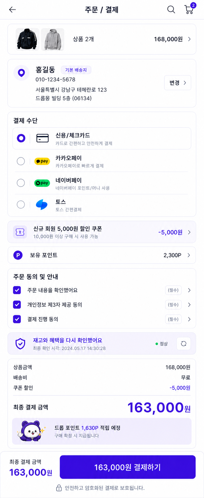
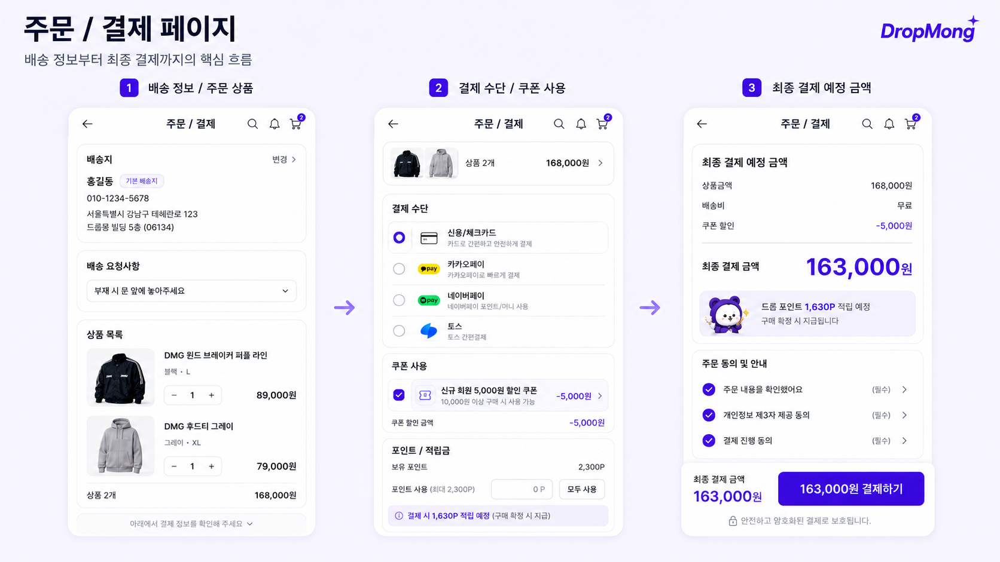
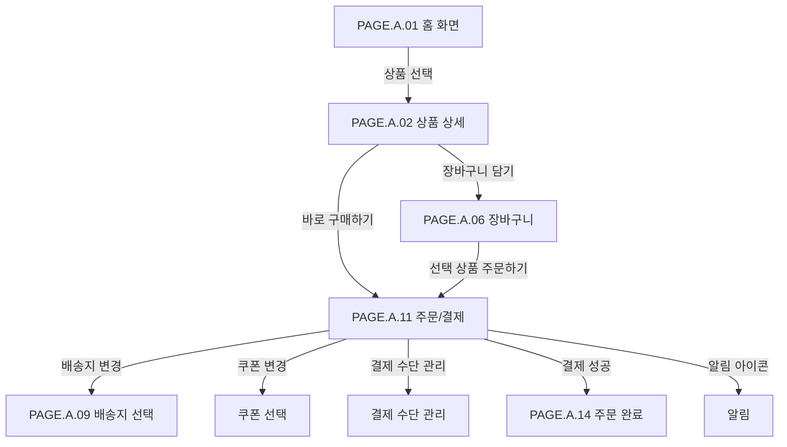

# 주문/결제 페이지

## 페이지 소개

주문/결제 페이지는 구매자가 장바구니 또는 상품 상세에서 선택한 상품을 기준으로 배송지, 배송 요청사항, 결제 수단, 쿠폰, 포인트, 필수 동의를 확인하고 최종 결제를 실행하는 화면이다.

한정 드롭 상품은 결제 직전에도 재고, 가격, 쿠폰 적용 가능 여부가 바뀔 수 있으므로 결제 페이지는 단순 입력 화면이 아니라 주문 확정 전 최종 검증 지점이다.

## 스크린샷

### 구매자 모바일 웹 시안

### 기존 UI 근거

## 화면 구성

| 영역 | 화면 요소 | 사용자 행동 | 연결 페이지/기능 |
| --- | --- | --- | --- |
| 상단 앱 바 | 뒤로가기, 페이지 제목, 검색, 알림, 장바구니 아이콘 | 이전 화면 복귀, 검색/알림/장바구니 이동 | 이전 페이지, 검색, 알림, 장바구니 |
| 배송지 카드 | 수령인, 연락처, 주소, 기본 배송지 배지, 변경 버튼 | 배송지 확인, 배송지 변경 | 배송지 선택/주소록 |
| 배송 요청사항 | 요청사항 드롭다운 | 문 앞 보관 등 배송 요청 선택 | 배송 요청사항 선택 |
| 상품 목록 | 주문 상품 썸네일, 상품명, 옵션, 수량, 가격 | 주문 상품 확인, 수량 확인 | 상품 상세 |
| 주문 상품 요약 바 | 상품 수, 대표 썸네일, 상품 금액 | 주문 상품 접기/펼치기 또는 상세 확인 | 상품 목록 |
| 결제 수단 | 신용/체크카드, 카카오페이, 네이버페이, 토스 | 결제 수단 선택 | 결제 수단 관리/PG |
| 쿠폰 사용 | 적용 쿠폰, 할인 금액, 쿠폰 라벨 | 쿠폰 적용/변경/해제 | 쿠폰 선택 |
| 포인트/적립금 | 보유 포인트, 사용 포인트, 모두 사용 버튼 | 포인트 입력, 전액 사용 | 포인트 정책 |
| 최종 결제 예정 금액 | 상품 금액, 배송비, 쿠폰 할인, 최종 결제 금액 | 결제 금액 확인 | 가격 계산 |
| 포인트 적립 안내 | 결제 시 적립 예정 포인트 | 적립 예정 혜택 확인 | 포인트 적립 |
| 주문 동의 및 안내 | 주문 확인, 개인정보 제3자 제공, 결제 진행 동의 | 필수 동의 체크 | 약관/동의 상세 |
| 하단 결제 바 | 최종 결제 금액, 결제하기 버튼 | 결제 실행 | 주문 생성, 결제 승인 |

## 연관 사이트맵

## 진입 경로

| 출발 지점 | 진입 조건 | 비고 |
| --- | --- | --- |
| 장바구니 | 선택 상품 주문하기 | 선택 상품이 1개 이상이고 주문 가능해야 한다. |
| 상품 상세 페이지 | 바로 구매하기 | 옵션, 수량, 구매 가능 여부가 확인되어야 한다. |
| 주문 실패 화면 | 결제 재시도 | 실패 사유와 주문 스냅샷 유지 필요 |

## 이동 규칙

| 사용자 행동 | 이동 대상 | 권한/상태 조건 |
| --- | --- | --- |
| 뒤로가기 선택 | 이전 화면 | 결제 입력 상태 보존 여부 결정 필요 |
| 배송지 변경 선택 | 배송지 선택 | 로그인 필요, 배송 가능 지역 검증 필요 |
| 배송 요청사항 선택 | 현재 화면 내부 상태 변경 | 선택 가능한 요청사항만 표시 |
| 상품 요약 선택 | 상품 목록 영역 | 상품 목록 접기/펼치기 가능 |
| 결제 수단 선택 | 현재 화면 내부 상태 변경 | 활성 결제 수단만 선택 가능 |
| 쿠폰 선택/변경 | 쿠폰 선택 | 주문 상품, 판매자, 최소 주문 금액 조건 검증 |
| 포인트 모두 사용 | 현재 화면 내부 상태 변경 | 보유 포인트와 사용 가능 금액 한도 적용 |
| 필수 동의 선택 | 현재 화면 내부 상태 변경 | 모든 필수 동의 완료 시 결제 CTA 활성화 |
| 결제하기 선택 | 주문 완료 또는 결제 실패 | 재고/가격/혜택 재검증 후 결제 승인 요청 |
| 장바구니 아이콘 선택 | 장바구니 | 결제 입력 중 이탈 확인 필요 가능 |

## 페이지 데이터

| 데이터 | 설명 | 출처/후속 연결 |
| --- | --- | --- |
| 체크아웃 식별자 | 결제 페이지 진입 시 생성되는 주문 준비 단위 | 주문/체크아웃 서비스 |
| 주문 상품 | 상품, 옵션, 수량, 가격, 판매자, 배송 정책 | 장바구니/상품/주문 서비스 |
| 배송지 | 수령인, 연락처, 주소, 기본 배송지 여부 | 회원/주소록 서비스 |
| 배송 요청사항 | 요청사항 코드와 표시 문구 | 주문 서비스 |
| 결제 수단 | 결제 수단 타입, 표시명, 활성 여부 | 결제 서비스 |
| 쿠폰 | 적용 쿠폰, 할인 금액, 사용 조건, 발급 주체 | 쿠폰 서비스 |
| 포인트 | 보유 포인트, 사용 가능 포인트, 적립 예정 포인트 | 포인트 서비스 |
| 금액 요약 | 상품 금액, 배송비, 쿠폰 할인, 포인트 사용, 최종 결제 금액 | 가격 계산 서비스 |
| 동의 항목 | 주문 확인, 개인정보 제3자 제공, 결제 진행 동의 | 약관/주문 서비스 |
| 결제 상태 | 결제 가능, 결제 진행 중, 결제 성공, 결제 실패 | 결제/주문 서비스 |

## 상태와 예외

| 상태 | 화면 처리 | 비고 |
| --- | --- | --- |
| 결제 가능 | 결제 금액과 필수 동의가 모두 확인되면 결제 버튼을 활성화한다. | 기본 상태 |
| 배송지 없음 | 배송지 등록/선택을 유도하고 결제 버튼을 비활성화한다. | 주소록 연결 필요 |
| 결제 수단 미선택 | 결제 수단 선택을 유도하고 결제 버튼을 비활성화한다. | 기본 결제 수단 자동 선택 가능 |
| 필수 동의 미완료 | 미동의 항목을 표시하고 결제 버튼을 비활성화한다. | 약관 상세 연결 |
| 쿠폰 적용 불가 | 쿠폰을 해제하고 사유를 안내한다. | 최소 주문 금액, 판매자, 상품 조건 |
| 포인트 사용 불가 | 입력값을 보정하거나 사유를 표시한다. | 보유 포인트, 사용 한도 |
| 재고 변경 | 결제 중단 후 변경된 상품 상태를 안내한다. | 한정 상품 핵심 예외 |
| 가격 변경 | 최신 가격으로 재계산하고 재확인을 요구한다. | 주문 확정 전 재검증 |
| 결제 승인 실패 | 실패 사유를 안내하고 재시도 또는 결제 수단 변경을 제공한다. | PG 응답 기반 |
| 결제 진행 중 | 결제 버튼 중복 클릭을 막고 진행 상태를 표시한다. | 중복 주문 방지 |

## 후속 페이지 후보

| 후보 Page ID | 페이지 | 상태 | 주문/결제에서의 연결 |
| --- | --- | --- | --- |
| `PAGE.A.02` | [상품 상세](./PAGE_A_02_product_detail.md) | 작성 완료 | 상품 목록에서 상품 확인 |
| `PAGE.A.06` | [장바구니](./PAGE_A_06_shopping_cart.md) | 작성 완료 | 장바구니 아이콘, 결제 이탈 |
| `PAGE.A.14` | [주문 완료](./PAGE_A_14_order_complete.md) | 작성 완료 | 결제 성공 후 이동 |
| `PAGE.A.09` | 배송지 선택 | 문서 예정 | 배송지 변경 |
| `PAGE.A.10` | [마이](./PAGE_A_10_my.md) | 작성 완료 | 결제 수단/주소록 관리와 연결 가능 |

## 연관 요구사항

| Requirements ID | 연결 이유 |
| --- | --- |
| [REQ.A.01](../../00-requirements/REQ_A_01_limited_drop_commerce.md) | 결제 직전 재고, 가격, 구매 제한, 주문 확정 검증과 연결된다. |
| [REQ.A.02](../../00-requirements/REQ_A_02_coupon_benefit.md) | 쿠폰 적용, 할인 금액 계산, 쿠폰 사용 조건 검증과 연결된다. |

## 연관 태그

🏷️ 요구사항 참조: [REQ.A.01](../../00-requirements/REQ_A_01_limited_drop_commerce.md), [REQ.A.02](../../00-requirements/REQ_A_02_coupon_benefit.md) | 플로우 참조: FLOW.A.11 | UI 참조: [UI.A.11](../../20-ui/buyer-mobile-web/UI_A_11_payment.md) | UC 참조: UC.A.11 | 영속성 참조: PST.A.11 | 서비스 참조: SVC.A.11 | 시나리오 참조: SCN.A.11 | API 참조: API.A.11

## 열린 질문

- 바로 구매하기와 장바구니 주문의 체크아웃 데이터 모델을 하나로 통합할 것인가?
- 결제 페이지 진입 시 주문 준비 레코드를 생성할 것인가, 결제 버튼 클릭 시 생성할 것인가?
- 기본 등록 결제 수단을 자동 선택할 것인가, 사용자가 명시적으로 선택해야 할 것인가?
- 쿠폰과 포인트 적용 순서는 어떻게 정할 것인가?
- 결제 진행 중 재고가 소진되면 주문 실패로 처리할 것인가, 결제 승인 전 재검증으로 차단할 것인가?
- 결제 페이지 이탈 시 입력 상태를 얼마나 보존할 것인가?

## 확인 필요

- 체크아웃 스냅샷 생성 시점과 만료 정책
- 주문 가능 여부 재검증 기준: 재고, 가격, 쿠폰, 포인트, 배송지, 결제 수단
- 결제 중복 요청 방지 방식
- 쿠폰/포인트 동시 사용 정책과 계산 순서
- 필수 동의 항목의 법무/정책 문구
- 결제 실패 후 재시도와 주문서 복구 정책
