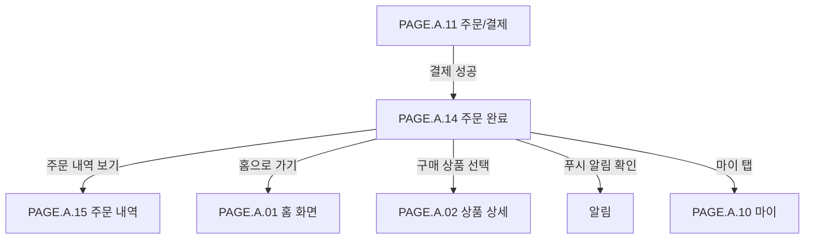

# 주문 완료 페이지

## 페이지 소개

주문 완료 페이지는 결제가 성공한 뒤 구매자에게 드롭 참여 성공, 주문번호, 결제일시, 최종 결제 금액, 배송 예정일, 구매 상품, 적립 예정 포인트를 확인시켜주는 화면이다.

한정 드롭 상품은 구매 성공 자체가 중요한 경험이므로 주문 완료 화면은 단순 결과 안내가 아니라 구매 성공의 성취감과 이후 배송 추적 행동을 연결하는 후속 화면이다.

## 스크린샷

### 구매자 모바일 웹 시안

### 기존 UI 근거

## 화면 구성

| 영역 | 화면 요소 | 사용자 행동 | 연결 페이지/기능 |
| --- | --- | --- | --- |
| 상단 앱 바 | 뒤로가기, 로고, 검색, 알림, 장바구니 아이콘 | 이전 화면 복귀, 검색/알림/장바구니 이동 | 홈, 검색, 알림, 장바구니 |
| 성공 상태 히어로 카드 | 성공 체크 아이콘, 완료 메시지, 캐릭터 이미지 | 주문 완료 상태 확인 | 주문 상태 |
| 주문 요약 정보 | 주문번호, 결제일시, 최종 결제 금액 | 주문 식별 정보 확인 | 주문 상세 |
| 배송 일정/상태 | 예상 배송일, 배송 상태 단계, 배송지 확인 버튼 | 배송 예정일 확인, 배송지 확인 | 배송지 확인, 배송 조회 |
| 안내 메시지 | 푸시 알림 안내 문구 | 배송 알림 기대 상태 확인 | 알림 설정 |
| 구매 상품 리스트 | 상품 썸네일, 상품명, 옵션, 수량, 가격 | 구매 상품 확인, 상품 정보 보기 | 상품 상세, 주문 상품 정보 |
| 포인트 적립 배너 | 적립 예정 포인트와 지급 조건 | 적립 예정 혜택 확인 | 포인트 내역 |
| 액션 버튼 | 주문 내역 보기, 홈으로 가기 | 주문 내역 이동, 홈 이동 | 주문 내역, 홈 |
| 하단 내비게이션 | 홈, 드롭, 알림, 마이 탭 | 주요 탭 이동 | 홈, 드롭, 알림, 마이 |

## 연관 사이트맵

## 진입 경로

| 출발 지점 | 진입 조건 | 비고 |
| --- | --- | --- |
| 주문/결제 | 결제 승인과 주문 생성이 모두 성공함 | 주문 결과를 단 한 번 명확히 보여줘야 한다. |
| 결제 재시도 | 이전 결제 실패 후 재결제가 성공함 | 중복 주문 여부 확인 필요 |
| 주문 내역 | 완료된 주문을 다시 확인함 | 재진입 시 성공 히어로 노출 정책 확인 필요 |

## 이동 규칙

| 사용자 행동 | 이동 대상 | 권한/상태 조건 |
| --- | --- | --- |
| 뒤로가기 선택 | 홈 또는 주문 내역 | 결제 페이지로 되돌아가지 않도록 정책 필요 |
| 검색 선택 | 검색 | 로그인 상태 유지 |
| 알림 선택 | 알림 | 주문/배송 알림 확인 가능 |
| 장바구니 선택 | 장바구니 | 주문 완료 후에도 기존 장바구니 확인 가능 |
| 배송지 확인 선택 | 주문 상세 또는 배송지 확인 | 배송지 변경 가능 여부는 출고 상태에 따름 |
| 구매 상품 선택 | 상품 상세 | 상품이 판매 종료되어도 상세 조회 가능 |
| 주문 내역 보기 선택 | 주문 내역 | 완료된 주문 상세로 이동 |
| 홈으로 가기 선택 | 홈 화면 | 구매 완료 후 탐색 복귀 |
| 하단 홈/드롭/알림/마이 선택 | 각 탭 | 전역 내비게이션 규칙 적용 |

## 페이지 데이터

| 데이터 | 설명 | 출처/후속 연결 |
| --- | --- | --- |
| 주문 식별자 | 주문번호, 주문 ID | 주문 서비스 |
| 결제 정보 | 결제일시, 최종 결제 금액, 결제 수단 요약 | 주문/결제 서비스 |
| 배송 정보 | 예상 배송일, 배송 상태, 배송지 확인 가능 여부 | 배송 서비스 |
| 배송 상태 단계 | 주문완료, 배송준비, 배송중, 배송완료 | 배송/주문 상태 |
| 구매 상품 | 상품명, 옵션, 수량, 가격, 썸네일 | 주문 상품 스냅샷 |
| 포인트 적립 | 적립 예정 포인트, 지급 조건, 지급 시점 | 포인트 서비스 |
| 알림 안내 | 배송 푸시 알림 수신 가능 여부 | 알림 서비스 |
| 액션 상태 | 주문 내역 보기, 홈으로 가기, 배송지 확인 활성 여부 | 화면 정책 |

## 상태와 예외

| 상태 | 화면 처리 | 비고 |
| --- | --- | --- |
| 주문 완료 | 성공 히어로, 주문 요약, 배송 일정, 구매 상품, 포인트 배너를 표시한다. | 기본 상태 |
| 포인트 적립 없음 | 포인트 배너를 숨기거나 0P 안내로 대체한다. | 포인트 정책에 따름 |
| 배송 예정일 미확정 | 예상 배송일 대신 준비 중 문구를 표시한다. | 판매자/물류 상태 필요 |
| 배송지 확인 불가 | 배송지 확인 버튼을 비활성화하거나 주문 상세로 대체한다. | 출고 후 변경 불가 가능 |
| 상품 정보 일부 비공개 | 주문 시점 스냅샷 기준으로 표시한다. | 판매 종료 상품도 주문 상품은 보존 |
| 주문 조회 실패 | 주문번호 기준 재조회 또는 주문 내역 이동을 제공한다. | 결제 성공 후 조회 지연 대응 |
| 중복 진입 | 동일 주문 완료 화면을 중복 노출해도 주문을 새로 만들지 않는다. | idempotency 필요 |

## 후속 페이지 후보

| 후보 Page ID | 페이지 | 상태 | 주문 완료에서의 연결 |
| --- | --- | --- | --- |
| `PAGE.A.01` | [홈 화면](./PAGE_A_01_homepage.md) | 작성 완료 | 홈으로 가기, 하단 홈 |
| `PAGE.A.02` | [상품 상세](./PAGE_A_02_product_detail.md) | 작성 완료 | 구매 상품 선택 |
| `PAGE.A.11` | [주문/결제](./PAGE_A_11_payment.md) | 작성 완료 | 결제 성공 후 진입 |
| `PAGE.A.15` | [주문 내역](./PAGE_A_15_order_history.md) | 작성 완료 | 주문 내역 보기 |
| `PAGE.A.16` | [배송 조회](./PAGE_A_16_track_order.md) | 작성 완료 | 배송 상태 확인 |

## 연관 요구사항

| Requirements ID | 연결 이유 |
| --- | --- |
| [REQ.A.01](../../00-requirements/REQ_A_01_limited_drop_commerce.md) | 주문 성공, 구매 확정, 재고 배정 결과, 주문 상태 안내와 연결된다. |
| [REQ.A.02](../../00-requirements/REQ_A_02_coupon_benefit.md) | 쿠폰 할인 후 최종 결제 금액과 포인트 적립 예정 안내와 연결된다. |

## 연관 태그

🏷️ 요구사항 참조: [REQ.A.01](../../00-requirements/REQ_A_01_limited_drop_commerce.md), [REQ.A.02](../../00-requirements/REQ_A_02_coupon_benefit.md) | 플로우 참조: FLOW.A.14 | UI 참조: [UI.A.14](../../20-ui/buyer-mobile-web/UI_A_14_order_complete.md) | UC 참조: UC.A.14 | 영속성 참조: PST.A.14 | 서비스 참조: SVC.A.14 | 시나리오 참조: SCN.A.14 | API 참조: API.A.14

## 열린 질문

- 주문 완료 화면의 뒤로가기는 홈으로 보낼 것인가, 주문 내역으로 보낼 것인가?
- 주문 완료 화면 재진입 시 성공 히어로를 계속 보여줄 것인가, 주문 상세 형태로 바꿀 것인가?
- 배송지 확인에서 배송지 변경까지 허용할 것인가?
- 포인트 적립은 결제 완료 즉시 예정으로 보여주고 구매 확정 후 지급할 것인가?
- 주문 완료 화면에서 추천 상품이나 다음 드롭을 노출할 것인가?

## 확인 필요

- 주문 생성과 결제 승인 사이의 최종 성공 판정 기준
- 주문 완료 화면 조회용 주문 스냅샷 구조
- 주문 완료 화면 중복 진입과 새로고침 처리 방식
- 배송 상태 단계와 배송 예정일 계산 기준
- 포인트 적립 예정 금액 계산 기준
- 배송 조회와 주문 완료 사이의 진입/복귀 정책 확정
