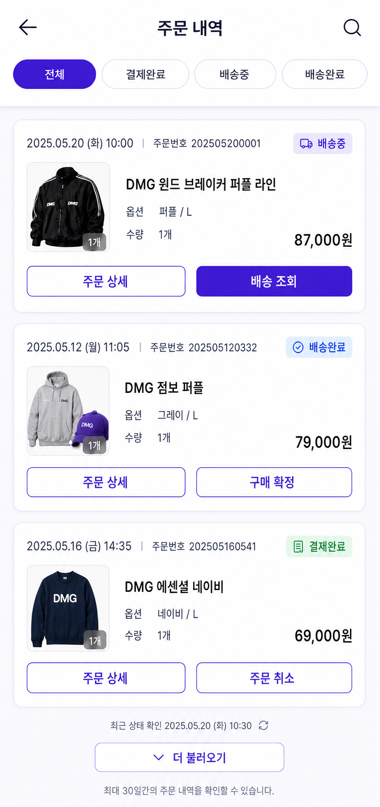
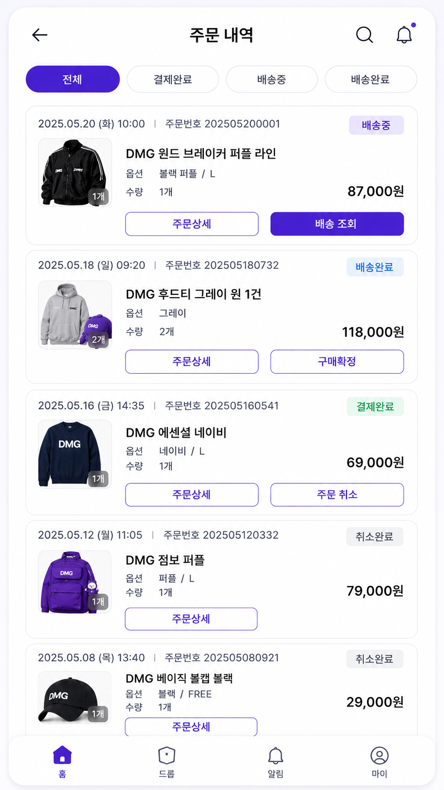
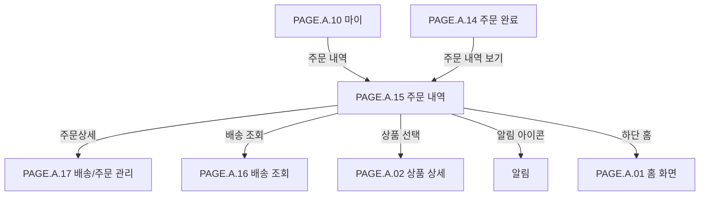

# 주문 내역 페이지

## 페이지 소개

주문 내역 페이지는 구매자가 과거 주문을 상태별로 탐색하고, 각 주문의 상세 정보, 배송 조회, 구매 확정, 주문 취소 같은 후속 행동을 실행하는 화면이다.

한정 드롭 상품은 구매 시점, 주문번호, 옵션, 배송 상태, 구매 확정 여부가 중요하므로 주문 내역은 단순 목록이 아니라 주문 이후 신뢰를 유지하는 사후 관리 화면이다.

## 스크린샷

### 구매자 모바일 웹 시안

### 기존 UI 근거

## 화면 구성

| 영역 | 화면 요소 | 사용자 행동 | 연결 페이지/기능 |
| --- | --- | --- | --- |
| 상단 앱 바 | 뒤로가기, 페이지 제목, 검색, 알림 | 이전 화면 복귀, 주문/상품 검색, 알림 확인 | 이전 화면, 검색, 알림 |
| 상태 필터 탭 | 전체, 결제완료, 배송중, 배송완료 | 주문 상태별 목록 필터링 | 주문 목록 조회 |
| 주문 내역 카드 | 주문일시, 주문번호, 상품 썸네일, 상품명, 옵션, 수량, 가격, 상태 칩 | 주문 정보 확인 | 주문 상세, 상품 상세 |
| 주문 상태 칩 | 배송중, 배송완료, 결제완료, 취소완료 | 주문 상태 확인 | 상태별 후속 행동 |
| 상품 썸네일/수량 배지 | 대표 상품 이미지, 주문 수량 | 주문 상품 빠른 확인 | 상품 상세, 주문 상세 |
| 액션 버튼 | 주문상세, 배송 조회, 구매확정, 주문 취소 | 상태별 후속 행동 실행 | 주문 상세, 배송 조회, 구매 확정, 주문 취소 |
| 하단 내비게이션 | 홈, 드롭, 알림, 마이 탭 | 주요 탭 이동 | 홈, 드롭, 알림, 마이 |

## 연관 사이트맵

## 진입 경로

| 출발 지점 | 진입 조건 | 비고 |
| --- | --- | --- |
| 마이 | 주문 내역 메뉴 선택 | 마이 페이지에서 진입 |
| 주문 완료 | 주문 내역 보기 선택 | 결제 성공 직후 주문 확인 |
| 알림 | 주문/배송 알림 선택 | 특정 주문 상태로 진입 가능 |
| 하단 내비게이션 | 마이 탭 이후 주문 내역 진입 | 전역 내비게이션 흐름 |

## 이동 규칙

| 사용자 행동 | 이동 대상 | 권한/상태 조건 |
| --- | --- | --- |
| 뒤로가기 선택 | 마이 또는 이전 화면 | 진입 경로 기준 복귀 |
| 검색 선택 | 검색 | 상품명 또는 주문번호 검색 가능성 검토 |
| 알림 선택 | 알림 | 로그인 필요 |
| 상태 필터 선택 | 현재 화면 내부 목록 갱신 | 전체/결제완료/배송중/배송완료 |
| 주문상세 선택 | 주문 상세 | 주문 소유자만 조회 가능 |
| 배송 조회 선택 | 배송 조회 | 배송중 또는 배송완료 주문에서 노출 |
| 구매확정 선택 | 구매 확정 | 배송완료 주문에서 노출 |
| 주문 취소 선택 | 주문 취소 | 결제완료 또는 배송준비 전 주문에서 노출 |
| 상품 썸네일/상품명 선택 | 상품 상세 | 판매 종료 상품도 조회 가능 여부 확인 |
| 하단 홈/드롭/알림/마이 선택 | 각 탭 | 전역 내비게이션 규칙 적용 |

## 페이지 데이터

| 데이터 | 설명 | 출처/후속 연결 |
| --- | --- | --- |
| 주문 목록 | 주문별 요약 정보 목록 | 주문 서비스 |
| 주문 식별자 | 주문번호, 주문 ID | 주문 서비스 |
| 주문 일시 | 주문 또는 결제 완료 시각 | 주문/결제 서비스 |
| 주문 상태 | 결제완료, 배송중, 배송완료, 취소완료 | 주문/배송 서비스 |
| 대표 상품 | 상품명, 대표 썸네일, 옵션, 수량, 외 N건 여부 | 주문 상품 스냅샷 |
| 가격 정보 | 주문별 최종 결제 금액 | 주문/결제 서비스 |
| 상태별 액션 | 주문상세, 배송 조회, 구매확정, 주문 취소 가능 여부 | 주문 상태 정책 |
| 필터 상태 | 현재 선택한 주문 상태 필터 | 화면 상태 |
| 알림 상태 | 주문/배송 알림 도트 또는 카운트 | 알림 서비스 |

## 상태와 예외

| 상태 | 화면 처리 | 비고 |
| --- | --- | --- |
| 전체 | 모든 주문을 최신순으로 표시한다. | 기본 필터 |
| 결제완료 | 결제 완료 후 배송 전 주문을 표시한다. | 주문 취소 가능성 있음 |
| 배송중 | 배송 중 주문을 표시하고 배송 조회 CTA를 제공한다. | 배송 조회 강조 |
| 배송완료 | 배송 완료 주문을 표시하고 구매확정 CTA를 제공한다. | 구매확정 정책 필요 |
| 취소완료 | 취소된 주문을 표시하고 주문상세만 제공한다. | 별도 필터 탭 추가 여부 확인 |
| 주문 없음 | 빈 상태 메시지와 드롭 둘러보기 CTA를 표시한다. | 화면 시안 추가 필요 |
| 목록 조회 실패 | 재시도 안내와 이전 화면 복귀를 제공한다. | 네트워크/권한 오류 |
| 상태 변경 지연 | 최신 상태 재조회 또는 새로고침을 제공한다. | 배송 상태 동기화 지연 대응 |

## 후속 페이지 후보

| 후보 Page ID | 페이지 | 상태 | 주문 내역에서의 연결 |
| --- | --- | --- | --- |
| `PAGE.A.01` | [홈 화면](./PAGE_A_01_homepage.md) | 작성 완료 | 하단 홈 |
| `PAGE.A.02` | [상품 상세](./PAGE_A_02_product_detail.md) | 작성 완료 | 상품 썸네일/상품명 |
| `PAGE.A.10` | [마이](./PAGE_A_10_my.md) | 작성 완료 | 뒤로가기 또는 하단 마이 |
| `PAGE.A.14` | [주문 완료](./PAGE_A_14_order_complete.md) | 작성 완료 | 주문 완료 후 진입 |
| `PAGE.A.16` | [배송 조회](./PAGE_A_16_track_order.md) | 작성 완료 | 배송 조회 |
| `PAGE.A.17` | [배송/주문 관리](./PAGE_A_17_shipping_order_manage.md) | 작성 완료 | 주문상세 |

## 연관 요구사항

| Requirements ID | 연결 이유 |
| --- | --- |
| [REQ.A.01](../../00-requirements/REQ_A_01_limited_drop_commerce.md) | 구매 성공 이후 주문 상태, 배송 상태, 구매 확정, 취소 가능 여부와 연결된다. |
| [REQ.A.02](../../00-requirements/REQ_A_02_coupon_benefit.md) | 주문별 최종 결제 금액과 할인 적용 결과를 주문 상세에서 이어서 확인해야 한다. |

## 연관 태그

🏷️ 요구사항 참조: [REQ.A.01](../../00-requirements/REQ_A_01_limited_drop_commerce.md), [REQ.A.02](../../00-requirements/REQ_A_02_coupon_benefit.md) | 플로우 참조: FLOW.A.15 | UI 참조: [UI.A.15](../../20-ui/buyer-mobile-web/UI_A_15_order_history.md) | UC 참조: UC.A.15 | 영속성 참조: PST.A.15 | 서비스 참조: SVC.A.15 | 시나리오 참조: SCN.A.15 | API 참조: API.A.15

## 열린 질문

- 취소완료 상태를 별도 필터 탭으로 둘 것인가, 전체 목록에서만 표시할 것인가?
- 주문 내역 카드에서 여러 상품 주문을 대표 상품 외 N건으로 축약할 것인가?
- 구매확정은 주문 단위로 할 것인가, 상품 단위로 할 것인가?
- 주문 취소 가능 시점은 결제완료까지만 허용할 것인가, 배송준비 전까지 허용할 것인가?
- 주문번호 또는 상품명 검색을 주문 내역 페이지 안에서 직접 제공할 것인가?

## 확인 필요

- 주문 상태 코드와 화면 표시명 매핑
- 상태별 노출 버튼 정책: 배송 조회, 구매확정, 주문 취소
- 주문 내역 기본 정렬 기준과 페이지네이션 방식
- 주문 상품 스냅샷 표시 범위
- 빈 목록 화면과 오류 화면 시안
- 마이 페이지와 주문 내역 사이의 뒤로가기 정책 확정
