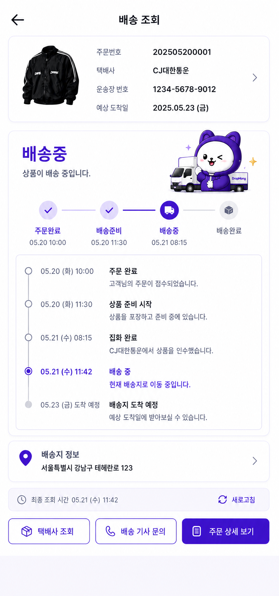
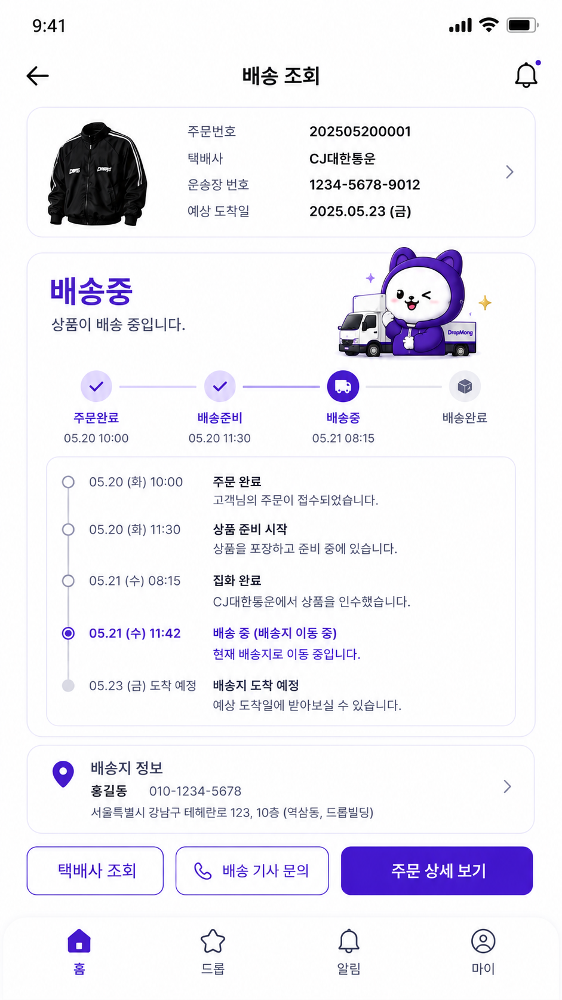
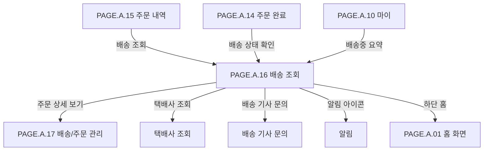

# 배송 조회 페이지

## 페이지 소개

배송 조회 페이지는 구매자가 주문 상품의 배송 상태, 운송장 정보, 예상 도착일, 배송 진행 단계, 배송 타임라인, 배송지 정보를 확인하는 화면이다.

한정 드롭 상품은 구매 성공 이후 실제 수령까지 기대감이 이어지므로 배송 조회는 단순 물류 조회가 아니라 신뢰를 유지하고 배송 불안을 줄이는 사후 경험 화면이다.

## 스크린샷

### 구매자 모바일 웹 시안

### 기존 UI 근거

## 화면 구성

| 영역 | 화면 요소 | 사용자 행동 | 연결 페이지/기능 |
| --- | --- | --- | --- |
| 상단 앱 바 | 뒤로가기, 페이지 제목, 알림 아이콘 | 이전 화면 복귀, 알림 확인 | 주문 내역, 알림 |
| 배송 요약 카드 | 상품 썸네일, 주문번호, 택배사, 운송장 번호, 예상 도착일 | 배송 기본 정보 확인 | 택배사 조회 |
| 배송 상태 헤더 | 현재 배송 상태 문구, 캐릭터 일러스트 | 현재 상태 빠른 확인 | 배송 상태 |
| 배송 진행 스텝 | 주문완료, 배송준비, 배송중, 배송완료 단계 | 단계별 진행 상황 확인 | 배송 상태 |
| 배송 타임라인 | 시간순 배송 이벤트, 현재 단계 강조, 도착 예정 이벤트 | 상세 배송 이력 확인 | 배송 이벤트 |
| 배송지 정보 카드 | 수령인, 연락처, 주소 | 배송지 확인 | 배송지 상세 |
| 하단 액션 버튼 | 택배사 조회, 배송 기사 문의, 주문 상세 보기 | 외부 배송 조회, 전화 문의, 주문 상세 이동 | 택배사, 전화, 주문 상세 |
| 하단 내비게이션 | 홈, 드롭, 알림, 마이 | 주요 탭 이동 | 홈, 드롭, 알림, 마이 |

## 연관 사이트맵

## 진입 경로

| 출발 지점 | 진입 조건 | 비고 |
| --- | --- | --- |
| 주문 내역 | 배송 조회 버튼 선택 | 배송중 또는 배송완료 주문에서 진입 |
| 주문 완료 | 배송 상태 확인 또는 배송 조회 선택 | 주문 직후 배송 상태 확인 |
| 마이 | 배송중 요약 선택 | 배송중 주문 목록 또는 대표 배송으로 이동 |
| 알림 | 배송 상태 알림 선택 | 특정 배송 이벤트로 진입 가능 |

## 이동 규칙

| 사용자 행동 | 이동 대상 | 권한/상태 조건 |
| --- | --- | --- |
| 뒤로가기 선택 | 주문 내역 또는 이전 화면 | 진입 경로 기준 복귀 |
| 알림 아이콘 선택 | 알림 | 로그인 필요 |
| 배송 요약 카드 선택 | 택배사 조회 또는 주문 상세 | 운송장 번호가 있어야 함 |
| 택배사 조회 선택 | 택배사 외부 조회 | 택배사, 운송장 번호 필요 |
| 배송 기사 문의 선택 | 전화 앱 또는 문의 안내 | 연락처 제공 가능 상태 |
| 주문 상세 보기 선택 | 주문 상세 | 주문 소유자만 조회 가능 |
| 배송지 정보 선택 | 배송지 상세 또는 주문 상세 | 출고 이후 수정 불가 가능 |
| 하단 홈/드롭/알림/마이 선택 | 각 탭 | 전역 내비게이션 규칙 적용 |

## 페이지 데이터

| 데이터 | 설명 | 출처/후속 연결 |
| --- | --- | --- |
| 주문 식별자 | 주문번호, 주문 ID | 주문 서비스 |
| 배송 식별자 | 배송 ID, 운송장 번호 | 배송 서비스 |
| 택배사 정보 | 택배사명, 택배사 코드, 외부 조회 URL | 배송/택배 연동 |
| 대표 상품 | 상품 썸네일, 상품명 | 주문 상품 스냅샷 |
| 배송 상태 | 주문완료, 배송준비, 배송중, 배송완료, 도착 예정 | 배송 서비스 |
| 예상 도착일 | 배송 예정 날짜 | 택배사/배송 서비스 |
| 진행 스텝 | 단계별 완료 여부와 완료 시각 | 배송 상태 이력 |
| 배송 타임라인 | 이벤트 시각, 제목, 설명, 현재 이벤트 여부 | 배송 이벤트 로그 |
| 배송지 정보 | 수령인, 연락처, 주소 | 주문 배송지 스냅샷 |
| 연락처 정보 | 배송 기사 문의 가능 번호 또는 안내 상태 | 택배사/배송 서비스 |

## 상태와 예외

| 상태 | 화면 처리 | 비고 |
| --- | --- | --- |
| 주문완료 | 주문 접수 상태와 배송준비 전 안내를 표시한다. | 운송장 없을 수 있음 |
| 배송준비 | 상품 포장/출고 준비 상태를 표시한다. | 배송 기사 문의 비활성 가능 |
| 배송중 | 현재 배송중 상태를 강조하고 타임라인 현재 이벤트를 표시한다. | 기본 시안 상태 |
| 배송완료 | 배송 완료 스텝과 완료 시간을 표시한다. | 구매확정 연결 가능 |
| 도착 예정 | 예상 도착일 이벤트를 타임라인 마지막에 표시한다. | 실제 완료 전 상태 |
| 운송장 없음 | 택배사 조회 버튼을 비활성화하거나 준비 중으로 표시한다. | 배송준비 단계 |
| 배송 이력 없음 | 배송 상태 헤더와 안내 문구를 우선 표시한다. | 택배사 연동 지연 |
| 배송 조회 실패 | 재시도 안내와 주문 상세 이동을 제공한다. | 외부 택배사 장애 가능 |

## 후속 페이지 후보

| 후보 Page ID | 페이지 | 상태 | 배송 조회에서의 연결 |
| --- | --- | --- | --- |
| `PAGE.A.01` | [홈 화면](./PAGE_A_01_homepage.md) | 작성 완료 | 하단 홈 |
| `PAGE.A.10` | [마이](./PAGE_A_10_my.md) | 작성 완료 | 하단 마이, 배송중 요약 |
| `PAGE.A.14` | [주문 완료](./PAGE_A_14_order_complete.md) | 작성 완료 | 주문 완료 후 배송 상태 확인 |
| `PAGE.A.15` | [주문 내역](./PAGE_A_15_order_history.md) | 작성 완료 | 뒤로가기, 배송 조회 진입 |
| `PAGE.A.17` | [배송/주문 관리](./PAGE_A_17_shipping_order_manage.md) | 작성 완료 | 주문 상세 보기 |

## 연관 요구사항

| Requirements ID | 연결 이유 |
| --- | --- |
| [REQ.A.01](../../00-requirements/REQ_A_01_limited_drop_commerce.md) | 주문 성공 이후 배송 상태, 주문 상세, 구매 확정 전 배송 추적과 연결된다. |

## 연관 태그

🏷️ 요구사항 참조: [REQ.A.01](../../00-requirements/REQ_A_01_limited_drop_commerce.md) | 플로우 참조: FLOW.A.16 | UI 참조: [UI.A.16](../../20-ui/buyer-mobile-web/UI_A_16_track_order.md) | UC 참조: UC.A.16 | 영속성 참조: PST.A.16 | 서비스 참조: SVC.A.16 | 시나리오 참조: SCN.A.16 | API 참조: API.A.16

## 열린 질문

- 택배사 조회는 앱 내부 웹뷰로 열 것인가, 외부 브라우저로 열 것인가?
- 배송 기사 문의 버튼은 실제 전화 연결을 제공할 것인가, 택배사 고객센터 안내로 대체할 것인가?
- 배송 타임라인은 택배사 원문 이벤트를 그대로 보여줄 것인가, DropMong 표준 문구로 정규화할 것인가?
- 배송지 정보에서 주소 변경을 허용할 것인가, 조회만 허용할 것인가?
- 배송완료 상태에서 구매확정 CTA를 함께 노출할 것인가?

## 확인 필요

- 배송 상태 코드와 화면 표시명 매핑
- 택배사 연동 API와 운송장 조회 실패 처리
- 배송 이벤트 타임라인 정렬 기준과 현재 이벤트 판정
- 예상 도착일 계산 출처
- 배송 기사 문의 가능 조건과 개인정보 노출 범위
- 배송/주문 관리와 별도 주문 상세 분리 여부 확정
