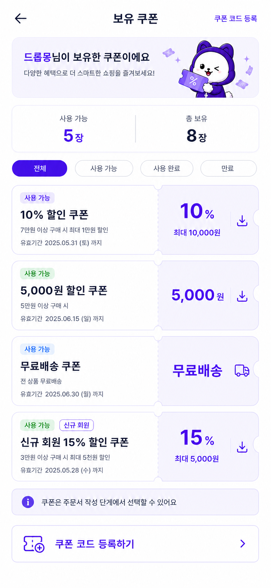
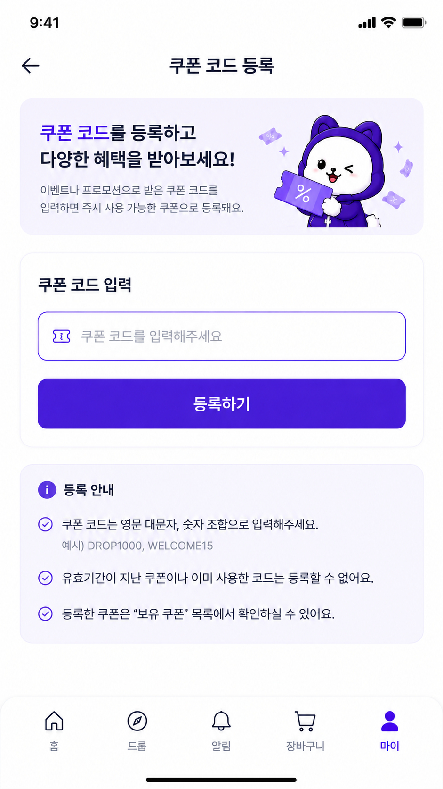
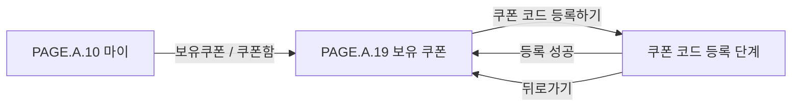

# 보유 쿠폰 페이지 그룹

## 문서 역할

이 문서는 구매자가 마이 페이지에서 보유 쿠폰을 확인하고, 이벤트나 프로모션으로 받은 쿠폰 코드를 등록하는 과정을 한 페이지 문서로 찾아가기 위한 인덱스다.

## 포함 문서

| Page ID | 페이지 | 경로 | 역할 |
| --- | --- | --- | --- |
| [PAGE.A.19](./PAGE_A_19_owned_coupon.md) | 보유 쿠폰 | /my/coupons, /my/coupons/register | 사용 가능, 사용 완료, 만료 쿠폰을 조회하고 쿠폰 코드를 등록하는 화면 묶음 |

## 화면 미리보기

### 구매자 모바일 웹 시안

### 기존 UI 근거

  <figure style="min-width: 180px; margin: 0;"><figcaption>PAGE.A.19 보유 쿠폰</figcaption></figure>
  <figure style="min-width: 180px; margin: 0;"><figcaption>PAGE.A.19 쿠폰 코드 등록</figcaption></figure>
  <figure style="min-width: 300px; margin: 0;"><figcaption>UI.A.19 컴포넌트 시트</figcaption></figure>

## 대표 Flow

## 연관 태그

🏷️ 요구사항 참조: [REQ.A.02](../../../00-requirements/REQ_A_02_coupon_benefit.md) | 페이지 참조: [PAGE.A.10](../PAGE_A_10_my.md), [PAGE.A.19](./PAGE_A_19_owned_coupon.md) | UI 참조: [UI.A.19](../../../20-ui/buyer-mobile-web/UI_A_19_coupon_wallet/UI_A_19_coupon_wallet.md) | UC 참조: [UC.A.19](../../../30-uc/UC_A_19_coupon_wallet.md) | 영속성 참조: PST.A.19 예정 | 서비스 참조: SVC.A.19 예정 | 시나리오 참조: SCN.A.19 예정 | API 참조: API.A.19 예정

## 확인 필요

- 쿠폰 코드 등록 성공 후 토스트만 표시할지, 보유 쿠폰 목록 상단으로 이동할지 결정한다.
- 쿠폰 코드 대소문자 정규화, 하이픈/공백 허용 여부, 실패 횟수 제한 정책을 정한다.
- 쿠폰 다운로드 아이콘이 실제 다운로드 액션인지, 쿠폰 상세/적용 안내 액션인지 확인한다.
