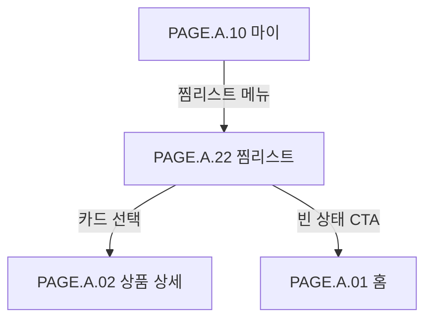

# 찜리스트 페이지

## 페이지 소개

찜리스트 페이지는 구매자가 마이 페이지에서 진입해, 상품 상세·랭킹 카드·추천 카드 어디서 찜(관심 등록)했든 상관없이 자신이 찜한 드롭을 한곳에 모아 확인하는 화면이다.

목록은 항상 현재 찜 상태(`ACTIVE`)인 드롭만 보여준다. 찜을 해제하면 그 즉시 목록에서 빠지며, 별도의 "해제한 찜 보기" 같은 상태 필터는 두지 않는다 — `UC.A.07-02`가 정의하는 사용자 목표가 "내가 지금 찜하고 있는 드롭 확인"으로 좁혀져 있고, `interest-service`의 `GET /v1/users/me/interests`(`API.A.07-03`) 응답 자체가 활성 찜만 반환하기 때문이다.

이 화면에서 찜을 해제하는 행동도 다시 같은 토글 API를 호출하는 것이므로, 상품 상세의 하트 버튼과 동일한 백엔드 동작이다.

## 스크린샷

### 구매자 모바일 웹 시안

[인터랙티브 버전(Artifact, 하트 탭으로 찜 해제 동작 확인 가능)](https://claude.ai/code/artifact/3a8b83b5-94f5-4bfb-88cb-d9108684c203)

> 이 페이지는 원본 참고 스크린샷 자산(디자인팀이 만든 png)이 없다. `UI_A_01`/`UI_A_02`/`UI_A_10`처럼 기존 시안 이미지에서 출발한 다른 페이지와 달리, 찜리스트는 `PAGE.A.22`/`UI.A.22` 자체가 이번에 처음 채워지는 문서라서다. 위 이미지는 `UI_A_10_my` 컴포넌트 시트에 실제로 라벨링된 공식 컬러 토큰 8종과 마스코트를 재사용하고, 화면 구조는 `UI_A_19_coupon_wallet`(보유 쿠폰 페이지)의 실제 레이아웃 순서를 그대로 따라 직접 작성한 HTML을 Playwright 헤드리스 브라우저로 캡처한 것이다 — 근거는 `UI.A.22` 문서의 "에셋 제작 근거" 참고.

## 연관 사이트맵

[PAGE.A.10](../PAGE_A_10_my.md) [PAGE.A.02](../PAGE_A_02_product_detail.md) [PAGE.A.01](../PAGE_A_01_homepage.md)

## 화면 구성

| 영역 | 화면 요소 | 사용자 행동 | 연결 페이지/기능 |
| --- | --- | --- | --- |
| 상단 앱 바 | 뒤로가기, 페이지 제목("찜리스트"), 찜 개수 | 마이로 복귀, 현재 찜 개수 확인 | [PAGE.A.10](../PAGE_A_10_my.md) |
| 찜 카드 | 상품 썸네일, 드롭 상태 배지(D-day/LIMITED/ONLY/품절 등), 브랜드명, 상품명, 가격, 찜 해제(채워진 하트) 버튼 | 상품 상세 이동, 찜 해제 | [PAGE.A.02](../PAGE_A_02_product_detail.md), 찜 해제 |
| 빈 상태 | 안내 문구, 드롭 구경하러 가기 CTA | 홈으로 이동해 찜할 드롭 탐색 | [PAGE.A.01](../PAGE_A_01_homepage.md) |

## 진입 경로

| 출발 지점 | 진입 조건 | 비고 |
| --- | --- | --- |
| [PAGE.A.10 마이](../PAGE_A_10_my.md) | 전체 메뉴 그리드의 찜리스트 메뉴 선택 | 로그인 필요 |

## 이동 규칙

| 사용자 행동 | 이동 대상 | 권한/상태 조건 |
| --- | --- | --- |
| 뒤로가기 선택 | [PAGE.A.10 마이](../PAGE_A_10_my.md) | 로그인 상태 유지 |
| 찜 카드 선택(썸네일/상품명 영역) | [PAGE.A.02 상품 상세](../PAGE_A_02_product_detail.md) | 해당 드롭의 상품 상세로 이동 |
| 하트 버튼 선택 | 현재 화면 내부 상태 변경 | 찜 해제, 카드가 목록에서 즉시 제거됨(되돌리기 없음) |
| 빈 상태 CTA 선택 | [PAGE.A.01 홈](../PAGE_A_01_homepage.md) | 로그인 필요 |

## 페이지 데이터

| 데이터 | 설명 | 출처/후속 연결 |
| --- | --- | --- |
| 찜 목록 | 찜한 드롭 ID, 찜 등록 시각, 커서 페이지네이션 | `interest-service` `GET /v1/users/me/interests`(`API.A.07-03`) |
| 드롭 표시 정보 | 상품 썸네일, 브랜드명, 상품명, 가격, D-day, LIMITED/ONLY 배지, 품절 여부 | `catalog-service`(interest-service 응답엔 없음 — 화면 조합 시점에 별도로 불러와야 함) |
| 찜 개수 | 앱 바에 표시할 총 찜 개수 | 찜 목록 응답의 페이지 정보 또는 개수 |

## 상태와 예외

| 상태 | 화면 처리 | 비고 |
| --- | --- | --- |
| 찜한 드롭 있음 | 카드 목록을 표시한다. | 기본 상태 |
| 찜한 드롭 없음 | 빈 상태와 드롭 구경하러 가기 CTA를 표시한다. | 최초 가입 직후에도 동일 |
| 찜 해제 성공 | 해당 카드를 목록에서 즉시 제거한다. | 서버 응답(204) 확인 후 반영, 낙관적 업데이트 여부는 확인 필요 |
| 찜 해제 중 통신 실패 | 카드를 유지하고 실패 안내를 표시한다. | 재시도 가능해야 함 |
| 목록 조회 실패 | 재시도 CTA와 일시 실패 안내를 표시한다. | 로그인 유지 상태에서의 일시 오류 |
| 카탈로그 정보 조회 실패(일부 드롭) | 해당 카드만 최소 정보(썸네일/이름 없이)로 표시하거나 스켈레톤 유지 | interest-service와 catalog-service 응답을 조합하는 화면이라 부분 실패 가능 |
| 세션 만료 | 로그인 화면으로 이동하고 복귀 의도를 보존한다. | 인증 게이트 |

## 연관 요구사항

| Requirements ID | 연결 이유 |
| --- | --- |
| [REQ.A.07.FR-002](../../00-requirements/REQ_A_07_interest_ranking.md) | 사용자는 자신의 찜 목록을 조회한다. |
| [REQ.A.07.FR-001](../../00-requirements/REQ_A_07_interest_ranking.md) | 찜리스트에서의 찜 해제도 드롭 상세와 동일한 찜 추가/해제 토글 동작을 사용한다. |

## 연관 태그

🏷️ 요구사항 참조: [REQ.A.07](../../00-requirements/REQ_A_07_interest_ranking.md) | 플로우 참조: FLOW.A.07 | UI 참조: [UI.A.22](../../20-ui/buyer-mobile-web/UI_A_22_wishlist.md) | UC 참조: [UC.A.07-02](../../30-uc/UC_A_07_interest_ranking.md) | 영속성 참조: [PST.A.0720](../../50-service-design/A_07_interest_ranking/A_07_20-persistence/persistence-design.md) | 서비스 참조: [SD.A.0730](../../50-service-design/A_07_interest_ranking/A_07_30-service/service-design.md) | 시나리오 참조: SCN.A.07 예정 | API 참조: [API.A.07-03](../../50-service-design/A_07_interest_ranking/A_07_40-api/openapi/paths/API_A_07_03_list_my_interests.yaml)

## 확인 필요

- 찜 해제를 낙관적 업데이트(즉시 카드 제거 후 실패 시 롤백)로 할지, 서버 응답을 기다린 뒤 제거할지 정한다. 이 목업은 전자를 가정했다.
- 찜 목록과 카탈로그 표시 정보(썸네일/가격/배지)를 화면에서 조합하는 방식 — BFF에서 합칠지, 프론트에서 두 API를 각각 불러와 합칠지 정한다. `interest-service` 자체는 드롭 표시 정보를 갖고 있지 않다.
- 찜한 드롭이 이미 품절/종료된 경우 카드에 어떤 상태 배지와 문구를 보여줄지 정한다(이 목업은 "품절" 배지로 임시 처리).
- 목록 정렬 기준(찜한 최신순 vs 드롭 오픈 임박순)을 정한다. 현재 API는 `dropId` 기준 커서만 제공한다.
- 페이지당 개수/무한 스크롤 여부를 정한다.
