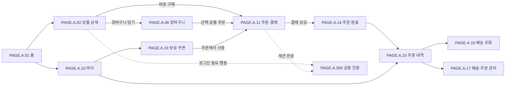

# 구매자 모바일 웹앱 사이트맵

## 문서 역할

구매자가 모바일 브라우저에서 드롭을 발견하고 주문 결과와 배송 상태를 확인할 때까지 사용하는 페이지를 한곳에서 찾기 위한 클라이언트 인덱스다. 같은 URL과 기능을 데스크톱에서도 제공하되, 이 폴더의 페이지 문서는 모바일 웹을 우선 기준으로 작성한다.

전용 네이티브 앱, 앱스토어 배포, 기기 전용 API는 현재 범위가 아니다. 공용 인증 페이지는 다른 클라이언트도 사용할 수 있으므로 상위 폴더에 유지한다.

## 페이지 목록

| Page ID | 경로 | 페이지 | 인증 기준 | UI |
| --- | --- | --- | --- | --- |
| [PAGE.A.01](PAGE_A_01_homepage.md) | `/` | 홈 | 공개, 개인화 영역만 선택 인증 | [UI.A.01](../../20-ui/buyer-mobile-web/UI_A_01_homepage.md) |
| [PAGE.A.02](PAGE_A_02_product_detail.md) | `/products/{productId}` | 상품 상세 | 조회 공개, 개인 행동은 로그인 필요 | [UI.A.02](../../20-ui/buyer-mobile-web/UI_A_02_product_detail.md) |
| [PAGE.A.06](PAGE_A_06_shopping_cart.md) | `/cart` | 장바구니 | 로그인 필요 | [UI.A.06](../../20-ui/buyer-mobile-web/UI_A_06_shopping_cart.md) |
| [PAGE.A.10](PAGE_A_10_my.md) | `/my` | 마이 | 로그인 필요 | [UI.A.10](../../20-ui/buyer-mobile-web/UI_A_10_my.md) |
| [PAGE.A.11](PAGE_A_11_payment.md) | `/checkout` | 주문·결제 | 로그인과 재검증 필요 | [UI.A.11](../../20-ui/buyer-mobile-web/UI_A_11_payment.md) |
| [PAGE.A.14](PAGE_A_14_order_complete.md) | `/orders/complete` | 주문 완료 | 로그인 필요 | [UI.A.14](../../20-ui/buyer-mobile-web/UI_A_14_order_complete.md) |
| [PAGE.A.15](PAGE_A_15_order_history.md) | `/orders` | 주문 내역 | 로그인 필요 | [UI.A.15](../../20-ui/buyer-mobile-web/UI_A_15_order_history.md) |
| [PAGE.A.16](PAGE_A_16_track_order.md) | `/orders/:orderId/tracking` | 배송 조회 | 주문 소유자 확인 | [UI.A.16](../../20-ui/buyer-mobile-web/UI_A_16_track_order.md) |
| [PAGE.A.17](PAGE_A_17_shipping_order_manage.md) | `/orders/:orderId/manage` | 배송·주문 관리 | 주문 소유자 확인 | [UI.A.17](../../20-ui/buyer-mobile-web/UI_A_17_shipping_order_manage.md) |
| [PAGE.A.19](PAGE_A_19_coupon_wallet/README.md) | `/my/coupons` | 보유 쿠폰·코드 등록 | 로그인 필요 | [UI.A.19](../../20-ui/buyer-mobile-web/UI_A_19_coupon_wallet/UI_A_19_coupon_wallet.md) |
| [PAGE.A.22](PAGE_A_22_wishlist.md) | `/my/wishlist` | 찜리스트 | 로그인 필요 | [UI.A.22](../../20-ui/buyer-mobile-web/UI_A_22_wishlist.md) |

## 핵심 사용자 여정

## 반응형 기준

| 구간 | 기준 | 적용 원칙 |
| --- | --- | --- |
| 모바일 | `375~767px` | 한 열, 하단 핵심 행동 고정, 최소 터치 영역 `44px`, 본문 최소 `16px` |
| 태블릿 | `768~1023px` | 한 열 또는 보조 정보가 있는 두 열, 과도한 가로 확장 금지 |
| 데스크톱 | `1024px 이상` | 같은 URL과 업무 규칙 유지, 콘텐츠 최대 너비와 보조 패널 사용 |

## 구현 우선순위

| 우선순위 | 페이지 | 이유 |
| --- | --- | --- |
| 1 | `PAGE.A.01 → 02 → 11 → 14` | 드롭 발견부터 주문 결과까지 핵심 시연을 완성한다. |
| 2 | `PAGE.A.15 → 16 → 17` | 비동기 주문·배송 상태와 장애 복구 상태를 보여준다. |
| 3 | `PAGE.A.06`, `PAGE.A.10`, `PAGE.A.19` | 장바구니와 개인 허브, 쿠폰 확장 범위를 보완한다. |

## 연관 태그

🏷️ 요구사항 참조: [REQ.A.01](../../00-requirements/REQ_A_01_limited_drop_commerce.md), [REQ.A.02](../../00-requirements/REQ_A_02_coupon_benefit.md), [REQ.A.05](../../00-requirements/REQ_A_05_auth_member.md), [REQ.A.08](../../00-requirements/REQ_A_08_web_application.md) | UI 참조: [구매자 모바일 웹앱 UI](../../20-ui/buyer-mobile-web/README.md) | 웹 애플리케이션 참조: [WEB 설계](../../60-web-application/README.md)
