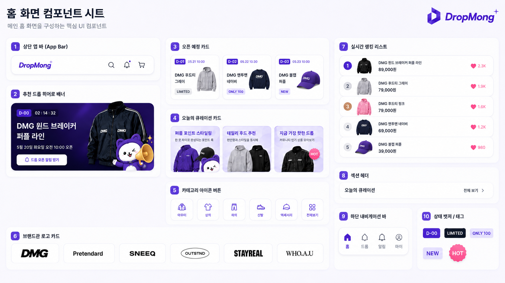

# 홈 화면 UI

## 기본 정보

- UI ID: `UI.A.01`
- 연관 Page: [PAGE.A.01](../10-sitemap/PAGE_A_01_homepage.md)
- 에셋 유형: 화면 이미지, 컴포넌트 시트
- 파일 경로:
  - [홈 화면](assets/UI_A_01_homepage/UI_A_01_01_homepage.png)
  - [홈 화면 컴포넌트 시트](assets/UI_A_01_homepage/UI_A_01_02_hompage_component.png)
- 원본 URL: local
- 캡처 일시: 2026-07-07
- 캡처 조건: DropMong 메인 홈, 추천 드롭/오픈 예정/큐레이션/카테고리/브랜드관/실시간 랭킹 노출

## 연관 태그

🏷️ 요구사항 참조: [REQ.A.01](../00-requirements/REQ_A_01_limited_drop_commerce.md) | 페이지 참조: [PAGE.A.01](../10-sitemap/PAGE_A_01_homepage.md) | UC 참조: UC.A.01 | 영속성 참조: PST.A.01 | 서비스 참조: SVC.A.01 | 시나리오 참조: SCN.A.01 | API 참조: API.A.01

## 에셋

### 홈 화면

### 컴포넌트 시트

## 화면 구성

| 번호 | 컴포넌트 | 역할 | 주요 상태/행동 |
| --- | --- | --- | --- |
| 1 | 상단 앱 바 | 로고, 검색, 알림, 장바구니 진입을 제공한다. | 검색 이동, 알림함 이동, 장바구니 배지 |
| 2 | 추천 드롭 히어로 배너 | 홈에서 가장 중요한 드롭을 크게 노출하고 오픈 알림 신청을 유도한다. | D-day, 카운트다운, 알림 신청 |
| 3 | 오픈 예정 카드 | 곧 열릴 드롭을 카드 형태로 보여준다. | 오픈 일시, 배지, 상품 상세 이동 |
| 4 | 오늘의 큐레이션 카드 | 운영자가 편성한 테마형 탐색 콘텐츠를 보여준다. | 큐레이션 목록 또는 상품 상세 이동 |
| 5 | 카테고리 아이콘 버튼 | 주요 상품 카테고리로 빠르게 이동한다. | 카테고리 필터 이동, 전체보기 |
| 6 | 브랜드관 로고 카드 | 판매자/브랜드별 탐색 진입점을 제공한다. | 브랜드 상세 또는 브랜드 드롭 목록 이동 |
| 7 | 실시간 랭킹 리스트 | 인기 상품 순위를 리스트로 보여준다. | 상품 상세 이동, 관심 수 표시 |
| 8 | 섹션 헤더 | 각 섹션 제목과 전체 보기 이동을 제공한다. | 전체 보기 이동 |
| 9 | 하단 내비게이션 바 | 홈, 드롭, 알림, 마이 주요 탭 이동을 제공한다. | 탭 선택, 활성 탭 표시 |
| 10 | 상태 배지/태그 | D-day, LIMITED, ONLY 100, NEW, HOT 같은 상태를 짧게 보여준다. | 상품/드롭 상태 강조 |

## 화면에 필요한 정보

| 화면 영역 | 필드 | 타입 | 용도 |
| --- | --- | --- | --- |
| 상단 앱 바 | `cartItemCount` | number | 장바구니 배지 표시 |
| 상단 앱 바 | `unreadNotificationCount` | number | 알림 배지 표시 |
| 추천 드롭 | `featuredDrop.id` | string | 상품 상세 또는 드롭 상세 이동 |
| 추천 드롭 | `featuredDrop.title` | string | 추천 드롭 제목 표시 |
| 추천 드롭 | `featuredDrop.openAt` | datetime | 오픈 시각 표시 |
| 추천 드롭 | `featuredDrop.dDay` | string | D-day 배지 표시 |
| 추천 드롭 | `featuredDrop.countdown` | string | 남은 시간 표시 |
| 추천 드롭 | `featuredDrop.imageUrl` | image | 대표 이미지 표시 |
| 추천 드롭 | `featuredDrop.isNotificationSubscribed` | boolean | 알림 신청 상태 표시 |
| 오픈 예정 | `upcomingDrops[]` | object[] | 오픈 예정 카드 목록 표시 |
| 큐레이션 | `curations[]` | object[] | 큐레이션 카드 목록 표시 |
| 카테고리 | `categories[]` | object[] | 카테고리 아이콘 버튼 표시 |
| 브랜드관 | `brandCards[]` | object[] | 판매자/브랜드 로고 카드 표시 |
| 실시간 랭킹 | `rankingItems[]` | object[] | 실시간 랭킹 리스트 표시 |
| 실시간 랭킹 | `rankingItems[].rank` | number | 순위 표시 |
| 실시간 랭킹 | `rankingItems[].favoriteCount` | number | 관심 수 표시 |
| 상태 배지 | `badges[]` | string[] | LIMITED, ONLY, NEW, HOT 표시 |

## 화면에서 확인한 행동

- 사용자는 홈에서 추천 드롭의 오픈 시간과 카운트다운을 확인한다.
- 사용자는 추천 드롭의 오픈 알림을 신청할 수 있다.
- 사용자는 오픈 예정 카드, 큐레이션 카드, 랭킹 상품을 선택해 상품 상세로 이동한다.
- 사용자는 카테고리 아이콘을 통해 카테고리 탐색으로 이동한다.
- 사용자는 브랜드 로고를 통해 판매자/브랜드별 탐색으로 이동한다.
- 사용자는 섹션 헤더의 전체 보기를 통해 목록 화면으로 이동한다.
- 사용자는 하단 내비게이션으로 홈, 드롭, 알림, 마이 탭을 이동한다.

## 설계 반영 사항

- Read Model 후보: `RM.A.01 HomeReadModel`
- Command 후보: `CMD.A.01.SubscribeDropNotification`, `CMD.A.02.ToggleFavoriteProduct`
- Error 후보: `ERR.A.01.LOGIN_REQUIRED`, `ERR.A.02.DROP_NOT_FOUND`, `ERR.A.03.NOTIFICATION_ALREADY_SUBSCRIBED`
- 권한 후보: 홈/상품 탐색은 비회원 조회 가능, 알림/마이/장바구니는 로그인 필요 가능

## 확인 필요

- 추천 드롭 편성 기준: 운영자 수동 편성, 랭킹 기반, 개인화 기반 중 선택
- 홈에서 표시할 오픈 예정 카드 개수와 정렬 기준
- 큐레이션 카드가 상품 상세로 바로 이동할지 큐레이션 목록으로 이동할지 여부
- 브랜드관의 브랜드가 판매자 표시명인지 별도 브랜드 엔티티인지 여부
- 실시간 랭킹 산정 기준과 갱신 주기
- 비회원이 알림 신청을 눌렀을 때 로그인 후 의도를 이어갈지 여부
