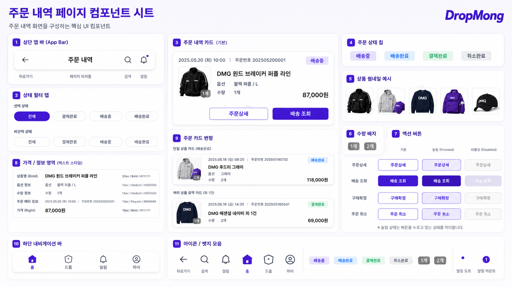

# 주문 내역 페이지 UI

## 기본 정보

- UI ID: `UI.A.15`
- 연관 Page: [PAGE.A.15](../10-sitemap/PAGE_A_15_order_history.md)
- 에셋 유형: 화면 이미지, 컴포넌트 시트
- 파일 경로:
  - [주문 내역 페이지](assets/UI_A_15_order_history/UI_A_15_01_order_history.png)
  - [주문 내역 페이지 컴포넌트 시트](assets/UI_A_15_order_history/UI_A_15_02_order_history_component.png)
- 원본 URL: local
- 캡처 일시: 2026-07-07
- 캡처 조건: DropMong 주문 내역, 전체/상태 필터, 주문 카드, 배송 조회, 구매확정, 주문 취소 액션 상태

## 연관 태그

🏷️ 요구사항 참조: [REQ.A.01](../00-requirements/REQ_A_01_limited_drop_commerce.md), [REQ.A.02](../00-requirements/REQ_A_02_coupon_benefit.md) | 페이지 참조: [PAGE.A.15](../10-sitemap/PAGE_A_15_order_history.md) | UC 참조: UC.A.15 | 영속성 참조: PST.A.15 | 서비스 참조: SVC.A.15 | 시나리오 참조: SCN.A.15 | API 참조: API.A.15

## 에셋

### 주문 내역 페이지

### 컴포넌트 시트

## 화면 구성

| 번호 | 컴포넌트 | 역할 | 주요 상태/행동 |
| --- | --- | --- | --- |
| 1 | 상단 앱 바 | 뒤로가기, 페이지 제목, 검색, 알림을 제공한다. | 뒤로가기, 검색, 알림 |
| 2 | 상태 필터 탭 | 전체, 결제완료, 배송중, 배송완료 목록 필터를 제공한다. | 선택됨, 선택 안 됨 |
| 3 | 주문 내역 카드 기본형 | 주문 메타, 상품 정보, 상태, 금액, 액션을 한 카드에 보여준다. | 주문상세, 배송 조회 |
| 4 | 주문 상태 칩 | 배송중, 배송완료, 결제완료, 취소완료 상태를 표시한다. | 상태별 색상 표시 |
| 5 | 상품 썸네일 예시 | 주문 상품의 대표 이미지를 보여준다. | 대표 상품, 여러 상품 |
| 6 | 수량 배지 | 대표 상품 이미지 위에 수량을 겹쳐 표시한다. | 1개, 2개 |
| 7 | 액션 버튼 | 주문상세, 배송 조회, 구매확정, 주문 취소 버튼 상태를 정의한다. | 기본, 눌림, 비활성 |
| 8 | 가격/정보 영역 | 상품명, 옵션, 수량, 주문 메타, 가격 텍스트 스타일을 정의한다. | 텍스트 계층 |
| 9 | 주문 카드 변형 | 단일 상품, 여러 상품 요약 카드의 축약 형태를 보여준다. | 배송완료, 결제완료 |
| 10 | 하단 내비게이션 바 | 홈, 드롭, 알림, 마이 탭을 제공한다. | 탭 이동 |
| 11 | 아이콘/배지 모음 | 뒤로가기, 검색, 알림, 홈, 드롭, 마이, 상태 칩, 수량 배지, 알림 도트를 정의한다. | 아이콘 상태 |

## 화면에 필요한 정보

| 화면 영역 | 필드 | 타입 | 용도 |
| --- | --- | --- | --- |
| 주문 목록 | `orders[]` | object[] | 주문 카드 목록 표시 |
| 주문 목록 | `selectedStatusFilter` | enum | 현재 필터 상태 표시 |
| 주문 카드 | `orders[].orderId` | string | 주문 식별 |
| 주문 카드 | `orders[].orderNumber` | string | 주문번호 표시 |
| 주문 카드 | `orders[].orderedAt` | datetime | 주문일시 표시 |
| 주문 카드 | `orders[].status` | enum | 결제완료, 배송중, 배송완료, 취소완료 |
| 주문 카드 | `orders[].statusLabel` | string | 상태 칩 문구 표시 |
| 주문 카드 | `orders[].representativeProductId` | string | 대표 상품 상세 연결 |
| 주문 카드 | `orders[].representativeProductName` | string | 대표 상품명 표시 |
| 주문 카드 | `orders[].thumbnailUrl` | image | 대표 상품 이미지 표시 |
| 주문 카드 | `orders[].optionLabel` | string | 대표 상품 옵션 표시 |
| 주문 카드 | `orders[].quantityLabel` | string | 수량 또는 외 N건 표시 |
| 주문 카드 | `orders[].totalQuantity` | number | 수량 배지 표시 |
| 주문 카드 | `orders[].finalPaymentAmount` | number | 주문별 결제 금액 표시 |
| 액션 | `orders[].actions.canViewDetail` | boolean | 주문상세 버튼 활성 |
| 액션 | `orders[].actions.canTrackDelivery` | boolean | 배송 조회 버튼 활성 |
| 액션 | `orders[].actions.canConfirmPurchase` | boolean | 구매확정 버튼 활성 |
| 액션 | `orders[].actions.canCancelOrder` | boolean | 주문 취소 버튼 활성 |
| 알림 | `notification.hasUnread` | boolean | 알림 도트 표시 |
| 목록 | `pagination.cursor` | string? | 다음 목록 조회 |
| 목록 | `emptyState.reason` | string? | 빈 목록 안내 |

## 화면에서 확인한 행동

- 사용자는 전체, 결제완료, 배송중, 배송완료 필터로 주문을 좁혀 본다.
- 사용자는 주문일시와 주문번호로 주문을 식별한다.
- 사용자는 주문 카드에서 대표 상품, 옵션, 수량, 결제 금액을 확인한다.
- 사용자는 배송중 주문에서 배송 조회를 실행한다.
- 사용자는 배송완료 주문에서 구매확정을 실행한다.
- 사용자는 결제완료 주문에서 주문 취소를 실행할 수 있다.
- 사용자는 취소완료 주문에서 주문상세만 확인한다.

## 설계 반영 사항

- Read Model 후보: `RM.A.15 OrderHistoryReadModel`
- Query 후보: `QRY.A.15.ListOrders`, `QRY.A.16.FilterOrdersByStatus`
- Command 후보: `CMD.A.23.ViewOrderDetail`, `CMD.A.24.TrackDelivery`, `CMD.A.25.ConfirmPurchase`, `CMD.A.26.CancelOrder`
- Error 후보: `ERR.A.23.ORDER_HISTORY_NOT_FOUND`, `ERR.A.24.ORDER_STATUS_NOT_ACTIONABLE`, `ERR.A.25.ORDER_ACTION_EXPIRED`, `ERR.A.26.ORDER_HISTORY_ACCESS_DENIED`
- 권한 후보: 주문 내역 조회와 주문 후속 액션은 주문 소유자 로그인 필요

## 확인 필요

- 주문 내역 목록의 기본 조회 기간과 페이지네이션 방식
- 취소완료 필터를 화면 상단에 추가할지 여부
- 여러 상품 주문 카드의 대표 상품 선정 기준
- 구매확정과 주문 취소의 확인 모달 문구
- 주문상세 문서의 Page ID 확정
- 마이 페이지와 주문 내역 사이의 하단 마이 탭, 뒤로가기 정책 연결
