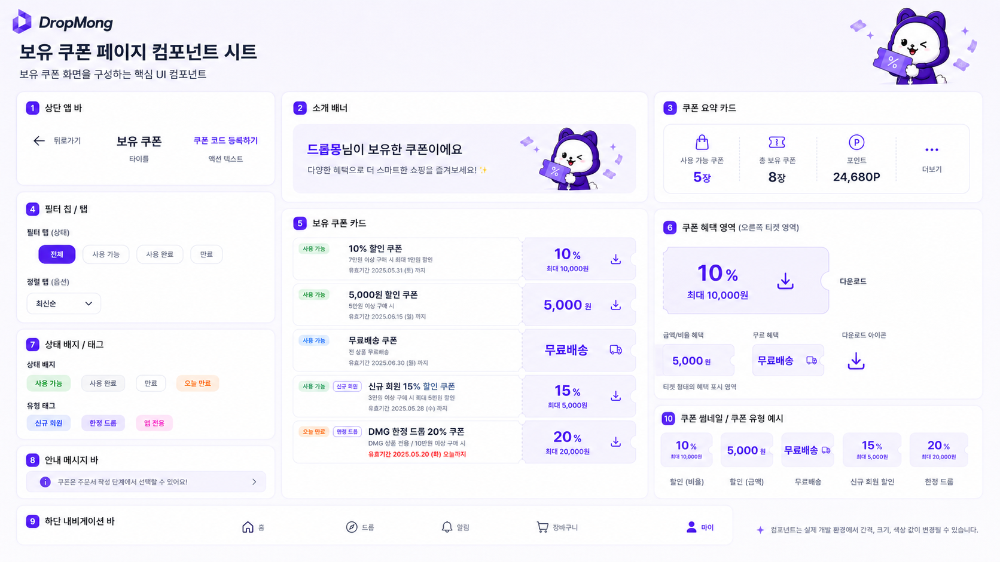

# 보유 쿠폰 UI 그룹

## 기본 정보

- UI ID: `UI.A.19`
- 연관 Page: [PAGE.A.19](../../10-sitemap/PAGE_A_19_coupon_wallet/PAGE_A_19_owned_coupon.md)
- 에셋 유형: 화면 이미지, 컴포넌트 시트
- 파일 경로:
  - [보유 쿠폰 페이지](../assets/UI_A_19_coupon_wallet/UI_A_19_01_owned_coupon.png)
  - [쿠폰 코드 등록 페이지](../assets/UI_A_19_coupon_wallet/UI_A_19_02_coupon_code_register.png)
  - [보유 쿠폰 페이지 컴포넌트 시트](../assets/UI_A_19_coupon_wallet/UI_A_19_03_owned_coupon_component_sheet.png)
- 원본 URL: local
- 캡처 일시: 2026-07-07
- 캡처 조건: DropMong 마이 영역, 보유 쿠폰 목록, 쿠폰 코드 등록, 컴포넌트 시트

## 연관 태그

🏷️ 요구사항 참조: [REQ.A.02](../../00-requirements/REQ_A_02_coupon_benefit.md) | 페이지 참조: [PAGE.A.19](../../10-sitemap/PAGE_A_19_coupon_wallet/PAGE_A_19_owned_coupon.md) | UC 참조: [UC.A.19](../../30-uc/UC_A_19_coupon_wallet.md) | 영속성 참조: PST.A.19 예정 | 서비스 참조: SVC.A.19 예정 | 시나리오 참조: SCN.A.19 예정 | API 참조: API.A.19 예정

## 화면 미리보기

  <figure style="min-width: 180px; margin: 0;"><figcaption>보유 쿠폰</figcaption></figure>
  <figure style="min-width: 180px; margin: 0;"><figcaption>쿠폰 코드 등록</figcaption></figure>
  <figure style="min-width: 320px; margin: 0;"><figcaption>컴포넌트 시트</figcaption></figure>

## 에셋

### 보유 쿠폰 페이지

### 쿠폰 코드 등록 페이지

### 컴포넌트 시트

## 화면 구성

| 번호 | 컴포넌트 | 역할 | 주요 상태/행동 |
| --- | --- | --- | --- |
| 1 | 상단 앱 바 | 뒤로가기, 페이지 제목, 쿠폰 코드 등록 진입을 제공한다. | 뒤로가기, 등록 화면 이동 |
| 2 | 소개 배너 | 보유 쿠폰 또는 쿠폰 코드 등록 맥락을 안내한다. | 안내 확인 |
| 3 | 쿠폰 요약 카드 | 사용 가능 쿠폰 수, 총 보유 쿠폰 수, 포인트를 요약한다. | 요약 확인 |
| 4 | 필터 탭 | 전체, 사용 가능, 사용 완료, 만료 상태를 선택한다. | 탭 전환 |
| 5 | 보유 쿠폰 카드 | 쿠폰 상태, 조건, 유효기간, 혜택 값을 티켓 형태로 보여준다. | 쿠폰 수령, 상세/적용 안내 후보 |
| 6 | 쿠폰 혜택 영역 | 비율 할인, 금액 할인, 무료배송, 수령 아이콘을 표현한다. | 혜택 확인, 수령/상세 선택 |
| 7 | 상태 배지/태그 | 사용 가능, 사용 완료, 만료, 오늘 만료, 신규 회원, 한정 드롭을 구분한다. | 상태 확인 |
| 8 | 안내 메시지 바 | 주문서에서 쿠폰을 사용할 수 있음을 안내한다. | 안내 상세 또는 주문서 이동 후보 |
| 9 | 쿠폰 코드 입력 카드 | 쿠폰 코드 입력 필드와 등록하기 CTA를 제공한다. | 코드 입력, 등록 요청 |
| 10 | 등록 안내 카드 | 입력 형식과 등록 불가 조건을 안내한다. | 정책 확인 |

## 화면에 필요한 정보

| 화면 영역 | 필드 | 타입 | 용도 |
| --- | --- | --- | --- |
| 요약 | `couponSummary.availableCount` | number | 사용 가능 쿠폰 수 표시 |
| 요약 | `couponSummary.totalCount` | number | 총 보유 쿠폰 수 표시 |
| 요약 | `point.balance` | number | 포인트 표시 |
| 필터 | `couponFilter.status` | enum | 전체, 사용 가능, 사용 완료, 만료 필터 |
| 목록 | `coupons[].userCouponId` | string | 보유 쿠폰 식별 |
| 목록 | `coupons[].couponName` | string | 쿠폰명 표시 |
| 목록 | `coupons[].status` | enum | 사용 가능, 사용 완료, 만료, 발급 대기 |
| 목록 | `coupons[].benefitType` | enum | 비율 할인, 금액 할인, 무료배송 |
| 목록 | `coupons[].benefitValue` | number/string | 할인율, 할인 금액, 무료배송 문구 |
| 목록 | `coupons[].maxDiscountAmount` | number? | 최대 할인 금액 표시 |
| 목록 | `coupons[].minimumOrderAmount` | number? | 최소 주문 금액 조건 |
| 목록 | `coupons[].validUntil` | datetime | 유효기간 표시 |
| 목록 | `coupons[].tags` | string[] | 신규 회원, 한정 드롭 등 태그 |
| 목록 | `coupons[].claimStatus` | enum | 수령 가능, 수령 완료, 발급 대기, 수량 종료, 대상 아님 표시 |
| 입력 | `couponCode.value` | string | 쿠폰 코드 입력값 |
| 입력 | `couponCode.validationStatus` | enum | 기본, 오류, 검증 중, 성공 |
| 등록 | `couponCode.registerResult` | enum? | 등록 성공, 이미 등록, 만료, 대상 아님, 존재하지 않음 |

## 화면에서 확인한 행동

- 사용자는 마이 페이지에서 보유 쿠폰 화면으로 진입한다.
- 사용자는 사용 가능 쿠폰 수와 총 보유 쿠폰 수를 확인한다.
- 사용자는 전체, 사용 가능, 사용 완료, 만료 탭으로 쿠폰 목록을 필터링한다.
- 사용자는 각 쿠폰의 할인 방식, 할인 값, 사용 조건, 유효기간, 상태 배지를 확인한다.
- 사용자는 수령 가능한 쿠폰을 선택해 보유 쿠폰으로 받는다.
- 사용자는 쿠폰 코드 등록하기를 눌러 쿠폰 코드 입력 화면으로 이동한다.
- 사용자는 쿠폰 코드를 입력하고 등록하기 버튼으로 서버 검증을 요청한다.
- 사용자는 등록한 쿠폰을 보유 쿠폰 목록에서 다시 확인한다.

## 설계 반영 사항

- Read Model 후보: `RM.A.19 CouponWalletReadModel`, `RM.A.190 CouponCodeRegisterFormModel`
- Query 후보: `QRY.A.19.GetOwnedCoupons`, `QRY.A.20.GetCouponSummary`
- Command 후보: `CMD.A.50.ClaimCoupon`, `CMD.A.51.RegisterCouponCode`, `CMD.A.52.ChangeCouponStatusFilter`, `CMD.A.53.OpenCouponCodeRegister`
- Error 후보: `ERR.A.50.COUPON_CLAIM_CLOSED`, `ERR.A.51.COUPON_CODE_NOT_FOUND`, `ERR.A.52.COUPON_CODE_EXPIRED`, `ERR.A.53.COUPON_ALREADY_REGISTERED`, `ERR.A.54.COUPON_NOT_ELIGIBLE`, `ERR.A.55.COUPON_QUANTITY_SOLD_OUT`
- 권한 후보: 보유 쿠폰 조회, 쿠폰 수령, 쿠폰 코드 등록은 로그인 필요

## 확인 필요

- 쿠폰 카드 액션 아이콘이 수령, 상세, 주문서 이동 중 무엇을 우선하는지 정한다.
- 쿠폰 수령 성공을 즉시 보유 쿠폰으로 표시할지, 발급 대기 상태를 먼저 표시할지 정한다.
- 쿠폰 코드 등록 성공 후 이동 방식과 성공 메시지를 정한다.
- 쿠폰 코드 입력 형식, 실패 횟수 제한, 재시도 쿨다운 정책을 정한다.
