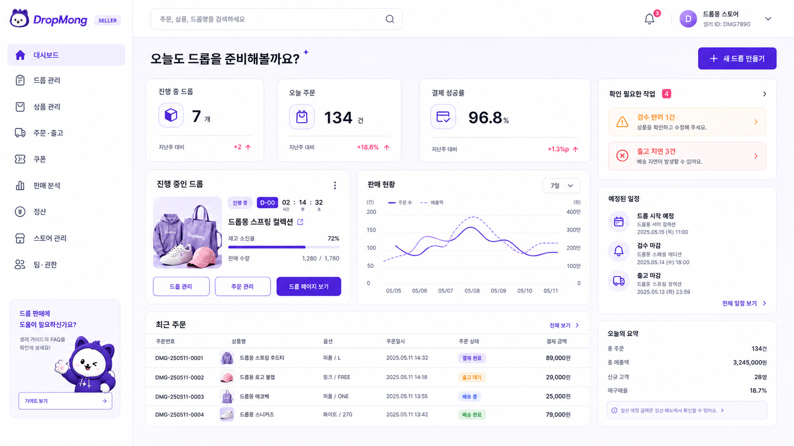

# UI.A.200 판매자 대시보드

## 기본 정보

- UI ID: `UI.A.200`
- 연관 Page: [PAGE.A.200 판매자 웹 포털](../../10-sitemap/PAGE_A_200_seller_portal/README.md)
- 기준 요구사항: [REQ.A.03 판매자](../../00-requirements/REQ_A_03_seller.md)
- 기준 유스케이스: [UC.A.02 판매자 드롭 운영](../../30-uc/UC_A_02_seller_manage_drop.md)
- 대상 환경: 데스크톱 우선 반응형 웹
- 통합 원본: [UI.A.200~211 판매자 웹 포털](README.md)

## 화면 시안

## 공통 화면 필드

| 화면 영역 | 필드 | 타입 | 용도 |
| --- | --- | --- | --- |
| 판매자 식별 | `seller.id` | string | 모든 조회·수정 요청의 판매자 범위를 고정 |
| 판매자 식별 | `seller.displayName` | string | 상단 바와 계정 전환 영역에 현재 판매자명 표시 |
| 판매자 식별 | `seller.type` | enum | 셀러·브랜드·제휴 판매자 등 계약 유형 표시 |
| 판매자 상태 | `seller.status` | enum | 정상, 검증 대기, 이용 제한, 탈퇴 상태 표시 |
| 판매자 상태 | `seller.verificationStatus` | enum | 사업자 및 판매자 인증 완료 여부 표시 |
| 사용자 식별 | `member.id` | string | 현재 로그인한 판매자 구성원 식별 |
| 사용자 식별 | `member.displayName` | string | 상단 프로필과 감사 기록에 사용자명 표시 |
| 사용자 권한 | `member.role` | enum | 대표 관리자, 상품 담당자, 출고 담당자, 성과 조회자 구분 |
| 사용자 권한 | `member.permissions[]` | enum[] | 페이지와 입력 항목의 조회·수정 가능 여부 결정 |
| 전역 알림 | `navigation.unreadNotificationCount` | number | 상단 알림 아이콘에 읽지 않은 알림 수 표시 |
| 전역 알림 | `navigation.notifications[].targetPageId` | page-id | 알림 선택 시 이동할 실제 판매자 페이지 지정 |

## 화면에 필요한 정보

| 화면 영역 | 필드 | 타입 | 용도 |
| --- | --- | --- | --- |
| 우선 작업 | `tasks[].taskId` | string | 작업 알림 항목 식별 |
| 우선 작업 | `tasks[].type` | enum | 검수 반려, 출고 대기, 쿠폰 응답, 정산 보류 구분 |
| 우선 작업 | `tasks[].title` | string | 판매자가 확인할 작업명 표시 |
| 우선 작업 | `tasks[].count` | number | 같은 유형의 처리 대상 건수 표시 |
| 우선 작업 | `tasks[].severity` | enum | 일반, 주의, 긴급 우선순위 표시 |
| 우선 작업 | `tasks[].dueAt` | datetime? | 처리 기한 또는 예정 시각 표시 |
| 우선 작업 | `tasks[].targetPageId` | page-id | 작업 선택 시 이동할 `PAGE.A.201~211` 지정 |
| KPI | `metrics.activeDropCount` | number | 진행 중인 드롭 수 표시 |
| KPI | `metrics.todayOrderCount` | number | 오늘 결제 완료된 주문 건수 표시 |
| KPI | `metrics.paymentSuccessRate` | percentage | 결제 시도 대비 성공 비율 표시 |
| KPI | `metrics.shippingPendingCount` | number | 송장 등록 또는 출고 처리가 필요한 주문 수 표시 |
| KPI | `metrics.comparedWithPreviousPeriodRate` | percentage | 각 KPI의 이전 비교 기간 대비 증감률 표시 |
| KPI | `metrics.aggregationCompletedAt` | datetime | 집계 완료 기준 시각 표시 |
| 진행 드롭 | `activeDrops[].dropId` | string | 드롭 상세·수정 페이지 연결에 사용하는 식별자 |
| 진행 드롭 | `activeDrops[].productName` | string | 대표 상품명 표시 |
| 진행 드롭 | `activeDrops[].thumbnailUrl` | image-url | 드롭 카드 대표 이미지 표시 |
| 진행 드롭 | `activeDrops[].status` | enum | 예정, 진행 중, 종료, 검수 상태 표시 |
| 진행 드롭 | `activeDrops[].opensAt` | datetime | 오픈 예정 또는 시작 시각 표시 |
| 진행 드롭 | `activeDrops[].endsAt` | datetime | 판매 종료 시각 표시 |
| 진행 드롭 | `activeDrops[].inventory.soldQuantity` | number | 판매 완료 수량 표시 |
| 진행 드롭 | `activeDrops[].inventory.totalQuantity` | number | 확정된 판매 가능 수량 표시 |
| 진행 드롭 | `activeDrops[].inventory.soldRate` | percentage | 재고 소진 진행률 표시 |
| 최근 주문 | `recentOrders[].orderNumber` | string | 주문 조회에 사용하는 판매자용 주문번호 표시 |
| 최근 주문 | `recentOrders[].productName` | string | 주문 상품명 표시 |
| 최근 주문 | `recentOrders[].fulfillmentStatus` | enum | 출고 대기, 배송 중, 배송 완료 상태 표시 |
| 최근 주문 | `recentOrders[].amount` | money | 결제 완료 금액 표시 |
| 최근 주문 | `recentOrders[].orderedAt` | datetime | 주문 접수 시각 표시 |
| 매출 추이 | `salesTrend.range` | date-range | 차트 집계 기간 표시 |
| 매출 추이 | `salesTrend.series[]` | chart-point[] | 날짜별 매출액과 주문 수 표시 |
| 운영 일정 | `schedule[].type` | enum | 드롭 오픈, 종료, 출고 기한, 정산 예정 구분 |
| 운영 일정 | `schedule[].title` | string | 일정 항목명 표시 |
| 운영 일정 | `schedule[].scheduledAt` | datetime | 일정 발생 시각 표시 |
| 운영 일정 | `schedule[].targetPageId` | page-id | 일정 선택 시 이동할 실제 페이지 지정 |
| 오늘 요약 | `todaySummary.totalSalesAmount` | money | 오늘 결제 완료된 총매출액 표시 |
| 오늘 요약 | `todaySummary.newCustomerCount` | number | 오늘 처음 구매한 고객 수 표시 |
| 오늘 요약 | `todaySummary.repurchaseRate` | percentage | 오늘 주문 중 재구매 주문 비율 표시 |

## 관련 문서

- [판매자 사이트맵](../../10-sitemap/PAGE_A_200_seller_portal/README.md)
- [판매자 요구사항](../../00-requirements/REQ_A_03_seller.md)
- [판매자 드롭 운영 유스케이스](../../30-uc/UC_A_02_seller_manage_drop.md)
