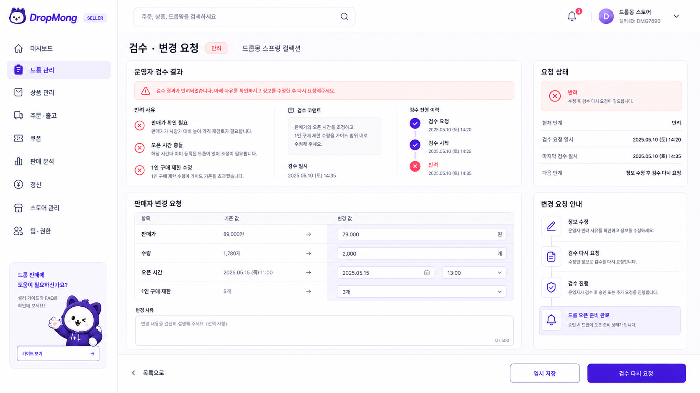

# UI.A.204 검수·변경 요청

## 기본 정보

- UI ID: `UI.A.204`
- 연관 Page: [PAGE.A.204 판매자 웹 포털](../../10-sitemap/PAGE_A_200_seller_portal/README.md)
- 기준 요구사항: [REQ.A.03 판매자](../../00-requirements/REQ_A_03_seller.md)
- 기준 유스케이스: [UC.A.02 판매자 드롭 운영](../../30-uc/UC_A_02_seller_manage_drop.md)
- 대상 환경: 데스크톱 우선 반응형 웹
- 통합 원본: [UI.A.200~211 판매자 웹 포털](README.md)

## 화면 시안

## 공통 화면 필드

| 화면 영역 | 필드 | 타입 | 용도 |
| --- | --- | --- | --- |
| 판매자 식별 | `seller.id` | string | 모든 조회·수정 요청의 판매자 범위를 고정 |
| 판매자 식별 | `seller.displayName` | string | 상단 바와 계정 전환 영역에 현재 판매자명 표시 |
| 판매자 식별 | `seller.type` | enum | 셀러·브랜드·제휴 판매자 등 계약 유형 표시 |
| 판매자 상태 | `seller.status` | enum | 정상, 검증 대기, 이용 제한, 탈퇴 상태 표시 |
| 판매자 상태 | `seller.verificationStatus` | enum | 사업자 및 판매자 인증 완료 여부 표시 |
| 사용자 식별 | `member.id` | string | 현재 로그인한 판매자 구성원 식별 |
| 사용자 식별 | `member.displayName` | string | 상단 프로필과 감사 기록에 사용자명 표시 |
| 사용자 권한 | `member.role` | enum | 대표 관리자, 상품 담당자, 출고 담당자, 성과 조회자 구분 |
| 사용자 권한 | `member.permissions[]` | enum[] | 페이지와 입력 항목의 조회·수정 가능 여부 결정 |
| 전역 알림 | `navigation.unreadNotificationCount` | number | 상단 알림 아이콘에 읽지 않은 알림 수 표시 |
| 전역 알림 | `navigation.notifications[].targetPageId` | page-id | 알림 선택 시 이동할 실제 판매자 페이지 지정 |

## 화면에 필요한 정보

| 화면 영역 | 필드 | 타입 | 용도 |
| --- | --- | --- | --- |
| 대상 드롭 | `drop.dropId` | string | 검수 또는 변경 요청 대상 식별 |
| 대상 드롭 | `drop.dropName` | string | 대상 드롭명 표시 |
| 검수 요약 | `review.requestId` | string | 검수 요청 식별 |
| 검수 요약 | `review.status` | enum | 검수 중, 승인, 반려, 보류, 보완 제출 상태 표시 |
| 검수 요약 | `review.submittedAt` | datetime | 검수 요청 제출 시각 표시 |
| 검수 요약 | `review.reviewedAt` | datetime? | 승인 또는 반려 처리 시각 표시 |
| 검수 요약 | `review.reviewerDisplayName` | string? | 검수 담당자 표시 가능한 경우 이름 표시 |
| 반려 내용 | `review.rejectionReasons[].code` | enum | 반려 사유 코드 식별 |
| 반려 내용 | `review.rejectionReasons[].label` | string | 판매자가 이해할 수 있는 반려 사유 표시 |
| 반려 내용 | `review.rejectionReasons[].fieldPath` | string? | 보완해야 할 등록 필드 위치 지정 |
| 반려 내용 | `review.reviewerComment` | text? | 검수 담당자의 상세 보완 요청 표시 |
| 처리 이력 | `review.timeline[].status` | enum | 제출, 검토, 승인, 반려, 재제출 단계 표시 |
| 처리 이력 | `review.timeline[].occurredAt` | datetime | 각 처리 시각 표시 |
| 처리 이력 | `review.timeline[].actorType` | enum | 판매자, 검수 담당자, 시스템 처리 주체 표시 |
| 변경 요청 | `changeRequest.requestId` | string? | 승인 후 조건 변경 요청 식별 |
| 변경 요청 | `changeRequest.status` | enum? | 작성 중, 검토 중, 승인, 반려 상태 표시 |
| 변경 요청 | `changeRequest.reason` | text? | 변경이 필요한 사유 입력·표시 |
| 변경 요청 | `changeRequest.changes[].fieldPath` | string | 변경 대상 필드 식별 |
| 변경 요청 | `changeRequest.changes[].beforeValue` | display-value | 승인된 기존 값 표시 |
| 변경 요청 | `changeRequest.changes[].afterValue` | display-value | 변경 요청 값 표시 |
| 변경 요청 | `changeRequest.requestedByDisplayName` | string? | 변경 요청자 표시 |
| 변경 요청 | `changeRequest.reviewedByDisplayName` | string? | 변경 요청을 승인·반려한 담당자 표시 |
| 변경 요청 | `changeRequest.submittedAt` | datetime? | 변경 요청 제출 시각 표시 |
| 작업 상태 | `actions.canResubmitReview` | boolean | 반려 보완 후 재검수 요청 가능 여부 결정 |
| 작업 상태 | `actions.canSubmitChangeRequest` | boolean | 승인된 드롭의 변경 요청 가능 여부 결정 |

## 관련 문서

- [판매자 사이트맵](../../10-sitemap/PAGE_A_200_seller_portal/README.md)
- [판매자 요구사항](../../00-requirements/REQ_A_03_seller.md)
- [판매자 드롭 운영 유스케이스](../../30-uc/UC_A_02_seller_manage_drop.md)
