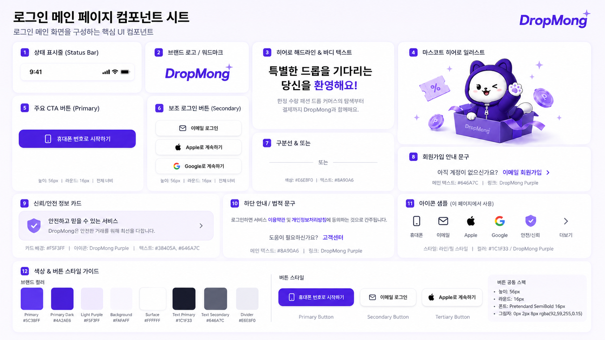

# 로그인 메인 페이지 UI

## 기본 정보

- UI ID: `UI.A.30`
- 연관 Page: [PAGE.A.30](../10-sitemap/PAGE_A_30_multi_signin.md)
- 에셋 유형: 화면 이미지, 컴포넌트 시트
- 파일 경로:
  - [로그인 메인 페이지](assets/UI_A_30_multi_signin/UI_A_30_01_multi_signin.png)
  - [로그인 메인 페이지 컴포넌트 시트](assets/UI_A_30_multi_signin/UI_A_30_02_multi_signin_component.png)
- 원본 URL: local
- 캡처 일시: 2026-07-07
- 캡처 조건: DropMong 로그인 메인, 휴대폰/이메일/Apple/Google 로그인, 이메일 회원가입, 신뢰 안내 카드 상태

## 연관 태그

🏷️ 요구사항 참조: [REQ.A.01](../00-requirements/REQ_A_01_limited_drop_commerce.md) | 페이지 참조: [PAGE.A.30](../10-sitemap/PAGE_A_30_multi_signin.md) | UC 참조: UC.A.30 | 영속성 참조: PST.A.30 | 서비스 참조: SVC.A.30 | 시나리오 참조: SCN.A.30 | API 참조: API.A.30

## 에셋

### 로그인 메인 페이지

### 컴포넌트 시트

## 화면 구성

| 번호 | 컴포넌트 | 역할 | 주요 상태/행동 |
| --- | --- | --- | --- |
| 1 | 상태 표시줄 | 모바일 상태 정보를 보여준다. | 고정 표시 |
| 2 | 브랜드 로고/워드마크 | DropMong 브랜드를 강조한다. | 브랜드 인지 |
| 3 | 히어로 헤드라인/본문 | 로그인 진입의 가치를 설명한다. | 안내 |
| 4 | 마스코트 히어로 일러스트 | 로그인 전 기대감을 시각화한다. | 장식/브랜드 |
| 5 | 주요 CTA 버튼 | 휴대폰 번호 로그인 진입을 제공한다. | 휴대폰 인증 |
| 6 | 보조 로그인 버튼 | 이메일, Apple, Google 로그인을 제공한다. | 인증 방식 선택 |
| 7 | 구분선/또는 라벨 | 로그인 방식 영역을 구분한다. | 시각 구분 |
| 8 | 회원가입 안내 문구 | 이메일 회원가입으로 이동한다. | 회원가입 |
| 9 | 신뢰/안전 정보 카드 | 안전 거래 안내를 제공한다. | 안전 안내 |
| 10 | 하단 안내/법적 문구 | 약관 동의와 고객센터 링크를 제공한다. | 약관/도움말 |
| 11 | 아이콘 샘플 | 휴대폰, 이메일, Apple, Google, 안전, 더보기 아이콘을 정의한다. | 아이콘 상태 |
| 12 | 색상/버튼 스타일 가이드 | 브랜드 컬러와 버튼 스타일을 정의한다. | 디자인 토큰 |

## 화면에 필요한 정보

| 화면 영역 | 필드 | 타입 | 용도 |
| --- | --- | --- | --- |
| 인증 | `authEntry.redirectTarget` | string? | 로그인 성공 후 복귀 화면 |
| 인증 | `authMethods.phone.enabled` | boolean | 휴대폰 로그인 버튼 표시 |
| 인증 | `authMethods.email.enabled` | boolean | 이메일 로그인 버튼 표시 |
| 인증 | `authMethods.apple.enabled` | boolean | Apple 로그인 버튼 표시 |
| 인증 | `authMethods.google.enabled` | boolean | Google 로그인 버튼 표시 |
| 링크 | `links.emailSignup` | string | 이메일 회원가입 이동 |
| 링크 | `links.terms` | string | 이용약관 이동 |
| 링크 | `links.privacy` | string | 개인정보처리방침 이동 |
| 링크 | `links.customerCenter` | string | 고객센터 이동 |
| 안내 | `trustNotice.title` | string | 신뢰/안전 카드 제목 |
| 안내 | `trustNotice.description` | string | 신뢰/안전 카드 설명 |

## 설계 반영 사항

- Read Model 후보: `RM.A.30 AuthEntryReadModel`
- Command 후보: `CMD.A.40.StartPhoneSignin`, `CMD.A.41.StartEmailSignin`, `CMD.A.42.StartSocialSignin`, `CMD.A.43.GoEmailSignup`
- Error 후보: `ERR.A.40.AUTH_METHOD_UNAVAILABLE`, `ERR.A.41.AUTH_REDIRECT_INVALID`
- 권한 후보: 비회원 접근 가능

## 확인 필요

- 휴대폰 번호 로그인 포함 여부
- 소셜 로그인 버튼 노출 조건
- 로그인 성공 후 redirect target 정책
- 약관/고객센터 링크 확정
