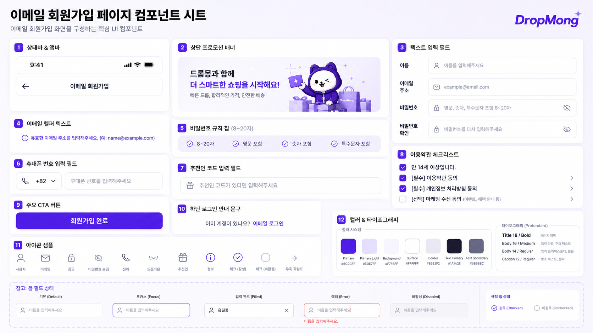

# 이메일 회원가입 페이지 UI

## 기본 정보

- UI ID: `UI.A.31`
- 연관 Page: [PAGE.A.31](../10-sitemap/PAGE_A_31_email_signup.md)
- 에셋 유형: 화면 이미지, 컴포넌트 시트
- 파일 경로:
  - [이메일 회원가입 페이지](assets/UI_A_31_email_signup/UI_A_31_01_email_signup.png)
  - [이메일 회원가입 페이지 컴포넌트 시트](assets/UI_A_31_email_signup/UI_A_31_02_email_signup_component.png)
- 원본 URL: local
- 캡처 일시: 2026-07-07
- 캡처 조건: DropMong 이메일 회원가입, 입력 필드, 비밀번호 규칙, 휴대폰 번호, 추천인 코드, 약관 체크리스트 상태

## 연관 태그

🏷️ 요구사항 참조: [REQ.A.01](../00-requirements/REQ_A_01_limited_drop_commerce.md), [REQ.A.02](../00-requirements/REQ_A_02_coupon_benefit.md) | 페이지 참조: [PAGE.A.31](../10-sitemap/PAGE_A_31_email_signup.md) | UC 참조: UC.A.31 | 영속성 참조: PST.A.31 | 서비스 참조: SVC.A.31 | 시나리오 참조: SCN.A.31 | API 참조: API.A.31

## 에셋

### 이메일 회원가입 페이지

### 컴포넌트 시트

## 화면 구성

| 번호 | 컴포넌트 | 역할 | 주요 상태/행동 |
| --- | --- | --- | --- |
| 1 | 상태바/앱 바 | 뒤로가기와 페이지 제목을 제공한다. | 뒤로가기 |
| 2 | 상단 프로모션 배너 | 회원가입 혜택 메시지를 전달한다. | 안내 |
| 3 | 텍스트 입력 필드 | 이름, 이메일, 비밀번호, 비밀번호 확인을 입력받는다. | 기본, 포커스, 입력 완료, 오류, 비활성 |
| 4 | 이메일 헬퍼 텍스트 | 이메일 형식 안내나 오류를 표시한다. | 안내/오류 |
| 5 | 비밀번호 규칙 칩 | 비밀번호 조건 충족 여부를 보여준다. | 충족/미충족 |
| 6 | 휴대폰 번호 입력 필드 | 국가번호와 휴대폰 번호를 입력받는다. | 국가번호 선택 |
| 7 | 추천인 코드 입력 필드 | 선택 추천인 코드를 입력받는다. | 선택 입력 |
| 8 | 이용약관 체크리스트 | 필수/선택 약관 동의를 받는다. | 체크/미체크 |
| 9 | 주요 CTA 버튼 | 회원가입 완료를 실행한다. | 활성/비활성 |
| 10 | 하단 로그인 안내 문구 | 이메일 로그인으로 이동한다. | 로그인 이동 |
| 11 | 아이콘 샘플 | 사용자, 이메일, 잠금, 보기/숨기기, 전화, 추천인, 정보, 체크 아이콘을 정의한다. | 아이콘 상태 |
| 12 | 컬러/타이포그래피 | 가입 폼의 색상과 글자 계층을 정의한다. | 디자인 토큰 |

## 화면에 필요한 정보

| 화면 영역 | 필드 | 타입 | 용도 |
| --- | --- | --- | --- |
| 입력 | `form.name` | string | 이름 입력 |
| 입력 | `form.email` | string | 이메일 주소 입력 |
| 입력 | `form.password` | string | 비밀번호 입력 |
| 입력 | `form.passwordConfirm` | string | 비밀번호 확인 |
| 입력 | `form.countryCode` | string | 국가번호 표시 |
| 입력 | `form.phoneNumber` | string | 휴대폰 번호 입력 |
| 입력 | `form.referralCode` | string? | 추천인 코드 입력 |
| 검증 | `validation.email.valid` | boolean | 이메일 형식 상태 |
| 검증 | `validation.password.rules[]` | object[] | 비밀번호 규칙 충족 |
| 동의 | `agreements[].required` | boolean | 필수 여부 |
| 동의 | `agreements[].checked` | boolean | 체크 상태 |
| 액션 | `actions.canSubmit` | boolean | 회원가입 완료 CTA 활성 |

## 설계 반영 사항

- Read Model 후보: `RM.A.31 EmailSignupFormModel`
- Command 후보: `CMD.A.44.ValidateEmailSignup`, `CMD.A.45.SubmitEmailSignup`, `CMD.A.46.ToggleSignupAgreement`
- Error 후보: `ERR.A.42.EMAIL_ALREADY_EXISTS`, `ERR.A.43.PASSWORD_RULE_NOT_MET`, `ERR.A.44.REQUIRED_AGREEMENT_MISSING`, `ERR.A.45.SIGNUP_FAILED`
- 권한 후보: 비회원 접근 가능

## 확인 필요

- 휴대폰 번호 인증 필수 여부
- 이메일 중복 확인 시점
- 추천인 코드 검증과 혜택 지급 시점
- 약관 전체동의 제공 여부
- 회원가입 완료 후 자동 로그인 여부
