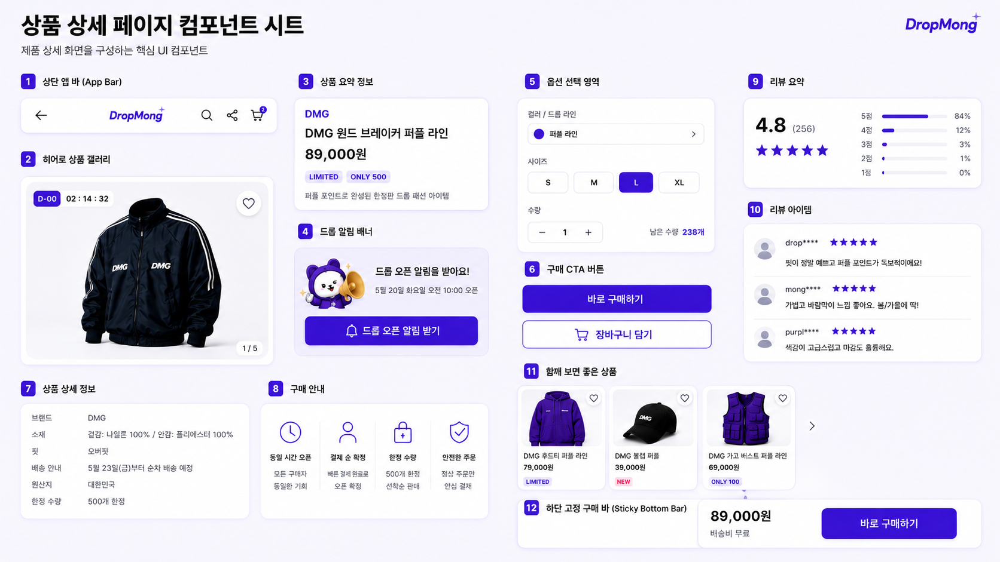

# 상품 상세 페이지 UI

## 기본 정보

- UI ID: `UI.A.02`
- 연관 Page: [PAGE.A.02](../../10-sitemap/buyer-mobile-web/PAGE_A_02_product_detail.md)
- 에셋 유형: 화면 이미지, 컴포넌트 시트
- 파일 경로:
  - [상품 상세 페이지](assets/UI_A_02_product_detail/UI_A_02_01_product_detail.png)
  - [상품 상세 페이지 컴포넌트 시트](assets/UI_A_02_product_detail/UI_A_02_02_product_detail_component.png)
  - [구매자 모바일 웹 시안](assets/UI_A_02_product_detail/UI_A_02_10_buyer_mobile_web.png)
- 원본 URL: local
- 작성 일시: 기존 근거 2026-07-07, 모바일 웹 시안 2026-07-10
- 기존 근거 조건: DropMong 한정 드롭 상품 상세, 오픈 전 카운트다운, 옵션 선택 가능, 리뷰/추천 상품 노출
- 모바일 웹 시안 조건: 390px 브라우저 화면, 전역 하단 내비게이션 생략, 페이지 내부 콘텐츠와 주요 CTA 중심

## 연관 태그

🏷️ 요구사항 참조: [REQ.A.01](../../00-requirements/REQ_A_01_limited_drop_commerce.md) | 페이지 참조: [PAGE.A.02](../../10-sitemap/buyer-mobile-web/PAGE_A_02_product_detail.md) | UC 참조: UC.A.02 | 영속성 참조: PST.A.02 | 서비스 참조: SVC.A.02 | 시나리오 참조: SCN.A.02 | API 참조: API.A.02

## 에셋

### 구매자 모바일 웹 시안

### 상품 상세 페이지

### 컴포넌트 시트

## 화면 구성

| 번호 | 컴포넌트 | 역할 | 주요 상태/행동 |
| --- | --- | --- | --- |
| 1 | 상단 앱 바 | 뒤로가기, 브랜드 로고, 검색, 공유, 장바구니 진입을 제공한다. | 장바구니 배지, 검색 이동, 공유 실행 |
| 2 | 히어로 상품 갤러리 | 대표 상품 이미지를 크게 보여주고 카운트다운과 관심 버튼을 함께 제공한다. | 이미지 페이지 표시, D-day, 남은 시간, 관심 등록 |
| 3 | 상품 요약 정보 | 판매자/브랜드명, 상품명, 가격, 배지, 한 줄 설명을 보여준다. | LIMITED, ONLY 수량 배지 |
| 4 | 드롭 알림 배너 | 오픈 전 사용자가 알림 신청을 하도록 유도한다. | 알림 신청, 로그인 필요 상태 |
| 5 | 옵션 선택 영역 | 컬러/드롭 라인, 사이즈, 수량, 남은 수량을 선택한다. | 선택/비선택/품절/수량 제한 |
| 6 | 구매 CTA 버튼 | 바로 구매와 장바구니 담기를 제공한다. | 활성, 비활성, 옵션 미선택, 품절 |
| 7 | 상품 상세 정보 | 소재, 핏, 배송 안내, 원산지, 한정 수량을 제공한다. | 정보성 조회 |
| 8 | 구매 안내 | 드롭 구매 방식과 결제 순 확정, 선착순 정책을 설명한다. | 정보성 조회 |
| 9 | 리뷰 요약 | 평균 평점, 리뷰 수, 별점 분포를 보여준다. | 전체 보기 이동 |
| 10 | 리뷰 아이템 | 최근 리뷰와 별점을 보여준다. | 리뷰 목록 이동 |
| 11 | 함께 보면 좋은 상품 | 관련 드롭 상품을 카드로 추천한다. | 상품 상세 이동, 관심 등록 |
| 12 | 하단 고정 구매 바 | 스크롤 중에도 가격과 바로 구매 CTA를 유지한다. | 바로 구매, 품절/오픈 전 비활성 |

## 화면에 필요한 정보

| 화면 영역 | 필드 | 타입 | 용도 |
| --- | --- | --- | --- |
| 상품 갤러리 | `images[]` | image[] | 상품 이미지 캐러셀 표시 |
| 상품 갤러리 | `imageIndex` | number | 현재 이미지 순서 표시 |
| 드롭 상태 | `dropStatus` | enum | 오픈 전, 오픈 중, 품절, 종료 상태 표시 |
| 드롭 상태 | `dDay` | string | D-day 배지 표시 |
| 드롭 상태 | `countdown.remainingTime` | string | 카운트다운 표시 |
| 상품 요약 | `sellerDisplayName` | string | 판매자/브랜드 표시 |
| 상품 요약 | `productName` | string | 상품명 표시 |
| 상품 요약 | `price` | number | 판매가 표시 |
| 상품 요약 | `badges[]` | string[] | LIMITED, ONLY 500 같은 배지 표시 |
| 알림 | `notification.isSubscribed` | boolean | 알림 신청 상태 표시 |
| 옵션 | `options.colorLine[]` | object[] | 컬러/드롭 라인 선택 |
| 옵션 | `options.sizes[]` | object[] | 사이즈 선택과 품절 상태 표시 |
| 옵션 | `selectedOptionId` | string? | 현재 선택 옵션 |
| 옵션 | `quantity` | number | 구매 수량 |
| 옵션 | `remainingQuantity` | number | 남은 수량 표시 |
| 구매 CTA | `actions.canBuyNow` | boolean | 바로 구매 활성화 |
| 구매 CTA | `actions.canAddToCart` | boolean | 장바구니 담기 활성화 |
| 구매 CTA | `actions.disabledReason` | string? | 구매 불가 사유 표시 |
| 상품 상세 정보 | `details.material` | string | 소재 표시 |
| 상품 상세 정보 | `details.fit` | string | 핏 표시 |
| 상품 상세 정보 | `details.shippingNotice` | string | 배송 안내 표시 |
| 상품 상세 정보 | `details.origin` | string | 원산지 표시 |
| 상품 상세 정보 | `details.limitedQuantity` | number | 한정 수량 표시 |
| 리뷰 | `reviewSummary.averageRating` | number | 평균 평점 표시 |
| 리뷰 | `reviewSummary.totalCount` | number | 리뷰 수 표시 |
| 리뷰 | `reviewSummary.ratingDistribution[]` | object[] | 별점 분포 표시 |
| 추천 상품 | `recommendedProducts[]` | object[] | 함께 보면 좋은 상품 카드 표시 |
| 장바구니 | `cartItemCount` | number | 상단 장바구니 배지 표시 |

## 화면에서 확인한 행동

- 사용자는 상품 이미지를 보고 상품 핵심 정보를 확인한다.
- 사용자는 오픈 전 드롭 알림을 신청할 수 있다.
- 사용자는 컬러/드롭 라인, 사이즈, 수량을 선택한다.
- 사용자는 옵션 선택 후 바로 구매하거나 장바구니에 담는다.
- 사용자는 드롭 구매 안내를 통해 결제 순 확정과 한정 수량 정책을 확인한다.
- 사용자는 리뷰/문의 요약을 보고 전체 목록으로 이동할 수 있다.
- 사용자는 함께 보면 좋은 상품 카드를 통해 다른 상품 상세로 이동할 수 있다.
- 사용자는 스크롤 하단에서도 고정 구매 바를 통해 바로 구매를 시도할 수 있다.

## 설계 반영 사항

- Read Model 후보: `RM.A.02 ProductDetailReadModel`
- Command 후보: `CMD.A.02.SubscribeDropNotification`, `CMD.A.03.ToggleFavoriteProduct`, `CMD.A.04.AddToCart`, `CMD.A.05.StartBuyNow`
- Error 후보: `ERR.A.02.OPTION_REQUIRED`, `ERR.A.03.OUT_OF_STOCK`, `ERR.A.04.DROP_NOT_OPEN`, `ERR.A.05.LOGIN_REQUIRED`, `ERR.A.06.QUANTITY_LIMIT_EXCEEDED`
- 권한 후보: 비회원 조회 가능, 알림/관심/장바구니/구매는 로그인 필요 가능

## 확인 필요

- 오픈 전 장바구니 담기를 허용할지 여부
- 카운트다운 종료 시 CTA 전환 방식
- 옵션 품절 상태의 비활성/안내 표현
- 하단 고정 구매 바가 오픈 전, 품절, 종료 상태에서 보여줄 문구
- 리뷰/문의의 MVP 포함 범위
- 추천 상품 카드의 추천 기준
- 판매자명과 브랜드명을 하나로 표시할지 분리할지 여부
