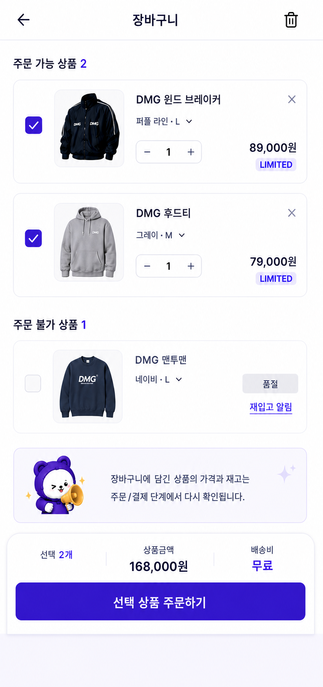
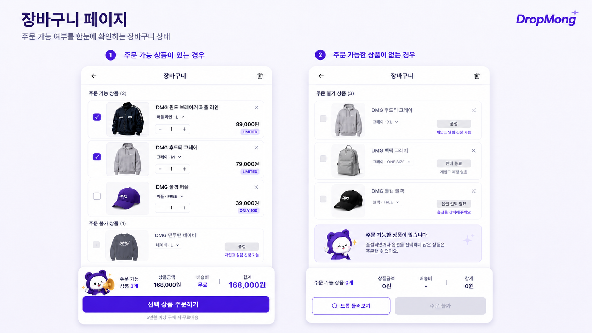
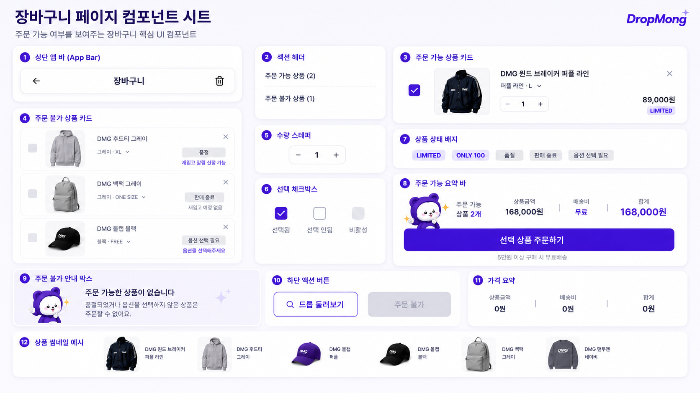

# 장바구니 페이지 UI

## 기본 정보

- UI ID: `UI.A.06`
- 연관 Page: [PAGE.A.06](../../10-sitemap/buyer-mobile-web/PAGE_A_06_shopping_cart.md)
- 에셋 유형: 화면 이미지, 컴포넌트 시트
- 파일 경로:
  - [장바구니 페이지](assets/UI_A_06_shopping_cart/UI_A_06_01_shopping_cart.png)
  - [장바구니 페이지 컴포넌트 시트](assets/UI_A_06_shopping_cart/UI_A_06_02_shopping_cart_component.png)
  - [구매자 모바일 웹 시안](assets/UI_A_06_shopping_cart/UI_A_06_10_buyer_mobile_web.png)
- 원본 URL: local
- 작성 일시: 기존 근거 2026-07-07, 모바일 웹 시안 2026-07-10
- 기존 근거 조건: DropMong 장바구니, 주문 가능 상품 있음/없음 상태, 주문 불가 상품 포함
- 모바일 웹 시안 조건: 390px 브라우저 화면, 전역 하단 내비게이션 생략, 페이지 내부 콘텐츠와 주요 CTA 중심

## 연관 태그

🏷️ 요구사항 참조: [REQ.A.01](../../00-requirements/REQ_A_01_limited_drop_commerce.md) | 페이지 참조: [PAGE.A.06](../../10-sitemap/buyer-mobile-web/PAGE_A_06_shopping_cart.md) | UC 참조: UC.A.06 | 영속성 참조: PST.A.06 | 서비스 참조: SVC.A.06 | 시나리오 참조: SCN.A.06 | API 참조: API.A.06

## 에셋

### 구매자 모바일 웹 시안

### 장바구니 페이지

### 컴포넌트 시트

## 화면 구성

| 번호 | 컴포넌트 | 역할 | 주요 상태/행동 |
| --- | --- | --- | --- |
| 1 | 상단 앱 바 | 뒤로가기, 페이지 제목, 전체 삭제를 제공한다. | 뒤로가기, 장바구니 비우기 |
| 2 | 섹션 헤더 | 주문 가능 상품과 주문 불가 상품 수를 구분해 보여준다. | 섹션 상태 표시 |
| 3 | 주문 가능 상품 카드 | 선택 가능한 장바구니 상품을 보여준다. | 선택/해제, 수량 변경, 삭제, 상품 상세 이동 |
| 4 | 주문 불가 상품 카드 | 품절, 판매 종료, 옵션 선택 필요 상품을 보여준다. | 삭제, 재입고 알림 신청, 옵션 선택 유도 |
| 5 | 수량 스테퍼 | 주문 가능 상품의 수량을 변경한다. | 증가/감소, 최소/최대 제한 |
| 6 | 선택 체크박스 | 주문 대상 상품을 선택한다. | 선택됨, 선택 안 됨, 비활성 |
| 7 | 상품 상태 배지 | LIMITED, ONLY 100, 품절, 판매 종료, 옵션 선택 필요 상태를 표시한다. | 주문 가능/불가 이유 표시 |
| 8 | 주문 가능 요약 바 | 선택 상품 수, 상품 금액, 배송비, 합계를 보여주고 주문 CTA를 제공한다. | 주문 가능, 주문 버튼 활성 |
| 9 | 주문 불가 안내 박스 | 주문 가능한 상품이 없을 때 이유와 대체 행동을 안내한다. | 드롭 둘러보기 유도 |
| 10 | 하단 액션 버튼 | 드롭 둘러보기와 주문 불가 버튼을 제공한다. | 대체 탐색, 주문 불가 비활성 |
| 11 | 가격 요약 | 상품 금액, 배송비, 합계를 요약한다. | 0원, 무료배송, 합계 갱신 |
| 12 | 상품 썸네일 예시 | 장바구니 상품 썸네일의 이미지 톤과 비율을 보여준다. | 카드 내 이미지 표시 |

## 화면에 필요한 정보

| 화면 영역 | 필드 | 타입 | 용도 |
| --- | --- | --- | --- |
| 장바구니 | `cartId` | string | 장바구니 식별 |
| 장바구니 | `orderableItems[]` | object[] | 주문 가능 상품 목록 |
| 장바구니 | `unorderableItems[]` | object[] | 주문 불가 상품 목록 |
| 상품 카드 | `items[].cartItemId` | string | 장바구니 항목 식별 |
| 상품 카드 | `items[].productId` | string | 상품 상세 이동 |
| 상품 카드 | `items[].productName` | string | 상품명 표시 |
| 상품 카드 | `items[].thumbnailUrl` | image | 상품 썸네일 표시 |
| 상품 카드 | `items[].optionLabel` | string | 컬러/사이즈 옵션 표시 |
| 상품 카드 | `items[].quantity` | number | 주문 수량 표시 |
| 상품 카드 | `items[].unitPrice` | number | 상품 가격 표시 |
| 상품 카드 | `items[].badges[]` | string[] | LIMITED, ONLY 100 표시 |
| 상품 카드 | `items[].selected` | boolean | 주문 선택 상태 |
| 상품 카드 | `items[].orderable` | boolean | 주문 가능 여부 |
| 상품 카드 | `items[].unorderableReason` | enum? | 품절, 판매 종료, 옵션 선택 필요 사유 |
| 상품 카드 | `items[].canRestockNotify` | boolean | 재입고 알림 신청 가능 여부 |
| 수량 스테퍼 | `items[].minQuantity` | number | 최소 수량 제한 |
| 수량 스테퍼 | `items[].maxQuantity` | number | 최대 수량 제한 |
| 요약 바 | `summary.orderableItemCount` | number | 주문 가능 상품 수 표시 |
| 요약 바 | `summary.selectedItemCount` | number | 선택 상품 수 표시 |
| 요약 바 | `summary.productAmount` | number | 상품 금액 합계 |
| 요약 바 | `summary.shippingFee` | number | 배송비 표시 |
| 요약 바 | `summary.totalAmount` | number | 결제 예상 합계 |
| 액션 | `actions.canCheckout` | boolean | 주문 CTA 활성화 |
| 액션 | `actions.disabledReason` | string? | 주문 불가 사유 표시 |

## 화면에서 확인한 행동

- 사용자는 장바구니에서 주문 가능한 상품과 주문 불가 상품을 구분해서 확인한다.
- 사용자는 주문 가능 상품을 선택하거나 선택 해제한다.
- 사용자는 주문 가능 상품의 수량을 변경한다.
- 사용자는 품절, 판매 종료, 옵션 선택 필요 상태를 확인한다.
- 사용자는 품절 상품에 대해 재입고 알림을 신청할 수 있다.
- 사용자는 주문 가능한 상품이 없을 때 드롭 둘러보기로 이동할 수 있다.
- 사용자는 선택 상품의 상품 금액, 배송비, 합계를 확인하고 주문서로 이동한다.

## 설계 반영 사항

- Read Model 후보: `RM.A.06 CartReadModel`
- Command 후보: `CMD.A.06.ToggleCartItemSelection`, `CMD.A.07.UpdateCartItemQuantity`, `CMD.A.08.RemoveCartItem`, `CMD.A.09.ClearCart`, `CMD.A.10.StartCheckoutFromCart`, `CMD.A.11.SubscribeRestockNotification`
- Error 후보: `ERR.A.06.CART_EMPTY`, `ERR.A.07.CART_ITEM_UNORDERABLE`, `ERR.A.08.OUT_OF_STOCK`, `ERR.A.09.OPTION_REQUIRED`, `ERR.A.10.QUANTITY_LIMIT_EXCEEDED`, `ERR.A.11.PRICE_CHANGED`
- 권한 후보: 장바구니 조회/수정/주문은 로그인 필요

## 확인 필요

- 주문 가능/불가 판단을 화면 진입 시점과 주문 버튼 클릭 시점에 모두 수행할지 여부
- 품절 상품의 재입고 알림과 드롭 알림을 같은 알림 모델로 처리할지 여부
- 판매 종료 상품을 장바구니에 유지할 수 있는 기간
- 옵션 선택 필요 상품을 장바구니 안에서 바로 수정할지 상품 상세로 이동시킬지 여부
- 무료배송 조건과 배송비 확정 시점
- 전체 삭제 시 확인 모달 문구와 복구 가능 여부
