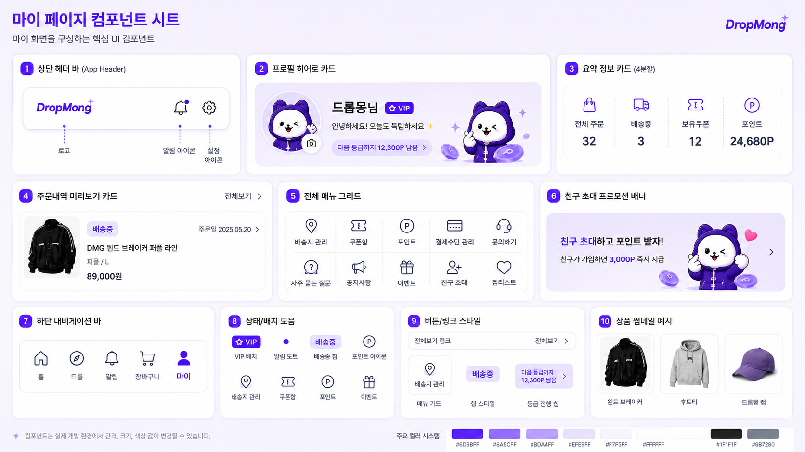

# 마이 페이지 UI

## 기본 정보

- UI ID: `UI.A.10`
- 연관 Page: [PAGE.A.10](../../10-sitemap/buyer-mobile-web/PAGE_A_10_my.md)
- 에셋 유형: 화면 이미지, 컴포넌트 시트
- 파일 경로:
  - [마이 페이지](assets/UI_A_10_my/UI_A_10_01_my.png)
  - [마이 페이지 컴포넌트 시트](assets/UI_A_10_my/UI_A_10_02_my_component.png)
  - [구매자 모바일 웹 시안](assets/UI_A_10_my/UI_A_10_10_buyer_mobile_web.png)
- 원본 URL: local
- 작성 일시: 기존 근거 2026-07-07, 모바일 웹 시안 2026-07-10
- 기존 근거 조건: DropMong 마이, 프로필, 요약 지표, 최근 주문, 전체 메뉴, 친구 초대 배너, 하단 탭 상태
- 모바일 웹 시안 조건: 390px 브라우저 화면, 전역 하단 내비게이션 생략, 페이지 내부 콘텐츠와 주요 CTA 중심

## 연관 태그

🏷️ 요구사항 참조: [REQ.A.01](../../00-requirements/REQ_A_01_limited_drop_commerce.md), [REQ.A.02](../../00-requirements/REQ_A_02_coupon_benefit.md) | 페이지 참조: [PAGE.A.10](../../10-sitemap/buyer-mobile-web/PAGE_A_10_my.md) | UC 참조: UC.A.10 | 영속성 참조: PST.A.10 | 서비스 참조: SVC.A.10 | 시나리오 참조: SCN.A.10 | API 참조: API.A.10

## 에셋

### 구매자 모바일 웹 시안

### 마이 페이지

### 컴포넌트 시트

## 화면 구성

| 번호 | 컴포넌트 | 역할 | 주요 상태/행동 |
| --- | --- | --- | --- |
| 1 | 상단 헤더 바 | 로고, 알림, 설정 진입을 제공한다. | 알림, 설정 |
| 2 | 프로필 히어로 카드 | 프로필 이미지, 닉네임, VIP 배지, 등급 진행 정보를 보여준다. | 프로필 확인, 이미지 변경, 등급 정보 이동 |
| 3 | 요약 정보 카드 | 전체 주문, 배송중, 보유쿠폰, 포인트를 4분할로 보여준다. | 각 요약 항목 선택 |
| 4 | 주문내역 미리보기 카드 | 최근 주문 한 건과 전체보기 링크를 제공한다. | 주문 내역 이동, 주문 상세 이동 |
| 5 | 전체 메뉴 그리드 | 계정, 혜택, 결제, 지원, 찜 관련 메뉴를 제공한다. | 메뉴 이동 |
| 6 | 친구 초대 프로모션 배너 | 친구 초대 포인트 혜택을 노출한다. | 친구 초대 이동 |
| 7 | 하단 내비게이션 바 | 홈, 드롭, 알림, 장바구니, 마이 탭을 제공한다. | 탭 이동, 마이 활성 |
| 8 | 상태/배지 모음 | VIP 배지, 알림 도트, 배송중 칩, 포인트 아이콘 등을 정의한다. | 상태 표시 |
| 9 | 버튼/링크 스타일 | 전체보기, 메뉴 카드, 등급 진행 칩 같은 링크형 요소를 정의한다. | 링크 이동 |
| 10 | 상품 썸네일 예시 | 최근 주문 카드에서 사용할 상품 이미지 비율을 보여준다. | 상품 이미지 표시 |

## 화면에 필요한 정보

| 화면 영역 | 필드 | 타입 | 용도 |
| --- | --- | --- | --- |
| 회원 | `user.userId` | string | 회원 식별 |
| 회원 | `user.nickname` | string | 닉네임 표시 |
| 회원 | `user.profileImageUrl` | image | 프로필 이미지 표시 |
| 회원 | `user.membershipGrade` | string | VIP 등급 배지 표시 |
| 등급 | `grade.nextGradeRemainingPoint` | number | 다음 등급까지 남은 포인트 표시 |
| 요약 | `summary.totalOrderCount` | number | 전체 주문 수 표시 |
| 요약 | `summary.shippingOrderCount` | number | 배송중 주문 수 표시 |
| 요약 | `summary.availableCouponCount` | number | 보유 쿠폰 수 표시 |
| 요약 | `summary.pointBalance` | number | 보유 포인트 표시 |
| 최근 주문 | `recentOrder.orderId` | string? | 주문 상세 연결 |
| 최근 주문 | `recentOrder.orderDate` | date? | 주문일 표시 |
| 최근 주문 | `recentOrder.status` | enum? | 배송중 등 상태 칩 표시 |
| 최근 주문 | `recentOrder.productId` | string? | 상품 상세 연결 |
| 최근 주문 | `recentOrder.productName` | string? | 상품명 표시 |
| 최근 주문 | `recentOrder.thumbnailUrl` | image? | 상품 썸네일 표시 |
| 최근 주문 | `recentOrder.optionLabel` | string? | 옵션 표시 |
| 최근 주문 | `recentOrder.finalPaymentAmount` | number? | 결제 금액 표시 |
| 메뉴 | `menus[].menuId` | string | 메뉴 식별 |
| 메뉴 | `menus[].label` | string | 메뉴명 표시 |
| 메뉴 | `menus[].iconName` | string | 아이콘 표시 |
| 메뉴 | `menus[].enabled` | boolean | 메뉴 활성 여부 |
| 배너 | `invitePromotion.title` | string | 친구 초대 배너 제목 |
| 배너 | `invitePromotion.rewardPoint` | number | 친구 초대 지급 포인트 |
| 알림 | `notification.hasUnread` | boolean | 알림 도트 표시 |

## 화면에서 확인한 행동

- 사용자는 자신의 닉네임, 프로필 이미지, VIP 등급을 확인한다.
- 사용자는 다음 등급까지 남은 포인트를 확인한다.
- 사용자는 전체 주문, 배송중, 보유쿠폰, 포인트 요약을 확인하고 관련 화면으로 이동한다.
- 사용자는 최근 주문을 확인하고 주문 내역 전체로 이동한다.
- 사용자는 배송지, 쿠폰함, 포인트, 결제수단, 문의, FAQ, 공지사항, 이벤트, 친구 초대, 찜리스트 메뉴로 이동한다.
- 사용자는 친구 초대 배너를 통해 포인트 혜택을 확인한다.
- 사용자는 하단 내비게이션에서 장바구니와 마이 탭을 이동한다.

## 설계 반영 사항

- Read Model 후보: `RM.A.10 MyPageReadModel`
- Query 후보: `QRY.A.10.GetMyPage`, `QRY.A.11.GetMySummary`, `QRY.A.12.GetRecentOrderPreview`
- Command 후보: `CMD.A.27.OpenProfileEdit`, `CMD.A.28.OpenInvite`, `CMD.A.29.OpenMyMenu`
- Error 후보: `ERR.A.27.MY_PAGE_LOGIN_REQUIRED`, `ERR.A.28.MY_SUMMARY_UNAVAILABLE`, `ERR.A.29.RECENT_ORDER_UNAVAILABLE`
- 권한 후보: 마이 페이지의 개인 정보와 요약 지표는 로그인 필요

## 확인 필요

- 비회원 상태 UI와 로그인 유도 방식
- VIP/등급 배지의 실제 등급 체계와 색상
- 요약 지표의 집계 기준과 갱신 주기
- 최근 주문 미리보기의 노출 기준과 빈 상태
- 전체 메뉴 중 MVP에서 비활성 처리할 항목
- 장바구니 하단 탭 유지 여부와 기존 홈/주문 내역 탭 구조 통일
