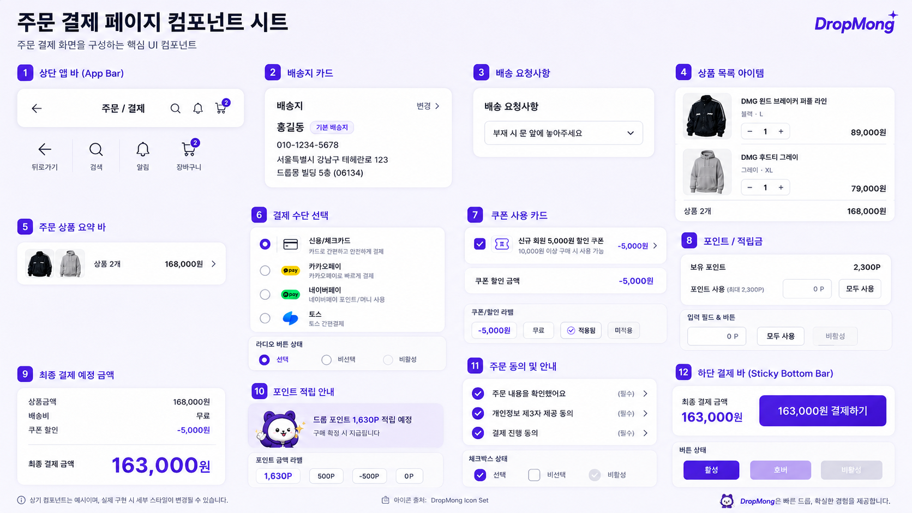

# 주문/결제 페이지 UI

## 기본 정보

- UI ID: `UI.A.11`
- 연관 Page: [PAGE.A.11](../../10-sitemap/buyer-mobile-web/PAGE_A_11_payment.md)
- 에셋 유형: 화면 이미지, 컴포넌트 시트
- 파일 경로:
  - [주문/결제 페이지](assets/UI_A_11_payment/UI_A_11_01_payment.png)
  - [주문/결제 페이지 컴포넌트 시트](assets/UI_A_11_payment/UI_A_11_02_payment_component.png)
  - [구매자 모바일 웹 시안](assets/UI_A_11_payment/UI_A_11_10_buyer_mobile_web.png)
- 원본 URL: local
- 작성 일시: 기존 근거 2026-07-07, 모바일 웹 시안 2026-07-10
- 기존 근거 조건: DropMong 주문/결제, 배송지 확인, 상품 목록, 결제 수단, 쿠폰, 포인트, 동의, 최종 결제 금액 상태
- 모바일 웹 시안 조건: 390px 브라우저 화면, 전역 하단 내비게이션 생략, 페이지 내부 콘텐츠와 주요 CTA 중심

## 연관 태그

🏷️ 요구사항 참조: [REQ.A.01](../../00-requirements/REQ_A_01_limited_drop_commerce.md), [REQ.A.02](../../00-requirements/REQ_A_02_coupon_benefit.md) | 페이지 참조: [PAGE.A.11](../../10-sitemap/buyer-mobile-web/PAGE_A_11_payment.md) | UC 참조: UC.A.11 | 영속성 참조: PST.A.11 | 서비스 참조: SVC.A.11 | 시나리오 참조: SCN.A.11 | API 참조: API.A.11

## 에셋

### 구매자 모바일 웹 시안

### 주문/결제 페이지

### 컴포넌트 시트

## 화면 구성

| 번호 | 컴포넌트 | 역할 | 주요 상태/행동 |
| --- | --- | --- | --- |
| 1 | 상단 앱 바 | 뒤로가기, 검색, 알림, 장바구니 이동을 제공한다. | 뒤로가기, 검색, 알림, 장바구니 |
| 2 | 배송지 카드 | 기본 배송지와 수령 정보를 보여준다. | 배송지 변경 |
| 3 | 배송 요청사항 | 배송 요청 문구를 선택한다. | 드롭다운 선택 |
| 4 | 상품 목록 아이템 | 결제 대상 상품, 옵션, 수량, 가격을 보여준다. | 상품 확인, 수량 확인 |
| 5 | 주문 상품 요약 바 | 대표 썸네일, 상품 수, 상품 금액을 요약한다. | 상품 목록 확인 |
| 6 | 결제 수단 선택 | 카드, 간편결제 등 결제 수단을 선택한다. | 라디오 선택, 비활성 상태 |
| 7 | 쿠폰 사용 카드 | 적용 쿠폰과 할인 금액을 보여준다. | 쿠폰 선택/변경, 적용/미적용 |
| 8 | 포인트/적립금 | 보유 포인트와 사용 포인트 입력을 제공한다. | 직접 입력, 모두 사용, 비활성 |
| 9 | 최종 결제 예정 금액 | 상품 금액, 배송비, 쿠폰 할인, 최종 결제 금액을 보여준다. | 금액 재계산 |
| 10 | 포인트 적립 안내 | 구매 확정 시 지급될 적립 예정 포인트를 안내한다. | 적립 예정 금액 표시 |
| 11 | 주문 동의 및 안내 | 주문 확인, 개인정보 제공, 결제 진행 동의를 받는다. | 필수 체크, 상세 보기 |
| 12 | 하단 결제 바 | 최종 결제 금액과 결제 CTA를 고정 노출한다. | 활성, 호버, 비활성 |

## 화면에 필요한 정보

| 화면 영역 | 필드 | 타입 | 용도 |
| --- | --- | --- | --- |
| 체크아웃 | `checkoutId` | string | 주문/결제 준비 식별 |
| 체크아웃 | `sourceType` | enum | 장바구니 주문 또는 바로 구매 구분 |
| 배송지 | `shippingAddress.id` | string | 배송지 식별 |
| 배송지 | `shippingAddress.recipientName` | string | 수령인 표시 |
| 배송지 | `shippingAddress.phone` | string | 연락처 표시 |
| 배송지 | `shippingAddress.addressLine` | string | 배송 주소 표시 |
| 배송지 | `shippingAddress.isDefault` | boolean | 기본 배송지 배지 표시 |
| 배송 요청사항 | `deliveryRequest.code` | string | 요청사항 저장 |
| 배송 요청사항 | `deliveryRequest.label` | string | 요청사항 문구 표시 |
| 상품 목록 | `items[].productId` | string | 상품 상세 연결 |
| 상품 목록 | `items[].productName` | string | 상품명 표시 |
| 상품 목록 | `items[].thumbnailUrl` | image | 상품 썸네일 표시 |
| 상품 목록 | `items[].optionLabel` | string | 컬러/사이즈 표시 |
| 상품 목록 | `items[].quantity` | number | 주문 수량 표시 |
| 상품 목록 | `items[].unitPrice` | number | 상품 단가 표시 |
| 결제 수단 | `paymentMethods[].type` | enum | 카드/간편결제 구분 |
| 결제 수단 | `paymentMethods[].displayName` | string | 결제 수단명 표시 |
| 결제 수단 | `paymentMethods[].selected` | boolean | 선택 상태 표시 |
| 결제 수단 | `paymentMethods[].enabled` | boolean | 사용 가능 여부 |
| 쿠폰 | `coupon.couponId` | string? | 적용 쿠폰 식별 |
| 쿠폰 | `coupon.title` | string? | 쿠폰명 표시 |
| 쿠폰 | `coupon.discountAmount` | number | 할인 금액 표시 |
| 쿠폰 | `coupon.applied` | boolean | 적용 상태 표시 |
| 포인트 | `point.balance` | number | 보유 포인트 표시 |
| 포인트 | `point.usableAmount` | number | 사용 가능 포인트 계산 |
| 포인트 | `point.useAmount` | number | 사용 포인트 입력값 |
| 포인트 | `point.earnExpectedAmount` | number | 적립 예정 포인트 표시 |
| 금액 요약 | `summary.productAmount` | number | 상품 금액 합계 |
| 금액 요약 | `summary.shippingFee` | number | 배송비 표시 |
| 금액 요약 | `summary.couponDiscountAmount` | number | 쿠폰 할인 표시 |
| 금액 요약 | `summary.pointUseAmount` | number | 포인트 사용 금액 표시 |
| 금액 요약 | `summary.finalPaymentAmount` | number | 최종 결제 금액 표시 |
| 동의 | `agreements[].agreementId` | string | 동의 항목 식별 |
| 동의 | `agreements[].required` | boolean | 필수 여부 표시 |
| 동의 | `agreements[].checked` | boolean | 체크 상태 표시 |
| 액션 | `actions.canPay` | boolean | 결제 CTA 활성화 |
| 액션 | `actions.disabledReason` | string? | 결제 불가 사유 표시 |

## 화면에서 확인한 행동

- 사용자는 결제 전 배송지와 배송 요청사항을 확인하고 변경할 수 있다.
- 사용자는 결제 대상 상품과 상품 금액을 확인한다.
- 사용자는 결제 수단을 선택한다.
- 사용자는 쿠폰을 적용하고 할인 금액을 확인한다.
- 사용자는 보유 포인트를 입력하거나 모두 사용할 수 있다.
- 사용자는 최종 결제 예정 금액과 적립 예정 포인트를 확인한다.
- 사용자는 필수 동의를 완료한 뒤 결제를 실행한다.

## 설계 반영 사항

- Read Model 후보: `RM.A.11 CheckoutReadModel`
- Command 후보: `CMD.A.12.ChangeShippingAddress`, `CMD.A.13.SelectDeliveryRequest`, `CMD.A.14.SelectPaymentMethod`, `CMD.A.15.ApplyCoupon`, `CMD.A.16.UsePoint`, `CMD.A.17.ToggleCheckoutAgreement`, `CMD.A.18.ConfirmPayment`
- Error 후보: `ERR.A.12.CHECKOUT_EXPIRED`, `ERR.A.13.SHIPPING_ADDRESS_REQUIRED`, `ERR.A.14.PAYMENT_METHOD_REQUIRED`, `ERR.A.15.COUPON_NOT_APPLICABLE`, `ERR.A.16.POINT_NOT_USABLE`, `ERR.A.17.AGREEMENT_REQUIRED`, `ERR.A.18.STOCK_CHANGED`, `ERR.A.19.PAYMENT_APPROVAL_FAILED`
- 권한 후보: 주문/결제 조회와 결제 실행은 로그인 필요

## 확인 필요

- 체크아웃 진입 시 기본 배송지와 기본 결제 수단을 자동 선택할지 여부
- 쿠폰과 포인트 적용 순서
- 결제 버튼 활성 조건: 배송지, 결제 수단, 필수 동의, 금액 재계산 완료
- 결제 승인 전 재고/가격/쿠폰/포인트 재검증 순서
- 결제 실패 후 재시도 시 체크아웃 스냅샷 유지 시간
- 결제 페이지에서 수량 변경을 허용할지, 장바구니/상품 상세로 되돌릴지 여부
