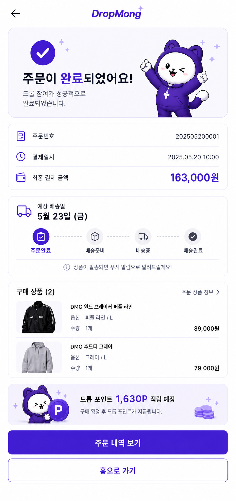
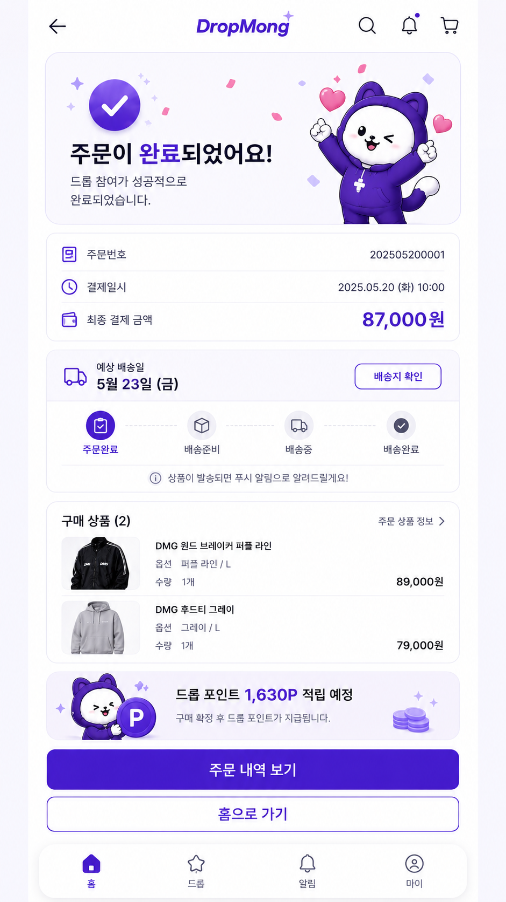
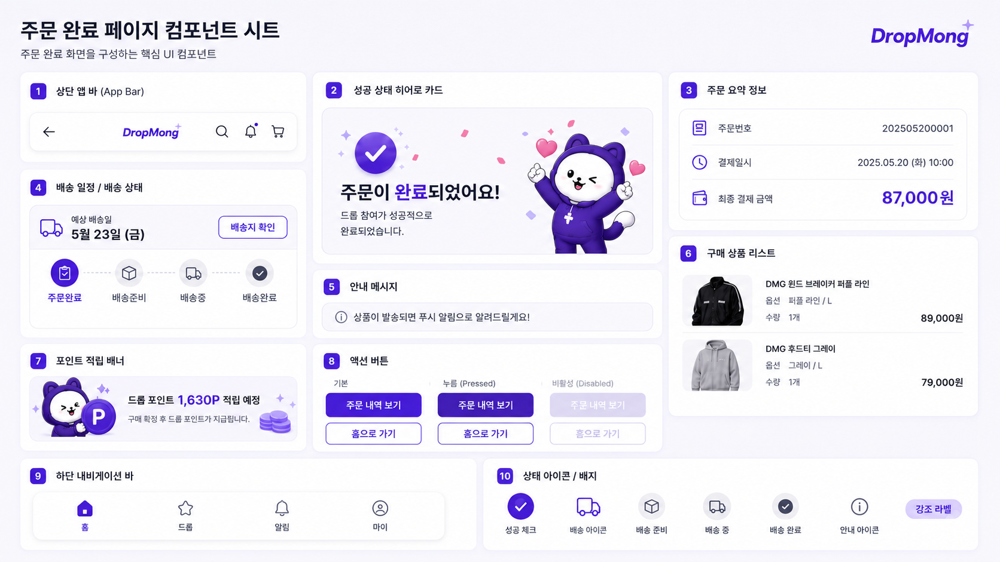

# 주문 완료 페이지 UI

## 기본 정보

- UI ID: `UI.A.14`
- 연관 Page: [PAGE.A.14](../../10-sitemap/buyer-mobile-web/PAGE_A_14_order_complete.md)
- 에셋 유형: 화면 이미지, 컴포넌트 시트
- 파일 경로:
  - [주문 완료 페이지](assets/UI_A_14_order_complete/UI_A_14_01_order_complete.png)
  - [주문 완료 페이지 컴포넌트 시트](assets/UI_A_14_order_complete/UI_A_14_02_order_complete_component.png)
  - [구매자 모바일 웹 시안](assets/UI_A_14_order_complete/UI_A_14_10_buyer_mobile_web.png)
- 원본 URL: local
- 작성 일시: 기존 근거 2026-07-07, 모바일 웹 시안 2026-07-10
- 기존 근거 조건: DropMong 주문 완료, 성공 상태, 주문 요약, 배송 일정, 구매 상품, 포인트 적립 예정 상태
- 모바일 웹 시안 조건: 390px 브라우저 화면, 전역 하단 내비게이션 생략, 페이지 내부 콘텐츠와 주요 CTA 중심

## 연관 태그

🏷️ 요구사항 참조: [REQ.A.01](../../00-requirements/REQ_A_01_limited_drop_commerce.md), [REQ.A.02](../../00-requirements/REQ_A_02_coupon_benefit.md) | 페이지 참조: [PAGE.A.14](../../10-sitemap/buyer-mobile-web/PAGE_A_14_order_complete.md) | UC 참조: UC.A.14 | 영속성 참조: PST.A.14 | 서비스 참조: SVC.A.14 | 시나리오 참조: SCN.A.14 | API 참조: API.A.14

## 에셋

### 구매자 모바일 웹 시안

### 주문 완료 페이지

### 컴포넌트 시트

## 화면 구성

| 번호 | 컴포넌트 | 역할 | 주요 상태/행동 |
| --- | --- | --- | --- |
| 1 | 상단 앱 바 | 뒤로가기, 로고, 검색, 알림, 장바구니 이동을 제공한다. | 뒤로가기, 검색, 알림, 장바구니 |
| 2 | 성공 상태 히어로 카드 | 주문 완료 상태와 성공 메시지를 강조한다. | 성공 상태 확인 |
| 3 | 주문 요약 정보 | 주문번호, 결제일시, 최종 결제 금액을 보여준다. | 주문 식별 정보 확인 |
| 4 | 배송 일정/배송 상태 | 예상 배송일과 배송 진행 단계를 보여준다. | 배송지 확인 |
| 5 | 안내 메시지 | 상품 발송 후 푸시 알림 안내를 제공한다. | 알림 기대 상태 확인 |
| 6 | 구매 상품 리스트 | 구매한 상품, 옵션, 수량, 가격을 보여준다. | 주문 상품 정보 확인 |
| 7 | 포인트 적립 배너 | 적립 예정 포인트와 지급 조건을 보여준다. | 포인트 혜택 확인 |
| 8 | 액션 버튼 | 주문 내역 보기와 홈으로 가기를 제공한다. | 주문 내역 이동, 홈 이동 |
| 9 | 하단 내비게이션 바 | 홈, 드롭, 알림, 마이 탭 이동을 제공한다. | 전역 탭 이동 |
| 10 | 상태 아이콘/배지 | 성공, 배송, 안내, 강조 라벨 아이콘을 정의한다. | 상태 시각화 |

## 화면에 필요한 정보

| 화면 영역 | 필드 | 타입 | 용도 |
| --- | --- | --- | --- |
| 주문 | `orderId` | string | 주문 식별 |
| 주문 | `orderNumber` | string | 주문번호 표시 |
| 주문 | `orderedAt` | datetime | 결제일시 표시 |
| 주문 | `finalPaymentAmount` | number | 최종 결제 금액 표시 |
| 성공 상태 | `completionMessage.title` | string | 주문 완료 제목 표시 |
| 성공 상태 | `completionMessage.description` | string | 완료 설명 표시 |
| 배송 | `delivery.expectedDeliveryDate` | date? | 예상 배송일 표시 |
| 배송 | `delivery.status` | enum | 주문완료, 배송준비, 배송중, 배송완료 단계 표시 |
| 배송 | `delivery.canViewAddress` | boolean | 배송지 확인 버튼 활성 여부 |
| 구매 상품 | `items[].orderItemId` | string | 주문 상품 식별 |
| 구매 상품 | `items[].productId` | string | 상품 상세 연결 |
| 구매 상품 | `items[].productName` | string | 상품명 표시 |
| 구매 상품 | `items[].thumbnailUrl` | image | 상품 썸네일 표시 |
| 구매 상품 | `items[].optionLabel` | string | 옵션 표시 |
| 구매 상품 | `items[].quantity` | number | 구매 수량 표시 |
| 구매 상품 | `items[].paidAmount` | number | 상품별 결제 금액 표시 |
| 포인트 | `point.earnExpectedAmount` | number | 적립 예정 포인트 표시 |
| 포인트 | `point.earnConditionLabel` | string | 지급 조건 문구 표시 |
| 안내 | `notificationGuide.message` | string | 푸시 알림 안내 표시 |
| 액션 | `actions.canViewOrderHistory` | boolean | 주문 내역 보기 활성화 |
| 액션 | `actions.canGoHome` | boolean | 홈으로 가기 활성화 |

## 화면에서 확인한 행동

- 사용자는 주문이 정상 완료되었음을 확인한다.
- 사용자는 주문번호, 결제일시, 최종 결제 금액을 확인한다.
- 사용자는 예상 배송일과 현재 배송 단계를 확인한다.
- 사용자는 배송지 확인으로 후속 배송 정보를 볼 수 있다.
- 사용자는 구매한 상품의 옵션, 수량, 가격을 확인한다.
- 사용자는 적립 예정 포인트와 지급 조건을 확인한다.
- 사용자는 주문 내역으로 이동하거나 홈으로 돌아간다.

## 설계 반영 사항

- Read Model 후보: `RM.A.14 OrderCompleteReadModel`
- Command 후보: `CMD.A.19.ViewOrderHistory`, `CMD.A.20.GoHomeFromOrderComplete`, `CMD.A.21.ViewDeliveryAddress`, `CMD.A.22.ViewPurchasedProduct`
- Event 후보: `EVT.A.14.OrderCompleted`, `EVT.A.15.PaymentApproved`, `EVT.A.16.PointEarnScheduled`
- Error 후보: `ERR.A.20.ORDER_RESULT_NOT_FOUND`, `ERR.A.21.ORDER_RESULT_EXPIRED`, `ERR.A.22.ORDER_RESULT_ACCESS_DENIED`
- 권한 후보: 주문 완료 조회는 주문 소유자 로그인 필요

## 확인 필요

- 주문 완료 화면을 결제 직후 전용 화면으로 둘지, 주문 상세 재조회 화면과 통합할지 여부
- 뒤로가기 동작: 결제 페이지 차단, 홈 이동, 주문 내역 이동 중 선택
- 배송 상태 단계의 표시명과 실제 주문/배송 상태 코드 매핑
- 포인트 적립 예정 금액과 지급 시점 문구
- 주문 상품 정보는 현재 상품 정보가 아니라 주문 시점 스냅샷을 사용할지 여부
- 하단 내비게이션에서 주문 완료 화면의 현재 탭을 홈으로 표시할지 별도 상태로 둘지 여부
