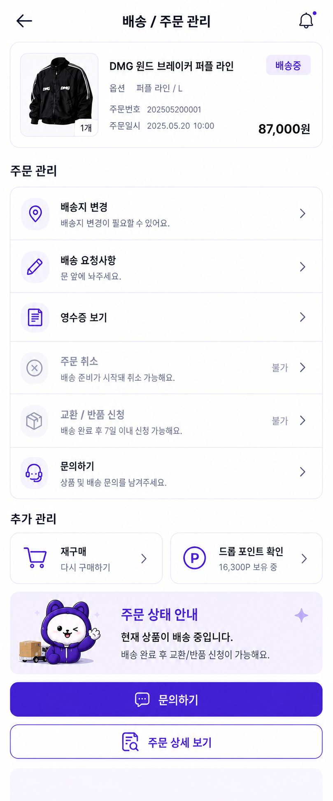
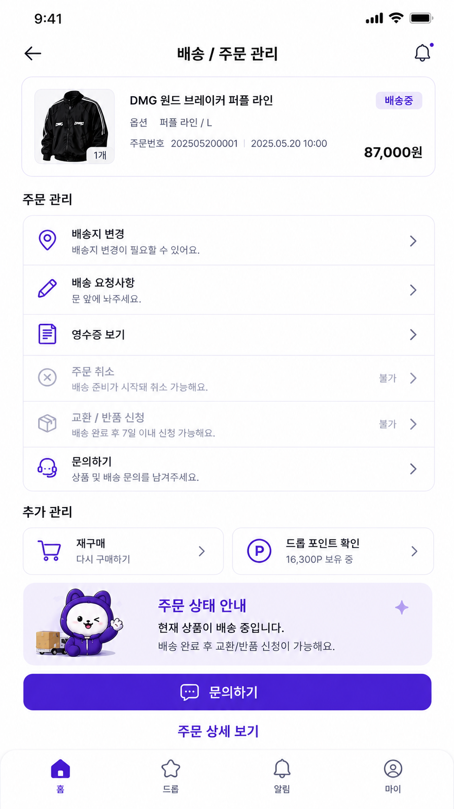
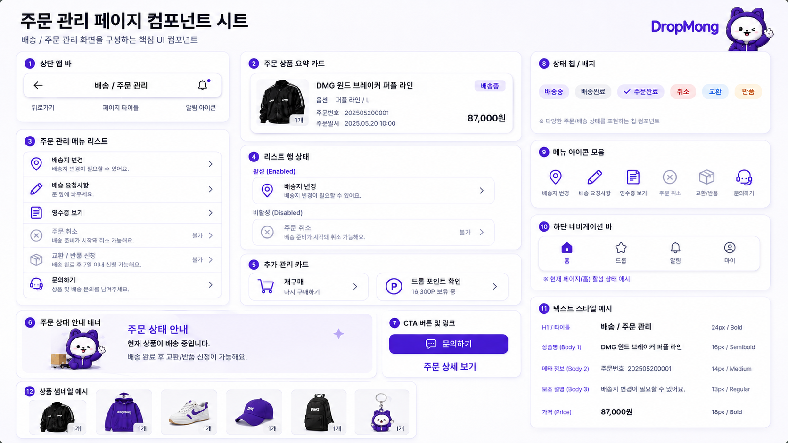

# 배송/주문 관리 페이지 UI

## 기본 정보

- UI ID: `UI.A.17`
- 연관 Page: [PAGE.A.17](../../10-sitemap/buyer-mobile-web/PAGE_A_17_shipping_order_manage.md)
- 에셋 유형: 화면 이미지, 컴포넌트 시트
- 파일 경로:
  - [배송/주문 관리 페이지](assets/UI_A_17_shipping_order_manage/UI_A_17_01_shipping_order_manage.png)
  - [배송/주문 관리 페이지 컴포넌트 시트](assets/UI_A_17_shipping_order_manage/UI_A_17_02_shipping_order_manage_component.png)
  - [구매자 모바일 웹 시안](assets/UI_A_17_shipping_order_manage/UI_A_17_10_buyer_mobile_web.png)
- 원본 URL: local
- 작성 일시: 기존 근거 2026-07-07, 모바일 웹 시안 2026-07-10
- 기존 근거 조건: DropMong 배송/주문 관리, 배송중 주문, 활성/비활성 메뉴, 추가 관리, 상태 안내 배너, CTA 버튼 상태
- 모바일 웹 시안 조건: 390px 브라우저 화면, 전역 하단 내비게이션 생략, 페이지 내부 콘텐츠와 주요 CTA 중심

## 연관 태그

🏷️ 요구사항 참조: [REQ.A.01](../../00-requirements/REQ_A_01_limited_drop_commerce.md), [REQ.A.02](../../00-requirements/REQ_A_02_coupon_benefit.md) | 페이지 참조: [PAGE.A.17](../../10-sitemap/buyer-mobile-web/PAGE_A_17_shipping_order_manage.md) | UC 참조: UC.A.17 | 영속성 참조: PST.A.17 | 서비스 참조: SVC.A.17 | 시나리오 참조: SCN.A.17 | API 참조: API.A.17

## 에셋

### 구매자 모바일 웹 시안

### 배송/주문 관리 페이지

### 컴포넌트 시트

## 화면 구성

| 번호 | 컴포넌트 | 역할 | 주요 상태/행동 |
| --- | --- | --- | --- |
| 1 | 상단 앱 바 | 뒤로가기, 페이지 제목, 알림 진입을 제공한다. | 뒤로가기, 알림 |
| 2 | 주문 상품 요약 카드 | 주문 대상 상품, 옵션, 주문번호, 주문일시, 가격, 상태를 요약한다. | 상품 확인, 주문 확인 |
| 3 | 주문 관리 메뉴 리스트 | 배송지 변경, 배송 요청사항, 영수증, 주문 취소, 교환/반품, 문의하기를 제공한다. | 메뉴 이동 |
| 4 | 리스트 행 상태 | 활성/비활성 행과 불가 사유 표시 방식을 정의한다. | 활성, 비활성 |
| 5 | 추가 관리 카드 | 재구매와 드롭 포인트 확인을 제공한다. | 재구매, 포인트 확인 |
| 6 | 주문 상태 안내 배너 | 현재 배송/주문 상태와 후속 가능 조건을 안내한다. | 상태 설명 |
| 7 | CTA 버튼 및 링크 | 문의하기와 주문 상세 보기 액션을 제공한다. | 기본, 링크 |
| 8 | 상태 칩/배지 | 배송중, 배송완료, 주문완료, 취소, 교환, 반품 칩을 정의한다. | 상태 표시 |
| 9 | 메뉴 아이콘 모음 | 배송지, 요청사항, 영수증, 취소, 교환/반품, 문의 아이콘을 정의한다. | 아이콘 상태 |
| 10 | 하단 내비게이션 바 | 홈, 드롭, 알림, 마이 탭을 제공한다. | 전역 탭 이동 |
| 11 | 텍스트 스타일 예시 | 제목, 상품명, 메타, 보조 설명, 가격 텍스트 계층을 정의한다. | 정보 위계 |
| 12 | 상품 썸네일 예시 | 주문 상품 썸네일과 수량 배지를 보여준다. | 상품 이미지 표시 |

## 화면에 필요한 정보

| 화면 영역 | 필드 | 타입 | 용도 |
| --- | --- | --- | --- |
| 주문 | `orderId` | string | 주문 식별 |
| 주문 | `orderNumber` | string | 주문번호 표시 |
| 주문 | `orderedAt` | datetime | 주문일시 표시 |
| 주문 | `status` | enum | 배송중, 배송완료, 주문완료, 취소 등 상태 표시 |
| 상품 | `product.productId` | string | 상품 상세 연결 |
| 상품 | `product.productName` | string | 상품명 표시 |
| 상품 | `product.thumbnailUrl` | image | 상품 썸네일 표시 |
| 상품 | `product.optionLabel` | string | 옵션 표시 |
| 상품 | `product.quantity` | number | 수량 배지 표시 |
| 금액 | `payment.finalAmount` | number | 결제 금액 표시 |
| 메뉴 | `managementMenus[].menuId` | string | 메뉴 식별 |
| 메뉴 | `managementMenus[].label` | string | 메뉴명 표시 |
| 메뉴 | `managementMenus[].description` | string | 보조 설명 표시 |
| 메뉴 | `managementMenus[].iconName` | string | 아이콘 표시 |
| 메뉴 | `managementMenus[].enabled` | boolean | 활성 여부 |
| 메뉴 | `managementMenus[].disabledReason` | string? | 불가 사유 표시 |
| 추가 관리 | `repurchase.enabled` | boolean | 재구매 가능 여부 |
| 추가 관리 | `point.balance` | number | 보유 포인트 표시 |
| 안내 | `statusGuide.title` | string | 주문 상태 안내 제목 |
| 안내 | `statusGuide.description` | string | 상태 설명 문구 |
| 액션 | `actions.canInquiry` | boolean | 문의하기 활성 |
| 액션 | `actions.canViewOrderDetail` | boolean | 주문 상세 보기 활성 |

## 화면에서 확인한 행동

- 사용자는 특정 주문의 상품, 옵션, 주문번호, 주문일시, 가격, 배송 상태를 확인한다.
- 사용자는 배송지 변경과 배송 요청사항을 선택한다.
- 사용자는 영수증을 확인한다.
- 사용자는 상태에 따라 주문 취소와 교환/반품 신청 가능 여부를 확인한다.
- 사용자는 상품 및 배송 문의를 남길 수 있다.
- 사용자는 재구매와 드롭 포인트 확인으로 이동한다.
- 사용자는 주문 상태 안내 배너로 현재 가능한 후속 행동을 이해한다.

## 설계 반영 사항

- Read Model 후보: `RM.A.17 ShippingOrderManageReadModel`
- Query 후보: `QRY.A.19.GetShippingOrderManage`
- Command 후보: `CMD.A.33.ChangeDeliveryAddress`, `CMD.A.34.UpdateDeliveryRequest`, `CMD.A.35.ViewReceipt`, `CMD.A.36.CancelOrder`, `CMD.A.37.RequestExchangeReturn`, `CMD.A.38.CreateOrderInquiry`, `CMD.A.39.RepurchaseOrderItem`
- Error 후보: `ERR.A.34.ORDER_MANAGE_NOT_FOUND`, `ERR.A.35.ORDER_ACTION_NOT_ALLOWED`, `ERR.A.36.ORDER_CANCEL_EXPIRED`, `ERR.A.37.EXCHANGE_RETURN_NOT_ALLOWED`, `ERR.A.38.ORDER_MANAGE_ACCESS_DENIED`
- 권한 후보: 배송/주문 관리는 주문 소유자 로그인 필요

## 확인 필요

- 주문 상태별 메뉴 활성/비활성 매트릭스
- 주문 취소와 교환/반품 신청의 확인 모달 문구
- 영수증 보기 방식과 결제 영수증 보관 정책
- 재구매 동작: 상품 상세 이동 또는 장바구니 즉시 담기
- 문의하기에서 상품 문의와 배송 문의를 나눌지 여부
- “주문 상세 보기”를 별도 화면으로 분리할지 현재 관리 화면 안에서 확장할지 여부
