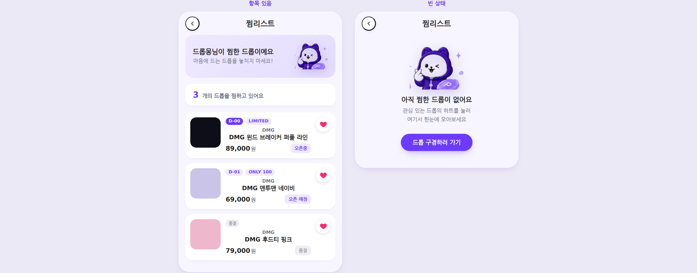
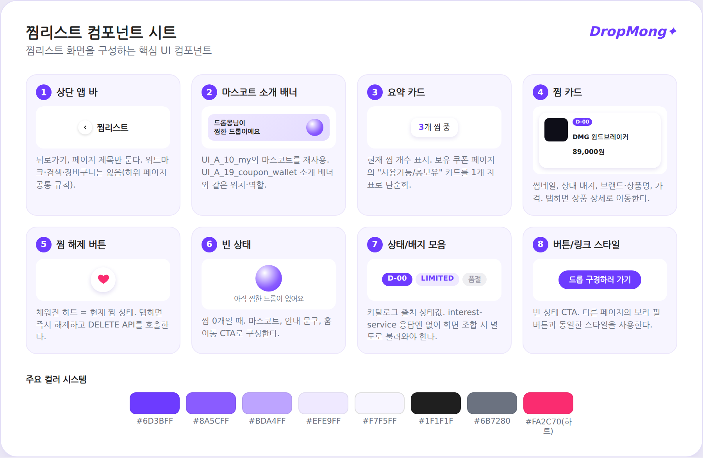

# 찜리스트 페이지 UI

## 기본 정보

- UI ID: `UI.A.22`
- 연관 Page: [PAGE.A.22](../../10-sitemap/buyer-mobile-web/PAGE_A_22_wishlist.md)
- 에셋 유형: 화면 이미지, 컴포넌트 시트
- 파일 경로:
  - [구매자 모바일 웹 시안](assets/UI_A_22_wishlist/UI_A_22_10_buyer_mobile_web.png)
  - [찜리스트 페이지 컴포넌트 시트](assets/UI_A_22_wishlist/UI_A_22_02_wishlist_component.png)
  - [인터랙티브 버전(Artifact, 하트 탭 등 실제 동작 확인용)](https://claude.ai/code/artifact/3a8b83b5-94f5-4bfb-88cb-d9108684c203)
- 원본 URL: local — Playwright(Chromium headless)로 직접 제작한 HTML을 렌더링해 png로 캡처(공식 디자인 자산 아님)
- 작성 일시: 2026-07-13(1차) → 2026-07-13(팀 컬러 토큰/마스코트/레이아웃 재작업) → 2026-07-13(png 캡처로 최종화)
- 작성 조건: 390px 모바일 웹 기준, 전역 하단 내비게이션 생략, 항목 있음/빈 상태 두 화면 + 8개 컴포넌트 분해도

> 이 페이지는 `UI_A_02`/`UI_A_10`/`UI_A_15`처럼 "기존 UI 근거"(디자인팀이 만든 원본 스크린샷)가 없다 — 찜리스트 자체가 이번에 처음 채워지는 문서라서다. 대신 다른 페이지들과 동일한 파일 구성(화면 시안 png + 컴포넌트 시트 png)을 갖추기 위해, 직접 작성한 HTML을 Playwright 헤드리스 브라우저로 렌더링해 실제 png 파일로 캡처했다. 인터랙티브 버전(하트 탭 시 카드가 빠지는 동작 등)은 Artifact 링크로 별도 유지한다.

## 연관 태그

🏷️ 요구사항 참조: [REQ.A.07](../../00-requirements/REQ_A_07_interest_ranking.md) | 페이지 참조: [PAGE.A.22](../../10-sitemap/buyer-mobile-web/PAGE_A_22_wishlist.md) | UC 참조: [UC.A.07-02](../../30-uc/UC_A_07_interest_ranking.md) | 영속성 참조: [PST.A.0720](../../50-service-design/A_07_interest_ranking/A_07_20-persistence/persistence-design.md) | 서비스 참조: [SD.A.0730](../../50-service-design/A_07_interest_ranking/A_07_30-service/service-design.md) | 시나리오 참조: SCN.A.07 예정 | API 참조: [API.A.07-03](../../50-service-design/A_07_interest_ranking/A_07_40-api/openapi/paths/API_A_07_03_list_my_interests.yaml)

## 에셋 제작 근거

이 화면은 기존 시안 이미지 라이브러리에 없던 페이지라, 새 팔레트나 새 레이아웃을 만드는 대신 이미 확정된 화면에서 색·마스코트·구조를 그대로 가져왔다(2026-07-13 1차 작성 후 사용자 피드백으로 재작업).

**색상** — `UI_A_10_my` 컴포넌트 시트(`UI_A_10_02_my_component.png`)에 실제로 라벨링된 "주요 컬러 시스템" 8종을 그대로 사용했다(추정 추출 아님, 이미지에 텍스트로 박제된 공식 값).

| 토큰 | 값 | 근거 |
| --- | --- | --- |
| 액센트(보라, 진함) | `#6D3BFF` | 컴포넌트 시트 공식 컬러 라벨, CTA/D-day 배지 |
| 액센트(보라, 밝음) | `#8A5CFF` | 컴포넌트 시트 공식 컬러 라벨 |
| 라벤더 | `#BDA4FF` | 컴포넌트 시트 공식 컬러 라벨 |
| 틴트 배경/배지 | `#EFE9FF` | 컴포넌트 시트 공식 컬러 라벨, `LIMITED` 배지 배경 |
| 페이지 배경 | `#F7F5FF` | 컴포넌트 시트 공식 컬러 라벨 |
| 본문 텍스트 | `#1F1F1F` | 컴포넌트 시트 공식 컬러 라벨 |
| 보조 텍스트 | `#6B7280` | 컴포넌트 시트 공식 컬러 라벨 |
| 찜 활성 하트 | `#FA2C70` | `UI_A_01_homepage` 실시간 랭킹의 채워진 하트를 Python/Pillow로 픽셀 샘플링해 확인 |

**마스코트** — 새로 그리지 않고, `UI_A_10_my` 컴포넌트 시트의 프로필 히어로 카드 영역(윙크하는 드롭몽)을 Python/Pillow로 크롭한 뒤 배경을 제거해 재사용했다.

**화면 구조** — 임의로 구성하지 않고, 이미 작성 완료된 `UI_A_19_coupon_wallet`(보유 쿠폰 페이지)의 실제 레이아웃 순서(뒤로가기+제목 앱 바 → 마스코트가 있는 소개 배너 → 요약 카드 → 아이템 목록)를 그대로 따랐다. 단, 필터 탭(전체/사용가능/사용완료/만료)은 넣지 않았다 — `API.A.07-03`이 활성 찜만 반환하고 상태 필터 파라미터가 없어서, 실제로 없는 서버 기능을 화면에 그려 넣지 않기 위한 의도적 차이다.

## 에셋

### 구매자 모바일 웹 시안

### 컴포넌트 시트

### 인터랙티브 버전

위 두 이미지는 정적 캡처본이다. 하트 탭 시 카드가 빠지고 개수가 줄어드는 실제 동작은 [Artifact 링크](https://claude.ai/code/artifact/3a8b83b5-94f5-4bfb-88cb-d9108684c203)에서 직접 눌러볼 수 있다.

## 화면 구성

| 번호 | 컴포넌트 | 역할 | 주요 상태/행동 |
| --- | --- | --- | --- |
| 1 | 상단 앱 바 | 뒤로가기, 페이지 제목, 찜 개수 표시를 제공한다. | 마이로 복귀, 개수 표시 |
| 2 | 찜 카드 | 찜한 드롭 하나를 썸네일·배지·이름·가격과 함께 보여준다. | 상품 상세 이동, 찜 해제 |
| 3 | 드롭 상태 배지 | D-day, LIMITED, ONLY, 품절 같은 카탈로그 상태를 짧게 보여준다. | 정보성 표시(카탈로그 데이터 조합 필요) |
| 4 | 찜 해제 버튼(채워진 하트) | 현재 화면에서 바로 찜을 해제한다. | 탭 시 카드 제거, 토스트 안내 |
| 5 | 빈 상태 | 찜한 드롭이 없을 때 안내와 탐색 유도를 제공한다. | 홈 이동 CTA |

## 화면에 필요한 정보

| 화면 영역 | 필드 | 타입 | 용도 |
| --- | --- | --- | --- |
| 앱 바 | `totalCount` | number | 찜 개수 표시 |
| 찜 카드 | `dropId` | string | 상품 상세 이동, 찜 해제 요청 대상 |
| 찜 카드 | `thumbnailUrl` | image | 상품 썸네일 표시 |
| 찜 카드 | `brandDisplayName` | string | 브랜드명 표시 |
| 찜 카드 | `productName` | string | 상품명 표시 |
| 찜 카드 | `price` | number | 가격 표시 |
| 찜 카드 | `dropStatus` | enum | D-day/오픈중/오픈예정/품절 배지 표시(카탈로그 출처) |
| 찜 카드 | `badges[]` | string[] | LIMITED, ONLY 같은 배지 표시(카탈로그 출처) |
| 찜 카드 | `interestedAt` | datetime | 정렬 후보(찜한 시각) |
| 페이지네이션 | `nextCursor` | string? | 다음 페이지 커서 |
| 페이지네이션 | `hasNext` | boolean | 추가 로드 가능 여부 |

## 화면에서 확인한 행동

- 사용자는 자신이 찜한 드롭 목록을 한 화면에서 확인한다.
- 사용자는 찜 카드를 선택해 해당 드롭의 상품 상세로 이동한다.
- 사용자는 찜 카드의 하트 버튼을 눌러 그 자리에서 바로 찜을 해제한다.
- 사용자는 찜한 드롭이 없을 때 안내 문구와 CTA를 통해 홈으로 이동해 새로운 드롭을 탐색한다.

## 설계 반영 사항

- Read Model 후보: `RM.A.22 WishlistReadModel`(interest-service의 찜 목록 + catalog-service의 드롭 표시 정보를 화면 조합 시점에 합친 결과)
- Command 후보: `CMD.A.07.RemoveInterest`(찜리스트 화면에서의 찜 해제, 상품 상세의 `ToggleInterest`와 동일 API를 재사용)
- Error 후보: `ERR.A.22.WISHLIST_LOGIN_REQUIRED`, `ERR.A.22.INTEREST_REMOVE_FAILED`, `ERR.A.22.CATALOG_INFO_UNAVAILABLE`
- 권한 후보: 찜리스트 전체가 로그인 필요(비회원 접근 불가)

## 확인 필요

- 찜 해제를 낙관적 업데이트로 할지 서버 응답 대기 후 반영할지
- 찜 목록(interest-service)과 드롭 표시 정보(catalog-service)를 프론트에서 합칠지 BFF에서 합칠지
- 품절/종료된 드롭을 찜리스트에서 계속 보여줄지, 별도 섹션으로 분리할지
- 정렬 기준(찜한 최신순 vs 드롭 오픈 임박순)
- 페이지당 개수와 무한 스크롤 여부
