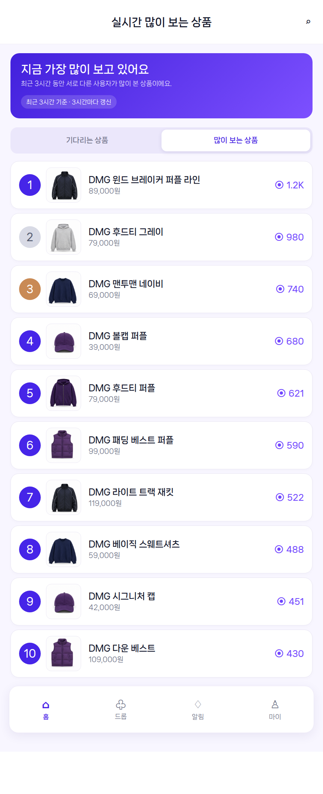

# 실시간 많이 보는 상품 랭킹 UI

## 기본 정보

- UI ID: `UI.A.23`
- 연관 Page: [PAGE.A.23](../../10-sitemap/buyer-mobile-web/PAGE_A_23_trending_products.md)
- 진입점: 홈의 `실시간 많이 보는 상품 > 전체 보기`
- 집계 기준: 최근 3시간 서로 다른 조회자 수 내림차순
- 최대 노출: 100위

## 에셋

## 화면 구성

| 영역 | 역할 | 상태/행동 |
| --- | --- | --- |
| 상단 앱 바 | 뒤로가기, 제목, 검색 진입 | 홈 복귀, 상품 검색 |
| 기준 안내 카드 | 랭킹의 시간 범위와 갱신 주기 표시 | `최근 3시간 기준 · 3시간마다 갱신` |
| 랭킹 전환 탭 | 두 랭킹 전체보기 사이 이동 | 많이 보는 상품 활성, 기다리는 상품 이동 |
| Top 100 리스트 | 순위, 상품 썸네일, 상품명, 가격, 조회자 수 표시 | 카드 선택 시 상품 상세 이동 |

## 데이터와 예외

- `GET /v1/rankings/drops/trending`(`API.A.07-08`)의 최신 `bucketStart` 스냅샷을 사용한다.
- 조회자 수는 단순 페이지뷰가 아니라 최근 구간의 서로 다른 조회자 수다.
- 새 구간 집계가 아직 준비되지 않았으면 직전 구간 값을 유지하고 기준 시각을 함께 표시한다.
- 목록이 비어 있으면 `최근 집계된 상품이 없어요`와 홈 이동 CTA를 표시한다.

## 제작 근거

홈 시안의 카드·순위 배지를 유지하고 하트 대신 보라색 조회 아이콘을 사용했다. 두 전체보기 화면은 같은 탭과 리스트 골격을 공유해 랭킹 기준만 다르다는 점이 명확하게 보이도록 했다.

## 연관 태그

🏷️ 요구사항 참조: [REQ.A.07](../../00-requirements/REQ_A_07_interest_ranking.md) | 페이지 참조: [PAGE.A.23](../../10-sitemap/buyer-mobile-web/PAGE_A_23_trending_products.md) | UC 참조: [UC.A.07](../../30-uc/UC_A_07_interest_ranking.md) | API 참조: [API.A.07-08](../../50-service-design/A_07_interest_ranking/A_07_40-api/README.md)

