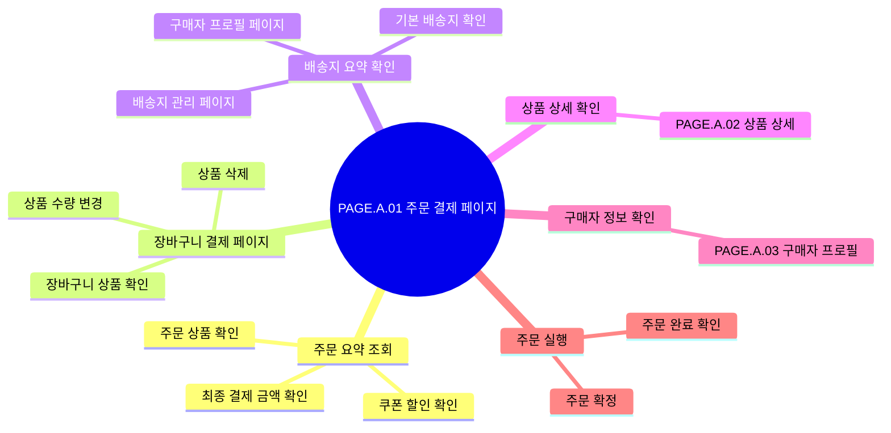

# 주문을 확정한다

## 기본 정보

- UC ID: `UC.A.01`
- 사용자: 구매자
- 기준 페이지: [PAGE.A.01](../../10-sitemap/.examples/PAGE_A_01_order_checkout.md)
- 기준 기능: 주문 결제

## 연관 태그

🏷️ 플로우 참조: FLOW.A.01 | 요구사항 참조: [REQ.A.01](../00-requirements/.examples/REQ_A_01_order_checkout.md) | 페이지 참조: [PAGE.A.01](../../10-sitemap/.examples/PAGE_A_01_order_checkout.md) | UI 참조: [UI.A.01](../../20-ui/.examples/UI_A_01_order_checkout_wireframe.md) | 영속성 참조: [PST.A.01](../../55-persistence/.examples/PST_A_01_order_persistence.md) | 서비스 참조: [SVC.A.01](../../60-service/.examples/SVC_A_01_order_service.md) | 시나리오 참조: [SCN.A.01](../../80-scenario/.examples/SCN_A_01_place_order.md) | API 참조: [API.A.01](../../70-api/.examples/API_A_01_place_order.md)

## 유스케이스

## 사용자에게 보이는 결과

- 주문 번호를 확인한다.
- 주문 완료 메시지를 확인한다.
- 주문 완료 페이지로 이어진다.

## 사용자가 처리해야 하는 상황

- 품절 상품을 확인한다.
- 변경된 금액을 다시 확인한다.
- 사용할 수 없는 쿠폰을 제거하거나 변경한다.

## 인수 조건

- 서버 계산 금액이 클라이언트 표시 금액과 다르면 주문을 생성하지 않는다.
- 동일 idempotency key로 재요청하면 같은 주문 생성 결과를 반환한다.
