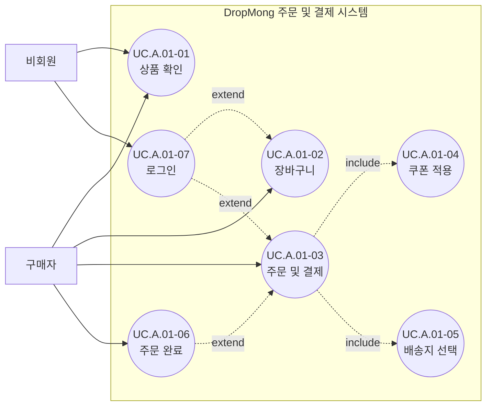

# 주문 및 결제 사용자 목표

## 기본 정보

- UC ID: `UC.A.01`
- 사용자: 비회원, 구매자
- 기준 페이지: [PAGE.A.01](../../10-sitemap/.examples/PAGE_A_01_order_checkout.md)
- 기준 기능: 상품 확인, 장바구니, 주문/결제, 쿠폰 적용, 배송지 선택, 주문 완료
- 제외 범위: PG 승인 처리, 재고 배정 내부 로직, 정산, 판매자 출고 처리

## 연관 태그

- 🏷️ 플로우 참조: FLOW.A.01
- 🏷️ 요구사항 참조: [REQ.A.01](../00-requirements/.examples/REQ_A_01_order_checkout.md)
- 🏷️ 페이지 참조: [PAGE.A.01](../../10-sitemap/.examples/PAGE_A_01_order_checkout.md)
- 🏷️ UI 참조: [UI.A.01](../../20-ui/.examples/UI_A_01_order_checkout_wireframe.md)
- 🏷️ 영속성 참조: [PST.A.01](../../55-persistence/.examples/PST_A_01_order_persistence.md)
- 🏷️ 서비스 참조: [SVC.A.01](../../60-service/.examples/SVC_A_01_order_service.md)
- 🏷️ 시나리오 참조: [SCN.A.01](../../80-sequence/.examples/SCN_A_01_place_order.md)
- 🏷️ API 참조: [API.A.01](../../70-api/.examples/API_A_01_place_order.md)

## 유스케이스

## 사용자 목표

| UC ID | 액터 | 사용자 목표 | 설명 | 연결 요구사항 |
| --- | --- | --- | --- | --- |
| `UC.A.01-01` | 비회원, 구매자 | 상품 확인 | 주문하려는 상품의 가격, 옵션, 판매 상태를 확인한다. | `REQ.A.01.FR-001` |
| `UC.A.01-02` | 구매자 | 장바구니 | 구매 후보 상품과 수량을 담아 주문 전까지 관리한다. | `REQ.A.01.FR-002` |
| `UC.A.01-03` | 구매자 | 주문 및 결제 | 배송지, 쿠폰, 결제 수단을 확인하고 주문을 확정한다. | `REQ.A.01.FR-003` |
| `UC.A.01-04` | 구매자 | 쿠폰 적용 | 주문에 사용할 수 있는 쿠폰을 선택한다. | `REQ.A.01.FR-004` |
| `UC.A.01-05` | 구매자 | 배송지 선택 | 주문 상품을 받을 배송지를 선택한다. | `REQ.A.01.FR-005` |
| `UC.A.01-06` | 구매자 | 주문 완료 | 주문번호와 결제 결과를 확인한다. | `REQ.A.01.FR-006` |
| `UC.A.01-07` | 비회원 | 로그인 | 장바구니 또는 주문 및 결제를 위해 구매자 계정으로 전환한다. | `REQ.A.01.FR-007` |
