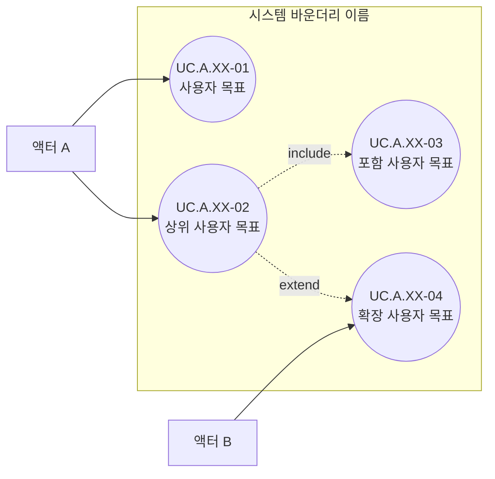

# 유스케이스 이름

## 기본 정보

- UC ID: `UC.A.XX`
- 사용자:
- 기준 페이지:
- 기준 기능:
- 제외 범위:

## 연관 태그

- 🏷️ 플로우 참조: FLOW.A.XX
- 🏷️ 요구사항 참조: [REQ.A.XX](../00-requirements/REQ_A_XX_name.md)
- 🏷️ 페이지 참조: [PAGE.A.XX](../10-sitemap/PAGE_A_XX_name.md)
- 🏷️ UI 참조: [UI.A.XX](../20-ui/UI_A_XX_name.md)
- 🏷️ 영속성 참조: [PST.A.XX](../55-persistence/PST_A_XX_name.md)
- 🏷️ 서비스 참조: [SVC.A.XX](../60-service/SVC_A_XX_name.md)
- 🏷️ 시나리오 참조: [SCN.A.XX](../80-sequence/SCN_A_XX_name.md)
- 🏷️ API 참조: [API.A.XX](../70-api/API_A_XX_name.md)

## 유스케이스

## 사용자 목표

| UC ID | 액터 | 사용자 목표 | 설명 | 연결 요구사항 |
| --- | --- | --- | --- | --- |
| `UC.A.XX-01` | 액터 A | 사용자 목표 | 사용자가 달성하려는 목표를 명사형으로 적는다. | `REQ.A.XX.FR-001` |
| `UC.A.XX-02` | 액터 A | 상위 사용자 목표 | 여러 선택지가 모이는 상위 목표를 적는다. | `REQ.A.XX.FR-002` |
| `UC.A.XX-03` | 액터 A | 포함 사용자 목표 | 상위 목표에 항상 포함되는 목표를 적는다. | `REQ.A.XX.FR-003` |
| `UC.A.XX-04` | 액터 B | 확장 사용자 목표 | 조건에 따라 확장되는 목표를 적는다. | `REQ.A.XX.FR-004` |
