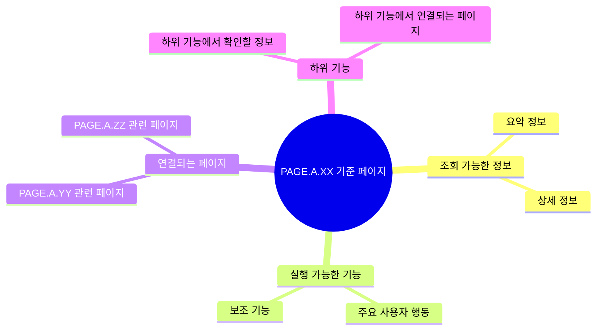

# 유스케이스 이름

## 기본 정보

- UC ID: `UC.A.XX`
- 사용자:
- 기준 페이지:
- 기준 기능:
- 제외 범위:

## 연관 태그

🏷️ 플로우 참조: FLOW.A.XX | 요구사항 참조: [REQ.A.XX](../00-requirements/REQ_A_XX_name.md) | 페이지 참조: [PAGE.A.XX](../10-sitemap/PAGE_A_XX_name.md) | UI 참조: [UI.A.XX](../20-ui/UI_A_XX_name.md) | 영속성 참조: [PST.A.XX](../55-persistence/PST_A_XX_name.md) | 서비스 참조: [SVC.A.XX](../60-service/SVC_A_XX_name.md) | 시나리오 참조: [SCN.A.XX](../80-scenario/SCN_A_XX_name.md) | API 참조: [API.A.XX](../70-api/API_A_XX_name.md)

## 유스케이스

이미지, 다이어그램, 텍스트 중 현재 설계 단계에서 가장 이해하기 쉬운 형태로 기준 페이지에서 확인하거나 실행하거나 연결되는 대상을 표현한다.

## 사용자에게 보이는 결과

-

## 사용자가 처리해야 하는 상황

-

## 인수 조건

-
