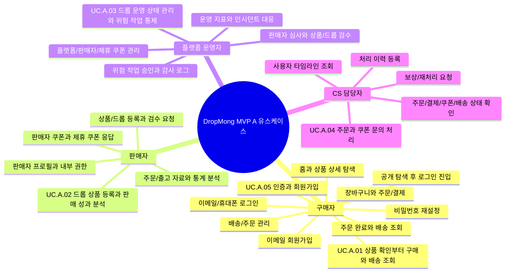

# 유스케이스 인덱스

## 역할

액터별로 DropMong MVP A에서 사용자가 확인하거나 실행할 수 있는 대상을 mindmap으로 정리하는 인덱스다.

## 템플릿

- [유스케이스 템플릿](.template/use-case.md)

## 액터별 유스케이스 지도

## 유스케이스 목록

- [UC.A.01 구매 및 배송 사용자 목표](UC_A_01_buyer_purchase_delivery.md)
- [UC.A.02 판매자 드롭 운영 사용자 목표](UC_A_02_seller_manage_drop.md)
- [UC.A.03 플랫폼 운영 사용자 목표](UC_A_03_platform_operator_admin.md)
- [UC.A.04 CS 주문 및 쿠폰 지원 사용자 목표](UC_A_04_cs_order_coupon_support.md)
- [UC.A.05 인증 및 회원 사용자 목표](UC_A_05_auth_member.md)

## 예시 문서

- [UC.A.01 주문을 확정한다](.examples/UC_A_01_place_order.md)

## 연관 태그

- 🏷️ 요구사항 참조: [REQ.A.01](../00-requirements/REQ_A_01_limited_drop_commerce.md), [REQ.A.02](../00-requirements/REQ_A_02_coupon_benefit.md), [REQ.A.03](../00-requirements/REQ_A_03_seller.md), [REQ.A.04](../00-requirements/REQ_A_04_platform_operator_admin.md), [REQ.A.05](../00-requirements/REQ_A_05_auth_member.md)
- 🏷️ 페이지 참조: [PAGE.A.01](../10-sitemap/PAGE_A_01_homepage.md), [PAGE.A.02](../10-sitemap/PAGE_A_02_product_detail.md), [PAGE.A.06](../10-sitemap/PAGE_A_06_shopping_cart.md), [PAGE.A.10](../10-sitemap/PAGE_A_10_my.md), [PAGE.A.11](../10-sitemap/PAGE_A_11_payment.md), [PAGE.A.14](../10-sitemap/PAGE_A_14_order_complete.md), [PAGE.A.15](../10-sitemap/PAGE_A_15_order_history.md), [PAGE.A.16](../10-sitemap/PAGE_A_16_track_order.md), [PAGE.A.17](../10-sitemap/PAGE_A_17_shipping_order_manage.md), [PAGE.A.300](../10-sitemap/PAGE_A_300_auth_member/PAGE_A_300_auth_member.md), [PAGE.A.310](../10-sitemap/PAGE_A_310_password_find/PAGE_A_310_password_find.md)
- 🏷️ UI 참조: [UI.A.01](../20-ui/UI_A_01_homepage.md), [UI.A.02](../20-ui/UI_A_02_product_detail.md), [UI.A.06](../20-ui/UI_A_06_shopping_cart.md), [UI.A.10](../20-ui/UI_A_10_my.md), [UI.A.11](../20-ui/UI_A_11_payment.md), [UI.A.14](../20-ui/UI_A_14_order_complete.md), [UI.A.15](../20-ui/UI_A_15_order_history.md), [UI.A.16](../20-ui/UI_A_16_track_order.md), [UI.A.17](../20-ui/UI_A_17_shipping_order_manage.md), [UI.A.300](../20-ui/UI_A_300_auth_member/UI_A_300_auth_member.md), [UI.A.310](../20-ui/UI_A_310_password_find/UI_A_310_password_find.md)
- 🏷️ 영속성 참조: PST.A.01-PST.A.05
- 🏷️ 서비스 참조: SVC.A.01-SVC.A.05
- 🏷️ 시나리오 참조: SCN.A.01-SCN.A.05
- 🏷️ API 참조: API.A.01-API.A.05

## 확인 필요

- 판매자 포털과 플랫폼 운영자 사이트의 Page ID/UI ID 발급
- CS 조회/처리 화면을 플랫폼 운영자 사이트 안의 하위 화면으로 둘지 별도 페이지로 둘지 결정
- 구매자 후속 페이지 중 배송지 변경, 교환/반품, 문의하기의 Page ID 확정
- 인증/회원 UC가 서비스/API 문서로 내려갈 때 세션, 휴대폰 인증, 계정 잠금, 감사 이벤트의 세부 ID 확정
