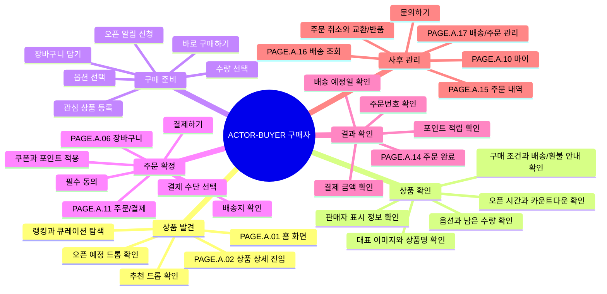

# 구매자는 드롭 상품을 확인하고 구매와 배송을 추적한다

## 기본 정보

- UC ID: `UC.A.01`
- 사용자: 구매자, 비회원 방문자
- 기준 페이지: [PAGE.A.01 홈 화면](../10-sitemap/PAGE_A_01_homepage.md), [PAGE.A.02 상품 상세](../10-sitemap/PAGE_A_02_product_detail.md), [PAGE.A.11 주문/결제](../10-sitemap/PAGE_A_11_payment.md), [PAGE.A.16 배송 조회](../10-sitemap/PAGE_A_16_track_order.md)
- 기준 기능: 상품 확인, 알림 신청, 옵션 선택, 장바구니, 주문/결제, 주문 완료, 주문 내역, 배송 조회, 배송/주문 관리
- 제외 범위: 판매자 상품 등록, 플랫폼 운영자 검수, CS 내부 처리, 정산, 물류 실행 시스템

## 연관 태그

🏷️ 플로우 참조: FLOW.A.01 | 요구사항 참조: [REQ.A.01](../00-requirements/REQ_A_01_limited_drop_commerce.md), [REQ.A.02](../00-requirements/REQ_A_02_coupon_benefit.md) | 페이지 참조: [PAGE.A.01](../10-sitemap/PAGE_A_01_homepage.md), [PAGE.A.02](../10-sitemap/PAGE_A_02_product_detail.md), [PAGE.A.06](../10-sitemap/PAGE_A_06_shopping_cart.md), [PAGE.A.10](../10-sitemap/PAGE_A_10_my.md), [PAGE.A.11](../10-sitemap/PAGE_A_11_payment.md), [PAGE.A.14](../10-sitemap/PAGE_A_14_order_complete.md), [PAGE.A.15](../10-sitemap/PAGE_A_15_order_history.md), [PAGE.A.16](../10-sitemap/PAGE_A_16_track_order.md), [PAGE.A.17](../10-sitemap/PAGE_A_17_shipping_order_manage.md) | UI 참조: [UI.A.01](../20-ui/UI_A_01_homepage.md), [UI.A.02](../20-ui/UI_A_02_product_detail.md), [UI.A.06](../20-ui/UI_A_06_shopping_cart.md), [UI.A.10](../20-ui/UI_A_10_my.md), [UI.A.11](../20-ui/UI_A_11_payment.md), [UI.A.14](../20-ui/UI_A_14_order_complete.md), [UI.A.15](../20-ui/UI_A_15_order_history.md), [UI.A.16](../20-ui/UI_A_16_track_order.md), [UI.A.17](../20-ui/UI_A_17_shipping_order_manage.md) | 영속성 참조: PST.A.01 | 서비스 참조: SVC.A.01 | 시나리오 참조: SCN.A.01 | API 참조: API.A.01

## 유스케이스

## 사전 조건

- 비회원은 홈, 상품 상세, 검색성 탐색 화면을 볼 수 있다.
- 구매 시도, 장바구니, 주문/결제, 주문 내역, 배송 조회는 로그인 사용자를 기준으로 한다.
- 상품은 판매자 또는 플랫폼 운영자 검수 후 구매자 화면에 노출된다.
- 드롭 오픈 시간, 판매 수량, 구매 제한, 가격, 배송 조건이 서버 기준으로 존재한다.

## 기본 흐름

| 순서 | 사용자 행동 | 시스템 응답 | 연결 문서 |
| --- | --- | --- | --- |
| 1 | 구매자가 홈에서 진행 중이거나 예정된 드롭 상품을 확인한다. | 추천 드롭, 오픈 예정, 큐레이션, 랭킹 상품을 표시한다. | [PAGE.A.01](../10-sitemap/PAGE_A_01_homepage.md), `REQ.A.01.FR-001` |
| 2 | 구매자가 상품 카드를 선택한다. | 상품 상세로 이동하고 상품 정보, 드롭 상태, 옵션, 구매 조건을 표시한다. | [PAGE.A.02](../10-sitemap/PAGE_A_02_product_detail.md), `REQ.A.01.FR-002` |
| 3 | 오픈 전이면 구매자가 드롭 오픈 알림을 신청한다. | 로그인 상태와 알림 수신 가능 여부를 확인하고 신청 상태를 저장한다. | `REQ.A.01.FR-003`, `REQ.A.01.FR-004` |
| 4 | 오픈 중이면 구매자가 옵션과 수량을 선택한다. | 선택 가능 옵션, 남은 수량, 1인 구매 제한을 검증한다. | [PAGE.A.02](../10-sitemap/PAGE_A_02_product_detail.md), `REQ.A.01.FR-005` |
| 5 | 구매자가 장바구니에 담거나 바로 구매를 선택한다. | 장바구니 상태 또는 체크아웃 스냅샷을 만들고 주문 가능 여부를 다시 확인한다. | [PAGE.A.06](../10-sitemap/PAGE_A_06_shopping_cart.md), [PAGE.A.11](../10-sitemap/PAGE_A_11_payment.md) |
| 6 | 구매자가 배송지, 쿠폰, 포인트, 결제 수단, 필수 동의를 확인한다. | 서버 기준으로 가격, 쿠폰, 배송비, 재고, 결제 가능 상태를 재계산한다. | [PAGE.A.11](../10-sitemap/PAGE_A_11_payment.md), `REQ.A.01.FR-010`, `REQ.A.02.FR-009` |
| 7 | 구매자가 결제하기를 선택한다. | 주문 생성, 재고 배정, 결제 요청, 결제 결과 반영을 멱등하게 처리한다. | `REQ.A.01.FR-008`, `REQ.A.01.FR-011` |
| 8 | 결제가 성공한다. | 주문 완료 페이지에서 주문번호, 결제 금액, 배송 예정일, 구매 상품을 보여준다. | [PAGE.A.14](../10-sitemap/PAGE_A_14_order_complete.md), `REQ.A.01.FR-012` |
| 9 | 구매자가 주문 내역 또는 배송 조회를 확인한다. | 주문 상태, 배송 상태, 운송장, 배송 타임라인을 표시한다. | [PAGE.A.15](../10-sitemap/PAGE_A_15_order_history.md), [PAGE.A.16](../10-sitemap/PAGE_A_16_track_order.md) |
| 10 | 구매자가 배송/주문 관리를 실행한다. | 주문 상태에 따라 배송지 변경, 영수증, 주문 취소, 교환/반품, 문의를 활성화한다. | [PAGE.A.17](../10-sitemap/PAGE_A_17_shipping_order_manage.md) |

## 예외 흐름

| 상황 | 처리 |
| --- | --- |
| 비회원이 알림, 장바구니, 구매 시도, 주문 내역에 진입한다. | 로그인으로 이동시키고 로그인 후 원래 의도한 위치로 복귀한다. |
| 오픈 전 구매 요청이 발생한다. | 구매 처리를 막고 오픈 전 상태와 추적 가능한 실패 코드를 반환한다. |
| 옵션 미선택, 수량 초과, 품절, 판매 종료 상태다. | CTA를 비활성화하거나 실패 사유를 표시하고 상품 상세 또는 장바구니에서 수정하도록 유도한다. |
| 결제 직전 가격, 재고, 쿠폰 조건이 바뀐다. | 서버 재계산 결과를 표시하고 사용자의 재확인을 요구한다. |
| 결제 승인 실패 또는 PG 지연이 발생한다. | 중복 결제를 만들지 않고 결제 수단 변경, 재시도, 주문서 복구 경로를 제공한다. |
| 주문은 성공했지만 알림 또는 후속 이벤트가 실패한다. | 주문 성공은 유지하고 실패 이벤트는 재처리/운영 확인 대상으로 남긴다. |
| 배송 상태 조회가 지연된다. | 마지막 갱신 시각과 재시도 또는 주문 내역 이동 경로를 제공한다. |

## 사용자에게 보이는 결과

- 구매자는 어떤 상품이 언제 열리는지 확인한다.
- 구매자는 드롭 오픈 전 알림을 신청하고 오픈 중 구매를 시도한다.
- 구매자는 주문/결제에서 최신 가격, 쿠폰, 배송비, 결제 수단을 확인한다.
- 구매자는 결제 성공 후 주문번호와 배송 예정 정보를 확인한다.
- 구매자는 주문 내역, 배송 조회, 배송/주문 관리에서 주문 이후 상태와 가능한 행동을 확인한다.

## 사용자가 처리해야 하는 상황

- 오픈 전에는 알림을 신청하거나 상품 정보를 확인한다.
- 오픈 중에는 옵션, 수량, 결제 수단, 쿠폰/포인트를 빠르게 확정한다.
- 품절, 결제 실패, 쿠폰 적용 불가, 배송 상태 지연 같은 실패 사유를 확인하고 다음 행동을 선택한다.
- 배송 이후에는 배송 조회, 주문 취소, 교환/반품, 문의하기 같은 사후 관리를 실행한다.

## 인수 조건

- 홈에서 진행 중/예정 드롭 상품을 썸네일 카드로 볼 수 있다.
- 상품 상세에서 오픈 시간, 판매 수량, 구매 제한, 옵션, 배송/환불 조건을 볼 수 있다.
- 비회원은 공개 탐색 화면을 볼 수 있고 구매/개인 정보 화면에서는 로그인으로 이동한다.
- 주문/결제에서 서버 기준 가격, 재고, 쿠폰, 포인트, 배송지, 결제 수단을 재검증한다.
- 같은 구매 요청을 반복해도 중복 주문이나 중복 결제가 생성되지 않는다.
- 주문 완료 후 주문 내역과 배송 조회에서 주문 상태를 확인할 수 있다.
- 배송/주문 관리에서 주문 상태에 따라 가능한 후속 행동만 활성화된다.

## 확인 필요

- 드롭 참여 방식: 즉시 선착순, 대기열, 추첨형 중 MVP 정책
- 오픈 전 장바구니 담기 허용 여부
- 결제 페이지 진입 시점의 체크아웃 스냅샷 생성 방식
- 주문 취소, 배송지 변경, 교환/반품 신청 가능 상태
- 배송 조회와 배송/주문 관리의 주문 상세 역할 분리 여부
