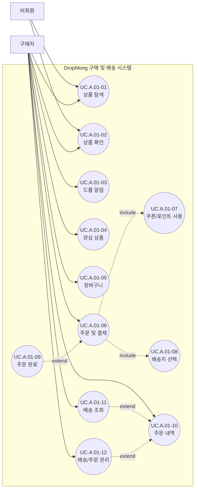

# 구매 및 배송 사용자 목표

## 기본 정보

- UC ID: `UC.A.01`
- 사용자: 비회원, 구매자
- 기준 페이지: [PAGE.A.01 홈 화면](../10-sitemap/buyer-mobile-web/PAGE_A_01_homepage.md), [PAGE.A.02 상품 상세](../10-sitemap/buyer-mobile-web/PAGE_A_02_product_detail.md), [PAGE.A.11 주문/결제](../10-sitemap/buyer-mobile-web/PAGE_A_11_payment.md), [PAGE.A.16 배송 조회](../10-sitemap/buyer-mobile-web/PAGE_A_16_track_order.md)
- 기준 기능: 상품 탐색, 상품 확인, 드롭 알림, 관심 상품, 장바구니, 주문/결제, 쿠폰/포인트 사용, 배송지 선택, 주문 완료, 주문 내역, 배송 조회, 배송/주문 관리
- 제외 범위: 판매자 상품 등록, 플랫폼 운영자 검수, CS 내부 처리, 정산, 물류 실행 시스템

## 연관 태그

- 🏷️ 플로우 참조: FLOW.A.01
- 🏷️ 요구사항 참조: [REQ.A.01](../00-requirements/REQ_A_01_limited_drop_commerce.md), [REQ.A.02](../00-requirements/REQ_A_02_coupon_benefit.md)
- 🏷️ 페이지 참조: [PAGE.A.01](../10-sitemap/buyer-mobile-web/PAGE_A_01_homepage.md), [PAGE.A.02](../10-sitemap/buyer-mobile-web/PAGE_A_02_product_detail.md), [PAGE.A.06](../10-sitemap/buyer-mobile-web/PAGE_A_06_shopping_cart.md), [PAGE.A.10](../10-sitemap/buyer-mobile-web/PAGE_A_10_my.md), [PAGE.A.11](../10-sitemap/buyer-mobile-web/PAGE_A_11_payment.md), [PAGE.A.14](../10-sitemap/buyer-mobile-web/PAGE_A_14_order_complete.md), [PAGE.A.15](../10-sitemap/buyer-mobile-web/PAGE_A_15_order_history.md), [PAGE.A.16](../10-sitemap/buyer-mobile-web/PAGE_A_16_track_order.md), [PAGE.A.17](../10-sitemap/buyer-mobile-web/PAGE_A_17_shipping_order_manage.md)
- 🏷️ UI 참조: [UI.A.01](../20-ui/buyer-mobile-web/UI_A_01_homepage.md), [UI.A.02](../20-ui/buyer-mobile-web/UI_A_02_product_detail.md), [UI.A.06](../20-ui/buyer-mobile-web/UI_A_06_shopping_cart.md), [UI.A.10](../20-ui/buyer-mobile-web/UI_A_10_my.md), [UI.A.11](../20-ui/buyer-mobile-web/UI_A_11_payment.md), [UI.A.14](../20-ui/buyer-mobile-web/UI_A_14_order_complete.md), [UI.A.15](../20-ui/buyer-mobile-web/UI_A_15_order_history.md), [UI.A.16](../20-ui/buyer-mobile-web/UI_A_16_track_order.md), [UI.A.17](../20-ui/buyer-mobile-web/UI_A_17_shipping_order_manage.md)
- 🏷️ 영속성 참조: PST.A.01
- 🏷️ 서비스 참조: SVC.A.01
- 🏷️ 시나리오 참조: SCN.A.01
- 🏷️ API 참조: API.A.01

## 유스케이스

## 사용자 목표

| UC ID | 액터 | 사용자 목표 | 설명 | 연결 요구사항 |
| --- | --- | --- | --- | --- |
| `UC.A.01-01` | 비회원, 구매자 | 상품 탐색 | 홈, 큐레이션, 랭킹, 오픈 예정 드롭에서 구매 후보 상품을 찾는다. | `REQ.A.01.FR-001` |
| `UC.A.01-02` | 비회원, 구매자 | 상품 확인 | 상품 상세에서 가격, 옵션, 판매 상태, 배송/환불 조건을 확인한다. | `REQ.A.01.FR-002` |
| `UC.A.01-03` | 구매자 | 드롭 알림 | 오픈 전 드롭의 판매 시작 알림을 신청하거나 신청 상태를 확인한다. | `REQ.A.01.FR-003`, `REQ.A.01.FR-004` |
| `UC.A.01-04` | 구매자 | 관심 상품 | 구매 후보 상품을 관심 목록에 저장한다. | `REQ.A.01.FR-004` |
| `UC.A.01-05` | 구매자 | 장바구니 | 선택한 상품, 옵션, 수량을 주문 전까지 관리한다. | `REQ.A.01.FR-005` |
| `UC.A.01-06` | 구매자 | 주문 및 결제 | 주문 상품, 배송지, 할인, 결제 수단, 필수 동의를 확인하고 주문을 확정한다. | `REQ.A.01.FR-008`, `REQ.A.01.FR-010`, `REQ.A.01.FR-011` |
| `UC.A.01-07` | 구매자 | 쿠폰/포인트 사용 | 주문에 사용할 수 있는 쿠폰과 포인트를 선택하고 결제 금액에 반영한다. | `REQ.A.02.FR-007`, `REQ.A.02.FR-009`, `REQ.A.02.FR-010` |
| `UC.A.01-08` | 구매자 | 배송지 선택 | 주문 상품을 받을 배송지를 선택하거나 확인한다. | `REQ.A.01.FR-010` |
| `UC.A.01-09` | 구매자 | 주문 완료 | 결제 성공 후 주문번호, 결제 금액, 배송 예정 정보를 확인한다. | `REQ.A.01.FR-012` |
| `UC.A.01-10` | 구매자 | 주문 내역 | 과거 주문과 현재 주문 상태를 확인한다. | `REQ.A.01.FR-013` |
| `UC.A.01-11` | 구매자 | 배송 조회 | 운송장, 배송 상태, 배송 타임라인을 확인한다. | `REQ.A.01.FR-014` |
| `UC.A.01-12` | 구매자 | 배송/주문 관리 | 주문 상태에 따라 배송지 변경, 영수증, 주문 취소, 교환/반품, 문의를 선택한다. | `REQ.A.01.FR-015` |
