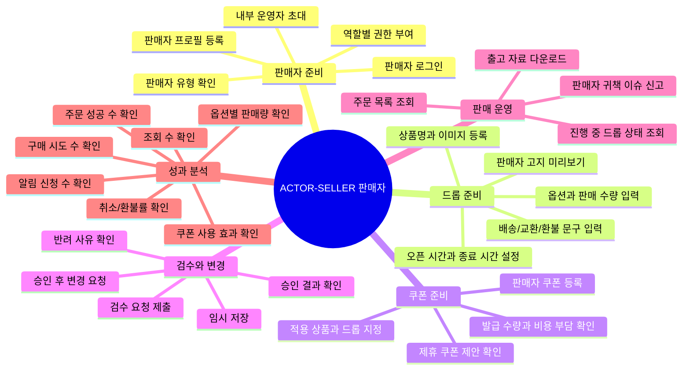

# 판매자는 드롭 상품을 등록하고 판매 성과를 분석한다

## 기본 정보

- UC ID: `UC.A.02`
- 사용자: 판매자 대표 관리자, 판매자 상품 담당자, 판매자 출고 담당자, 판매자 성과 조회자
- 기준 페이지: 판매자 포털 페이지 예정
- 기준 기능: 판매자 정보 관리, 상품/드롭 등록, 판매자 쿠폰 등록, 검수 요청, 주문/출고 자료 조회, 판매 통계 분석
- 제외 범위: 플랫폼 전체 운영, 상품 제휴/이벤트 제휴 기획, CS 보상, 구매자 결제 승인, 최종 정산 회계

## 연관 태그

🏷️ 플로우 참조: FLOW.A.02 | 요구사항 참조: [REQ.A.03](../00-requirements/REQ_A_03_seller.md), [REQ.A.02](../00-requirements/REQ_A_02_coupon_benefit.md) | 페이지 참조: 판매자 포털 페이지 예정 | UI 참조: UI.A.02 예정 | 영속성 참조: PST.A.02 | 서비스 참조: SVC.A.02 | 시나리오 참조: SCN.A.02 | API 참조: API.A.02

## 유스케이스

## 사전 조건

- 판매자는 DropMong 판매자 계정과 역할 권한을 가진다.
- 판매자 유형, 인증 수준, 등록 가능 상품 범위가 정책으로 정의되어 있다.
- 판매자 포털은 구매자 구매 경로와 장애 영향이 분리되어 있다.
- 검수 요청 대상 상품과 드롭은 구매자 화면에 공개되기 전 상태다.

## 기본 흐름

| 순서 | 사용자 행동 | 시스템 응답 | 연결 요구사항 |
| --- | --- | --- | --- |
| 1 | 판매자 대표 관리자가 판매자 정보를 등록한다. | 판매자명, 유형, 인증 정보, 연락처, 배송/교환/환불 기본 문구를 저장한다. | `REQ.A.03.FR-002` |
| 2 | 판매자 대표 관리자가 내부 운영자를 초대한다. | 역할별 접근 가능한 메뉴와 작업 범위를 부여한다. | `REQ.A.03.FR-003`, `REQ.A.03.FR-020` |
| 3 | 상품 담당자가 드롭 상품을 등록한다. | 상품명, 이미지, 상세 설명, 가격, 옵션, 판매 수량을 검증한다. | `REQ.A.03.FR-005`, `REQ.A.03.FR-007` |
| 4 | 상품 담당자가 드롭 판매 조건을 설정한다. | 오픈 시각, 종료 시각, 노출 시작 시각, 구매 제한, 배송/반품 조건을 저장한다. | `REQ.A.03.FR-006` |
| 5 | 판매자가 판매자 쿠폰을 등록한다. | 자기 상품 또는 자기 드롭 범위인지 검증하고 비용 부담 기준을 기록한다. | `REQ.A.03.FR-023`, `REQ.A.02.FR-022` |
| 6 | 판매자가 검수 요청을 제출한다. | 검수 중 상태로 전환하고 플랫폼 운영자 검수 대기열에 노출한다. | `REQ.A.03.FR-008` |
| 7 | 판매자가 승인, 반려, 보류 결과를 확인한다. | 반려/보류 사유와 수정 필요 항목을 표시한다. | `REQ.A.03.FR-009` |
| 8 | 판매자가 진행 중인 드롭 상태를 조회한다. | 노출 상태, 품절 상태, 주문 가능 상태, 주요 운영 지표를 표시한다. | `REQ.A.03.FR-012`, `REQ.A.03.FR-013` |
| 9 | 출고 담당자가 주문 목록과 출고 자료를 조회한다. | 자기 판매 주문만 제공하고 다운로드 이력을 감사 로그로 남긴다. | `REQ.A.03.FR-015`, `REQ.A.03.FR-016` |
| 10 | 성과 조회자가 판매 통계를 분석한다. | 상품, 옵션, 기간, 유입 경로, 쿠폰 사용 여부, 취소/환불 여부 기준으로 지표를 보여준다. | `REQ.A.03.FR-022`, `REQ.A.03.FR-024` |

## 예외 흐름

| 상황 | 처리 |
| --- | --- |
| 판매자가 다른 판매자의 상품, 주문, 성과를 조회하려 한다. | 접근을 차단하고 권한 오류를 남긴다. |
| 승인되지 않은 드롭을 공개하려 한다. | 구매자 화면 노출을 막고 검수 상태를 표시한다. |
| 승인 후 가격, 판매 수량, 오픈 시간이 바뀐다. | 직접 수정 대신 변경 요청과 재승인 절차로 전환한다. |
| 판매자 쿠폰이 정책상 위험 조건에 걸린다. | 운영자 승인 전까지 구매자에게 노출하지 않는다. |
| 주문 자료에 과도한 개인정보가 포함된다. | 다운로드를 차단하거나 최소 정보만 포함한 파일로 대체한다. |
| 판매자 포털 조회가 느려진다. | 구매자 구매 경로와 분리된 조회 모델 또는 degraded mode로 처리한다. |

## 사용자에게 보이는 결과

- 판매자는 자기 판매자 계정의 상품, 드롭, 쿠폰, 주문, 성과만 확인한다.
- 판매자는 검수 요청과 승인 결과를 확인하고 필요한 수정 또는 변경 요청을 제출한다.
- 판매자는 진행 중 드롭의 운영 상태와 판매 성과를 분석한다.
- 판매자는 출고에 필요한 주문 자료를 목적에 맞게 다운로드한다.

## 사용자가 처리해야 하는 상황

- 판매자는 판매 조건과 구매자 고지 문구를 오픈 전에 확정해야 한다.
- 판매자는 반려 사유를 확인하고 상품/드롭 정보를 수정해야 한다.
- 판매자는 오픈 직전이나 진행 중 위험 작업이 제한될 수 있음을 받아들여야 한다.
- 판매자는 쿠폰 비용 부담과 적용 범위를 확인해야 한다.

## 인수 조건

- 판매자는 자기 판매자 계정의 데이터만 조회하고 수정할 수 있다.
- 승인되지 않은 드롭은 구매자 홈, 상품 상세, 검색 결과에 노출되지 않는다.
- 승인 후 핵심 판매 조건 변경은 변경 요청으로 남고 운영자 승인 전 반영되지 않는다.
- 판매자 쿠폰은 해당 판매자의 상품 또는 드롭 범위를 벗어나 적용되지 않는다.
- 주문 자료 다운로드는 요청자, 범위, 목적, 시각이 감사 로그에 남는다.
- 상품 판매 통계는 지표 정의와 집계 완료 시각을 함께 표시한다.

## 확인 필요

- 판매자 포털의 실제 Page ID와 UI 문서 식별자
- 판매자 유형별 인증, 등록 가능 상품, 검수 강도
- 판매자 쿠폰 자동 승인과 운영자 승인 조건
- 출고 자료 다운로드 필드와 개인정보 마스킹 기준
- 판매자 성과 지표의 실시간/사후 확정 구분
