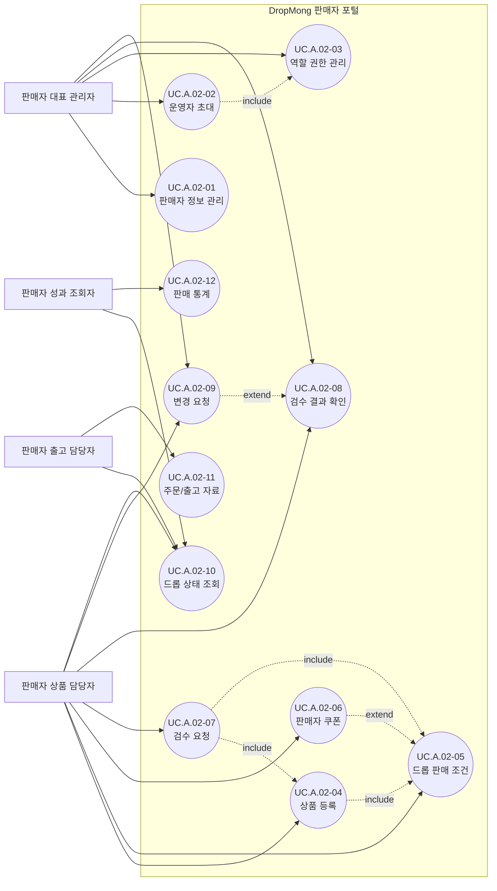

# 판매자 드롭 운영 사용자 목표

## 기본 정보

- UC ID: `UC.A.02`
- 사용자: 판매자 대표 관리자, 판매자 상품 담당자, 판매자 출고 담당자, 판매자 성과 조회자
- 기준 페이지: 판매자 포털 페이지 예정
- 기준 기능: 판매자 정보 관리, 운영자 초대, 역할 권한 관리, 상품 등록, 드롭 판매 조건, 판매자 쿠폰, 검수 요청, 검수 결과 확인, 변경 요청, 드롭 상태 조회, 주문/출고 자료, 판매 통계
- 제외 범위: 플랫폼 전체 운영, 상품 제휴/이벤트 제휴 기획, CS 보상, 구매자 결제 승인, 최종 정산 회계

## 연관 태그

- 🏷️ 플로우 참조: FLOW.A.02
- 🏷️ 요구사항 참조: [REQ.A.03](../00-requirements/REQ_A_03_seller.md), [REQ.A.02](../00-requirements/REQ_A_02_coupon_benefit.md)
- 🏷️ 페이지 참조: 판매자 포털 페이지 예정
- 🏷️ UI 참조: UI.A.02 예정
- 🏷️ 영속성 참조: PST.A.02
- 🏷️ 서비스 참조: SVC.A.02
- 🏷️ 시나리오 참조: SCN.A.02
- 🏷️ API 참조: API.A.02

## 유스케이스

## 사용자 목표

| UC ID | 액터 | 사용자 목표 | 설명 | 연결 요구사항 |
| --- | --- | --- | --- | --- |
| `UC.A.02-01` | 판매자 대표 관리자 | 판매자 정보 관리 | 판매자명, 유형, 인증 정보, 연락처, 배송/교환/환불 기본 문구를 관리한다. | `REQ.A.03.FR-002` |
| `UC.A.02-02` | 판매자 대표 관리자 | 운영자 초대 | 판매자 포털에서 함께 일할 내부 운영자를 초대한다. | `REQ.A.03.FR-003` |
| `UC.A.02-03` | 판매자 대표 관리자 | 역할 권한 관리 | 내부 운영자의 접근 메뉴와 작업 범위를 역할별로 관리한다. | `REQ.A.03.FR-003`, `REQ.A.03.FR-020` |
| `UC.A.02-04` | 판매자 상품 담당자 | 상품 등록 | 상품명, 이미지, 상세 설명, 가격, 옵션, 판매 수량을 등록한다. | `REQ.A.03.FR-005`, `REQ.A.03.FR-007` |
| `UC.A.02-05` | 판매자 상품 담당자 | 드롭 판매 조건 | 오픈 시각, 종료 시각, 구매 제한, 배송/반품 조건을 설정한다. | `REQ.A.03.FR-006` |
| `UC.A.02-06` | 판매자 상품 담당자 | 판매자 쿠폰 | 자기 상품 또는 드롭에 적용할 판매자 쿠폰을 등록한다. | `REQ.A.03.FR-023`, `REQ.A.02.FR-022` |
| `UC.A.02-07` | 판매자 상품 담당자 | 검수 요청 | 공개 전 상품과 드롭을 플랫폼 검수 대상으로 제출한다. | `REQ.A.03.FR-008` |
| `UC.A.02-08` | 판매자 대표 관리자, 판매자 상품 담당자 | 검수 결과 확인 | 승인, 반려, 보류 결과와 수정 필요 항목을 확인한다. | `REQ.A.03.FR-009` |
| `UC.A.02-09` | 판매자 대표 관리자, 판매자 상품 담당자 | 변경 요청 | 승인 후 핵심 판매 조건 변경이 필요할 때 운영자 검토를 요청한다. | `REQ.A.03.FR-009` |
| `UC.A.02-10` | 판매자 상품 담당자, 판매자 출고 담당자, 판매자 성과 조회자 | 드롭 상태 조회 | 노출, 품절, 주문 가능 상태와 주요 운영 지표를 확인한다. | `REQ.A.03.FR-012`, `REQ.A.03.FR-013` |
| `UC.A.02-11` | 판매자 출고 담당자 | 주문/출고 자료 | 자기 판매 주문과 출고에 필요한 자료를 조회하거나 다운로드한다. | `REQ.A.03.FR-015`, `REQ.A.03.FR-016` |
| `UC.A.02-12` | 판매자 성과 조회자 | 판매 통계 | 상품, 옵션, 기간, 유입 경로, 쿠폰 사용 여부 기준으로 성과를 확인한다. | `REQ.A.03.FR-022`, `REQ.A.03.FR-024` |
