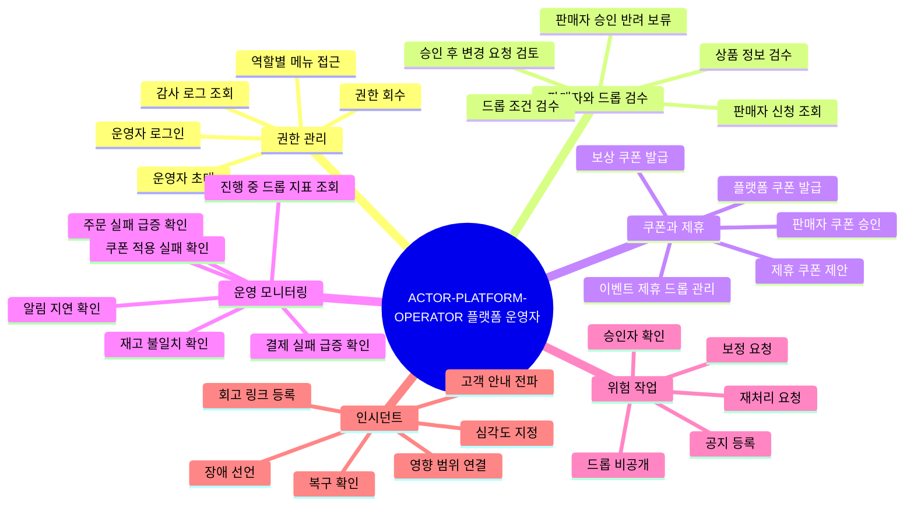

# 플랫폼 운영자는 드롭 운영 상태를 관리하고 위험 작업을 통제한다

## 기본 정보

- UC ID: `UC.A.03`
- 사용자: 운영 관리자, 상품/콘텐츠 검수 담당자, 제휴/이벤트 담당자, 쿠폰 운영 담당자, 정산 담당자, 인시던트 담당자
- 기준 페이지: 플랫폼 운영자 사이트 페이지 예정
- 기준 기능: 운영자 권한, 판매자 심사, 상품/드롭 검수, 드롭 현황, 쿠폰 발급/승인, 제휴/이벤트 운영, 위험 작업 승인, 인시던트 대응, 감사 로그
- 제외 범위: 구매자 화면 조작, 판매자 셀프서비스 업무, 외부 PG 승인 처리, 물류 실행, 회계 확정

## 연관 태그

🏷️ 플로우 참조: FLOW.A.03 | 요구사항 참조: [REQ.A.04](../00-requirements/REQ_A_04_platform_operator_admin.md), [REQ.A.03](../00-requirements/REQ_A_03_seller.md), [REQ.A.02](../00-requirements/REQ_A_02_coupon_benefit.md) | 페이지 참조: 플랫폼 운영자 사이트 페이지 예정 | UI 참조: UI.A.03 예정 | 영속성 참조: PST.A.03 | 서비스 참조: SVC.A.03 | 시나리오 참조: SCN.A.03 | API 참조: API.A.03

## 유스케이스

## 사전 조건

- 운영자는 역할 기반 권한을 가진다.
- 운영자 사이트는 구매자 구매 경로와 조회/쓰기 자원이 분리되어 있다.
- 판매자, 상품, 드롭, 주문, 쿠폰, 결제, 배송, 알림 상태를 조회할 수 있는 운영용 읽기 모델이 있다.
- 위험 작업에는 사유, 승인자, 대상 범위, 변경 전후 값, trace id를 남길 수 있다.

## 기본 흐름

| 순서 | 사용자 행동 | 시스템 응답 | 연결 요구사항 |
| --- | --- | --- | --- |
| 1 | 운영자가 운영자 사이트에 로그인한다. | 역할에 맞는 메뉴와 작업만 보여준다. | `REQ.A.04.FR-001`, `REQ.A.04.NFR-001` |
| 2 | 검수 담당자가 판매자 신청과 상품/드롭 검수 대상을 조회한다. | 판매자 유형, 인증 정보, 상품 정보, 드롭 조건, 위험 신호를 표시한다. | `REQ.A.04.FR-003`, `REQ.A.04.FR-005`, `REQ.A.04.FR-006` |
| 3 | 검수 담당자가 승인, 반려, 보류를 처리한다. | 구조화된 사유와 처리 이력을 남기고 판매자에게 결과를 노출한다. | `REQ.A.04.FR-004`, `REQ.A.04.NFR-003` |
| 4 | 쿠폰 운영 담당자가 플랫폼 쿠폰 또는 보상 쿠폰을 발급한다. | 발급 주체, 비용 부담, 대상, 수량, 승인 근거를 기록한다. | `REQ.A.04.FR-026`, `REQ.A.04.NFR-022` |
| 5 | 쿠폰 운영 담당자가 판매자 쿠폰을 승인하거나 반려한다. | 정책 위반 사유, 승인자, 적용 시작 시각을 남긴다. | `REQ.A.04.FR-027`, `REQ.A.04.NFR-024` |
| 6 | 제휴/이벤트 담당자가 제휴 드롭과 제휴 쿠폰을 관리한다. | 노출 위치, 참여 조건, 비용 부담, 판매자 응답 상태를 기록한다. | `REQ.A.04.FR-008`, `REQ.A.04.FR-021`, `REQ.A.04.FR-028` |
| 7 | 운영자가 진행 중 드롭의 주요 지표와 이상 신호를 조회한다. | 드롭, 판매자, 쿠폰, 결제, 주문, 알림 기준으로 업무 지표를 보여준다. | `REQ.A.04.FR-012`, `REQ.A.04.FR-013` |
| 8 | 운영자가 위험 작업 또는 재처리 요청을 등록한다. | 고유 요청 ID, 멱등키, 승인자, 사유, 결과 상태를 가진 작업으로 남긴다. | `REQ.A.04.FR-022`, `REQ.A.04.FR-023` |
| 9 | 인시던트 담당자가 장애를 선언한다. | 심각도, 영향 범위, 영향 드롭, 담당자, 조치 타임라인을 기록한다. | `REQ.A.04.FR-016`, `REQ.A.04.FR-017` |
| 10 | 운영자가 고객 안내와 복구 상태를 관리한다. | 공지 문구, 노출 상태, 회수 이력, 인시던트 연결 정보를 남긴다. | `REQ.A.04.FR-015`, `REQ.A.04.NFR-016` |

## 예외 흐름

| 상황 | 처리 |
| --- | --- |
| 운영자가 권한 밖 메뉴나 작업에 접근한다. | 접근을 차단하고 감사 로그를 남긴다. |
| 진행 중 드롭의 가격, 수량, 오픈 시간이 바뀌려 한다. | 기본 차단하고 예외 승인 절차를 요구한다. |
| 운영자 사이트 일부 기능이 장애 상태다. | 구매자 구매 경로와 격리하고 cached snapshot 또는 제한 조회 상태를 표시한다. |
| 재처리 또는 보정 작업이 중복 요청된다. | 같은 요청 ID 또는 멱등키 기준으로 중복 실행을 막는다. |
| 인시던트 영향 범위가 아직 불명확하다. | 영향 추정 상태로 기록하고 관련 드롭/쿠폰/주문을 추가 연결할 수 있게 한다. |

## 사용자에게 보이는 결과

- 운영자는 판매자와 드롭 검수 상태를 일관된 기준으로 처리한다.
- 운영자는 진행 중 드롭의 주문, 결제, 쿠폰, 재고, 알림 이상 신호를 확인한다.
- 운영자는 위험 작업을 승인 기반으로 실행하고 감사 로그를 남긴다.
- 운영자는 인시던트를 선언하고 고객 안내와 복구 상태를 추적한다.

## 사용자가 처리해야 하는 상황

- 운영자는 판매자 요청과 구매자 공정성 사이의 충돌을 판단해야 한다.
- 운영자는 피크 중 차단, 공지, 재처리, 보정 같은 위험 작업을 신중히 선택해야 한다.
- 운영자는 인시던트 중 CS/판매자/구매자 안내 기준을 맞춰야 한다.
- 운영자는 플랫폼 쿠폰, 판매자 쿠폰, 제휴 쿠폰의 비용 부담과 승인 상태를 구분해야 한다.

## 인수 조건

- 운영자는 역할에 따라 허용된 메뉴와 작업만 수행한다.
- 판매자, 상품, 드롭 승인/반려/보류에는 구조화된 사유가 남는다.
- 진행 중 드롭의 핵심 조건 변경은 위험 작업 승인 절차를 거친다.
- 플랫폼 쿠폰, 판매자 쿠폰, 제휴 쿠폰, 보상 쿠폰은 발급 주체와 비용 부담이 기록된다.
- 운영자는 드롭별 주요 지표와 이상 신호를 업무 단위로 확인할 수 있다.
- 인시던트 선언, 조치, 고객 안내, 복구 확인, 종료 이력이 타임라인으로 남는다.
- 모든 위험 작업과 재처리/보정 작업은 멱등하고 감사 가능하다.

## 확인 필요

- 플랫폼 운영자 사이트의 실제 Page ID와 UI 문서 식별자
- 운영자 역할과 권한 매트릭스
- 위험 작업 승인선과 이중 확인 범위
- 인시던트 심각도 기준과 알림 채널
- 운영자 조회용 읽기 모델과 데이터 최신성 표시 방식
